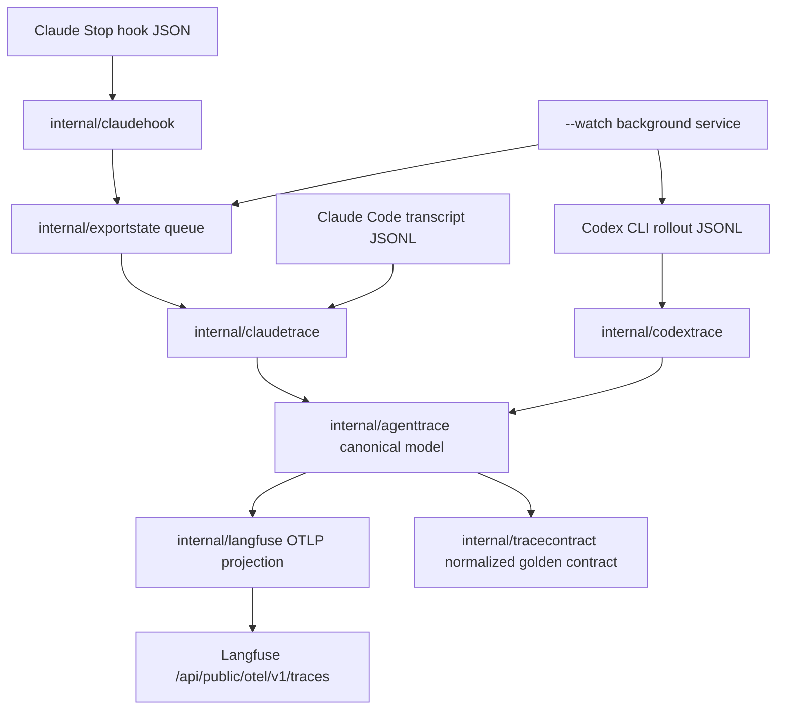

# Claude Code Support Plan

## 1. Title and metadata

- Project name: Codex Langfuse Tracer
- Version: 2.0
- Owners: repository maintainer and implementation agent
- Date: 2026-05-04
- Document ID: CLT-CLAUDE-SRS-TEST-PLAN-002
- Repository root: `/home/kirill/p/codex-langfuse-tracer`
- Plan file: `plans/claude-code-support-plan.md`
- Compute controls:
  - branch_limits: evaluate at most three architecture alternatives per decision topic, then implement one selected path.
  - reflection_passes: perform two review passes before each phase exit, one for traceability and one for duplicate or legacy paths.
  - early_stop%: suspend a phase when estimated phase confidence is below 75% after RED triage or feature creep is above 25%.
- Metric policy: any metric threshold change requires an ADR update before implementation proceeds.
- Restore point policy: before each phase, create `git tag -f clt-claude-Pxx-start HEAD`; after phase exit gates are green, create `git tag -f clt-claude-Pxx-green HEAD`.
- Phase exit policy: yellow criteria are blocking findings, not acceptable residual debt. A phase cannot receive its green restore tag while any yellow criterion is true.

This plan defines how to add Claude Code support to the existing Go-based Codex Langfuse Tracer without weakening the current Codex trace contract. The work adds a Claude transcript parser, a provider-neutral trace domain model, provider-aware Langfuse OTLP projection, manual Claude export through `--provider claude --path`, and automatic Claude export through Claude Code hooks that enqueue work for the existing background watch service. The plan excludes wrapper paths, native Claude OTEL forwarding, Claude transcript polling, automatic Claude settings mutation, second fixture registries, legacy shims, duplicated helper logic, and Claude pricing in the MVP.

## 2. Design consensus and trade-offs

| Topic | Verdict | Rationale |
|---|---|---|
| Current Claude support claim | AGAINST | The current binary parses Codex rollout JSONL through `internal/codextrace/parser.go` and discovers only `~/.codex/sessions/**/rollout-*.jsonl` through `internal/codextrace/sessions.go`. Claude support must not be documented as complete until fixtures, parser tests, projection tests, and CLI tests pass. |
| Native Claude Code OTEL as primary path | AGAINST | Claude Code has its own OpenTelemetry surface, but this repository already owns a curated Langfuse OTLP contract through `internal/langfuse/export.go`, `internal/tracecontract/contract.go`, and `testdata/golden/*.normalized.json`. Native Claude OTEL would create a second semantic contract rather than reuse the current review surface. |
| Claude hook path | DECISION | Claude Code hooks provide `session_id`, `transcript_path`, `cwd`, and `hook_event_name`. The automatic path will accept only `Stop` events, write a queue request, and let the existing background service export. |
| Claude polling watcher | AGAINST | Polling `~/.claude/projects/**/*.jsonl` would add a second automatic discovery path and a second turn-completion heuristic. Automatic Claude export is hook to queue to `--watch`. |
| Provider-neutral trace model | DECISION | Shared behavior now lives under `internal/codextrace` but includes generic responsibilities: turn structs, redaction, truncation, stable IDs, terminal assembly, command classification, file metadata, insight rollup, and exportability. These move to `internal/agenttrace`; provider parsers only map raw source records into that model. |
| Codex behavior preservation | DECISION | Existing Codex trace names, observation names, tags, metadata keys, CLI defaults, state behavior, install flow, and golden outputs remain stable unless a failing test proves a required shared abstraction change. |
| Claude observation names | DECISION | Claude traces use provider-specific names such as `claude.agent`, `claude.transcript`, `claude.terminal`, and `claude.tool.bash`. Claude data must not use `codex.*` observation names. |
| Provider profiles | DECISION | Provider-specific names and metadata prefixes are data in a profile table, not scattered conditionals. Rollups use provider-neutral observation families rather than name-prefix parsing. |
| Fixture inventory | DECISION | `testdata/manifest.json` remains the single fixture registry. Provider and source format are added to manifest entries. |
| Fixture location | DECISION | Fixture sources move directly to provider-neutral paths such as `testdata/sources/codex/*.jsonl` and `testdata/sources/claude/*.jsonl`. No compatibility shim for `testdata/rollouts` remains after the migration. |
| Configuration | DECISION | The MVP reuses the existing Langfuse credential loader in `internal/config/config.go` and the existing `--config` flag. It does not add a second config file format or Claude-only config path. |
| Pricing | AGAINST in MVP | Claude model pricing is a separate source-checked follow-up. The MVP sends model and usage details when available but does not add Anthropic pricing definitions, local cost multiplication, fallback aliases, or unpriced Claude model guesses. |
| Raw tool details | DECISION | Claude tool inputs and outputs can contain sensitive data. The shared redaction and truncation path must process Claude prompt text, assistant text, tool inputs, tool outputs, terminal stream, and metadata string fields before Langfuse export. |
| Tool support breadth | DECISION | The MVP gives Bash first-class command/output/status metadata and maps every other Claude tool to a generic normalized tool observation with bounded metadata. No richer file/search/agent tool families or placeholder interfaces are scaffolded in the MVP. |
| Hidden thinking | AGAINST | Claude thinking blocks, hidden thinking, and encrypted reasoning are not exported in the MVP. Visible assistant text and tool outputs are the export surface. |
| File diffs | AGAINST | The MVP does not reconstruct unified diffs from Claude internal file-history snapshots. File tool observations carry bounded path and result metadata only. |
| Hook direct export | AGAINST | Exporting from the hook process would duplicate the automatic path and expose Claude Code response completion to Langfuse network latency. Hooks only enqueue. |
| Shared state and dedupe | DECISION | State, processed trace IDs, and queue locking move to one provider-neutral package, `internal/exportstate`. There is no separate Claude state file. |
| Service naming | DECISION | The existing binary name `codex-langfuse-exporter` and service name `codex-langfuse-watch.service` remain for the MVP. No generic alias is added while the repository and install contract are Codex-named. |
| Legacy paths | AGAINST | The final implementation must not leave compatibility shims, forwarding helpers, duplicated helper implementations, wrapper export paths, direct ingestion shortcuts, or unused alternate paths. |

## 3. PRD / stakeholder and system needs

### Problem

- Codex sessions are exported to Langfuse with high-signal trace contracts, but Claude Code sessions are not.
- The current implementation is Codex-specific in parser event names, source discovery, trace naming, observation naming, metadata keys, tags, and pricing catalog.
- Adding Claude support by copying Codex logic would increase maintenance cost and violate the repository preference for one direct implementation path.

### Users

- Local operators using both Codex CLI and Claude Code.
- Maintainers reviewing LLM coding sessions in one Langfuse project.
- Future implementation agents maintaining parser drift, fixture contracts, and trace output stability.

### Value

- Codex and Claude Code sessions become comparable in Langfuse.
- Claude users get prompt and final answer review, tool audit, terminal output, model, usage, cwd, and metadata when those fields exist in the transcript.
- The Codex production path stays stable while shared logic moves to provider-neutral packages.

### Business goals

- Preserve the existing public-facing Codex tracer while expanding addressable usage to Claude Code.
- Keep the repository small and maintainable for LLM-driven maintenance.
- Make tests and fixtures the binding source for behavior.
- Avoid undocumented product behavior, legacy branches, and duplicate support paths.

### Success metrics

- All existing Codex golden fixtures remain semantically identical after shared-model migration.
- The single manifest includes sanitized real-derived Claude structure fixtures plus synthetic edge fixtures: no-tools final answer, Bash turn, generic tool turn, incomplete or corrupt transcript, and thinking-block omission.
- Manual Claude export through `--provider claude --path <transcript.jsonl>` succeeds against a fake Langfuse server.
- Hook input with `hook_event_name=Stop` enqueues exactly one request and performs no network export in the hook process.
- `--watch` drains Claude queue requests through the same state and dedupe path used for Codex exports.
- `go test ./... -count=1` and `git diff --check` pass before handoff.
- README marks Claude support as production-ready for workstation use after CHECK-001 live validation has confirmed manual and hook-triggered Langfuse traces in the target environment.

### Scope

- Add `internal/agenttrace` for provider-neutral turns, observations, token usage, redaction, IDs, terminal assembly, command classification, file metadata, insight rollup, provider profiles, and exportability.
- Refactor `internal/codextrace` into a Codex parser that emits `agenttrace` values.
- Add `internal/claudetrace` for Claude Code transcript JSONL parsing.
- Add `internal/exportstate` for processed trace IDs and queue locking.
- Update `internal/langfuse` and `internal/tracecontract` to consume `agenttrace`.
- Add provider-aware CLI mode in `cmd/codex-langfuse-exporter/main.go`.
- Add `internal/claudehook` for hook JSON parsing and queue request creation.
- Update `README.md`, `TESTING.md`, concise `AGENTS.md` guardrails, `testdata/manifest.json`, fixture sources, and golden contract tests.

### Non-goals

- No Codex wrapper export path.
- No Claude wrapper around the `claude` binary.
- No native Codex OTEL path.
- No native Claude OTEL forwarding.
- No direct Langfuse ingestion API shortcut outside the existing OTLP HTTP path.
- No Claude transcript directory polling.
- No automatic mutation of `~/.claude/settings.json`.
- No second fixture manifest.
- No per-file observation fanout.
- No hidden thinking export.
- No local cost calculation.
- No Claude pricing definitions in the MVP.
- No placeholder interfaces for future Claude tool families, pricing, discovery, or transport paths.
- No repository rename.
- No generic binary or service aliases in the MVP.

### Dependencies

- Go module: `github.com/kirilligum/codex-langfuse-tracer` with Go `1.26.0` in `go.mod`.
- Existing OTLP exporter path: `internal/langfuse/export.go` posts to `/api/public/otel/v1/traces`.
- Existing Langfuse credentials loader: `internal/config/config.go`.
- Existing systemd service contract: `systemd/codex-langfuse-watch.service` referenced by install tests and `internal/buildinfo/buildinfo.go`.
- Existing test command contract: `TESTING.md` and `AGENTS.md`.
- Official Claude Code hook JSON fields observed in current Claude Code docs and local `claude --version` output from 2026-05-04.

### Risks

- Claude transcript schema drift changes record shapes.
- Turn segmentation can over-export or under-export multi-turn transcripts.
- Queue locking mistakes can duplicate exports under concurrent hooks.
- Shared refactor can regress Codex golden outputs.
- Pricing scope can creep into MVP before parser and export behavior are validated.
- Docs can claim support before the parser, CLI, hook, and projection paths are tested.

### Assumptions

- Sanitized real-derived Claude structure fixtures are acceptable when private transcript text is removed before commit; raw real local transcript content is not committed.
- `Stop` is the only Claude hook event used for automatic export in the MVP.
- Claude manual export from an explicit transcript path is sufficient before adding Claude session discovery.
- Live Claude Code validation uses non-interactive `claude -p` with the cheapest available model alias, `--model haiku`, and does not use `--bare` or `--no-session-persistence` because hook execution and transcript persistence are required.
- Langfuse remains the cost calculator; this repository only sends model and usage details.
- Tests should fail before code changes in each phase.

## 4. SRS / canonical requirements

### Functional requirements

- REQ-001 type func: Parse Claude Code transcript JSONL into exportable turns.
  - Acceptance: parser accepts sanitized real-derived Claude structure fixtures and synthetic Claude JSONL with user, assistant, tool_use, tool_result, model, usage, cwd, and session fields; incomplete turns are non-exportable.
- REQ-002 type func: Preserve existing Codex behavior.
  - Acceptance: existing Codex fixtures and golden contracts remain stable except for deliberate provider fields documented in this plan.
- REQ-003 type func: Own provider-neutral trace behavior in `internal/agenttrace`.
  - Acceptance: shared turn structs, usage mapping, redaction, truncation, IDs, terminal assembly, command classification, file metadata, insight rollup, provider profiles, and exportability have one implementation.
- REQ-004 type func: Support manual Claude export through explicit provider and path selection.
  - Acceptance: `--provider claude --path <transcript.jsonl>` exports Claude turns; existing Codex modes keep `codex` as default provider.
- REQ-005 type func: Support automatic Claude export through hook-queued work.
  - Acceptance: `--claude-hook` reads hook JSON from stdin, enqueues only `Stop` events, and `--watch` drains queued Claude requests.
- REQ-006 type func: Project provider-specific Langfuse trace and observation names.
  - Acceptance: Codex keeps `codex.turn.transcript`, `codex.agent`, `codex.transcript`, and `codex.terminal`; Claude uses `claude.turn.transcript`, `claude.agent`, `claude.transcript`, and `claude.terminal`.
- REQ-007 type func: Map Claude tool calls into canonical observations.
  - Acceptance: Bash maps to first-class command/output/status metadata; every other Claude tool maps to a generic normalized tool observation with bounded metadata.
- REQ-008 type func: Map model and token usage without local cost calculation or Claude pricing definitions.
  - Acceptance: Claude model and usage details are emitted only when present; the MVP does not add Anthropic pricing definitions.
- REQ-009 type func: Keep one fixture inventory.
  - Acceptance: `testdata/manifest.json` is the only fixture registry and includes provider-neutral source fields.
- REQ-010 type func: Document real Claude support level.
  - Acceptance: README owns install and usage wording, TESTING owns verification commands, AGENTS owns concise maintenance guardrails, and no support claim is duplicated across docs.

### Non-functional requirements

- REQ-011 type security: Omit Claude thinking blocks, hidden thinking, and encrypted reasoning.
  - Acceptance: Claude fixtures with thinking-like blocks do not place that content in trace input, output, observations, metadata, tags, or golden JSON.
- REQ-012 type security: Apply shared redaction and truncation to all exported Claude fields.
  - Acceptance: prompt, assistant output, tool input, tool output, terminal stream, and metadata strings pass through `agenttrace.ExportText`.
- REQ-013 type nfr: Avoid duplicated logic.
  - Acceptance: redaction, IDs, exportability, terminal assembly, command classification, file metadata, insight rollup, provider profiles, queue state, and Langfuse projection helpers have one owner.
- REQ-014 type nfr: Avoid legacy and alternate runtime paths.
  - Acceptance: no wrapper export path, direct hook export, native Claude OTEL forwarding, Claude polling watcher, fixture compatibility shim, or generic alias remains in the MVP.
- REQ-015 type perf: Keep parser and queue processing bounded for local transcript sizes.
  - Acceptance: parser fixture corpus completes within the evaluation threshold, queue drain completes in one scan for queued requests, and no per-file observation fanout is added.
- REQ-016 type reliability: Centralize state, dedupe, and queue locking.
  - Acceptance: processed trace IDs and queued export requests share `internal/exportstate` and one state file format.
- REQ-017 type reliability: Keep hook execution non-networked.
  - Acceptance: hook mode only validates JSON and writes a queue record; it does not load Langfuse config or call `langfuse.ExportTurn`.
- REQ-018 type data: Derive deterministic provider-separated IDs.
  - Acceptance: Codex and Claude IDs include provider in the hash source and do not collide for matching session and turn strings.

### Interface/API requirements

- REQ-019 type int: Return precise parse and hook errors.
  - Acceptance: malformed JSONL errors include file path and line number; malformed hook JSON errors identify the missing or invalid hook field.
- REQ-020 type int: Emit provider-aware telemetry metadata.
  - Acceptance: Langfuse attributes include provider, session ID, turn ID, cwd when present, version, release, environment, and provider-specific insight metadata prefix.
- REQ-021 type int: Keep CLI mode selection one-way and explicit.
  - Acceptance: Claude supports only `--provider claude --path` and `--claude-hook`; Claude `--latest`, Claude `--session-id`, Claude polling, and direct hook export are rejected.
- REQ-022 type int: Reuse existing credential configuration.
  - Acceptance: `--config` continues to load the Langfuse config through `internal/config/config.go`; no Claude-only config path is added.
- REQ-023 type int: Keep OTLP HTTP as the export transport.
  - Acceptance: Langfuse export continues through `/api/public/otel/v1/traces` with existing auth header behavior.

### Data requirements

- REQ-024 type data: Extend normalized golden contracts with provider identity.
  - Acceptance: normalized traces include provider, trace name, model, token usage, metadata, tags, and observations.
- REQ-025 type data: Use provider-neutral fixture source paths.
  - Acceptance: manifest entries identify provider, source, source_format, golden path, and categories; global test wording no longer says every fixture is a Codex rollout.
- REQ-026 type data: Keep Claude pricing out of the MVP and reserve source-backed pricing for a follow-up.
  - Acceptance: the MVP contains no Anthropic pricing definitions, no Claude cost math, and no docs claiming Claude cost calculation; a future pricing change must add source URL, source date, and explicit model IDs.

### Error handling and telemetry expectations

- Parser errors include source path and line number for JSONL files.
- Unknown Claude conversation or tool records fail parsing until fixture-backed support is added; explicitly classified non-conversation metadata records may be ignored.
- Recognized Claude `tool_use` records with non-Bash tool names emit a generic tool observation with a normalized name and redacted bounded metadata.
- Non-exportable turns return clear CLI messages without partial Langfuse export.
- Hook mode reports invalid JSON or missing `transcript_path`; non-`Stop` events exit without enqueueing.
- Watch mode logs queue drain success, queue drain failures, source path, trace ID, and HTTP status when export occurs.
- Langfuse projection never infers provider by parsing observation name prefixes.

### Architecture diagram



C4-style ASCII representation:

```text
System: codex-langfuse-tracer

Person:
  Local operator

Containers:
  cmd/codex-langfuse-exporter
    - Parses CLI flags.
    - Runs manual provider export, sync-model-pricing, --watch, and --claude-hook modes.

  internal/codextrace
    - Reads Codex rollout JSONL.
    - Emits internal/agenttrace turns.

  internal/claudetrace
    - Reads Claude Code transcript JSONL.
    - Emits internal/agenttrace turns.

  internal/agenttrace
    - Owns provider-neutral domain model and shared behavior.

  internal/exportstate
    - Owns processed trace ID state and Claude export queue locking.

  internal/watch
    - Scans Codex rollout files.
    - Drains Claude queue records.
    - Calls internal/langfuse with exportable turns.

  internal/langfuse
    - Projects agenttrace turns into OpenTelemetry spans.
    - Sends OTLP HTTP to Langfuse.

  testdata/manifest.json and testdata/golden
    - Own normalized fixture contract.

External systems:
  Codex CLI writes ~/.codex/sessions/**/rollout-*.jsonl.
  Claude Code writes ~/.claude/projects/<project>/<session>.jsonl and fires hooks.
  Langfuse receives /api/public/otel/v1/traces.
```

## 5. Iterative implementation and test plan

### Phase strategy

- Work in atomic phases that move one architectural boundary at a time.
- Each phase starts with a failing test or eval for the impacted requirements.
- RED and GREEN use the same command for the same test ID.
- Refactor steps remove duplicate code or simplify ownership boundaries, then execute the full Go suite.
- Measure steps execute phase evals with fixed thresholds.
- Phase transition tags follow the restore point policy in Section 1.
- Yellow exit gates must be resolved inside the phase or converted into an ADR-backed requirement change before the green tag is created.

### Risk register

| Risk | Trigger | Mitigation |
|---|---|---|
| Codex golden regression | Shared model refactor changes normalized Codex output | Keep Codex parity tests in P02 and execute full suite after each refactor. |
| Claude schema drift | Local Claude transcripts include record shapes absent from committed fixtures | Seed parser tests with sanitized real-derived structure fixtures, ignore only explicitly classified non-conversation metadata records, and add fixture-backed support only for observed export fields. |
| Hidden thinking leak | Thinking block text appears in any exported field | Add privacy fixture and static golden scan before parser implementation. |
| Duplicate state paths | Hook queue and Codex watcher write separate state files | Move state and queue to `internal/exportstate` before hook implementation. |
| Hook latency | Hook process waits on Langfuse or config load | Make hook tests fail if hook imports `internal/langfuse` or `internal/config`. |
| CLI mode sprawl | Claude support adds latest/session discovery or polling | Add CLI rejection tests before provider implementation. |
| Pricing scope creep | Claude cache buckets or pricing models are added before parser/export support is proven | Keep pricing out of MVP; add a docs/static test that rejects Claude pricing claims and Anthropic model definitions in the MVP. |
| Docs drift | README claims unimplemented support | Add docs static tests before docs updates. |

### Suspension/resumption criteria

- Suspend when a phase cannot produce a failing test before implementation.
- Suspend when supporting a Claude transcript shape requires exporting thinking blocks.
- Suspend when implementation requires a second automatic exporter, second fixture registry, second state file, or duplicated helper implementation.
- Suspend when Codex golden fixtures cannot remain stable after the provider-neutral refactor.
- Resume by adding or narrowing a fixture, updating an ADR, or reducing the phase scope while preserving the one-path architecture.

### Phase P00: Provider-neutral fixture contract

- Scope and objectives:
  - Impacted requirements: REQ-009, REQ-024, REQ-025.
  - Migrate fixture contract from Codex-only rollout wording to provider-neutral source wording.
  - Add sanitized real-derived Claude structure fixtures plus synthetic edge fixtures.
  - Keep `testdata/manifest.json` as the only registry.
- Restore points:
  - Before RED: `git tag -f clt-claude-P00-start HEAD`
  - After exit gates: `git tag -f clt-claude-P00-green HEAD`
- Steps:
  - Step 1 RED: create/update TEST-501 in `test/contract_fixture_test.go` for REQ-009, REQ-024, and REQ-025; run `go test ./test -run TestFixtureManifestProviderSources -count=1`; expected FAIL because manifest entries still use `rollout` and `testdata/rollouts`.
  - Step 2 GREEN: update `testdata/manifest.json`, move Codex fixture sources to `testdata/sources/codex`, add sanitized real-derived Claude structure fixtures and synthetic Claude edge fixtures under `testdata/sources/claude`, and update test loaders; run TEST-501 with `go test ./test -run TestFixtureManifestProviderSources -count=1`; expected PASS.
  - Step 3 REFACTOR: remove remaining test helper names that imply every fixture is a rollout; run TEST-599 with `go test ./... -count=1`; expected PASS.
  - Step 4 MEASURE: run EVAL-001 with `go test ./test -run TestEvalClaudeFixtureCoverage -count=1`; expected thresholds met.
- Exit gates:
  - Green criteria: manifest has provider, source, source_format, golden, and categories for every fixture; Claude fixture categories identify real-derived structure fixtures separately from synthetic edge fixtures.
  - Yellow criteria: Codex fixture paths moved but docs still contain old global rollout wording.
  - Red criteria: a second manifest or compatibility fixture registry appears.
- Phase metrics:
  - Confidence %: 90, because the phase is fixture and test-loader only.
  - Long-term robustness %: 88, because source format is explicit.
  - Internal interactions: 4, `testdata/manifest.json`, `testdata/sources`, `testdata/golden`, `test`.
  - External interactions: 0.
  - Complexity %: 25.
  - Feature creep %: 10.
  - Technical debt %: 5.
  - YAGNI score: 8.
  - MoSCoW: Must.
  - Local/non-local scope: local testdata and tests.
  - Architectural changes count: 1.

### Phase P01: Provider-neutral agenttrace package

- Scope and objectives:
  - Impacted requirements: REQ-003, REQ-012, REQ-013, REQ-018.
  - Create `internal/agenttrace` as the single owner of generic trace behavior.
  - Leave Codex output unchanged at the package boundary.
- Restore points:
  - Before RED: `git tag -f clt-claude-P01-start HEAD`
  - After exit gates: `git tag -f clt-claude-P01-green HEAD`
- Steps:
  - Step 1 RED: create/update TEST-502 in `internal/agenttrace/agenttrace_test.go` and `test/static_architecture_test.go` for REQ-003, REQ-012, REQ-013, and REQ-018; run `go test ./internal/agenttrace ./test -run 'TestAgentTraceSharedOwnership|TestNoDuplicateAgentTraceLogic' -count=1`; expected FAIL because `internal/agenttrace` does not exist and generic helpers still live in `internal/codextrace`.
  - Step 2 GREEN: move shared structs and helpers from `internal/codextrace` to `internal/agenttrace`; update imports with no forwarding wrappers; run TEST-502 with `go test ./internal/agenttrace ./test -run 'TestAgentTraceSharedOwnership|TestNoDuplicateAgentTraceLogic' -count=1`; expected PASS.
  - Step 3 REFACTOR: delete old duplicate helper implementations from `internal/codextrace`; run TEST-599 with `go test ./... -count=1`; expected PASS.
  - Step 4 MEASURE: run EVAL-002 with `go test ./test -run TestEvalAgentTraceOwnershipSurface -count=1`; expected thresholds met.
- Exit gates:
  - Green criteria: one implementation exists for redaction, truncation, IDs, terminal assembly, command classification, file metadata, insight rollup, and exportability.
  - Yellow criteria: package move compiles but static ownership test identifies a duplicate helper name.
  - Red criteria: provider parser imports another provider parser or `internal/agenttrace` imports provider packages.
- Phase metrics:
  - Confidence %: 82, because the refactor touches shared types.
  - Long-term robustness %: 94, because duplicated provider logic is removed before Claude parser work.
  - Internal interactions: 5, `internal/agenttrace`, `internal/codextrace`, `internal/tracecontract`, `internal/langfuse`, `test`.
  - External interactions: 0.
  - Complexity %: 55.
  - Feature creep %: 12.
  - Technical debt %: 8.
  - YAGNI score: 10.
  - MoSCoW: Must.
  - Local/non-local scope: non-local internal package boundary.
  - Architectural changes count: 2.

### Phase P02: Codex parser migration and parity

- Scope and objectives:
  - Impacted requirements: REQ-002, REQ-003, REQ-013.
  - Convert `internal/codextrace` into a provider parser that emits `agenttrace` turns.
  - Preserve Codex contract output.
- Restore points:
  - Before RED: `git tag -f clt-claude-P02-start HEAD`
  - After exit gates: `git tag -f clt-claude-P02-green HEAD`
- Steps:
  - Step 1 RED: create/update TEST-503 in `internal/codextrace/parser_test.go` and `test/contract_test.go` for REQ-002, REQ-003, and REQ-013; run `go test ./internal/codextrace ./test -run 'TestCodexParserUsesAgentTrace|TestGoldenTraceContract' -count=1`; expected FAIL because Codex parser still returns Codex-owned structs.
  - Step 2 GREEN: update Codex parser and tracecontract projection code to return and consume `agenttrace` values; run TEST-503 with `go test ./internal/codextrace ./test -run 'TestCodexParserUsesAgentTrace|TestGoldenTraceContract' -count=1`; expected PASS.
  - Step 3 REFACTOR: remove Codex-only naming from local helper variables where it now means provider-neutral data; run TEST-599 with `go test ./... -count=1`; expected PASS.
  - Step 4 MEASURE: run EVAL-003 with `go test ./internal/codextrace -run TestEvalCodexGoldenParityAfterAgentTrace -count=1`; expected thresholds met.
- Exit gates:
  - Green criteria: existing Codex golden fixtures pass and trace IDs remain stable.
  - Yellow criteria: tests pass but naming still makes provider-neutral logic appear Codex-owned.
  - Red criteria: any existing Codex observation name or metadata key changes without an ADR.
- Phase metrics:
  - Confidence %: 84, because fixture contracts protect behavior.
  - Long-term robustness %: 92, because Codex becomes one provider parser.
  - Internal interactions: 4, `internal/codextrace`, `internal/agenttrace`, `internal/tracecontract`, `testdata`.
  - External interactions: 0.
  - Complexity %: 50.
  - Feature creep %: 8.
  - Technical debt %: 6.
  - YAGNI score: 7.
  - MoSCoW: Must.
  - Local/non-local scope: non-local parser and contract boundary.
  - Architectural changes count: 1.

### Phase P03: Claude parser MVP

- Scope and objectives:
  - Impacted requirements: REQ-001, REQ-007, REQ-011, REQ-012, REQ-015, REQ-018, REQ-019.
  - Add `internal/claudetrace` parser for sanitized real-derived Claude structure fixtures plus synthetic edge fixtures.
  - Keep raw JSON parsing separate from Langfuse projection.
- Restore points:
  - Before RED: `git tag -f clt-claude-P03-start HEAD`
  - After exit gates: `git tag -f clt-claude-P03-green HEAD`
- Steps:
  - Step 1 RED: create/update TEST-504 in `internal/claudetrace/parser_test.go` for REQ-001, REQ-007, REQ-011, REQ-012, REQ-015, REQ-018, and REQ-019; run `go test ./internal/claudetrace -count=1`; expected FAIL because `internal/claudetrace` does not exist.
  - Step 2 GREEN: implement line-by-line Claude transcript parsing, turn segmentation, Bash-specific command/output/status mapping, generic non-Bash tool_use to tool_result pairing, model and usage extraction, thinking omission, redaction, deterministic IDs, and parse errors; run TEST-504 with `go test ./internal/claudetrace -count=1`; expected PASS.
  - Step 3 REFACTOR: move any parser-local generic helpers into `internal/agenttrace` and keep only Claude raw-shape mapping in `internal/claudetrace`; run TEST-599 with `go test ./... -count=1`; expected PASS.
  - Step 4 MEASURE: run EVAL-004 with `go test ./internal/claudetrace -run TestEvalClaudeParserDeterminismAndLatency -count=1`; expected thresholds met.
- Exit gates:
  - Green criteria: sanitized real-derived structure fixtures plus no-tools, Bash, generic tool, incomplete, corrupt, and thinking synthetic fixtures parse deterministically.
  - Yellow criteria: parser handles fixtures but Bash metadata is too sparse for command review.
  - Red criteria: thinking content appears in any exported field.
- Phase metrics:
  - Confidence %: 78, because Claude transcript schema can drift.
  - Long-term robustness %: 86, because parser owns only raw-shape mapping.
  - Internal interactions: 3, `internal/claudetrace`, `internal/agenttrace`, `testdata/sources/claude`.
  - External interactions: 0.
  - Complexity %: 60.
  - Feature creep %: 18.
  - Technical debt %: 10.
  - YAGNI score: 14.
  - MoSCoW: Must.
  - Local/non-local scope: local provider package plus shared model usage.
  - Architectural changes count: 1.

### Phase P04: Provider-aware Langfuse projection

- Scope and objectives:
  - Impacted requirements: REQ-006, REQ-008, REQ-020, REQ-023, REQ-024.
  - Update `internal/langfuse` and `internal/tracecontract` to consume provider profiles.
  - Keep the existing OTLP endpoint and auth behavior.
- Restore points:
  - Before RED: `git tag -f clt-claude-P04-start HEAD`
  - After exit gates: `git tag -f clt-claude-P04-green HEAD`
- Steps:
  - Step 1 RED: create/update TEST-505 in `internal/langfuse/spans_test.go` and `internal/tracecontract/contract_test.go` for REQ-006, REQ-008, REQ-020, REQ-023, and REQ-024; run `go test ./internal/langfuse ./internal/tracecontract -run 'TestProviderProjectionNames|TestTraceContractProviderFields' -count=1`; expected FAIL because trace and observation names are Codex constants.
  - Step 2 GREEN: add provider profiles in `internal/agenttrace`, update Langfuse span naming and tracecontract normalization, and retain `/api/public/otel/v1/traces`; run TEST-505 with `go test ./internal/langfuse ./internal/tracecontract -run 'TestProviderProjectionNames|TestTraceContractProviderFields' -count=1`; expected PASS.
  - Step 3 REFACTOR: replace name-prefix conditionals with provider profile fields and observation families; run TEST-599 with `go test ./... -count=1`; expected PASS.
  - Step 4 MEASURE: run EVAL-005 with `go test ./internal/langfuse -run TestEvalProviderProjectionDeterminism -count=1`; expected thresholds met.
- Exit gates:
  - Green criteria: Codex and Claude span names do not mix, and Langfuse attributes include provider-aware metadata.
  - Yellow criteria: projection passes but profile fields are scattered outside `internal/agenttrace`.
  - Red criteria: Langfuse exporter parses raw transcript JSON or provider parser imports Langfuse.
- Phase metrics:
  - Confidence %: 80, because span naming and IDs are cross-package behavior.
  - Long-term robustness %: 90, because provider profiles localize provider-specific naming.
  - Internal interactions: 4, `internal/langfuse`, `internal/tracecontract`, `internal/agenttrace`, `internal/buildinfo`.
  - External interactions: 1, Langfuse OTLP HTTP contract.
  - Complexity %: 58.
  - Feature creep %: 12.
  - Technical debt %: 7.
  - YAGNI score: 11.
  - MoSCoW: Must.
  - Local/non-local scope: non-local projection boundary.
  - Architectural changes count: 1.

### Phase P05: CLI provider mode

- Scope and objectives:
  - Impacted requirements: REQ-004, REQ-014, REQ-021, REQ-022.
  - Add explicit provider selection without adding Claude discovery or polling.
  - Preserve default Codex CLI behavior.
- Restore points:
  - Before RED: `git tag -f clt-claude-P05-start HEAD`
  - After exit gates: `git tag -f clt-claude-P05-green HEAD`
- Steps:
  - Step 1 RED: create/update TEST-506 in `cmd/codex-langfuse-exporter/cli_test.go` and `cmd/codex-langfuse-exporter/main_integration_test.go` for REQ-004, REQ-014, REQ-021, and REQ-022; run `go test ./cmd/codex-langfuse-exporter -run 'TestCLIProviderSelection|TestManualProviderExportCLIIntegration' -count=1`; expected FAIL because `--provider claude` does not exist.
  - Step 2 GREEN: add `--provider codex|claude`, default to Codex, route provider paths through `internal/providers`, reject Claude `--latest` and `--session-id`, and reuse `--config`; run TEST-506 with `go test ./cmd/codex-langfuse-exporter -run 'TestCLIProviderSelection|TestManualProviderExportCLIIntegration' -count=1`; expected PASS.
  - Step 3 REFACTOR: split provider dispatch into small functions without indirect dispatch layers or parser retry logic; run TEST-599 with `go test ./... -count=1`; expected PASS.
  - Step 4 MEASURE: run EVAL-006 with `go test ./cmd/codex-langfuse-exporter -run TestEvalProviderCLISurface -count=1`; expected thresholds met.
- Exit gates:
  - Green criteria: existing Codex tests pass with no required `--provider codex` flag.
  - Yellow criteria: CLI behavior works but help text leaves Claude support ambiguous.
  - Red criteria: Claude latest selection, session discovery, polling, or wrapper behavior appears.
- Phase metrics:
  - Confidence %: 86, because CLI tests are direct and fake-server backed.
  - Long-term robustness %: 84, because provider selection is explicit.
  - Internal interactions: 4, `cmd`, `internal/providers`, `internal/codextrace`, `internal/claudetrace`, `internal/config`.
  - External interactions: 1, fake Langfuse server in tests.
  - Complexity %: 42.
  - Feature creep %: 15.
  - Technical debt %: 7.
  - YAGNI score: 9.
  - MoSCoW: Must.
  - Local/non-local scope: local CLI plus parser dispatch.
  - Architectural changes count: 1.

### Phase P06: Claude hook notifier and shared exportstate

- Scope and objectives:
  - Impacted requirements: REQ-005, REQ-016, REQ-017, REQ-018, REQ-020.
  - Add hook-to-queue support and centralize state in `internal/exportstate`.
  - Extend `--watch` to drain Claude queue requests without polling Claude transcript directories.
- Restore points:
  - Before RED: `git tag -f clt-claude-P06-start HEAD`
  - After exit gates: `git tag -f clt-claude-P06-green HEAD`
- Steps:
  - Step 1 RED: create/update TEST-507 in `internal/claudehook/hook_test.go`, `internal/exportstate/queue_test.go`, and `internal/watch/watch_test.go` for REQ-005, REQ-016, REQ-017, REQ-018, and REQ-020; run `go test ./internal/claudehook ./internal/exportstate ./internal/watch -run 'TestClaudeHookEnqueuesStopOnly|TestExportStateQueueDedupe|TestWatchDrainsClaudeQueue' -count=1`; expected FAIL because hook and exportstate packages do not exist.
  - Step 2 GREEN: implement hook JSON parsing, queue append with locking, provider-separated processed IDs, and watch queue draining through the same export callback; run TEST-507 with `go test ./internal/claudehook ./internal/exportstate ./internal/watch -run 'TestClaudeHookEnqueuesStopOnly|TestExportStateQueueDedupe|TestWatchDrainsClaudeQueue' -count=1`; expected PASS.
  - Step 3 REFACTOR: move existing watch state load/save code into `internal/exportstate` and remove duplicate state logic from `internal/watch`; run TEST-599 with `go test ./... -count=1`; expected PASS.
  - Step 4 MEASURE: run EVAL-007 with `go test ./internal/watch -run TestEvalHookQueueDrainLatency -count=1`; expected thresholds met.
- Exit gates:
  - Green criteria: hook mode imports neither `internal/langfuse` nor `internal/config`; watch drains one queued Claude request once.
  - Yellow criteria: queue works but log messages lack provider or source path.
  - Red criteria: hook process performs network export or writes a second state file.
- Phase metrics:
  - Confidence %: 76, because queue locking and watch state touch reliability behavior.
  - Long-term robustness %: 90, because state ownership becomes provider-neutral.
  - Internal interactions: 5, `internal/claudehook`, `internal/exportstate`, `internal/watch`, `cmd`, parser packages.
  - External interactions: 0 for tests, 1 for future Claude hook runtime.
  - Complexity %: 64.
  - Feature creep %: 18.
  - Technical debt %: 8.
  - YAGNI score: 12.
  - MoSCoW: Must.
  - Local/non-local scope: non-local runtime state path.
  - Architectural changes count: 2.

### Phase P07: Docs and public contract

- Scope and objectives:
  - Impacted requirements: REQ-008, REQ-010, REQ-023, REQ-026.
  - Update public docs after code behavior exists.
  - Keep one docs ownership model: README for install/use, TESTING for commands, AGENTS for terse maintenance guardrails.
  - Document Claude support as production-ready for workstation use after CHECK-001 live validation passes, with TESTING retaining the live revalidation procedure.
  - Keep Claude pricing out of the MVP and document it as a source-checked follow-up.
- Restore points:
  - Before RED: `git tag -f clt-claude-P07-start HEAD`
  - After exit gates: `git tag -f clt-claude-P07-green HEAD`
- Steps:
  - Step 1 RED: create/update TEST-508 in `test/docs_static_test.go` and `internal/langfuse/models_test.go` for REQ-008, REQ-010, REQ-023, and REQ-026; run `go test ./... -run 'TestDocsClaudeSupportContract|TestClaudePricingDeferredContract' -count=1`; expected FAIL because README lacks Claude support docs and the pricing deferral guard does not exist.
  - Step 2 GREEN: update README install/use wording, TESTING verification commands, AGENTS maintenance guardrails, and model pricing tests so Claude support has one production-ready docs path after CHECK-001, no Claude pricing definitions are added, and no behavior claim is duplicated; run TEST-508 with `go test ./... -run 'TestDocsClaudeSupportContract|TestClaudePricingDeferredContract' -count=1`; expected PASS.
  - Step 3 REFACTOR: remove duplicated docs wording so each durable document has one owner for its topic; run TEST-599 with `go test ./... -count=1`; expected PASS.
  - Step 4 MEASURE: run EVAL-008 with `go test ./test -run TestEvalDocsClaudeContractCompleteness -count=1`; expected thresholds met.
- Exit gates:
  - Green criteria: docs describe only parser-tested, CLI-tested, hook-queued, and live-validated Claude support, keep live revalidation in TESTING, and keep install/use wording out of AGENTS.
  - Yellow criteria: docs are correct but too long, duplicate another document's owner topic, or make AGENTS a second README.
  - Red criteria: docs claim native Claude OTEL forwarding, Claude polling, automatic settings mutation, or Claude cost calculation.
- Phase metrics:
  - Confidence %: 82, because docs tests can guard public claims.
  - Long-term robustness %: 86, because docs tests guard public claims and the pricing boundary stays explicit.
  - Internal interactions: 5, README, TESTING, AGENTS, `test/docs_static_test.go`, `internal/langfuse/models.go`.
  - External interactions: 0.
  - Complexity %: 38.
  - Feature creep %: 20.
  - Technical debt %: 5.
  - YAGNI score: 10.
  - MoSCoW: Must.
  - Local/non-local scope: docs and pricing deferral guard.
  - Architectural changes count: 0.

### Phase P08: Final acceptance and cleanup

  - Scope and objectives:
  - Impacted requirements: REQ-001 through REQ-026.
  - Prove the integrated implementation has one path, no legacy shims, no duplicate logic, and complete traceability.
  - Keep live Claude smoke outside RTM, but require it before production-ready Claude wording in public docs.
- Restore points:
  - Before RED: `git tag -f clt-claude-P08-start HEAD`
  - After exit gates: `git tag -f clt-claude-P08-green HEAD`
- Steps:
  - Step 1 RED: create/update TEST-511 in `test/full_acceptance_test.go` and TEST-512 in `test/static_architecture_test.go` for REQ-001 through REQ-026; run `go test ./test -run 'TestFullClaudeAcceptance|TestNoLegacyDuplicateClaudePaths' -count=1`; expected FAIL because final integrated acceptance is not complete.
  - Step 2 GREEN: connect parser, CLI, hook queue, watch drain, Langfuse projection, fixture contract, docs, and pricing deferral behavior; run TEST-511 and TEST-512 with `go test ./test -run 'TestFullClaudeAcceptance|TestNoLegacyDuplicateClaudePaths' -count=1`; expected PASS.
  - Step 3 REFACTOR: delete unused compatibility code, collapse duplicate style or helper blocks, and remove stale comments; run TEST-599 with `go test ./... -count=1`; expected PASS.
  - Step 4 REFACTOR: run TEST-598 with `git diff --check`; expected PASS.
  - Step 5 MEASURE: run EVAL-009 with `go test ./test -run TestEvalClaudeSupportAcceptance -count=1`; expected thresholds met.
- Exit gates:
  - Green criteria: full suite and diff whitespace gate pass; no duplicate runtime paths or helper ownership violations remain.
  - Yellow criteria: CHECK-001 live smoke has not been executed and any public doc claims production-ready Claude support.
  - Red criteria: any required REQ is absent from the RTM or any test command in this plan is invalid.
- Phase metrics:
  - Confidence %: 88, because this phase integrates all acceptance gates.
  - Long-term robustness %: 92, because static cleanup gates block legacy paths.
  - Internal interactions: 8, cmd, agenttrace, codextrace, claudetrace, exportstate, watch, langfuse, testdata.
  - External interactions: 0 for RTM, 2 for CHECK-001 live smoke with Claude Code and Langfuse before production-ready wording.
  - Complexity %: 52.
  - Feature creep %: 8.
  - Technical debt %: 4.
  - YAGNI score: 6.
  - MoSCoW: Must.
  - Local/non-local scope: non-local final integration.
  - Architectural changes count: 0.

## 6. Evaluations

```yaml
evaluations:
  - id: EVAL-001
    purpose: dev
    command: "go test ./test -run TestEvalClaudeFixtureCoverage -count=1"
    metrics:
      - claude_fixture_count
      - claude_real_derived_structure_fixture_count
      - provider_field_coverage
      - source_format_coverage
    thresholds:
      claude_fixture_count: ">= 5"
      claude_real_derived_structure_fixture_count: ">= 2"
      provider_field_coverage: "100%"
      source_format_coverage: "100%"
    seeds:
      - sanitized-real-derived-claude-structure
      - synthetic-claude-no-tools
      - synthetic-claude-bash-tool
      - synthetic-claude-generic-tool
      - synthetic-claude-incomplete
    runtime_budget: "5s"
  - id: EVAL-002
    purpose: dev
    command: "go test ./test -run TestEvalAgentTraceOwnershipSurface -count=1"
    metrics:
      - duplicate_helper_count
      - forbidden_dependency_count
    thresholds:
      duplicate_helper_count: "0"
      forbidden_dependency_count: "0"
    seeds:
      - static-package-scan
    runtime_budget: "5s"
  - id: EVAL-003
    purpose: holdout
    command: "go test ./internal/codextrace -run TestEvalCodexGoldenParityAfterAgentTrace -count=1"
    metrics:
      - codex_contract_diff_count
      - stable_trace_id_diff_count
    thresholds:
      codex_contract_diff_count: "0"
      stable_trace_id_diff_count: "0"
    seeds:
      - testdata/sources/codex
    runtime_budget: "10s"
  - id: EVAL-004
    purpose: dev
    command: "go test ./internal/claudetrace -run TestEvalClaudeParserDeterminismAndLatency -count=1"
    metrics:
      - repeated_parse_diff_count
      - parser_fixture_runtime_ms
      - thinking_leak_count
    thresholds:
      repeated_parse_diff_count: "0"
      parser_fixture_runtime_ms: "<= 200"
      thinking_leak_count: "0"
    seeds:
      - sanitized-real-derived-claude-structure
      - synthetic-claude-parser-corpus
    runtime_budget: "5s"
  - id: EVAL-005
    purpose: dev
    command: "go test ./internal/langfuse -run TestEvalProviderProjectionDeterminism -count=1"
    metrics:
      - provider_name_mix_count
      - span_id_diff_count
      - raw_transport_field_count
    thresholds:
      provider_name_mix_count: "0"
      span_id_diff_count: "0"
      raw_transport_field_count: "0"
    seeds:
      - codex-complete-tools
      - claude-bash-tool
      - claude-generic-tool
    runtime_budget: "5s"
  - id: EVAL-006
    purpose: adversarial
    command: "go test ./cmd/codex-langfuse-exporter -run TestEvalProviderCLISurface -count=1"
    metrics:
      - unsupported_claude_mode_acceptance_count
      - codex_default_regression_count
    thresholds:
      unsupported_claude_mode_acceptance_count: "0"
      codex_default_regression_count: "0"
    seeds:
      - cli-provider-matrix
    runtime_budget: "5s"
  - id: EVAL-007
    purpose: dev
    command: "go test ./internal/watch -run TestEvalHookQueueDrainLatency -count=1"
    metrics:
      - hook_network_call_count
      - queue_duplicate_export_count
      - drain_scans_required
    thresholds:
      hook_network_call_count: "0"
      queue_duplicate_export_count: "0"
      drain_scans_required: "<= 1"
    seeds:
      - two-stop-hooks-same-transcript
    runtime_budget: "5s"
  - id: EVAL-008
    purpose: holdout
    command: "go test ./test -run TestEvalDocsClaudeContractCompleteness -count=1"
    metrics:
      - unsupported_claim_count
      - claude_pricing_claim_count
      - duplicate_docs_surface_count
    thresholds:
      unsupported_claim_count: "0"
      claude_pricing_claim_count: "0"
      duplicate_docs_surface_count: "0"
    seeds:
      - README.md
      - TESTING.md
      - AGENTS.md
    runtime_budget: "5s"
  - id: EVAL-009
    purpose: holdout
    command: "go test ./test -run TestEvalClaudeSupportAcceptance -count=1"
    metrics:
      - rtm_missing_req_count
      - legacy_path_count
      - full_acceptance_failure_count
    thresholds:
      rtm_missing_req_count: "0"
      legacy_path_count: "0"
      full_acceptance_failure_count: "0"
    seeds:
      - final-repository-state
    runtime_budget: "10s"
```

## 7. Tests

### 7.1 Test inventory

- Actual repo frameworks and runners:
  - Go unit, integration, static, fixture, and eval tests use `go test`.
  - Go fuzz smoke commands exist in `TESTING.md`.
  - Whitespace/static diff gate uses `git diff --check` from `AGENTS.md` and `TESTING.md`.
  - There is no `package.json`, Makefile, `scripts/` test runner, or CI config in the inspected repository tree.
- Existing exact commands from repository documentation:
  - `go test ./... -count=1`
  - `go test ./test -run TestGoldenTraceContract -count=1`
  - `go test ./internal/codextrace -count=1`
  - `go test ./internal/watch -count=1`
  - `go test ./internal/langfuse -count=1`
  - `go test ./internal/codextrace -run '^$' -fuzz=FuzzParseTurnsDoesNotPanic -fuzztime=10s`
  - `go test ./internal/codextrace -run '^$' -fuzz=FuzzExportTextRedactsSentinels -fuzztime=10s`
  - `go test ./... -coverpkg=./... -coverprofile=/tmp/codex-langfuse-tracer.all.cover`
  - `git diff --check`
- Test file locations:
  - `cmd/codex-langfuse-exporter/*_test.go`
  - `internal/codextrace/*_test.go`
  - `internal/claudetrace/*_test.go` to be created
  - `internal/agenttrace/*_test.go` to be created
  - `internal/claudehook/*_test.go` to be created
  - `internal/exportstate/*_test.go` to be created
  - `internal/langfuse/*_test.go`
  - `internal/tracecontract/*_test.go`
  - `internal/watch/*_test.go`
  - `test/*_test.go`

### 7.2 Test suites overview

| name | purpose | runner | command | runtime budget | when it runs |
|---|---|---|---|---|---|
| Unit | Parser, shared model, CLI, config, state, projection helpers | Go test | `go test ./internal/agenttrace ./internal/codextrace ./internal/claudetrace ./internal/claudehook ./internal/exportstate ./internal/langfuse ./cmd/codex-langfuse-exporter -count=1` | 20s | pre-commit |
| Integration | CLI fake-server export, watcher drain, tracecontract normalization | Go test | `go test ./cmd/codex-langfuse-exporter ./internal/watch ./test -count=1` | 45s | pre-commit |
| E2E | End-to-end fake Langfuse contract without live secrets | Go test | `go test ./test -run TestFullClaudeAcceptance -count=1` | 10s | CI |
| Perf | Parser and queue latency budgets | Go test | `go test ./internal/claudetrace ./internal/watch -run 'TestEvalClaudeParserDeterminismAndLatency|TestEvalHookQueueDrainLatency' -count=1` | 10s | pre-commit |
| Data Drift | Fixture manifest, normalized golden contracts, docs claim drift | Go test | `go test ./test -run 'TestFixtureManifestProviderSources|TestGoldenTraceContract|TestDocsClaudeSupportContract' -count=1` | 15s | CI |
| Static | Duplicate path, forbidden dependency, whitespace gates | Go test and git | `go test ./test -run 'TestNoDuplicateAgentTraceLogic|TestNoLegacyDuplicateClaudePaths' -count=1` and `git diff --check` | 10s | pre-commit |

### 7.3 Test definitions

- id: TEST-501
  - name: Fixture manifest provider sources
  - type: static
  - verifies: REQ-009, REQ-024, REQ-025
  - location: `test/contract_fixture_test.go`
  - command: `go test ./test -run TestFixtureManifestProviderSources -count=1`
  - fixtures/mocks/data: `testdata/manifest.json`, `testdata/sources/codex/*.jsonl`, `testdata/sources/claude/*.jsonl`, `testdata/golden/*.normalized.json`
  - deterministic controls: no network, no time dependency, sorted fixture IDs
  - pass_criteria: every fixture has provider, source, source_format, golden, categories; only one manifest file exists under `testdata`; no source path uses `testdata/rollouts`
  - expected_runtime: 5s
  - traceability tag: `// TEST-501`
- id: TEST-502
  - name: Agenttrace shared ownership and dependency boundaries
  - type: static
  - verifies: REQ-003, REQ-012, REQ-013, REQ-018
  - location: `internal/agenttrace/agenttrace_test.go`, `test/static_architecture_test.go`
  - command: `go test ./internal/agenttrace ./test -run 'TestAgentTraceSharedOwnership|TestNoDuplicateAgentTraceLogic' -count=1`
  - fixtures/mocks/data: Go source files under `internal`
  - deterministic controls: no network, source file scan sorted by path
  - pass_criteria: shared helpers live in `internal/agenttrace`; forbidden imports are absent; duplicate helper implementations are absent
  - expected_runtime: 5s
  - traceability tag: `// TEST-502`
- id: TEST-503
  - name: Codex parser agenttrace parity
  - type: integration
  - verifies: REQ-002, REQ-003, REQ-013
  - location: `internal/codextrace/parser_test.go`, `test/contract_test.go`
  - command: `go test ./internal/codextrace ./test -run 'TestCodexParserUsesAgentTrace|TestGoldenTraceContract' -count=1`
  - fixtures/mocks/data: `testdata/sources/codex/*.jsonl`, `testdata/golden/*.normalized.json`
  - deterministic controls: no network, fixed fixture corpus, stable JSON comparison
  - pass_criteria: Codex parser emits `agenttrace` turns; Codex golden contracts remain stable; trace IDs are unchanged
  - expected_runtime: 15s
  - traceability tag: `// TEST-503`
- id: TEST-504
  - name: Claude transcript parser contract
  - type: unit
  - verifies: REQ-001, REQ-007, REQ-011, REQ-012, REQ-015, REQ-018, REQ-019
  - location: `internal/claudetrace/parser_test.go`
  - command: `go test ./internal/claudetrace -count=1`
  - fixtures/mocks/data: `testdata/sources/claude/real-derived-structure-*.jsonl`, `testdata/sources/claude/no-tools.jsonl`, `testdata/sources/claude/bash-tool.jsonl`, `testdata/sources/claude/generic-tool.jsonl`, `testdata/sources/claude/incomplete.jsonl`, `testdata/sources/claude/corrupt.jsonl`, `testdata/sources/claude/thinking.jsonl`
  - deterministic controls: no network, fixed sanitized real-derived structure fixtures, fixed synthetic transcript JSONL, repeated parse comparison, parser runtime budget 200ms for fixture corpus
  - pass_criteria: parser returns expected exportable turns, maps Bash command/output/status metadata, maps non-Bash tools to generic normalized observations, pairs tool_use/tool_result IDs, omits thinking blocks, redacts sentinel secrets, includes path and line in corrupt JSON errors, and derives provider-separated IDs
  - expected_runtime: 5s
  - traceability tag: `// TEST-504`
- id: TEST-505
  - name: Provider-aware Langfuse and tracecontract projection
  - type: unit
  - verifies: REQ-006, REQ-008, REQ-020, REQ-023, REQ-024
  - location: `internal/langfuse/spans_test.go`, `internal/tracecontract/contract_test.go`
  - command: `go test ./internal/langfuse ./internal/tracecontract -run 'TestProviderProjectionNames|TestTraceContractProviderFields' -count=1`
  - fixtures/mocks/data: in-memory Codex and Claude `agenttrace.Turn` values
  - deterministic controls: memory span exporter, fixed timestamps, fixed IDs
  - pass_criteria: Codex and Claude names do not mix; OTLP path remains `/api/public/otel/v1/traces`; provider metadata and usage details are present when source data exists
  - expected_runtime: 5s
  - traceability tag: `// TEST-505`
- id: TEST-506
  - name: CLI provider selection and manual Claude export
  - type: integration
  - verifies: REQ-004, REQ-014, REQ-021, REQ-022
  - location: `cmd/codex-langfuse-exporter/cli_test.go`, `cmd/codex-langfuse-exporter/main_integration_test.go`
  - command: `go test ./cmd/codex-langfuse-exporter -run 'TestCLIProviderSelection|TestManualProviderExportCLIIntegration' -count=1`
  - fixtures/mocks/data: sanitized real-derived Claude structure fixture, synthetic Claude transcript fixture, temporary Langfuse config, fake HTTP server
  - deterministic controls: temp dirs, no live credentials, fake server status 201
  - pass_criteria: `--provider claude --path` exports; Codex default modes still parse; Claude `--latest`, `--session-id`, and polling combinations are rejected
  - expected_runtime: 5s
  - traceability tag: `// TEST-506`
- id: TEST-507
  - name: Claude hook queue and watch drain
  - type: integration
  - verifies: REQ-005, REQ-016, REQ-017, REQ-018, REQ-020
  - location: `internal/claudehook/hook_test.go`, `internal/exportstate/queue_test.go`, `internal/watch/watch_test.go`
  - command: `go test ./internal/claudehook ./internal/exportstate ./internal/watch -run 'TestClaudeHookEnqueuesStopOnly|TestExportStateQueueDedupe|TestWatchDrainsClaudeQueue' -count=1`
  - fixtures/mocks/data: hook JSON fixtures, temp queue file, sanitized real-derived Claude structure fixture, synthetic Claude transcript fixture, fake export callback
  - deterministic controls: temp dirs, fixed clock, locked queue writes, no network in hook
  - pass_criteria: only Stop enqueues; duplicate queued trace exports once; watch drains queue through shared state; hook imports neither config nor langfuse
  - expected_runtime: 5s
  - traceability tag: `// TEST-507`
- id: TEST-508
  - name: Claude docs and pricing deferral contract
  - type: static
  - verifies: REQ-008, REQ-010, REQ-023, REQ-026
  - location: `test/docs_static_test.go`, `internal/langfuse/models_test.go`
  - command: `go test ./... -run 'TestDocsClaudeSupportContract|TestClaudePricingDeferredContract' -count=1`
  - fixtures/mocks/data: `README.md`, `TESTING.md`, `AGENTS.md`, `internal/langfuse/models.go`
  - deterministic controls: no network in tests, source scan of docs and model catalog
  - pass_criteria: docs describe only implemented and live-validated Claude support, README owns install/use, TESTING owns commands and live revalidation, AGENTS contains only maintenance guardrails, unsupported claims are absent, no Claude pricing definitions are added, and no Claude cost math exists
  - expected_runtime: 10s
  - traceability tag: `// TEST-508`
- id: TEST-511
  - name: Full Claude acceptance
  - type: e2e
  - verifies: REQ-001, REQ-004, REQ-005, REQ-006, REQ-007, REQ-008, REQ-010, REQ-020, REQ-023, REQ-024
  - location: `test/full_acceptance_test.go`
  - command: `go test ./test -run 'TestFullClaudeAcceptance|TestNoLegacyDuplicateClaudePaths' -count=1`
  - fixtures/mocks/data: sanitized real-derived Claude structure fixtures, synthetic Claude fixtures, Codex fixtures, fake Langfuse server, temp queue/state
  - deterministic controls: temp dirs, fixed timestamps, fake server, no live credentials
  - pass_criteria: manual Claude export and hook-queued watch export produce expected normalized traces and fake Langfuse spans
  - expected_runtime: 10s
  - traceability tag: `// TEST-511`
- id: TEST-512
  - name: No legacy or duplicate Claude paths
  - type: static
  - verifies: REQ-013, REQ-014, REQ-021, REQ-025
  - location: `test/static_architecture_test.go`
  - command: `go test ./test -run 'TestFullClaudeAcceptance|TestNoLegacyDuplicateClaudePaths' -count=1`
  - fixtures/mocks/data: repository source files and docs
  - deterministic controls: sorted file scan, no network
  - pass_criteria: no wrapper path, native Claude OTEL forwarding, Claude polling watcher, direct hook export, fixture shim, second config path, generic alias, or duplicate shared helper exists
  - expected_runtime: 10s
  - traceability tag: `// TEST-512`
- id: TEST-598
  - name: Whitespace diff gate
  - type: static
  - verifies: REQ-010, REQ-013, REQ-014, REQ-025
  - location: `.`
  - command: `git diff --check`
  - fixtures/mocks/data: current git diff
  - deterministic controls: repository worktree only
  - pass_criteria: command exits zero
  - expected_runtime: 2s
  - traceability tag: existing repository command, no test file tag required
- id: TEST-599
  - name: Full Go suite
  - type: integration
  - verifies: REQ-001, REQ-002, REQ-003, REQ-004, REQ-005, REQ-006, REQ-007, REQ-008, REQ-009, REQ-010, REQ-011, REQ-012, REQ-013, REQ-014, REQ-015, REQ-016, REQ-017, REQ-018, REQ-019, REQ-020, REQ-021, REQ-022, REQ-023, REQ-024, REQ-025, REQ-026
  - location: `.`
  - command: `go test ./... -count=1`
  - fixtures/mocks/data: all Go test fixtures in repository
  - deterministic controls: test-owned temp dirs and fake servers
  - pass_criteria: command exits zero
  - expected_runtime: 90s
  - traceability tag: existing repository suite, individual test files carry their own TEST tags

### 7.4 Manual checks, optional

- id: CHECK-001
  - name: Required live Claude smoke for production-ready wording
  - procedure:
    - Build and install using the repository install flow after TEST-599 and TEST-598 pass.
    - Add the README hook snippet to a temporary Claude settings file or to `~/.claude/settings.json`; the command hook invokes `~/.codex/bin/codex-langfuse-exporter --claude-hook` and does not mutate settings automatically.
    - Run a harmless Claude Code prompt with the cheapest available model alias:
      ```sh
      session_id="$(cat /proc/sys/kernel/random/uuid)"
      claude -p "Reply exactly: claude-langfuse-smoke-test" \
        --model haiku \
        --output-format json \
        --tools "" \
        --session-id "$session_id"
      ```
    - Do not add `--bare`; bare mode skips hook loading and would not validate automatic export.
    - Do not add `--no-session-persistence`; the exporter needs Claude Code's persisted JSONL transcript.
    - Confirm the Claude command exits zero, returns JSON with the same `session_id`, and includes result text `claude-langfuse-smoke-test`.
    - Confirm Langfuse shows one trace named `claude.turn.transcript` with non-empty input and output and no thinking content.
  - exclusion from RTM: this depends on local Claude Code, user settings, and live Langfuse credentials; docs may claim production-ready workstation support only after this passes.

## 8. Data contract

### Schema snapshot

```text
agenttrace.Provider:
  - codex
  - claude

agenttrace.ProviderProfile:
  Provider
  TraceName
  AgentName
  TranscriptName
  TerminalName
  InsightPrefix
  SessionMetaKey
  TurnMetaKey
  ToolNamePrefix

agenttrace.Turn:
  Provider
  SessionID
  TurnID
  TraceID
  StartTS
  EndTS
  CWD
  Model
  UserMessages[]
  AssistantTexts[]
  TokenUsage
  Completed
  TerminalEntries[]
  Observations[]

agenttrace.Observation:
  Name
  Family
  StartTimeUnixNS
  EndTimeUnixNS
  Type
  Input
  Output
  Metadata

testdata/manifest.json fixture:
  id
  provider
  source
  source_format
  golden
  categories[]

exportstate.State:
  version
  scan_watermark_ns
  processed_trace_ids[]

exportstate.QueueRecord:
  provider
  source
  session_id
  cwd
  enqueued_at_unix_ns
```

### Invariants

- Provider is explicit on every canonical turn.
- Trace IDs are deterministic and provider-separated.
- Provider parsers do not import each other.
- `internal/langfuse` does not parse raw transcript JSONL.
- `internal/agenttrace` does not import provider parser packages or Langfuse.
- `testdata/manifest.json` is the only fixture registry.
- Golden files contain normalized contracts, not raw OTLP transport payloads.
- Hook queue records reference transcript paths; they do not copy transcript body text into queue files.
- Processed trace IDs are deduped through one provider-neutral state implementation.

### Privacy/data quality constraints

- Committed Claude fixtures are sanitized real-derived structure fixtures or synthetic fixtures, and all committed fixture content is secret-free.
- Raw real Claude transcript bodies are not committed.
- Redaction occurs before truncation.
- Truncation uses the shared maximum from `internal/buildinfo/buildinfo.go`.
- Thinking blocks, hidden thinking, and encrypted reasoning are omitted.
- Secret sentinel tests cover Langfuse keys, GitHub tokens, bearer tokens, API keys, and provider-specific key patterns.
- Metadata values are sorted or canonicalized where golden output compares JSON.

## 9. Reproducibility

- Seeds:
  - Synthetic Codex fixtures under `testdata/sources/codex`.
  - Sanitized real-derived Claude structure fixtures under `testdata/sources/claude`.
  - Synthetic Claude edge fixtures under `testdata/sources/claude`.
  - Fixed fake-server responses with HTTP 201.
  - Fixed clocks in watch, queue, and parser tests.
- Hardware assumptions:
  - Local development machine capable of running Go tests for this module.
  - No GPU, browser, or container runtime is required for RTM tests.
- OS/driver/container tag:
  - Linux user environment is assumed for installed systemd service behavior.
  - Go version follows `go 1.26.0` in `go.mod`.
  - Bash is used by existing install/uninstall tests through Go test wrappers.
- Relevant environment variables:
  - `CODEX_HOME` affects `internal/config.CodexHome()` and test-owned temp dirs.
  - Langfuse credentials are loaded from the existing `--config` path in non-test runtime.
  - RTM tests use fake servers and temp configs rather than live secrets.
  - Claude hook runtime provides `session_id`, `transcript_path`, `cwd`, and `hook_event_name` in stdin JSON.
  - CHECK-001 requires authenticated Claude Code, a configured Langfuse project, and a Claude settings source that loads the Stop hook.
  - CHECK-001 uses the `haiku` alias because the user has a Claude subscription and wants the cheapest live validation model without a local spend cap.

## 10. Requirements Traceability Matrix

| Phase | REQ-### | TEST-### | Test Path | Command |
|---|---|---|---|---|
| P03 | REQ-001 | TEST-504 | `internal/claudetrace/parser_test.go` | `go test ./internal/claudetrace -count=1` |
| P08 | REQ-001 | TEST-511 | `test/full_acceptance_test.go` | `go test ./test -run 'TestFullClaudeAcceptance|TestNoLegacyDuplicateClaudePaths' -count=1` |
| P02 | REQ-002 | TEST-503 | `internal/codextrace/parser_test.go`, `test/contract_test.go` | `go test ./internal/codextrace ./test -run 'TestCodexParserUsesAgentTrace|TestGoldenTraceContract' -count=1` |
| P01 | REQ-003 | TEST-502 | `internal/agenttrace/agenttrace_test.go`, `test/static_architecture_test.go` | `go test ./internal/agenttrace ./test -run 'TestAgentTraceSharedOwnership|TestNoDuplicateAgentTraceLogic' -count=1` |
| P02 | REQ-003 | TEST-503 | `internal/codextrace/parser_test.go`, `test/contract_test.go` | `go test ./internal/codextrace ./test -run 'TestCodexParserUsesAgentTrace|TestGoldenTraceContract' -count=1` |
| P05 | REQ-004 | TEST-506 | `cmd/codex-langfuse-exporter/cli_test.go`, `cmd/codex-langfuse-exporter/main_integration_test.go` | `go test ./cmd/codex-langfuse-exporter -run 'TestCLIProviderSelection|TestManualProviderExportCLIIntegration' -count=1` |
| P08 | REQ-004 | TEST-511 | `test/full_acceptance_test.go` | `go test ./test -run 'TestFullClaudeAcceptance|TestNoLegacyDuplicateClaudePaths' -count=1` |
| P06 | REQ-005 | TEST-507 | `internal/claudehook/hook_test.go`, `internal/exportstate/queue_test.go`, `internal/watch/watch_test.go` | `go test ./internal/claudehook ./internal/exportstate ./internal/watch -run 'TestClaudeHookEnqueuesStopOnly|TestExportStateQueueDedupe|TestWatchDrainsClaudeQueue' -count=1` |
| P08 | REQ-005 | TEST-511 | `test/full_acceptance_test.go` | `go test ./test -run 'TestFullClaudeAcceptance|TestNoLegacyDuplicateClaudePaths' -count=1` |
| P04 | REQ-006 | TEST-505 | `internal/langfuse/spans_test.go`, `internal/tracecontract/contract_test.go` | `go test ./internal/langfuse ./internal/tracecontract -run 'TestProviderProjectionNames|TestTraceContractProviderFields' -count=1` |
| P03 | REQ-007 | TEST-504 | `internal/claudetrace/parser_test.go` | `go test ./internal/claudetrace -count=1` |
| P04 | REQ-008 | TEST-505 | `internal/langfuse/spans_test.go`, `internal/tracecontract/contract_test.go` | `go test ./internal/langfuse ./internal/tracecontract -run 'TestProviderProjectionNames|TestTraceContractProviderFields' -count=1` |
| P07 | REQ-008 | TEST-508 | `test/docs_static_test.go`, `internal/langfuse/models_test.go` | `go test ./... -run 'TestDocsClaudeSupportContract|TestClaudePricingDeferredContract' -count=1` |
| P00 | REQ-009 | TEST-501 | `test/contract_fixture_test.go` | `go test ./test -run TestFixtureManifestProviderSources -count=1` |
| P07 | REQ-010 | TEST-508 | `test/docs_static_test.go`, `internal/langfuse/models_test.go` | `go test ./... -run 'TestDocsClaudeSupportContract|TestClaudePricingDeferredContract' -count=1` |
| P08 | REQ-010 | TEST-598 | `.` | `git diff --check` |
| P03 | REQ-011 | TEST-504 | `internal/claudetrace/parser_test.go` | `go test ./internal/claudetrace -count=1` |
| P01 | REQ-012 | TEST-502 | `internal/agenttrace/agenttrace_test.go`, `test/static_architecture_test.go` | `go test ./internal/agenttrace ./test -run 'TestAgentTraceSharedOwnership|TestNoDuplicateAgentTraceLogic' -count=1` |
| P03 | REQ-012 | TEST-504 | `internal/claudetrace/parser_test.go` | `go test ./internal/claudetrace -count=1` |
| P01 | REQ-013 | TEST-502 | `internal/agenttrace/agenttrace_test.go`, `test/static_architecture_test.go` | `go test ./internal/agenttrace ./test -run 'TestAgentTraceSharedOwnership|TestNoDuplicateAgentTraceLogic' -count=1` |
| P08 | REQ-013 | TEST-512 | `test/static_architecture_test.go` | `go test ./test -run 'TestFullClaudeAcceptance|TestNoLegacyDuplicateClaudePaths' -count=1` |
| P05 | REQ-014 | TEST-506 | `cmd/codex-langfuse-exporter/cli_test.go`, `cmd/codex-langfuse-exporter/main_integration_test.go` | `go test ./cmd/codex-langfuse-exporter -run 'TestCLIProviderSelection|TestManualProviderExportCLIIntegration' -count=1` |
| P08 | REQ-014 | TEST-512 | `test/static_architecture_test.go` | `go test ./test -run 'TestFullClaudeAcceptance|TestNoLegacyDuplicateClaudePaths' -count=1` |
| P03 | REQ-015 | TEST-504 | `internal/claudetrace/parser_test.go` | `go test ./internal/claudetrace -count=1` |
| P06 | REQ-016 | TEST-507 | `internal/claudehook/hook_test.go`, `internal/exportstate/queue_test.go`, `internal/watch/watch_test.go` | `go test ./internal/claudehook ./internal/exportstate ./internal/watch -run 'TestClaudeHookEnqueuesStopOnly|TestExportStateQueueDedupe|TestWatchDrainsClaudeQueue' -count=1` |
| P06 | REQ-017 | TEST-507 | `internal/claudehook/hook_test.go`, `internal/exportstate/queue_test.go`, `internal/watch/watch_test.go` | `go test ./internal/claudehook ./internal/exportstate ./internal/watch -run 'TestClaudeHookEnqueuesStopOnly|TestExportStateQueueDedupe|TestWatchDrainsClaudeQueue' -count=1` |
| P03 | REQ-018 | TEST-504 | `internal/claudetrace/parser_test.go` | `go test ./internal/claudetrace -count=1` |
| P06 | REQ-018 | TEST-507 | `internal/claudehook/hook_test.go`, `internal/exportstate/queue_test.go`, `internal/watch/watch_test.go` | `go test ./internal/claudehook ./internal/exportstate ./internal/watch -run 'TestClaudeHookEnqueuesStopOnly|TestExportStateQueueDedupe|TestWatchDrainsClaudeQueue' -count=1` |
| P03 | REQ-019 | TEST-504 | `internal/claudetrace/parser_test.go` | `go test ./internal/claudetrace -count=1` |
| P04 | REQ-020 | TEST-505 | `internal/langfuse/spans_test.go`, `internal/tracecontract/contract_test.go` | `go test ./internal/langfuse ./internal/tracecontract -run 'TestProviderProjectionNames|TestTraceContractProviderFields' -count=1` |
| P06 | REQ-020 | TEST-507 | `internal/claudehook/hook_test.go`, `internal/exportstate/queue_test.go`, `internal/watch/watch_test.go` | `go test ./internal/claudehook ./internal/exportstate ./internal/watch -run 'TestClaudeHookEnqueuesStopOnly|TestExportStateQueueDedupe|TestWatchDrainsClaudeQueue' -count=1` |
| P05 | REQ-021 | TEST-506 | `cmd/codex-langfuse-exporter/cli_test.go`, `cmd/codex-langfuse-exporter/main_integration_test.go` | `go test ./cmd/codex-langfuse-exporter -run 'TestCLIProviderSelection|TestManualProviderExportCLIIntegration' -count=1` |
| P08 | REQ-021 | TEST-512 | `test/static_architecture_test.go` | `go test ./test -run 'TestFullClaudeAcceptance|TestNoLegacyDuplicateClaudePaths' -count=1` |
| P05 | REQ-022 | TEST-506 | `cmd/codex-langfuse-exporter/cli_test.go`, `cmd/codex-langfuse-exporter/main_integration_test.go` | `go test ./cmd/codex-langfuse-exporter -run 'TestCLIProviderSelection|TestManualProviderExportCLIIntegration' -count=1` |
| P04 | REQ-023 | TEST-505 | `internal/langfuse/spans_test.go`, `internal/tracecontract/contract_test.go` | `go test ./internal/langfuse ./internal/tracecontract -run 'TestProviderProjectionNames|TestTraceContractProviderFields' -count=1` |
| P07 | REQ-023 | TEST-508 | `test/docs_static_test.go`, `internal/langfuse/models_test.go` | `go test ./... -run 'TestDocsClaudeSupportContract|TestClaudePricingDeferredContract' -count=1` |
| P00 | REQ-024 | TEST-501 | `test/contract_fixture_test.go` | `go test ./test -run TestFixtureManifestProviderSources -count=1` |
| P04 | REQ-024 | TEST-505 | `internal/langfuse/spans_test.go`, `internal/tracecontract/contract_test.go` | `go test ./internal/langfuse ./internal/tracecontract -run 'TestProviderProjectionNames|TestTraceContractProviderFields' -count=1` |
| P00 | REQ-025 | TEST-501 | `test/contract_fixture_test.go` | `go test ./test -run TestFixtureManifestProviderSources -count=1` |
| P08 | REQ-025 | TEST-512 | `test/static_architecture_test.go` | `go test ./test -run 'TestFullClaudeAcceptance|TestNoLegacyDuplicateClaudePaths' -count=1` |
| P07 | REQ-026 | TEST-508 | `test/docs_static_test.go`, `internal/langfuse/models_test.go` | `go test ./... -run 'TestDocsClaudeSupportContract|TestClaudePricingDeferredContract' -count=1` |

## 11. Execution log template

### Phase Status: Pending/Done

- Phase:
- Owner:
- Date started:
- Date completed:
- Restore tags:

### Completed Steps

- RED:
- GREEN:
- REFACTOR:
- MEASURE:

### Quantitative Results: metrics mean +/- std, 95% CI

- Confidence %:
- Long-term robustness %:
- Complexity %:
- Feature creep %:
- Technical debt %:
- EVAL results:

### Issues/Resolutions

- Issue:
- Resolution:

### Failed Attempts

- Attempt:
- Failure mode:
- Evidence:

### Deviations

- Deviation:
- Approved by:
- ADR:

### Lessons Learned

- Lesson:

### ADR Updates

- ADR ID:
- Change:

## 12. Appendix: ADR index

- ADR-001: Claude automatic export uses hook-to-queue-to-watch, not polling or direct hook export.
- ADR-002: Provider-neutral shared trace behavior lives in `internal/agenttrace`.
- ADR-003: Fixture sources use one manifest and provider-neutral source paths.
- ADR-004: Metric threshold changes require an ADR before code changes.
- ADR-005: Existing binary and service names remain in the MVP; no generic aliases are added.
- ADR-006: Claude pricing is deferred out of the MVP; a future pricing change requires source URL, source date, and explicit model IDs.
- ADR-007: Yellow phase gates are blocking; no residual docs, duplicate logic, or legacy-path debt carries into the next phase without an ADR-backed requirement change.

## 13. Consistency check

- All requirements REQ-001 through REQ-026 appear in the RTM.
- All TEST IDs referenced in phases and RTM are defined in Section 7.3.
- All EVAL IDs referenced in phases are defined in Section 6.
- Every phase P00 through P08 has RED, GREEN, REFACTOR, and MEASURE steps.
- Every phase has populated metrics.
- Every verification step includes a TEST ID or EVAL ID plus an exact command.
- RED and GREEN use the same command for the same phase test ID.
- TEST paths and commands in the RTM match Section 7.3.
- Manual CHECK IDs do not appear in the RTM.
- Commands come from repository Go test usage, `TESTING.md`, `AGENTS.md`, or phase-created Go tests.
- The document contains no placeholder terms from the output policy.
