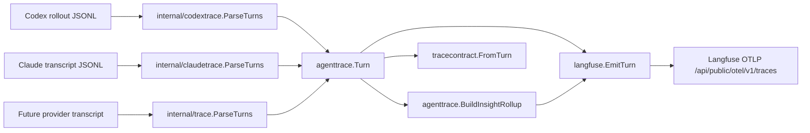

# Claude Langfuse Parity Plan

## 1. Title And Metadata

- Project name: `codex-langfuse-tracer`
- Version: 1.0
- Owners: Repository maintainer and implementation agent
- Date: 2026-05-04
- Document ID: CLT-PLAN-CLAUDE-LANGFUSE-PARITY-20260504
- Purpose and scope: This plan closes the Langfuse integration gaps between Codex CLI and Claude Code in the current Go repository. The work makes command tags, MCP tags, file-change tags, usage details, cost-pricing sync, trace contract goldens, and documentation use one provider-neutral path after parsing. The scope is limited to the existing exporter architecture: `source transcript/log -> internal/<provider>trace -> agenttrace.Turn -> tracecontract.Trace -> langfuse.EmitTurn`.

## 2. Design Consensus And Trade-Offs

- Topic: One canonical Langfuse semantic model after parsing.
  - Verdict: DECISION
  - Rationale: `internal/langfuse/export.go` already exports any `agenttrace.Turn` through one path. The remaining asymmetry is in parser output and `internal/agenttrace/insight.go`, where command, file-change, and MCP rollups currently key on `codex.tool.*` observation names.

- Topic: Replace provider-specific tool-family names with semantic observation families.
  - Verdict: FOR
  - Rationale: Current names such as `codex.tool.exec_command`, `codex.tool.apply_patch`, and `claude.tool.bash` duplicate the same concepts across providers. Canonical names `<provider>.tool.command`, `<provider>.tool.file_change`, `<provider>.tool.mcp`, `<provider>.tool.web_search`, `<provider>.tool.tool_search`, and `<provider>.tool.generic` keep provider names for Langfuse readability while centralizing semantics.

- Topic: Add compatibility aliases for legacy observation names.
  - Verdict: AGAINST
  - Rationale: The repo guidance in `AGENTS.md` rejects legacy paths and duplicate export surfaces. The change should update tests, fixtures, docs, and goldens in one pass instead of emitting old and new observation names.

- Topic: Generic tool category.
  - Verdict: DECISION
  - Rationale: `generic` is a first-class terminal semantic category for observed tools that are not command, file-change, MCP, web-search, or tool-search events. It is not a compatibility path, retry path, or alias layer. Parsers emit one observation per tool call and store the exact provider tool name in metadata.

- Topic: Infer file changes from shell output or Git state.
  - Verdict: AGAINST
  - Rationale: The exporter should reflect structured local transcript data only. Inferring file changes from text output would be brittle, prompt-dependent, and harder to audit than parser-supplied `changed_files` metadata.

- Topic: Claude MCP support.
  - Verdict: DECISION
  - Rationale: Codex MCP data is structured through `mcp_tool_call_end` and `agenttrace.MCPToolMetadata`. Claude MCP support must be added only from an observed, sanitized Claude Code transcript shape that identifies server and tool fields. If the transcript has no structured MCP fields, the parser must not infer MCP identity from human text or add a speculative branch.

- Topic: Claude cost support.
  - Verdict: DECISION
  - Rationale: `internal/langfuse/export.go` already emits `langfuse.observation.model.name` and `langfuse.observation.usage_details`. `internal/langfuse/models.go` currently syncs only OpenAI/Codex model pricing. Claude pricing should be added as model definitions for Langfuse calculation, using official Claude pricing docs from `https://platform.claude.com/docs/en/about-claude/pricing`, with no local `cost_details` math.

- Topic: Provider wrapper execution.
  - Verdict: AGAINST
  - Rationale: README currently documents provider addition through parser packages and `internal/providers/providers.go`. The exporter should not wrap Codex, Claude Code, Gemini CLI, OpenCode, Goose, or other agents.

- Topic: Partial production readiness.
  - Verdict: AGAINST
  - Rationale: Yellow exit gates are diagnostic states only. They block production handoff until either the phase reaches green or the relevant capability is explicitly removed from scope with a test and docs update.

## 3. PRD / Stakeholder And System Needs

- Problem:
  - Claude Code traces export to Langfuse, but command rollups, MCP tags, file-change tags, and cost-pricing behavior are not at the same semantic level as Codex CLI traces.
  - Future providers would inherit the same gap if rollup logic keeps hard-coded Codex observation names.

- Users:
  - Local workstation users who run Codex CLI and Claude Code.
  - Maintainers reviewing Langfuse traces for coding-agent behavior.
  - Future contributors adding Gemini CLI, OpenCode, Goose, or similar local coding agents.

- Value:
  - Langfuse filters work consistently across supported agents.
  - Maintainers can compare provider behavior without learning separate trace schemas.
  - New agent integration requires one parser and shared tests, not a new exporter path.

- Business goals:
  - Keep the public-facing exporter small, direct, and maintainable.
  - Reduce provider-specific logic to parser packages and provider profiles.
  - Preserve Langfuse as the cost-calculation system of record.

- Success metrics:
  - `go test ./... -count=1` passes.
  - `git diff --check` passes.
  - Claude fixtures produce command, MCP, file-change, usage, and tag goldens through `go test ./test -run TestGoldenTraceContract -count=1`.
  - Live Claude Code traces show the same tag families as Codex where the transcript contains equivalent structured data.
  - No active code emits legacy observation aliases.
  - Yellow phase gates do not count as production-ready.

- Scope:
  - `internal/agenttrace`
  - `internal/codextrace`
  - `internal/claudetrace`
  - `internal/langfuse`
  - `internal/tracecontract`
  - `test`
  - `testdata/manifest.json`
  - `testdata/sources/codex`
  - `testdata/sources/claude`
  - `testdata/golden`
  - `README.md`
  - `TESTING.md`
  - `AGENTS.md` only if repo guidance must name the new canonical semantic families

- Non-goals:
  - Provider wrapper execution.
  - Direct Langfuse ingestion API path.
  - Native Codex or Claude OTEL forwarding.
  - Claude transcript directory polling.
  - Automatic mutation of Claude settings.
  - Local cost multiplication or `cost_details`.
  - Backward-compatible duplicate observation aliases.
  - Text parsing of human-readable tool output to synthesize structured MCP or file-change metadata.
  - Provider-specific pricing overrides, aliases, or local model-name fallbacks.

- Dependencies:
  - Go module in `go.mod`, currently `go 1.26.0`.
  - Existing Go tests documented in `TESTING.md`.
  - Existing fixture inventory in `testdata/manifest.json`.
  - Langfuse OTLP endpoint `/api/public/otel/v1/traces`.
  - Official Claude pricing documentation at `https://platform.claude.com/docs/en/about-claude/pricing`.
  - Sanitized Claude Code MCP and file-change transcripts with stable JSONL record shape.

- Risks:
  - Existing README filter examples and goldens will break when observation names change.
  - Claude MCP transcript shape may differ across Claude Code versions.
  - Claude Code subscription cost and Anthropic API token pricing are not the same billing contract.
  - Langfuse model-pricing definitions can conflict with existing user-created model entries.

- Assumptions:
  - Claude Code JSONL transcripts continue to expose `tool_use` and `tool_result` blocks as parsed by `internal/claudetrace/parser.go`.
  - Claude Bash tools include a command string under `input.command`.
  - Claude file-writing tools expose target path metadata in tool input for `Edit`, `Write`, and `MultiEdit`.
  - Langfuse usage details accept model-specific usage keys that match pricing-tier `prices` keys.

- Anti-overengineering constraints:
  - One parser registry: `internal/providers/providers.go`.
  - One shared trace model: `agenttrace.Turn`.
  - One normalized trace projection: `tracecontract.FromTurn`.
  - One Langfuse exporter: `langfuse.EmitTurn`.
  - One fixture registry: `testdata/manifest.json`.
  - One active docs surface set: `README.md`, `TESTING.md`, and short `AGENTS.md`.
  - Zero compatibility aliases, wrapper export paths, direct hook exports, transcript polling loops, local cost math, or provider-specific rollup branches.

## 4. SRS / Canonical Requirements

- REQ-001 type func: The repository shall define canonical semantic tool families for Langfuse observations: `command`, `file_change`, `mcp`, `web_search`, `tool_search`, and `generic`.
  - Acceptance criteria: Active parser output and normalized goldens use `<provider>.tool.<family>` names for supported tool observations. Exact provider tool names remain in metadata.

- REQ-002 type func: Insight rollups shall be provider-neutral.
  - Acceptance criteria: Command counts, failed command counts, verification status, file-change counts, changed extensions, touched test files, MCP counts, and tags are derived from canonical observation family plus metadata, not from hard-coded `codex.tool.*` names.

- REQ-003 type func: Codex parser output shall map existing Codex events to canonical semantic observations.
  - Acceptance criteria: `exec_command_end`, `patch_apply_end`, `mcp_tool_call_end`, `web_search_end`, and deferred tool-search output still export their inputs, outputs, terminal entries, and metadata through the canonical family names.

- REQ-004 type func: Claude parser output shall map Claude Code tools to canonical semantic observations.
  - Acceptance criteria: Claude `Bash` maps to command; Claude file-writing tools map to file-change when structured path fields are present; Claude MCP calls map to MCP when structured server/tool fields are present; other tools map to generic. No parser branch infers structure from human-readable output.

- REQ-005 type int: Langfuse export shall use one provider-neutral projection path.
  - Acceptance criteria: `internal/langfuse/export.go` emits trace names, transcript names, terminal names, tags, metadata, model name, usage details, and tool spans from `agenttrace.Turn` and `ProviderProfile` without importing provider parsers.

- REQ-006 type data: The fixture corpus shall remain manifest-driven.
  - Acceptance criteria: All Codex and Claude fixtures are listed in `testdata/manifest.json`, sources live under `testdata/sources/<provider>`, and normalized expectations live under `testdata/golden`.

- REQ-007 type func: Claude usage details shall preserve cache read and cache creation token categories.
  - Acceptance criteria: `agenttrace.TokenUsage.LangfuseUsageDetails()` emits distinct usage keys for Claude cache read and cache creation tokens when present, without folding those tokens into base input.

- REQ-008 type int: Model pricing sync shall include OpenAI/Codex and Anthropic/Claude model definitions through one catalog.
  - Acceptance criteria: `internal/langfuse/models.go` creates or validates Langfuse model definitions for existing OpenAI/Codex fixtures and observed Claude Code fixture model names. Anthropic prices are source-dated and use the official Claude pricing page. Existing conflicting Langfuse model definitions fail fast; the implementation does not add aliases or local overrides.

- REQ-009 type nfr: The implementation shall not add duplicate logic, duplicate docs surfaces, compatibility aliases, or parallel exporter paths.
  - Acceptance criteria: Static tests fail if active code or docs contain legacy semantic observation aliases after migration.

- REQ-010 type security: Redaction and hidden-thinking handling shall remain shared.
  - Acceptance criteria: `agenttrace.ExportText` remains the only export redaction path; Claude `thinking` and `redacted_thinking` blocks remain excluded from output and terminal observations.

- REQ-011 type reliability: Unsupported or malformed provider records shall fail loudly at parser boundaries.
  - Acceptance criteria: Parser tests cover corrupt transcripts, unsupported record types, missing MCP server/tool fields, and incomplete turns without silent export of incomplete data.

- REQ-012 type perf: Rollup computation shall stay lightweight for local exporter use.
  - Acceptance criteria: 100 rollup computations complete within 10 ms on the existing unit-test fixture.

- Error handling and telemetry expectations:
  - Parser errors include source path and line number for malformed JSONL records.
  - Unsupported providers return `providers.ErrUnsupportedProvider`.
  - Langfuse export returns non-2xx OTLP status as an error.
  - Failed command observations set `langfuse.observation.level=ERROR` and a status message derived from `failure_type`.
  - Trace tags never include prompts, outputs, cwd, file paths, session IDs, trace IDs, or exact MCP tool names.



```text
System: codex-langfuse-tracer

Container: CLI and watcher
  cmd/codex-langfuse-exporter
  internal/watch
  internal/exportstate

Container: Provider parsers
  internal/codextrace      -> Codex rollout JSONL to agenttrace.Turn
  internal/claudetrace     -> Claude transcript JSONL to agenttrace.Turn
  internal/providers       -> one parser registry

Container: Shared domain core
  internal/agenttrace      -> Turn, Observation, TokenUsage, redaction, terminal stream, insight rollup
  internal/tracecontract   -> normalized golden trace contract

Container: External boundary
  internal/langfuse        -> OTLP export, trace fetch, model pricing sync
  Langfuse                 -> trace storage, filters, model pricing, calculated costs
```

## 5. Iterative Implementation And Test Plan

- Phase strategy:
  - Start by adding failing provider-neutral tests for rollup semantics.
  - Migrate parser output to canonical semantic observation families.
  - Update goldens and docs only after parser and rollup tests pass.
  - Add Claude pricing and usage-detail support after trace semantics are stable.
  - Finish with live Claude validation and the existing production gate.

- Compute controls:
  - branch_limits: one active implementation branch; one parser registry; one fixture manifest; zero compatibility aliases.
  - reflection_passes: 2 review passes per phase, one before GREEN and one before REFACTOR.
  - early_stop%: 0 for implementation phases; stop only on Red criteria or unavailable external transcript data.

- Risk register:
  - Risk: Claude MCP transcript shape is unavailable. Trigger: no sanitized transcript with server/tool fields for P02 RED. Mitigation: suspend P02 MCP mapping and request a sanitized transcript before implementation.
  - Risk: Langfuse model definition conflict. Trigger: `SyncModelPricing` sees the same model name with a different pricing tier. Mitigation: fail fast with the exact conflicting model fields; do not add alias matching, local override math, or provider-specific bypasses.
  - Risk: Legacy filter names remain in docs. Trigger: static docs tests find old observation names. Mitigation: update README and TESTING in P05.
  - Risk: Provider-neutral names break all goldens at once. Trigger: broad `TestGoldenTraceContract` diff. Mitigation: update fixtures and goldens in one phase after parser unit tests pass.

- Suspension criteria:
  - Stop before P02 GREEN for Claude MCP if no real sanitized Claude MCP transcript shape exists.
  - Stop before P04 GREEN if official pricing source cannot be accessed or prices conflict with current source.
  - Stop before P06 GREEN if live Claude Code or Langfuse credentials are unavailable.
  - Stop before production handoff on any Yellow criteria.

- Resumption criteria:
  - Resume P02 with a sanitized JSONL fixture committed under `testdata/sources/claude`.
  - Resume P04 after recording official source URL, source date, model names, and prices in tests.
  - Resume P06 after `LANGFUSE_HOST`, `LANGFUSE_PUBLIC_KEY`, `LANGFUSE_SECRET_KEY`, Claude Code CLI, and the watched service are available.
  - Resume production handoff only from Green criteria.

### Phase P00: Baseline And Static Guard

- Scope and objectives:
  - Impacted requirements: REQ-001, REQ-002, REQ-009.
  - Add failing static and unit tests that prove current hard-coded Codex semantics and legacy observation names remain.

- Steps:
  - Step 1 RED: create/update `TEST-520` in `internal/agenttrace/insight_test.go` for REQ-002; run `go test ./internal/agenttrace -run TestInsightRollupProviderNeutralSemanticFamilies -count=1`; expected FAIL because `BuildInsightRollup` currently counts command, file-change, and MCP semantics only for `codex.tool.exec_command`, `codex.tool.apply_patch`, and `codex.tool.mcp`.
  - Step 2 GREEN: implement minimal provider-neutral family detection in `internal/agenttrace/insight.go`; run `go test ./internal/agenttrace -run TestInsightRollupProviderNeutralSemanticFamilies -count=1`; expected PASS.
  - Step 3 REFACTOR: remove duplicated family parsing and centralize family extraction in `internal/agenttrace/insight.go`; run `go test ./internal/agenttrace -count=1`; expected PASS for TEST-520 and existing agenttrace tests.
  - Step 4 MEASURE: run EVAL-520 with `go test ./internal/agenttrace -run 'TestEvalInsightProviderNeutralDeterminism|TestEvalInsightRollupLatency' -count=1`; expected thresholds met.
  - Restore point: before Phase P01, run `git status --short && git tag -f restore/claude-langfuse-parity-P00`.

- Exit gates:
  - Green criteria: TEST-520 and EVAL-520 pass.
  - Yellow criteria: Rollup tests pass but naming migration still leaves legacy names outside parser output.
  - Red criteria: Provider-neutral rollup requires importing provider packages into `internal/agenttrace`.

- Phase metrics:
  - Confidence %: 85; local tests directly exercise the shared rollup gap.
  - Long-term robustness %: 90; semantic family parsing reduces provider-specific branches.
  - Internal interactions: 2; `internal/agenttrace` and `test/static_architecture_test.go`.
  - External interactions: 0; no network or Langfuse dependency.
  - Complexity %: 25; limited pure Go logic change.
  - Feature creep %: 5; scope is existing rollup semantics only.
  - Technical debt %: 10; legacy names may still exist until P02/P03.
  - YAGNI score: 95; no compatibility alias path.
  - MoSCoW: Must.
  - Local/non-local scope: Local.
  - Architectural changes count: 1.

### Phase P01: Canonical Observation Families

- Scope and objectives:
  - Impacted requirements: REQ-001, REQ-002, REQ-009.
  - Define and enforce canonical observation names and metadata keys.

- Steps:
  - Step 1 RED: create/update `TEST-521` in `test/static_architecture_test.go` for REQ-001 and REQ-009; run `go test ./test -run TestNoLegacySemanticToolNames -count=1`; expected FAIL because active docs, parser tests, or goldens still reference legacy names such as `codex.tool.exec_command`, `codex.tool.apply_patch`, or `claude.tool.bash`.
  - Step 2 GREEN: add canonical family helpers in `internal/agenttrace` and update tests to expect `<provider>.tool.command`, `<provider>.tool.file_change`, `<provider>.tool.mcp`, `<provider>.tool.web_search`, `<provider>.tool.tool_search`, and `<provider>.tool.generic`; run `go test ./test -run TestNoLegacySemanticToolNames -count=1`; expected PASS.
  - Step 3 REFACTOR: move all semantic family strings into one `internal/agenttrace` owner and remove duplicate literals from parser tests; run `go test ./internal/agenttrace ./test -run 'TestInsightRollupProviderNeutralSemanticFamilies|TestNoLegacySemanticToolNames' -count=1`; expected PASS for TEST-520 and TEST-521.
  - Step 4 MEASURE: run EVAL-523 with `go test ./test -run 'TestNoDuplicateAgentTraceLogic|TestProviderParserDispatchHasOneOwner|TestNoLegacySemanticToolNames' -count=1`; expected thresholds met.
  - Restore point: before Phase P02, run `git status --short && git tag -f restore/claude-langfuse-parity-P01`.

- Exit gates:
  - Green criteria: TEST-521 and EVAL-523 pass.
  - Yellow criteria: Static test passes but docs still need P05 wording updates.
  - Red criteria: More than one package owns canonical semantic family constants.

- Phase metrics:
  - Confidence %: 80; static ownership tests catch duplicate names.
  - Long-term robustness %: 88; one semantic vocabulary supports future providers.
  - Internal interactions: 3; `internal/agenttrace`, `test`, docs references.
  - External interactions: 0.
  - Complexity %: 30.
  - Feature creep %: 5.
  - Technical debt %: 8.
  - YAGNI score: 90.
  - MoSCoW: Must.
  - Local/non-local scope: Local.
  - Architectural changes count: 1.

### Phase P02: Parser Semantic Parity

- Scope and objectives:
  - Impacted requirements: REQ-003, REQ-004, REQ-006, REQ-010, REQ-011.
  - Update Codex and Claude parser output to canonical semantic observation families.

- Steps:
  - Step 1 RED: create/update `TEST-522` in `internal/codextrace/parser_test.go` for REQ-003; run `go test ./internal/codextrace -run TestCodexParserCanonicalToolFamilies -count=1`; expected FAIL because Codex parser currently emits legacy tool observation names.
  - Step 2 GREEN: update `internal/codextrace/parser.go` to emit canonical Codex tool families with existing metadata preserved; run `go test ./internal/codextrace -run TestCodexParserCanonicalToolFamilies -count=1`; expected PASS.
  - Step 3 RED: create/update `TEST-523`, `TEST-524`, and `TEST-525` in `internal/claudetrace/parser_test.go` for REQ-004, REQ-010, and REQ-011; run `go test ./internal/claudetrace -run 'TestClaudeParserCanonicalBashCommand|TestClaudeParserCanonicalFileChange|TestClaudeParserCanonicalMCP' -count=1`; expected FAIL because Claude parser currently emits Bash as `claude.tool.bash`, file-writing tools as generic, and no MCP metadata.
  - Step 4 GREEN: update `internal/claudetrace/parser.go` to map Claude Bash, file-writing, and MCP tools to canonical families using structured tool input/result data; run `go test ./internal/claudetrace -run 'TestClaudeParserCanonicalBashCommand|TestClaudeParserCanonicalFileChange|TestClaudeParserCanonicalMCP' -count=1`; expected PASS.
  - Step 5 REFACTOR: remove parser-local duplicated metadata shaping and reuse `agenttrace.CommandInsightMetadata`, `agenttrace.FileChangeMetadata`, and `agenttrace.MCPToolMetadata` where inputs match those helper contracts; run `go test ./internal/codextrace ./internal/claudetrace -count=1`; expected PASS for TEST-522, TEST-523, TEST-524, and TEST-525.
  - Step 6 MEASURE: run EVAL-526 with `go test ./internal/codextrace ./internal/claudetrace -run 'TestCodexParserCanonicalToolFamilies|TestClaudeParserCanonicalBashCommand|TestClaudeParserCanonicalFileChange|TestClaudeParserCanonicalMCP' -count=1`; expected thresholds met.
  - Restore point: before Phase P03, run `git status --short && git tag -f restore/claude-langfuse-parity-P02`.

- Exit gates:
  - Green criteria: Parser tests pass for Codex and Claude canonical family output.
  - Yellow criteria: Codex and Claude command/file-change tests pass, but MCP waits for sanitized Claude MCP source data; production handoff remains blocked.
  - Red criteria: Claude MCP mapping relies on string parsing of human text instead of structured fields.

- Phase metrics:
  - Confidence %: 75; Codex data shape is already tested, Claude MCP shape depends on a sanitized fixture.
  - Long-term robustness %: 87; provider-specific parsing remains in parser packages only.
  - Internal interactions: 4; `internal/codextrace`, `internal/claudetrace`, `internal/agenttrace`, `testdata`.
  - External interactions: 0.
  - Complexity %: 45.
  - Feature creep %: 10.
  - Technical debt %: 10.
  - YAGNI score: 85.
  - MoSCoW: Must.
  - Local/non-local scope: Local.
  - Architectural changes count: 1.

### Phase P03: Golden Contract And Langfuse Projection

- Scope and objectives:
  - Impacted requirements: REQ-001, REQ-002, REQ-005, REQ-006, REQ-009.
  - Update normalized trace contracts, fixture manifest categories, and OTLP projection tests for semantic parity.

- Steps:
  - Step 1 RED: create/update `TEST-526` in `test/contract_test.go`, `test/contract_fixture_test.go`, `testdata/manifest.json`, and `testdata/golden/*.normalized.json` for REQ-001, REQ-002, REQ-005, and REQ-006; run `go test ./test -run TestGoldenTraceContract -count=1`; expected FAIL because existing goldens still contain legacy observation names and Claude traces lack MCP/file-change tags.
  - Step 2 GREEN: update manifest entries, source fixtures, and normalized goldens so Codex and Claude emit canonical observations and provider-neutral tags; run `go test ./test -run TestGoldenTraceContract -count=1`; expected PASS.
  - Step 3 RED: create/update `TEST-527` in `internal/langfuse/spans_test.go` for REQ-005; run `go test ./internal/langfuse -run TestLangfuseProviderNeutralSemanticTagsExportedOnSpans -count=1`; expected FAIL because OTLP span expectations still reference old provider-specific tool names.
  - Step 4 GREEN: update Langfuse span expectations and any exporter metadata assertions to use canonical family output; run `go test ./internal/langfuse -run TestLangfuseProviderNeutralSemanticTagsExportedOnSpans -count=1`; expected PASS.
  - Step 5 REFACTOR: remove duplicate Codex-only and Claude-only contract assertions where a provider-neutral assertion covers both; run `go test ./test ./internal/langfuse -run 'TestGoldenTraceContract|TestGoldenLangfuseTagsContract|TestLangfuseProviderNeutralSemanticTagsExportedOnSpans' -count=1`; expected PASS for TEST-526 and TEST-527.
  - Step 6 MEASURE: run EVAL-521 with `go test ./test -run TestEvalGoldenFixtureCoverageForLangfuseTags -count=1`; expected thresholds met.
  - Restore point: before Phase P04, run `git status --short && git tag -f restore/claude-langfuse-parity-P03`.

- Exit gates:
  - Green criteria: Golden contract and OTLP projection tests pass with canonical observations.
  - Yellow criteria: Golden tests pass but docs static tests still expect legacy examples.
  - Red criteria: Contract tests allow unexpected extra observations or duplicate aliases.

- Phase metrics:
  - Confidence %: 82; the normalized contract corpus exercises the user-facing trace shape.
  - Long-term robustness %: 90; future providers use the same contract harness.
  - Internal interactions: 5; `test`, `testdata`, `internal/langfuse`, `internal/tracecontract`, `internal/agenttrace`.
  - External interactions: 0.
  - Complexity %: 50.
  - Feature creep %: 8.
  - Technical debt %: 7.
  - YAGNI score: 88.
  - MoSCoW: Must.
  - Local/non-local scope: Non-local.
  - Architectural changes count: 1.

### Phase P04: Claude Usage And Pricing

- Scope and objectives:
  - Impacted requirements: REQ-007, REQ-008.
  - Add Claude usage details and Anthropic model pricing sync through the existing Langfuse model-definition path.

- Steps:
  - Step 1 RED: create/update `TEST-529` in `internal/claudetrace/parser_test.go` and `internal/agenttrace/model_test.go` for REQ-007; run `go test ./internal/claudetrace ./internal/agenttrace -run 'TestClaudeUsageDetailsPreserveCacheCategories|TestTokenUsageLangfuseDetailsPreserveCacheCategories' -count=1`; expected FAIL because Claude cache creation tokens are currently folded into base input and only cache read maps to `input_cached_tokens`.
  - Step 2 GREEN: extend `agenttrace.TokenUsage` and Claude parsing to preserve `cache_creation_input_tokens` and `cache_read_input_tokens` as distinct Langfuse usage details; run `go test ./internal/claudetrace ./internal/agenttrace -run 'TestClaudeUsageDetailsPreserveCacheCategories|TestTokenUsageLangfuseDetailsPreserveCacheCategories' -count=1`; expected PASS.
  - Step 3 RED: create/update `TEST-528` in `internal/langfuse/models_test.go` for REQ-008; run `go test ./internal/langfuse -run 'TestModelPricingCatalogCoversOpenAIAndAnthropicModels|TestModelDefinitionSyncCreatesMissingModels' -count=1`; expected FAIL because `codexModelPricingCatalog()` currently covers only OpenAI/Codex models.
  - Step 4 GREEN: generalize the pricing catalog in `internal/langfuse/models.go` to include OpenAI/Codex and Anthropic/Claude entries, including `claude-haiku-4-5-20251001` with prices from the official Claude pricing page accessed on 2026-05-04: input `0.000001`, 5-minute cache write `0.00000125`, 1-hour cache write `0.000002`, cache read `0.00000010`, output `0.000005`; run `go test ./internal/langfuse -run 'TestModelPricingCatalogCoversOpenAIAndAnthropicModels|TestModelDefinitionSyncCreatesMissingModels' -count=1`; expected PASS.
  - Step 5 REFACTOR: rename Codex-specific pricing types to provider-neutral names without changing the public `--sync-model-pricing` CLI behavior; run `go test ./internal/langfuse -count=1`; expected PASS for TEST-528 and existing model sync tests.
  - Step 6 MEASURE: run EVAL-522 with `go test ./internal/langfuse -run TestEvalPricingCatalogCoverage -count=1`; expected thresholds met.
  - Restore point: before Phase P05, run `git status --short && git tag -f restore/claude-langfuse-parity-P04`.

- Exit gates:
  - Green criteria: Claude usage keys and Langfuse pricing definitions cover fixture model names.
  - Yellow criteria: Pricing sync tests pass but live Langfuse already has conflicting model definitions; production handoff remains blocked until the conflict is resolved in Langfuse.
  - Red criteria: Implementation emits local `cost_details` or local calculated costs.

- Phase metrics:
  - Confidence %: 78; official prices are known, but user Langfuse instances can contain conflicting model definitions.
  - Long-term robustness %: 84; one catalog supports multiple providers.
  - Internal interactions: 3; `internal/agenttrace`, `internal/claudetrace`, `internal/langfuse`.
  - External interactions: 1; official Claude pricing page.
  - Complexity %: 45.
  - Feature creep %: 10.
  - Technical debt %: 8.
  - YAGNI score: 83.
  - MoSCoW: Should.
  - Local/non-local scope: Non-local.
  - Architectural changes count: 1.

### Phase P05: Documentation And Production Gate

- Scope and objectives:
  - Impacted requirements: REQ-001, REQ-005, REQ-008, REQ-009.
  - Update active docs and production commands so maintainers see one provider-neutral integration path.

- Steps:
  - Step 1 RED: create/update `TEST-530` in `test/docs_static_test.go` for REQ-001, REQ-005, REQ-008, and REQ-009; run `go test ./test -run 'TestDocsTagsAndMCPUsage|TestDocsLangfuseCostPricing|TestDocsClaudeSupportContract|TestDocsCanonicalSemanticToolFamilies' -count=1`; expected FAIL because README and TESTING still describe legacy tool names and deferred Claude pricing.
  - Step 2 GREEN: update `README.md` and `TESTING.md` to document canonical observation families, Claude command/MCP/file-change parity, Anthropic pricing sync, and new provider integration guidance; run `go test ./test -run 'TestDocsTagsAndMCPUsage|TestDocsLangfuseCostPricing|TestDocsClaudeSupportContract|TestDocsCanonicalSemanticToolFamilies' -count=1`; expected PASS.
  - Step 3 REFACTOR: remove duplicated docs wording and keep active documentation in `README.md`, `TESTING.md`, and short `AGENTS.md` guidance only; run `go test ./test -run 'TestDocsCodingAgentIntegrationGuide|TestNoLegacyDuplicateClaudePaths|TestNoLegacySemanticToolNames' -count=1`; expected PASS for TEST-521 and TEST-530.
  - Step 4 MEASURE: run EVAL-524 with `go test ./... -count=1`; expected thresholds met.
  - Step 5 MEASURE: run EVAL-525 with `git diff --check`; expected thresholds met.
  - Restore point: before Phase P06, run `git status --short && git tag -f restore/claude-langfuse-parity-P05`.

- Exit gates:
  - Green criteria: Docs static tests, full Go suite, and diff whitespace gate pass.
  - Yellow criteria: Docs tests pass but archival `plans/` references still mention older behavior; production handoff remains blocked only if active docs or tests reference the older behavior.
  - Red criteria: Active docs require legacy aliases or duplicate fixture registries.

- Phase metrics:
  - Confidence %: 88; static docs tests guard active documentation.
  - Long-term robustness %: 86; provider integration guidance stays centralized.
  - Internal interactions: 4; README, TESTING, AGENTS, docs static tests.
  - External interactions: 0.
  - Complexity %: 25.
  - Feature creep %: 5.
  - Technical debt %: 5.
  - YAGNI score: 92.
  - MoSCoW: Must.
  - Local/non-local scope: Local.
  - Architectural changes count: 0.

### Phase P06: Live Claude Validation

- Scope and objectives:
  - Impacted requirements: REQ-004, REQ-005, REQ-007, REQ-008, REQ-011.
  - Validate the production path against live Claude Code and Langfuse after local tests pass.

- Steps:
  - Step 1 RED: create/update `TEST-532` in `internal/langfuse/live_claude_parity_test.go` for REQ-004, REQ-005, REQ-007, REQ-008, and REQ-011; run `LIVE_LANGFUSE_CLAUDE_TRACE_ID="$TRACE_ID" go test ./internal/langfuse -run TestLiveClaudeParityTrace -count=1`; expected FAIL before CHECK-001 records a trace that contains command, MCP, file-change, model, usage, and tag fields.
  - Step 2 GREEN: execute CHECK-001 and CHECK-002 to produce a live Claude trace ID, then run `LIVE_LANGFUSE_CLAUDE_TRACE_ID="$TRACE_ID" go test ./internal/langfuse -run TestLiveClaudeParityTrace -count=1`; expected PASS.
  - Step 3 REFACTOR: document live result fields in `TESTING.md` without adding a second live-test harness; run `go test ./test -run TestDocsClaudeSupportContract -count=1`; expected PASS for TEST-530.
  - Step 4 MEASURE: run EVAL-524 with `go test ./... -count=1`; expected thresholds met.
  - Step 5 MEASURE: run EVAL-525 with `git diff --check`; expected thresholds met.
  - Restore point: after Phase P06, run `git status --short && git tag -f restore/claude-langfuse-parity-P06`.

- Exit gates:
  - Green criteria: Live Claude trace has canonical command, MCP, file-change, model, usage, and tag fields in Langfuse.
  - Yellow criteria: Live command and file-change fields pass, but live MCP cannot be produced by installed Claude Code configuration; production handoff remains blocked for MCP parity.
  - Red criteria: Live trace requires direct hook export, transcript polling, local cost math, or provider wrapper execution.

- Phase metrics:
  - Confidence %: 70; live validation depends on local Claude Code, Langfuse availability, and MCP configuration.
  - Long-term robustness %: 82; live gate validates the production path.
  - Internal interactions: 3; `internal/langfuse`, TESTING, service state.
  - External interactions: 2; Claude Code CLI and Langfuse API.
  - Complexity %: 35.
  - Feature creep %: 5.
  - Technical debt %: 7.
  - YAGNI score: 85.
  - MoSCoW: Should.
  - Local/non-local scope: Non-local.
  - Architectural changes count: 0.

## 6. Evaluations

```yaml
evals:
  - id: EVAL-520
    purpose: dev
    metrics:
      - provider_neutral_rollup_deterministic
      - 100_rollups_latency_ms
    thresholds:
      provider_neutral_rollup_deterministic: true
      100_rollups_latency_ms: "<=10"
    seeds:
      - completeFixtureTurn
      - claudeCanonicalCommandFixture
    runtime_budget: "2s"
  - id: EVAL-521
    purpose: holdout
    metrics:
      - golden_fixture_tag_coverage
      - no_exact_mcp_tool_in_tags
      - no_path_like_tag_values
    thresholds:
      golden_fixture_tag_coverage: "100%"
      no_exact_mcp_tool_in_tags: true
      no_path_like_tag_values: true
    seeds:
      - testdata/manifest.json
    runtime_budget: "3s"
  - id: EVAL-522
    purpose: dev
    metrics:
      - pricing_catalog_covers_fixture_models
      - pricing_catalog_uses_source_dates
      - no_local_cost_details
    thresholds:
      pricing_catalog_covers_fixture_models: "100%"
      pricing_catalog_uses_source_dates: true
      no_local_cost_details: true
    seeds:
      - testdata/manifest.json
      - official_claude_pricing_2026_05_04
    runtime_budget: "2s"
  - id: EVAL-523
    purpose: adversarial
    metrics:
      - one_agenttrace_owner
      - one_provider_parser_dispatch_owner
      - no_legacy_semantic_tool_names
    thresholds:
      one_agenttrace_owner: true
      one_provider_parser_dispatch_owner: true
      no_legacy_semantic_tool_names: true
    seeds:
      - repository_source_tree
    runtime_budget: "2s"
  - id: EVAL-524
    purpose: holdout
    metrics:
      - full_go_suite_pass
    thresholds:
      full_go_suite_pass: true
    seeds:
      - repository_source_tree
    runtime_budget: "60s"
  - id: EVAL-525
    purpose: dev
    metrics:
      - diff_whitespace_clean
    thresholds:
      diff_whitespace_clean: true
    seeds:
      - repository_worktree
    runtime_budget: "2s"
  - id: EVAL-526
    purpose: dev
    metrics:
      - codex_parser_semantic_family_coverage
      - claude_parser_semantic_family_coverage
      - parser_hidden_thinking_exclusion
    thresholds:
      codex_parser_semantic_family_coverage: "100%"
      claude_parser_semantic_family_coverage: "100%"
      parser_hidden_thinking_exclusion: true
    seeds:
      - testdata/sources/codex/complete-tools.jsonl
      - testdata/sources/claude/bash-tool.jsonl
      - testdata/sources/claude/file-change-tool.jsonl
      - testdata/sources/claude/mcp-tool.jsonl
    runtime_budget: "2s"
```

## 7. Tests

### 7.1 Test Inventory

- Actual test frameworks/runners:
  - Go test runner from `go.mod`.
  - Go fuzz runner for existing `internal/codextrace/fuzz_test.go`.
  - `git diff --check` whitespace gate from `AGENTS.md` and `TESTING.md`.

- Existing command inventory from `TESTING.md`:
  - `go test ./... -count=1`
  - `go test ./test -run TestGoldenTraceContract -count=1`
  - `go test ./internal/codextrace -count=1`
  - `go test ./internal/claudetrace -count=1`
  - `go test ./internal/claudehook ./internal/exportstate ./internal/watch -run 'TestClaudeHookEnqueuesStopOnly|TestExportStateQueueDedupe|TestWatchDrainsClaudeQueue' -count=1`
  - `go test ./internal/watch -count=1`
  - `go test ./cmd/codex-langfuse-exporter -run 'TestCLIProviderSelection|TestManualProviderExportCLIIntegration' -count=1`
  - `go test ./internal/providers -count=1`
  - `go test ./test -run TestProviderParserDispatchHasOneOwner -count=1`
  - `go test ./internal/langfuse -count=1`
  - `go test ./internal/codextrace -run TestInsightCountMetadataSingleRepresentation -count=1`
  - `go test ./test -run TestGoldenLangfuseSingleRepresentation -count=1`
  - `go test ./internal/langfuse -run TestCountMetadataExportedOnAgent -count=1`
  - `go test ./test -run TestDocsNavigationFacetsAndFilters -count=1`
  - `go test ./internal/codextrace -run TestInsightTagFacets -count=1`
  - `go test ./test -run TestGoldenLangfuseTagsContract -count=1`
  - `go test ./internal/langfuse -run TestLangfuseTraceTagsExportedOnSpans -count=1`
  - `go test ./test -run TestDocsTagsAndMCPUsage -count=1`
  - `go test ./internal/codextrace -run '^$' -fuzz=FuzzParseTurnsDoesNotPanic -fuzztime=10s`
  - `go test ./internal/codextrace -run '^$' -fuzz=FuzzExportTextRedactsSentinels -fuzztime=10s`
  - `go test ./... -coverpkg=./... -coverprofile=/tmp/codex-langfuse-tracer.all.cover`
  - `go test ./internal/claudetrace ./internal/claudehook ./internal/exportstate -count=1`
  - `git diff --check`

- File globs and locations:
  - Unit tests: `internal/**/*_test.go`
  - Integration/contract tests: `test/**/*_test.go`
  - Static architecture tests: `test/static_architecture_test.go`, `test/docs_static_test.go`
  - Fixture manifest: `testdata/manifest.json`
  - Fixture sources: `testdata/sources/<provider>/*.jsonl`
  - Normalized goldens: `testdata/golden/*.normalized.json`

- Missing commands:
  - No package.json, Makefile, or CI workflow command file is present in the current repository inventory. No new command wrapper is required because `TESTING.md` already defines direct Go commands.

### 7.2 Test Suites Overview

- name: Unit
  - purpose: Parser, rollup, model, privacy, terminal, provider registry, and Langfuse helper behavior.
  - runner: Go test
  - command: `go test ./internal/... -count=1`
  - runtime budget: 20s
  - when it runs: pre-commit and CI

- name: Integration
  - purpose: CLI behavior, watcher queue behavior, trace contract, and OTLP projection.
  - runner: Go test
  - command: `go test ./cmd/codex-langfuse-exporter ./internal/watch ./test -count=1`
  - runtime budget: 30s
  - when it runs: pre-commit and CI

- name: E2E
  - purpose: Live Claude Code to Langfuse trace verification.
  - runner: Go test plus CHECK-001 and CHECK-002 procedures.
  - command: `LIVE_LANGFUSE_CLAUDE_TRACE_ID="$TRACE_ID" go test ./internal/langfuse -run TestLiveClaudeParityTrace -count=1`
  - runtime budget: 120s
  - when it runs: release gate

- name: Perf
  - purpose: Rollup latency and watcher performance guard.
  - runner: Go test
  - command: `go test ./internal/agenttrace ./internal/watch -run 'TestEvalInsightRollupLatency|TestWatchLargeStatePerf' -count=1`
  - runtime budget: 10s
  - when it runs: pre-commit and CI

- name: Data Drift
  - purpose: Fixture manifest and pricing catalog coverage.
  - runner: Go test
  - command: `go test ./test ./internal/langfuse -run 'TestGoldenTraceContract|TestModelPricingCatalogCoversOpenAIAndAnthropicModels' -count=1`
  - runtime budget: 10s
  - when it runs: pre-commit and CI

- name: Static
  - purpose: Docs, ownership, duplicate-path, and no-legacy-name gates.
  - runner: Go test and git
  - command: `go test ./test -run 'TestNoDuplicateAgentTraceLogic|TestProviderParserDispatchHasOneOwner|TestNoLegacySemanticToolNames|TestDocsCanonicalSemanticToolFamilies' -count=1`
  - runtime budget: 5s
  - when it runs: pre-commit and CI

### 7.3 Test Definitions

- id: TEST-520
  - name: Provider-neutral insight rollup semantic families
  - type: unit
  - verifies: REQ-001, REQ-002
  - location: `internal/agenttrace/insight_test.go`
  - command: `go test ./internal/agenttrace -run TestInsightRollupProviderNeutralSemanticFamilies -count=1`
  - fixtures/mocks/data: in-memory `agenttrace.Turn` values containing `codex.tool.command`, `claude.tool.command`, `claude.tool.file_change`, and `claude.tool.mcp`
  - deterministic controls: no network; no time dependency; test functions include `// TEST-520`
  - pass_criteria: command counts, verification status, file-change counts, MCP server counts, metadata, and tags are identical for equivalent Codex and Claude semantic observations
  - expected_runtime: 1s

- id: TEST-521
  - name: No legacy semantic tool names
  - type: static
  - verifies: REQ-001, REQ-009
  - location: `test/static_architecture_test.go`
  - command: `go test ./test -run TestNoLegacySemanticToolNames -count=1`
  - fixtures/mocks/data: repository source, README, TESTING, AGENTS, `testdata/golden/*.normalized.json`
  - deterministic controls: local filesystem only; test function includes `// TEST-521`
  - pass_criteria: active code, active docs, and goldens do not contain legacy observation names after migration
  - expected_runtime: 1s

- id: TEST-522
  - name: Codex parser canonical tool families
  - type: unit
  - verifies: REQ-003, REQ-006, REQ-010
  - location: `internal/codextrace/parser_test.go`
  - command: `go test ./internal/codextrace -run TestCodexParserCanonicalToolFamilies -count=1`
  - fixtures/mocks/data: `testdata/sources/codex/complete-tools.jsonl`
  - deterministic controls: local fixture only; test function includes `// TEST-522`
  - pass_criteria: parsed observations use canonical Codex tool families and preserve command, file-change, MCP, web-search, and tool-search metadata
  - expected_runtime: 1s

- id: TEST-523
  - name: Claude parser canonical Bash command
  - type: unit
  - verifies: REQ-004, REQ-007, REQ-010
  - location: `internal/claudetrace/parser_test.go`
  - command: `go test ./internal/claudetrace -run TestClaudeParserCanonicalBashCommand -count=1`
  - fixtures/mocks/data: `testdata/sources/claude/bash-tool.jsonl`
  - deterministic controls: local fixture only; test function includes `// TEST-523`
  - pass_criteria: Claude Bash maps to `claude.tool.command`, includes `tool_name`, `command_kind`, `status`, `failure_type`, and terminal text
  - expected_runtime: 1s

- id: TEST-524
  - name: Claude parser canonical file change
  - type: unit
  - verifies: REQ-004, REQ-006, REQ-011
  - location: `internal/claudetrace/parser_test.go`
  - command: `go test ./internal/claudetrace -run TestClaudeParserCanonicalFileChange -count=1`
  - fixtures/mocks/data: `testdata/sources/claude/file-change-tool.jsonl`
  - deterministic controls: local sanitized fixture; test function includes `// TEST-524`
  - pass_criteria: Claude file-writing tool maps to `claude.tool.file_change`, includes sorted `changed_files`, `changed_file_count`, and file-change type metadata without root-level `changed_files`
  - expected_runtime: 1s

- id: TEST-525
  - name: Claude parser canonical MCP
  - type: unit
  - verifies: REQ-004, REQ-006, REQ-011
  - location: `internal/claudetrace/parser_test.go`
  - command: `go test ./internal/claudetrace -run TestClaudeParserCanonicalMCP -count=1`
  - fixtures/mocks/data: `testdata/sources/claude/mcp-tool.jsonl`
  - deterministic controls: local sanitized fixture from observed Claude Code MCP transcript shape; test function includes `// TEST-525`
  - pass_criteria: Claude MCP maps to `claude.tool.mcp`, includes normalized `mcp_server`, exact `mcp_tool` in observation metadata, and does not put exact MCP tool names into tags
  - expected_runtime: 1s

- id: TEST-526
  - name: Golden trace contract semantic parity
  - type: integration
  - verifies: REQ-001, REQ-002, REQ-005, REQ-006, REQ-009, REQ-010, REQ-011
  - location: `test/contract_test.go`
  - command: `go test ./test -run TestGoldenTraceContract -count=1`
  - fixtures/mocks/data: all entries in `testdata/manifest.json`
  - deterministic controls: local fixtures and goldens only; modified tests include `// TEST-526`
  - pass_criteria: every manifest fixture matches its normalized golden exactly, with no unexpected extra observations
  - expected_runtime: 3s

- id: TEST-527
  - name: Langfuse provider-neutral semantic tags exported on spans
  - type: integration
  - verifies: REQ-002, REQ-005
  - location: `internal/langfuse/spans_test.go`
  - command: `go test ./internal/langfuse -run TestLangfuseProviderNeutralSemanticTagsExportedOnSpans -count=1`
  - fixtures/mocks/data: in-memory Codex and Claude turns with command, file-change, MCP, and usage metadata
  - deterministic controls: fake OTLP span exporter; no network; test function includes `// TEST-527`
  - pass_criteria: agent, transcript, terminal, and tool spans receive sorted trace tags and provider metadata through the shared exporter
  - expected_runtime: 1s

- id: TEST-528
  - name: Model pricing catalog covers OpenAI and Anthropic models
  - type: unit
  - verifies: REQ-008
  - location: `internal/langfuse/models_test.go`
  - command: `go test ./internal/langfuse -run TestModelPricingCatalogCoversOpenAIAndAnthropicModels -count=1`
  - fixtures/mocks/data: `testdata/manifest.json`, fixture model names, official pricing source constants in `models.go`
  - deterministic controls: no network in test; source URL and source date asserted as constants; test function includes `// TEST-528`
  - pass_criteria: catalog covers fixture model names and includes nonzero prices for `input`, Claude cache write/read keys, and `output`
  - expected_runtime: 1s

- id: TEST-529
  - name: Claude usage details preserve cache categories
  - type: unit
  - verifies: REQ-007
  - location: `internal/claudetrace/parser_test.go`, `internal/agenttrace/model_test.go`
  - command: `go test ./internal/claudetrace ./internal/agenttrace -run 'TestClaudeUsageDetailsPreserveCacheCategories|TestTokenUsageLangfuseDetailsPreserveCacheCategories' -count=1`
  - fixtures/mocks/data: in-memory Claude usage map with `input_tokens`, `output_tokens`, `cache_creation_input_tokens`, and `cache_read_input_tokens`
  - deterministic controls: no network; test functions include `// TEST-529`
  - pass_criteria: Langfuse usage details keep base input, cache creation input, cache read input, output, and total as distinct fields
  - expected_runtime: 1s

- id: TEST-530
  - name: Docs canonical semantic tool families
  - type: static
  - verifies: REQ-001, REQ-005, REQ-008, REQ-009
  - location: `test/docs_static_test.go`
  - command: `go test ./test -run 'TestDocsTagsAndMCPUsage|TestDocsLangfuseCostPricing|TestDocsClaudeSupportContract|TestDocsCanonicalSemanticToolFamilies' -count=1`
  - fixtures/mocks/data: README, TESTING, AGENTS
  - deterministic controls: local filesystem only; test function includes `// TEST-530`
  - pass_criteria: active docs describe canonical observation families, Claude parity fields, Anthropic pricing sync, and no duplicate provider paths
  - expected_runtime: 1s

- id: TEST-531
  - name: Full repository Go gate
  - type: integration
  - verifies: REQ-001, REQ-002, REQ-003, REQ-004, REQ-005, REQ-006, REQ-007, REQ-008, REQ-009, REQ-010, REQ-011, REQ-012
  - location: `.`
  - command: `go test ./... -count=1`
  - fixtures/mocks/data: all Go packages and committed test fixtures
  - deterministic controls: local test suite; live tests must skip unless their documented environment variables are set; existing tests and new modified tests include `// TEST-###` comments
  - pass_criteria: all packages pass
  - expected_runtime: 60s

- id: TEST-532
  - name: Live Claude parity trace
  - type: e2e
  - verifies: REQ-004, REQ-005, REQ-007, REQ-008, REQ-011
  - location: `internal/langfuse/live_claude_parity_test.go`
  - command: `LIVE_LANGFUSE_CLAUDE_TRACE_ID="$TRACE_ID" go test ./internal/langfuse -run TestLiveClaudeParityTrace -count=1`
  - fixtures/mocks/data: live Langfuse trace created by CHECK-001 and CHECK-002
  - deterministic controls: `LIVE_LANGFUSE_CLAUDE_TRACE_ID` set to the trace ID produced in the same validation session; `LANGFUSE_HOST`, `LANGFUSE_PUBLIC_KEY`, and `LANGFUSE_SECRET_KEY` set from local config; test function includes `// TEST-532`
  - pass_criteria: fetched trace contains `claude.turn.transcript`, canonical Claude tool observations, model name, usage details, and expected tags for command, MCP, and file changes
  - expected_runtime: 15s

### 7.4 Manual Checks, Optional

- CHECK-001: Live Claude Code transcript creation.
  - Procedure:
    - Confirm `claude --version`.
    - Use Claude Code print mode with the cheapest available model alias `haiku`.
    - Prompt Claude to execute one Bash command, invoke one configured MCP tool, and make one harmless file edit in a temporary directory.
    - Capture the transcript JSONL path and the expected sentinel string.
    - Export with `~/.codex/bin/codex-langfuse-exporter --provider claude --path "$TRANSCRIPT_JSONL"`.
    - Record the Langfuse trace ID as `TRACE_ID`.
  - Completion evidence: Claude Code version, model alias, transcript path, trace ID, and exporter HTTP status.

- CHECK-002: Claude hook queue path.
  - Procedure:
    - Configure the existing Claude Stop hook to call `codex-langfuse-exporter --claude-hook`.
    - Repeat the CHECK-001 prompt in a temporary directory.
    - Let `codex-langfuse-watch.service` drain the queue.
    - Record the queued trace ID and compare it with the explicitly exported trace family fields.
  - Completion evidence: queue drained, trace exists in Langfuse, and canonical tags match the explicit export path.

## 8. Data Contract

- Schema snapshot:
  - `agenttrace.Turn`
    - `Provider string`
    - `SessionID string`
    - `TurnID string`
    - `TraceID string`
    - `StartTS string`
    - `EndTS string`
    - `CWD string`
    - `Model string`
    - `UserMessages []string`
    - `AssistantTexts []string`
    - `TokenUsage *TokenUsage`
    - `Completed bool`
    - `TerminalEntries []TerminalEntry`
    - `Observations []Observation`
  - `agenttrace.Observation`
    - `Name string`
    - `StartTimeUnixNS string`
    - `EndTimeUnixNS string`
    - `Type string`
    - `Input string`
    - `Output string`
    - `Metadata map[string]any`
  - `agenttrace.TokenUsage`
    - Existing fields: input, output, total, cached input, reasoning output.
    - Planned fields: cache creation input and cache read input as distinct categories for Claude.
  - `tracecontract.Trace`
    - Schema version, provider, trace ID, session ID, turn ID, input, output, model, cwd, metadata, tags, token usage, exportable state, parse-error state, and observations.

- Invariants:
  - Completed turns require non-empty prompt, non-empty assistant output, and non-empty stable trace ID before export.
  - Trace IDs include provider, session ID, and turn ID.
  - Tags are sorted, unique, lowercase, and derived from navigation plus MCP server only.
  - Root metadata never contains full `changed_files`.
  - Exact MCP tool names stay in observation metadata only.
  - Parser packages may import `internal/agenttrace`; `internal/agenttrace` must not import parser or Langfuse packages.

- Privacy/data quality constraints:
  - Export text uses `agenttrace.ExportText`.
  - Hidden Claude thinking blocks are omitted.
  - Large raw payload fields are omitted from observation metadata.
  - No secrets are added to fixtures, docs, plans, or goldens.
  - Cost fields are model-pricing definitions and usage details only; no local calculated cost fields.

## 9. Reproducibility

- Seeds:
  - `testdata/manifest.json`
  - `testdata/sources/codex/*.jsonl`
  - `testdata/sources/claude/*.jsonl`
  - in-memory fixture constructors in `internal/agenttrace/fixture_test.go`

- Hardware assumptions:
  - Linux workstation.
  - Local filesystem access to Codex and Claude transcript fixtures.
  - Network only for live Langfuse and official pricing-source lookup during implementation.

- OS/driver/container tag:
  - OS: Linux.
  - Go: version declared by `go.mod`, `go 1.26.0`.
  - Container: none required by current repository.

- Relevant environment variables:
  - `LANGFUSE_HOST`
  - `LANGFUSE_PUBLIC_KEY`
  - `LANGFUSE_SECRET_KEY`
  - `CODEX_HOME`
  - `TRACE_ID`
  - `TRANSCRIPT_JSONL`
  - `LIVE_LANGFUSE_CLAUDE_TRACE_ID`

## 10. Requirements Traceability Matrix

| Phase | REQ-### | TEST-### | Test Path | Command |
|---|---|---|---|---|
| P00 | REQ-001 | TEST-520 | `internal/agenttrace/insight_test.go` | `go test ./internal/agenttrace -run TestInsightRollupProviderNeutralSemanticFamilies -count=1` |
| P00 | REQ-002 | TEST-520 | `internal/agenttrace/insight_test.go` | `go test ./internal/agenttrace -run TestInsightRollupProviderNeutralSemanticFamilies -count=1` |
| P01 | REQ-001 | TEST-521 | `test/static_architecture_test.go` | `go test ./test -run TestNoLegacySemanticToolNames -count=1` |
| P01 | REQ-009 | TEST-521 | `test/static_architecture_test.go` | `go test ./test -run TestNoLegacySemanticToolNames -count=1` |
| P02 | REQ-003 | TEST-522 | `internal/codextrace/parser_test.go` | `go test ./internal/codextrace -run TestCodexParserCanonicalToolFamilies -count=1` |
| P02 | REQ-004 | TEST-523 | `internal/claudetrace/parser_test.go` | `go test ./internal/claudetrace -run TestClaudeParserCanonicalBashCommand -count=1` |
| P02 | REQ-004 | TEST-524 | `internal/claudetrace/parser_test.go` | `go test ./internal/claudetrace -run TestClaudeParserCanonicalFileChange -count=1` |
| P02 | REQ-004 | TEST-525 | `internal/claudetrace/parser_test.go` | `go test ./internal/claudetrace -run TestClaudeParserCanonicalMCP -count=1` |
| P02 | REQ-006 | TEST-522 | `internal/codextrace/parser_test.go` | `go test ./internal/codextrace -run TestCodexParserCanonicalToolFamilies -count=1` |
| P02 | REQ-010 | TEST-523 | `internal/claudetrace/parser_test.go` | `go test ./internal/claudetrace -run TestClaudeParserCanonicalBashCommand -count=1` |
| P02 | REQ-011 | TEST-525 | `internal/claudetrace/parser_test.go` | `go test ./internal/claudetrace -run TestClaudeParserCanonicalMCP -count=1` |
| P03 | REQ-001 | TEST-526 | `test/contract_test.go` | `go test ./test -run TestGoldenTraceContract -count=1` |
| P03 | REQ-002 | TEST-526 | `test/contract_test.go` | `go test ./test -run TestGoldenTraceContract -count=1` |
| P03 | REQ-005 | TEST-527 | `internal/langfuse/spans_test.go` | `go test ./internal/langfuse -run TestLangfuseProviderNeutralSemanticTagsExportedOnSpans -count=1` |
| P03 | REQ-006 | TEST-526 | `test/contract_test.go` | `go test ./test -run TestGoldenTraceContract -count=1` |
| P03 | REQ-009 | TEST-526 | `test/contract_test.go` | `go test ./test -run TestGoldenTraceContract -count=1` |
| P04 | REQ-007 | TEST-529 | `internal/claudetrace/parser_test.go`, `internal/agenttrace/model_test.go` | `go test ./internal/claudetrace ./internal/agenttrace -run 'TestClaudeUsageDetailsPreserveCacheCategories|TestTokenUsageLangfuseDetailsPreserveCacheCategories' -count=1` |
| P04 | REQ-008 | TEST-528 | `internal/langfuse/models_test.go` | `go test ./internal/langfuse -run TestModelPricingCatalogCoversOpenAIAndAnthropicModels -count=1` |
| P05 | REQ-001 | TEST-530 | `test/docs_static_test.go` | `go test ./test -run 'TestDocsTagsAndMCPUsage|TestDocsLangfuseCostPricing|TestDocsClaudeSupportContract|TestDocsCanonicalSemanticToolFamilies' -count=1` |
| P05 | REQ-005 | TEST-530 | `test/docs_static_test.go` | `go test ./test -run 'TestDocsTagsAndMCPUsage|TestDocsLangfuseCostPricing|TestDocsClaudeSupportContract|TestDocsCanonicalSemanticToolFamilies' -count=1` |
| P05 | REQ-008 | TEST-530 | `test/docs_static_test.go` | `go test ./test -run 'TestDocsTagsAndMCPUsage|TestDocsLangfuseCostPricing|TestDocsClaudeSupportContract|TestDocsCanonicalSemanticToolFamilies' -count=1` |
| P05 | REQ-009 | TEST-530 | `test/docs_static_test.go` | `go test ./test -run 'TestDocsTagsAndMCPUsage|TestDocsLangfuseCostPricing|TestDocsClaudeSupportContract|TestDocsCanonicalSemanticToolFamilies' -count=1` |
| P06 | REQ-004 | TEST-532 | `internal/langfuse/live_claude_parity_test.go` | `LIVE_LANGFUSE_CLAUDE_TRACE_ID="$TRACE_ID" go test ./internal/langfuse -run TestLiveClaudeParityTrace -count=1` |
| P06 | REQ-005 | TEST-532 | `internal/langfuse/live_claude_parity_test.go` | `LIVE_LANGFUSE_CLAUDE_TRACE_ID="$TRACE_ID" go test ./internal/langfuse -run TestLiveClaudeParityTrace -count=1` |
| P06 | REQ-007 | TEST-532 | `internal/langfuse/live_claude_parity_test.go` | `LIVE_LANGFUSE_CLAUDE_TRACE_ID="$TRACE_ID" go test ./internal/langfuse -run TestLiveClaudeParityTrace -count=1` |
| P06 | REQ-008 | TEST-532 | `internal/langfuse/live_claude_parity_test.go` | `LIVE_LANGFUSE_CLAUDE_TRACE_ID="$TRACE_ID" go test ./internal/langfuse -run TestLiveClaudeParityTrace -count=1` |
| P06 | REQ-011 | TEST-532 | `internal/langfuse/live_claude_parity_test.go` | `LIVE_LANGFUSE_CLAUDE_TRACE_ID="$TRACE_ID" go test ./internal/langfuse -run TestLiveClaudeParityTrace -count=1` |
| P06 | REQ-012 | TEST-531 | `.` | `go test ./... -count=1` |

## 11. Execution Log Template

- Phase Status: Pending/Done
- Completed Steps:
- Quantitative Results: metrics mean +/- std, 95% CI
- Issues/Resolutions:
- Failed Attempts:
- Deviations:
- Lessons Learned:
- ADR Updates:

## 12. Appendix: ADR Index

- ADR-001: Use canonical semantic observation families and remove legacy aliases.
- ADR-002: Keep provider-specific logic in parser packages and provider profiles only.
- ADR-003: Keep Langfuse as the cost-calculation system and avoid local cost math.
- ADR-004: Add Anthropic pricing definitions only from official Claude pricing docs with source date.
- ADR-005: Require sanitized real transcript shape before implementing Claude MCP mapping.
- ADR-006: Treat Yellow gates as non-production states, not acceptable release states.

## 13. Consistency Check

- All REQs appear in the RTM.
- All TEST IDs referenced in phases, evals, or RTM are defined in Section 7.3.
- Every phase has RED/GREEN/REFACTOR/MEASURE steps.
- Every phase has populated metrics.
- Every verification step includes a TEST-### or EVAL-### plus an exact command.
- Commands are grounded in `TESTING.md`, `go.mod`, or Git restore-point requirements.
- Manual CHECK entries do not appear in the RTM.
- No active implementation step precedes a RED test for its impacted requirements.
- No compatibility aliases, duplicate fixture registries, wrapper export paths, local cost math, or direct Langfuse ingestion paths are planned.
- Yellow gates are explicitly non-production states.
