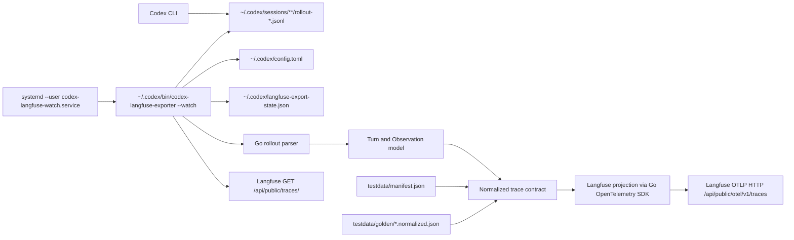

# Go Rewrite Plan for Codex Langfuse Tracer

## 1. Title and metadata
- Project name: Codex Langfuse Tracer
- Version: 1.0
- Owners: repository maintainer and implementation agent
- Date: 2026-05-01
- Document ID: CLT-GO-SRS-TEST-PLAN-001
- Purpose and scope: This plan defines a verification-first rewrite of the repository runtime from Python to Go. It covers requirements, architecture, phased implementation, tests, evaluations, data contracts, and traceability for replacing `bin/export_codex_session_to_langfuse.py` with a compiled Go binary while preserving the existing Langfuse trace contract, `systemd --user` watcher behavior, installer behavior, and documentation.

## 2. Design consensus and trade-offs
| Topic | Verdict | Rationale grounded in repository/context constraints |
|---|---|---|
| Rewrite language | DECISION: Go | The repository currently has one Python runtime file of about 1100 lines plus shell install scripts and a systemd service. Go is installed locally as `go1.26.0 linux/amd64`, supports a compiled machine-level binary, and keeps deployment simpler than Python runtime management. |
| Python runtime path | AGAINST | The repository goal is one way of doing things. Keeping Python and Go paths would duplicate parser/export/watch logic and increase the risk of divergent Langfuse traces. |
| Wrapper export | AGAINST | The repository already deleted wrapper-based export in favor of a background watcher. The Go rewrite must keep one export path through `codex-langfuse-watch.service`. |
| Native Codex OTEL | AGAINST | The README records that native Codex OTEL emits low-level runtime spans such as socket, streaming, dispatch, and model internals that do not match the trace goals. |
| Go OTel SDK | DECISION: FOR | The rewrite will use official Go OpenTelemetry packages because Langfuse ingestion is OTLP HTTP and trace/span typing should be represented through OTel APIs rather than hand-built JSON. |
| TOML parser | DECISION: FOR | Current credentials live in `~/.codex/config.toml` under `[mcp_servers.langfuse.env]`. A TOML library avoids brittle parsing of credential config. |
| Initial history behavior | DECISION: watermark | Current watch mode sets an initial watermark and avoids parsing/exporting all old local session history. The Go watcher must keep this behavior to avoid flooding Langfuse and to avoid corrupt old rollout files blocking startup. |
| File watching approach | DECISION: polling | Polling exists in the current design, has low complexity, avoids inotify portability and race issues, and is fast enough for `~/.codex/sessions`. |
| Per-file observations | AGAINST | Current docs keep file changes as metadata on `codex.tool.apply_patch`; adding per-file observations would increase noise and cost without a current use case. |
| Test strategy | DECISION: Go `testing` with parallel tests | No package.json, Makefile, scripts directory, or CI config exists in the current repo. The rewrite will create Go tests and execute them with `go test`, using `t.Parallel()` and isolated temp dirs. |
| Dry-run mode | AGAINST | The current project context records no dry-run mode. The rewrite keeps behavior lean by testing through fake servers and temp homes instead of shipping a second runtime mode. |
| Shell-specific support | DECISION: shell-independent service | The watch service follows rollout files and does not wrap shells. This covers `codex`, local `co`, `codex exec`, and `codex resume` when Codex writes rollouts, without fish/bash/zsh-specific runtime logic. |
| Trace-table input/output | DECISION: clean prompt and final answer | Trace table previews must show the first useful prompt and final answer text. Timestamps and terminal framing belong in `codex.terminal`, not trace-level input/output. |
| Terminal visibility | DECISION: `codex.terminal` | All visible Codex CLI activity that Codex records locally is represented as one ordered terminal stream. `codex.timeline` remains deleted. |
| Langfuse Agent Graph and Log View | DECISION: typed observations only | `agent`, `generation`, `tool`, and `span` observations with parent-child nesting are enough for Langfuse Agent Graphs and Trace Log View. No second graph export format is added. |
| Context tracking | AGAINST authoritative context list | Rollout JSONL does not provide a guaranteed structured list of files added to model context. File reads may appear as commands, but the exporter must not label them as authoritative model context. |
| Include/exclude rules | AGAINST for current scope | The current context records no include/exclude config surface. Redaction and documented limits are retained, but extra path-rule configuration is deferred until real usage creates the need. |
| Langfuse deployment | DECISION: external dependency | Self-hosted Langfuse is installed outside this repository under `/home/kirill/p/langfuse`; this repo reads credentials from `~/.codex/config.toml` and must not store Langfuse secrets. |
| Language-agnostic contract tests | DECISION: first execution gate | Before translating behavior into Go, the plan freezes synthetic rollout fixtures and normalized golden trace JSON. The Go tests validate those language-agnostic fixtures first, then later Go implementation tests must match the same goldens. |
| Contract manifest | DECISION: explicit fixture inventory | `testdata/manifest.json` lists fixture IDs and behavior categories so coverage is declarative and not inferred from filenames. |
| Normalized contract schema | DECISION: versioned semantic schema | Every golden file uses `schema_version: 1`; schema or metric threshold changes require an ADR before implementation continues. |
| Raw OTLP snapshots | AGAINST | Golden files compare semantic trace shape, not raw OTLP transport envelopes, protobuf byte order, SDK incidental fields, or backend-specific serialization. |
| Langfuse projection package | DECISION: single Go OTel projection path | Domain code produces `NormalizedTraceContract`; only `internal/langfuse` maps that contract to Langfuse through the Go OpenTelemetry SDK. No alternate direct-OTLP exporter is planned in this rewrite. If the chosen SDK cannot satisfy deterministic IDs, timing, and parent-child relationships, phase execution stops and this plan is revised before code proceeds. |

Prior decisions to preserve:
- Keep one runtime and one automatic export path; no Python alternate runtime, wrapper export path, native OTEL parallel path, direct-OTLP implementation, or shell-specific runtime branch.
- Keep exactly one Langfuse projection path through the Go OpenTelemetry SDK during this rewrite.
- Keep the watcher as the normal automatic path; manual export is only for explicit backfill and debugging.
- Keep trace data focused on Codex input, final output, visible terminal activity, tool calls, command output, patch diffs, token usage, timing, and file-change metadata.
- Keep low-level Codex runtime spans out of new traces, including streaming/socket/dispatch/model-client internals.
- Keep trace-level input/output on `codex.agent` only, with no duplicate trace input/output attributes on child observations.
- Keep `codex.agent` as root, `codex.transcript` as the generation child, `codex.terminal` as the ordered visible CLI stream, and `codex.tool.*` for tool observations.
- Keep `apply_patch` file details as metadata on `codex.tool.apply_patch`; do not fan out per-file observations.
- Keep visible reasoning summaries only when Codex records a non-empty summary; never export hidden reasoning `content` or `encrypted_content`.
- Keep the first-start watermark to avoid exporting old local history while leaving current/recent active rollouts eligible.
- Keep local setup and docs secret-free; Langfuse credentials live in `~/.codex/config.toml` or the external Langfuse stack `.env`, not in this repo.
- Use the current Python exporter only to characterize and freeze committed normalized golden fixtures before implementation. Final tests must validate the Go binary and must not depend on Python as an alternate runtime.
- Keep `testdata/manifest.json` as the declarative fixture inventory and require every normalized golden to declare `schema_version: 1`.
- Keep normalization rules explicit: stable sort observations, strip transport-only OTLP fields, preserve semantic IDs/timestamps where required, and compare metadata after deterministic JSON normalization.

## 3. PRD / stakeholder and system needs
- Problem: The repository exports Codex CLI rollout JSONL content to Langfuse through a Python watcher. The project needs a compiled Go implementation with the same behavior, smaller runtime surface, and fast parallel tests.
- Users: the local machine owner running Codex CLI, future maintainers reading the repo, and implementation agents making changes to tracing behavior.
- Value: one compiled binary, one watcher path, no Python runtime requirement, faster startup, strongly typed implementation boundaries, and a test suite suitable for quick iteration.
- Business goals:
  - Preserve current Langfuse trace utility for prompts, final answers, terminal stream, tool calls, timing, token usage, and agent graph/log views.
  - Reduce runtime operational complexity by removing Python from the installed path.
  - Improve maintainability through a typed implementation and traceable tests.
- Success metrics:
  - 100% of `REQ-###` rows appear in the requirements traceability matrix.
  - 100% of `TEST-###` tests pass locally.
  - Golden fixture coverage matches `testdata/manifest.json`, with at least one synthetic fixture for each automatable product-functionality category in this plan.
  - Watcher exports a synthetic completed turn through a fake OTLP endpoint in less than 5 seconds at p95.
  - Real local smoke export returns Langfuse API input/output matching the Codex prompt/final answer.
  - Installed service remains active for 2 minutes after startup with memory under 150 MiB.
- Product functionality inventory:
  - Automatic tracing: a `systemd --user` watcher polls Codex rollout JSONL under `~/.codex/sessions/**/rollout-*.jsonl` and exports completed turns without waiting for Codex process exit.
  - Shell coverage: the watcher is independent of fish, bash, zsh, aliases, and wrappers; any launcher is covered when Codex writes standard rollout files.
  - Manual backfill: the CLI supports `--latest`, `--session-id`, `--path`, `--turn-id`, verification controls, and no-verify mode for explicit backfill/debugging.
  - Credential loading: the exporter reads `LANGFUSE_HOST`, `LANGFUSE_PUBLIC_KEY`, and `LANGFUSE_SECRET_KEY` from `~/.codex/config.toml` under `[mcp_servers.langfuse.env]`.
  - Trace creation: the exporter sends one Langfuse trace per completed turn named `codex.turn.transcript`.
  - Trace previews: Langfuse table input/output show clean user prompt and final assistant answer text without terminal timestamps.
  - Agent workflow shape: `codex.agent` is the root `agent` observation; `codex.transcript` is the main `generation` child; typed children allow Langfuse Agent Graph and Trace Log View to render the run.
  - Transcript data: the transcript includes user input, final assistant output, token usage, cached input tokens, reasoning output tokens, and turn timing when Codex records them.
  - Terminal stream: `codex.terminal` captures ordered visible CLI-relevant events recorded locally, including user messages, assistant messages, tool calls, command output, and patch output.
  - Assistant progress: visible commentary messages are exported as `codex.message.commentary`.
  - Reasoning summaries: non-empty visible reasoning summaries are exported as `codex.reasoning.summary`; hidden or encrypted reasoning fields are excluded.
  - Tool observations: shell commands, `apply_patch`, MCP calls, web search, and deferred tool discovery are exported as typed tool observations when present in the rollout.
  - File-change metadata: `apply_patch` observations include changed files, added/modified/deleted/moved files, change types, changed file count, and unified diffs.
  - Timing: tool and observation durations are preserved when start/end timestamps are available.
  - Stable identity: trace IDs and span IDs are deterministic for repeatable session/turn/observation inputs.
  - State and dedupe: watcher state stores processed trace IDs and an initial scan watermark in `~/.codex/langfuse-export-state.json`.
  - Error behavior: watch mode skips corrupt/unreadable rollout files with warnings, does not advance state after failed export, and logs success/failure with trace IDs.
  - Install/uninstall: install builds the Go binary, installs the user service, starts it, and removes the old Codex wrapper; uninstall removes service, binary, old wrapper, log, and state.
  - Documentation: README and project context describe install, credential setup, local self-hosted Langfuse, manual backfill, verification, trace contract, limits, and troubleshooting.
- Scope:
  - Create language-agnostic synthetic rollout fixtures and normalized golden trace JSON before parser/exporter translation.
  - Rewrite exporter, parser, watch loop, state handling, OTLP export, verification client, install/uninstall scripts, service unit, and docs.
  - Replace Python runtime file with Go source and binary installation.
  - Preserve current trace contract and CLI flags.
- Non-goals:
  - No launchd, cron, Windows service, inotify-only watcher, native Codex OTEL, per-file observation fanout, SDK migration to Langfuse native API, or UI automation suite.
  - No deletion or migration of existing Langfuse traces.
- Dependencies:
  - Go `1.26.0` is present locally.
  - Codex rollout files are under `~/.codex/sessions/**/rollout-*.jsonl`.
  - Langfuse credentials are in `~/.codex/config.toml`.
  - Local automatic mode uses `systemd --user`.
  - Go dependencies: `github.com/BurntSushi/toml`, `go.opentelemetry.io/otel`, `go.opentelemetry.io/otel/sdk`, `go.opentelemetry.io/otel/exporters/otlp/otlptrace/otlptracehttp`.
- Risks:
  - OpenTelemetry SDK custom ID injection may be harder than hand-built OTLP JSON.
  - Go OpenTelemetry SDK deterministic replay can fail if historical timestamps, IDs, or parent-child relationships cannot be injected cleanly.
  - Golden fixtures can overfit current implementation artifacts if they compare raw OTLP instead of normalized semantic trace shape.
  - Parser parity can drift from the Python behavior without golden tests.
  - Corrupt historical JSONL files can crash the daemon if watch mode does not skip them.
  - State watermark mistakes can miss turns or duplicate export.
  - Secret redaction regressions can leak prompt/tool data.
- Assumptions:
  - Linux/WSL2 remains the supported automatic runtime target.
  - Go is available at install time.
  - Tests will use synthetic fixtures and fake HTTP servers; real Codex/Langfuse smoke is optional.
  - The current dirty working tree is accepted as the baseline for this plan.
- Compute controls:
  ```yaml
  branch_limits:
    max_parallel_feature_branches: 1
    max_parallel_test_branches: 2
    rationale: keep one runtime rewrite path while allowing parser/exporter test work in parallel
  reflection_passes: 2
  early_stop%: 85
  ```

## 4. SRS / canonical requirements
### Functional requirements
- REQ-001 type func: The system shall replace `bin/export_codex_session_to_langfuse.py` with a Go binary installed at `~/.codex/bin/codex-langfuse-exporter`. Acceptance: no installed Python exporter is needed for normal operation.
- REQ-002 type func: The Go CLI shall preserve the current source selection flags `--session-id`, `--path`, `--latest`, and `--watch` as mutually exclusive modes. Acceptance: invalid combinations exit non-zero with a clear error.
- REQ-003 type func: The Go parser shall read Codex JSONL rollouts and build completed turns only after `event_msg` payload type `task_complete`. Acceptance: final-answer-only turns are not exported.
- REQ-004 type func: The Go parser shall preserve message, commentary, reasoning summary, context compaction, tool, and terminal event behavior from the Python exporter. Acceptance: synthetic fixtures produce expected observations and terminal entries.
- REQ-005 type func: The Go exporter shall emit one Langfuse trace per completed Codex turn named `codex.turn.transcript`. Acceptance: exported trace name matches the current contract.
- REQ-006 type func: The Go watcher shall poll `~/.codex/sessions/**/rollout-*.jsonl` and export newly completed turns without depending on Codex process exit. Acceptance: a new completed fixture is exported by watch mode.
- REQ-007 type func: Manual export modes shall support `--turn-id`, `--no-verify`, `--verify-wait-seconds`, and `--verify-interval-seconds`. Acceptance: CLI tests cover these flags.

### Non-functional requirements
- REQ-008 type reliability: Watch mode shall skip unreadable rollout files with a warning and continue. Acceptance: corrupt JSONL fixture does not terminate watch scan.
- REQ-009 type reliability: Watch state shall prevent normal duplicate exports and persist successful trace IDs atomically. Acceptance: repeated scans export a completed turn once.
- REQ-010 type perf: Watch scan shall export a single new completed turn through a fake OTLP endpoint within 5 seconds p95 on this WSL2/Linux machine. Acceptance: performance eval threshold passes.
- REQ-011 type security: The exporter shall redact known key/token patterns before truncation. Acceptance: redaction tests cover all current regex patterns.
- REQ-012 type security: The exporter shall never export hidden reasoning `content` or `encrypted_content`. Acceptance: reasoning tests assert only visible summaries appear.
- REQ-013 type reliability: The installed service shall start through `systemd --user`, restart on failure, and run the Go binary. Acceptance: service unit validation passes.
- REQ-014 type nfr: The Go test suite shall support parallel execution with isolated temp dirs. Acceptance: `go test ./... -parallel 8` passes.

### Interface/API requirements
- REQ-015 type int: The Go CLI shall keep current defaults: environment `default`, service name `codex_transcript_exporter`, state file `~/.codex/langfuse-export-state.json`, poll interval `5.0`, verify wait `25.0`, verify interval `3.0`. Acceptance: CLI default tests pass.
- REQ-016 type int: The OTLP HTTP export shall send to `<LANGFUSE_HOST>/api/public/otel/v1/traces` with Basic auth and `x-langfuse-ingestion-version: 4`. Acceptance: fake HTTP server observes exact path and headers.
- REQ-017 type int: The verification client shall fetch `GET <LANGFUSE_HOST>/api/public/traces/<trace_id>` with Basic auth. Acceptance: fake server returns trace JSON and verification succeeds.
- REQ-018 type int: The installer shall build the Go binary, install the service unit, remove old Python/wrapper installed paths, and start `codex-langfuse-watch.service`. Acceptance: temp HOME install test validates files and command text.
- REQ-019 type int: The uninstaller shall stop/disable the service and remove the Go binary, old Python path, old wrapper path, log file, service unit, and state file. Acceptance: temp HOME uninstall test validates removal.

### Data requirements
- REQ-020 type data: Stable trace IDs shall remain `sha256("codex-turn:<session_id>:<turn_id>")[:32]` when Codex lacks `payload.trace_id`. Acceptance: stable ID tests match known vectors.
- REQ-021 type data: Deterministic span IDs shall remain derived from current string prefixes for agent, transcript, and observation spans. Acceptance: OTel span tests match known vectors.
- REQ-022 type data: The state file schema shall remain version `1` with `scan_watermark_ns` and `processed_trace_ids`. Acceptance: state load/save tests match JSON schema snapshot.
- REQ-023 type data: Exported text fields shall be redacted then truncated to 50,000 characters with the current truncation suffix. Acceptance: text limit tests pass.
- REQ-024 type data: Observation metadata for `apply_patch` shall include `changed_files`, `added_files`, `modified_files`, `deleted_files`, `moved_files`, `file_change_types`, and `changed_file_count`. Acceptance: patch fixture tests pass.
- REQ-029 type data: Contract fixtures shall include `testdata/manifest.json`, `testdata/rollouts/*.jsonl`, and `testdata/golden/*.normalized.json`; the manifest shall list fixture IDs and behavior categories. Acceptance: fixture schema tests validate manifest coverage.
- REQ-030 type data: Normalized golden trace contracts shall use `schema_version: 1` and compare semantic trace shape instead of raw OTLP transport fields. Acceptance: contract tests validate normalization rules and reject transport-only fields.

### Error handling and telemetry expectations
- REQ-025 type reliability: Manual mode shall fail loudly on invalid rollout JSON with file path and line number. Acceptance: manual parser error test passes.
- REQ-026 type reliability: Watch export failure shall not advance the watermark for that scan. Acceptance: failed fake OTLP test retries the same turn.
- REQ-027 type nfr: Logs shall include `exported trace=<id> status=<status> path=<path>` on successful watch export and `ERROR: failed to export trace=<id>` on export failure. Acceptance: watch log tests pass.
- REQ-028 type nfr: Documentation shall describe Go build/install commands, service operation, manual backfill, troubleshooting, and trace contract without Python runtime commands. Acceptance: docs test scans for expected and forbidden strings.

### Architecture diagram


C4-style ASCII representation:
```text
System: Codex Langfuse Tracer
  Person: Local Codex user
  Container: Codex CLI
    Writes rollout JSONL under ~/.codex/sessions
  Container: codex-langfuse-exporter Go binary
    Reads config, parses rollouts, creates normalized trace model, exports OTLP, manages state
  Container: contract fixture corpus
    Provides manifest, synthetic rollouts, and normalized golden JSON for migration conformance
  Container: systemd user service
    Starts and restarts watch mode
  External system: Langfuse
    Receives OTLP traces and serves trace verification API
```

## 5. Iterative implementation and test plan
Phase strategy:
- Build Go test harness and language-agnostic contract fixtures first, then add parser, privacy, exporter, watcher, CLI, installer, docs, and migration.
- Freeze normalized golden JSON before translating parser/exporter behavior; later Go tests consume those fixtures rather than reusing Python as an oracle.
- Use micro-steps with one failing test command before each code change.
- Create git restore tags before and after each phase with `git tag -f restore/go-rewrite-Pxx-start` and `git tag -f restore/go-rewrite-Pxx-done`.
- Use synthetic fixtures only in committed tests; live local Langfuse checks remain outside RTM.

Risk register:
| Risk | Trigger | Mitigation |
|---|---|---|
| OTel custom IDs fail | In-memory span tests show random trace/span IDs | Keep ID generation in `internal/langfuse`; if TEST-007 cannot pass through the Go OTel SDK, suspend the rewrite and revise this plan instead of adding a second exporter |
| OTel SDK projection leaks into domain | Parser or contract package imports OTel SDK packages | Keep OTel imports inside `internal/langfuse`; add architectural assertions in package graph eval |
| Golden contract overfits Python internals | Golden files contain raw OTLP envelope or incidental field ordering | Normalize to semantic trace shape before comparing |
| Python oracle lingers | Final tests call `bin/export_codex_session_to_langfuse.py` | P07 docs/static checks and contract tests forbid Python runtime dependency after migration |
| Parser parity drift | Fixture expected observation count changes | Golden tests for each Codex event category |
| Watch misses active turn | New rollout mtime is ahead of scan start | Watch test covers mtime greater than scan start and next-scan export |
| Duplicate export | Repeated scan sends same trace twice | State test requires processed trace ID persistence after success |
| Secret leak | Redaction test finds unredacted key pattern | Redaction suite blocks merge |
| Old corrupt rollout blocks daemon | Watch scan returns parse error | Watch helper skips corrupt files and logs warning |
| Python residue | Docs or install still mention Python runtime | Docs/static test scans repository paths and docs |

Suspension criteria:
- Stop phase execution when any RED command does not fail for the intended reason.
- Stop phase execution when GREEN requires changing public behavior not listed in `REQ-###`.
- Stop phase execution when a metric threshold would need to change; create ADR before continuing.

Resumption criteria:
- Resume from the latest `restore/go-rewrite-Pxx-start` or `restore/go-rewrite-Pxx-done` tag.
- Document failed attempts in the execution log template.
- Add or update ADR before changing metric thresholds or trace contract.

### Phase P00: Contract fixtures and Go test harness
- Scope and objectives: Create Go module, package skeleton, language-agnostic rollout fixtures, fixture manifest, normalized golden trace JSON, and executable test/eval commands before parser/exporter translation. Impacts `REQ-001`, `REQ-003`, `REQ-004`, `REQ-005`, `REQ-011`, `REQ-012`, `REQ-014`, `REQ-020`, `REQ-023`, `REQ-024`, `REQ-029`, `REQ-030`.
- Restore point before RED: `git tag -f restore/go-rewrite-P00-start`.
- Step 1 RED: create/update `TEST-001` in `cmd/codex-langfuse-exporter/main_test.go` for `REQ-001`; run `go test ./...`; expected FAIL because `go.mod` and Go package files do not exist.
- Step 2 GREEN: implement minimal `go.mod`, package directories, and a no-op CLI returning help text; run `go test ./...`; expected PASS.
- Step 3 RED: create/update `TEST-020` in `test/contract_fixture_test.go` for `REQ-003`, `REQ-004`, `REQ-005`, `REQ-011`, `REQ-012`, `REQ-020`, `REQ-023`, `REQ-024`, `REQ-029`, and `REQ-030`; run `go test ./test -run TestGoldenFixturesAreLanguageAgnostic -count=1`; expected FAIL because `testdata/manifest.json`, `testdata/rollouts/*.jsonl`, and `testdata/golden/*.normalized.json` do not exist.
- Step 4 GREEN: add `testdata/manifest.json`, synthetic rollout fixtures, and normalized golden trace JSON with `schema_version: 1`; manifest categories must cover the automatable product-functionality inventory in Section 3; run `go test ./test -run TestGoldenFixturesAreLanguageAgnostic -count=1`; expected PASS.
- Step 5 REFACTOR: move constants to `internal/buildinfo`, keep contract fixture schema helpers in `test/contract_fixture_test.go`, and add traceability comments `// TEST-001` and `// TEST-020`; run `go test ./... -parallel 8`; expected PASS.
- Step 6 MEASURE: run `EVAL-009` command `go test ./test -run TestEvalGoldenFixtureCoverage -count=3 -parallel 4`; expected thresholds met.
- Restore point after exit: `git tag -f restore/go-rewrite-P00-done`.
- Exit gates:
  - Green criteria: Go module compiles, manifest coverage validates, contract fixture/golden schema validates, no final-runtime Python dependency is introduced, package skeleton stable.
  - Yellow criteria: Go build succeeds but package names need one ADR for rename.
  - Red criteria: Go tests require network, real home directory, real Langfuse, or raw OTLP byte-for-byte comparisons.
- Phase metrics:
  - Confidence %: 84, because compilation, package graph, and frozen behavior fixtures are established before translation.
  - Long-term robustness %: 78, because normalized goldens limit behavior drift without keeping a second runtime.
  - Internal interactions: 5, main to buildinfo plus contract test fixtures.
  - External interactions: 0, no network or systemd yet.
  - Complexity %: 28, still low but includes fixture schema validation.
  - Feature creep %: 5, no product behavior added.
  - Technical debt %: 8, behavior contract is committed before implementation.
  - YAGNI score: 88, fixtures cover required behavior without adding runtime options.
  - MoSCoW: Must.
  - Local/non-local scope: local.
  - Architectural changes count: 1.

### Phase P01: Config, CLI flags, and source selection
- Scope and objectives: Implement config loading, `CODEX_HOME`, default paths, mutually exclusive source flags, latest/session/path lookup. Impacts `REQ-002`, `REQ-007`, `REQ-015`.
- Restore point before RED: `git tag -f restore/go-rewrite-P01-start`.
- Step 1 RED: create/update `TEST-002` in `cmd/codex-langfuse-exporter/cli_test.go` for `REQ-002` and `REQ-015`; run `go test ./cmd/codex-langfuse-exporter -run TestCLIFlags -count=1`; expected FAIL because flag parsing is not implemented.
- Step 2 GREEN: implement flag parsing, defaults, and mutually exclusive mode validation; run `go test ./cmd/codex-langfuse-exporter -run TestCLIFlags -count=1`; expected PASS.
- Step 3 RED: create/update `TEST-003` in `internal/config/config_test.go` for `REQ-015`; run `go test ./internal/config -run TestLoadConfig -count=1`; expected FAIL because TOML config loading is not implemented.
- Step 4 GREEN: implement TOML config parsing and `CODEX_HOME` path resolution; run `go test ./internal/config -run TestLoadConfig -count=1`; expected PASS.
- Step 5 REFACTOR: extract source-selection helpers to `internal/codextrace/sessions.go`; run `go test ./cmd/codex-langfuse-exporter ./internal/config ./internal/codextrace -parallel 8`; expected PASS.
- Step 6 MEASURE: run `EVAL-001` command `go test ./... -run TestEvalBuildAndPackageGraph -count=3 -parallel 8`; expected thresholds met.
- Restore point after exit: `git tag -f restore/go-rewrite-P01-done`.
- Exit gates:
  - Green criteria: CLI errors and defaults match current Python behavior.
  - Yellow criteria: Error wording differs but remains clear and tested.
  - Red criteria: Config parser accepts missing Langfuse host/key without error.
- Phase metrics:
  - Confidence %: 82, because interface defaults and config are locked by tests.
  - Long-term robustness %: 76, because config parsing is isolated.
  - Internal interactions: 5.
  - External interactions: 1, filesystem config.
  - Complexity %: 30.
  - Feature creep %: 8.
  - Technical debt %: 12.
  - YAGNI score: 88.
  - MoSCoW: Must.
  - Local/non-local scope: local.
  - Architectural changes count: 1.

### Phase P02: Rollout parser and turn model
- Scope and objectives: Translate session/turn/message parsing and exportable-turn rules using the P00 rollout contract corpus as the parser test basis. Impacts `REQ-003`, `REQ-004`, `REQ-020`, `REQ-025`.
- Restore point before RED: `git tag -f restore/go-rewrite-P02-start`.
- Step 1 RED: create/update `TEST-004` in `internal/codextrace/parser_test.go` for `REQ-003` and `REQ-020`; run `go test ./internal/codextrace -run TestParseCompletedAndIncompleteTurns -count=1`; expected FAIL because parser types are missing.
- Step 2 GREEN: implement JSONL decoder, session metadata, turn context, user/final/task_complete parsing, stable trace IDs; run `go test ./internal/codextrace -run TestParseCompletedAndIncompleteTurns -count=1`; expected PASS.
- Step 3 RED: create/update `TEST-012` in `internal/codextrace/parser_errors_test.go` for `REQ-025`; run `go test ./internal/codextrace -run TestManualParseErrorsIncludePathAndLine -count=1`; expected FAIL because line-numbered parse errors are missing.
- Step 4 GREEN: add parse error wrapping with path and line number; run `go test ./internal/codextrace -run TestManualParseErrorsIncludePathAndLine -count=1`; expected PASS.
- Step 5 REFACTOR: separate dynamic JSON helpers from parser loop; run `go test ./internal/codextrace -parallel 8`; expected PASS.
- Step 6 MEASURE: run `EVAL-002` command `go test ./internal/codextrace -run TestEvalParserGoldenCorpus -count=3 -parallel 8`; expected thresholds met.
- Restore point after exit: `git tag -f restore/go-rewrite-P02-done`.
- Exit gates:
  - Green criteria: completed/incomplete turns, stable IDs, and parse errors match expected fixtures.
  - Yellow criteria: parser allocates more than target but correctness passes.
  - Red criteria: hidden/incomplete turns become exportable.
- Phase metrics:
  - Confidence %: 84.
  - Long-term robustness %: 80.
  - Internal interactions: 6.
  - External interactions: 1, rollout filesystem.
  - Complexity %: 45.
  - Feature creep %: 6.
  - Technical debt %: 15.
  - YAGNI score: 86.
  - MoSCoW: Must.
  - Local/non-local scope: local.
  - Architectural changes count: 1.

### Phase P03: Tool, terminal, privacy, and metadata parity
- Scope and objectives: Implement all event categories, terminal stream construction, redaction, truncation, and patch metadata using the P00 golden contract corpus as the behavior source. Impacts `REQ-004`, `REQ-011`, `REQ-012`, `REQ-023`, `REQ-024`.
- Restore point before RED: `git tag -f restore/go-rewrite-P03-start`.
- Step 1 RED: create/update `TEST-005` in `internal/codextrace/tools_test.go` for `REQ-004` and `REQ-024`; run `go test ./internal/codextrace -run TestToolObservationParity -count=1`; expected FAIL because tool event mapping is incomplete.
- Step 2 GREEN: implement exec, apply_patch, mcp, web_search, pending function outputs, and tool_search mapping; run `go test ./internal/codextrace -run TestToolObservationParity -count=1`; expected PASS.
- Step 3 RED: create/update `TEST-006` in `internal/codextrace/privacy_test.go` for `REQ-011` and `REQ-023`; run `go test ./internal/codextrace -run TestRedactionTruncationAndTerminal -count=1`; expected FAIL because redaction/truncation/terminal duplicate rules are incomplete.
- Step 4 GREEN: implement redaction patterns, 50,000-character text limit, command formatting, stable JSON, terminal sections, and adjacent duplicate suppression; run `go test ./internal/codextrace -run TestRedactionTruncationAndTerminal -count=1`; expected PASS.
- Step 5 RED: create/update `TEST-016` in `internal/codextrace/reasoning_test.go` for `REQ-012`; run `go test ./internal/codextrace -run TestVisibleReasoningOnly -count=1`; expected FAIL because reasoning handling is incomplete.
- Step 6 GREEN: implement visible summary export and ignore `content` and `encrypted_content`; run `go test ./internal/codextrace -run TestVisibleReasoningOnly -count=1`; expected PASS.
- Step 7 REFACTOR: merge duplicated metadata filtering helpers into one typed helper; run `go test ./internal/codextrace -parallel 8`; expected PASS.
- Step 8 MEASURE: run `EVAL-003` command `go test ./internal/codextrace -run TestEvalRedactionCorpus -count=3 -parallel 8`; expected thresholds met.
- Restore point after exit: `git tag -f restore/go-rewrite-P03-done`.
- Exit gates:
  - Green criteria: every current event family maps to expected observations.
  - Yellow criteria: stable JSON formatting differs only in indentation while tests accept deterministic output.
  - Red criteria: any hidden reasoning field appears in exported output.
- Phase metrics:
  - Confidence %: 86.
  - Long-term robustness %: 83.
  - Internal interactions: 8.
  - External interactions: 1.
  - Complexity %: 58.
  - Feature creep %: 7.
  - Technical debt %: 14.
  - YAGNI score: 84.
  - MoSCoW: Must.
  - Local/non-local scope: local.
  - Architectural changes count: 1.

### Phase P04: Langfuse OpenTelemetry exporter and verification client
- Scope and objectives: Implement deterministic OTel spans, isolated Langfuse projection, OTLP HTTP export, usage details, trace verification, and normalized contract comparison. Impacts `REQ-003`, `REQ-004`, `REQ-005`, `REQ-011`, `REQ-012`, `REQ-016`, `REQ-017`, `REQ-020`, `REQ-021`, `REQ-023`, `REQ-024`, `REQ-029`, `REQ-030`.
- Restore point before RED: `git tag -f restore/go-rewrite-P04-start`.
- Step 1 RED: create/update `TEST-007` in `internal/langfuse/spans_test.go` for `REQ-005` and `REQ-021`; run `go test ./internal/langfuse -run TestSpanShapeAndIDs -count=1`; expected FAIL because OTel span construction is missing.
- Step 2 GREEN: implement custom ID generator, span creation, parent-child relationships, Langfuse attributes, usage details; run `go test ./internal/langfuse -run TestSpanShapeAndIDs -count=1`; expected PASS.
- Step 3 RED: create/update `TEST-008` in `internal/langfuse/otlp_http_test.go` for `REQ-016`; run `go test ./internal/langfuse -run TestOTLPHTTPExport -count=1`; expected FAIL because OTLP HTTP export is missing.
- Step 4 GREEN: implement OTLP HTTP exporter with Basic auth and ingestion header; run `go test ./internal/langfuse -run TestOTLPHTTPExport -count=1`; expected PASS.
- Step 5 RED: create/update `TEST-009` in `internal/langfuse/verify_test.go` for `REQ-017`; run `go test ./internal/langfuse -run TestTraceVerificationClient -count=1`; expected FAIL because verification client is missing.
- Step 6 GREEN: implement fetch and polling verification behavior; run `go test ./internal/langfuse -run TestTraceVerificationClient -count=1`; expected PASS.
- Step 7 RED: create/update `TEST-021` in `test/contract_test.go` for `REQ-003`, `REQ-004`, `REQ-005`, `REQ-011`, `REQ-012`, `REQ-020`, `REQ-021`, `REQ-023`, `REQ-024`, `REQ-029`, and `REQ-030`; run `go test ./test -run TestGoldenTraceContract -count=1`; expected FAIL because Go normalized trace output is not yet wired to the P00 golden contract.
- Step 8 GREEN: wire Go parser/exporter output through the normalized trace contract comparator using `testdata/manifest.json`, `testdata/rollouts/*.jsonl`, and `testdata/golden/*.normalized.json`; run `go test ./test -run TestGoldenTraceContract -count=1`; expected PASS.
- Step 9 REFACTOR: isolate OTel provider construction from export call for testability and remove duplicated normalizer assertions; run `go test ./internal/langfuse ./test -parallel 8`; expected PASS.
- Step 10 MEASURE: run `EVAL-004` command `go test ./internal/langfuse -run TestEvalOTLPPayloadSizeAndLatency -count=5 -parallel 4`; expected thresholds met.
- Restore point after exit: `git tag -f restore/go-rewrite-P04-done`.
- Exit gates:
  - Green criteria: fake server receives valid OTLP POST and in-memory exporter sees expected spans.
  - Yellow criteria: OTel dependency versions add transitive modules but no runtime behavior change.
  - Red criteria: deterministic trace or span IDs do not match vectors.
- Phase metrics:
  - Confidence %: 82.
  - Long-term robustness %: 78.
  - Internal interactions: 7.
  - External interactions: 2, OTLP POST and verification GET.
  - Complexity %: 62.
  - Feature creep %: 8.
  - Technical debt %: 18.
  - YAGNI score: 78.
  - MoSCoW: Must.
  - Local/non-local scope: non-local.
  - Architectural changes count: 2.

### Phase P05: Watcher state and polling service behavior
- Scope and objectives: Implement polling, watermark, state, retry, corrupt-file behavior, and watch logs. Impacts `REQ-006`, `REQ-008`, `REQ-009`, `REQ-010`, `REQ-022`, `REQ-026`, `REQ-027`.
- Restore point before RED: `git tag -f restore/go-rewrite-P05-start`.
- Step 1 RED: create/update `TEST-010` in `internal/watch/state_test.go` for `REQ-009` and `REQ-022`; run `go test ./internal/watch -run TestStateLoadSaveAndDedupe -count=1`; expected FAIL because state handling is missing.
- Step 2 GREEN: implement versioned JSON state load/save with atomic temp-file rename and processed trace ID set; run `go test ./internal/watch -run TestStateLoadSaveAndDedupe -count=1`; expected PASS.
- Step 3 RED: create/update `TEST-011` in `internal/watch/watch_test.go` for `REQ-006`, `REQ-008`, and `REQ-026`; run `go test ./internal/watch -run TestWatchScanSemantics -count=1`; expected FAIL because watch scan behavior is missing.
- Step 4 GREEN: implement session globbing, initial watermark, mtime filters, completed-turn export, corrupt-file warnings, failed-export retry semantics; run `go test ./internal/watch -run TestWatchScanSemantics -count=1`; expected PASS.
- Step 5 RED: create/update `TEST-017` in `internal/watch/logging_test.go` for `REQ-027`; run `go test ./internal/watch -run TestWatchLogs -count=1`; expected FAIL because log messages are missing.
- Step 6 GREEN: implement success and failure log strings matching requirement text; run `go test ./internal/watch -run TestWatchLogs -count=1`; expected PASS.
- Step 7 REFACTOR: move filesystem clock interactions behind small interfaces for deterministic tests; run `go test ./internal/watch -parallel 8`; expected PASS.
- Step 8 MEASURE: run `EVAL-005` command `go test ./internal/watch -run TestEvalWatchExportLatency -count=5 -parallel 4`; expected thresholds met.
- Restore point after exit: `git tag -f restore/go-rewrite-P05-done`.
- Exit gates:
  - Green criteria: watch exports once, retries failures, and does not crash on corrupt files.
  - Yellow criteria: watch scan p95 under threshold but memory above target by less than 20 MiB.
  - Red criteria: watermark advances after failed export.
- Phase metrics:
  - Confidence %: 88.
  - Long-term robustness %: 86.
  - Internal interactions: 9.
  - External interactions: 2, filesystem and exporter callback.
  - Complexity %: 60.
  - Feature creep %: 5.
  - Technical debt %: 12.
  - YAGNI score: 86.
  - MoSCoW: Must.
  - Local/non-local scope: non-local.
  - Architectural changes count: 1.

### Phase P06: CLI integration, installer, uninstaller, and systemd unit
- Scope and objectives: Wire CLI to parser/exporter/watcher, update service to Go binary, update install/uninstall. Impacts `REQ-001`, `REQ-007`, `REQ-013`, `REQ-018`, `REQ-019`.
- Restore point before RED: `git tag -f restore/go-rewrite-P06-start`.
- Step 1 RED: create/update `TEST-013` in `test/install_test.go` for `REQ-018` and `REQ-019`; run `go test ./test -run TestInstallUninstallScripts -count=1`; expected FAIL because scripts still install the Python exporter.
- Step 2 GREEN: update `install.sh`, `uninstall.sh`, and service unit to build/install/remove `codex-langfuse-exporter`; run `go test ./test -run TestInstallUninstallScripts -count=1`; expected PASS.
- Step 3 RED: create/update `TEST-015` in `cmd/codex-langfuse-exporter/main_integration_test.go` for `REQ-007`; run `go test ./cmd/codex-langfuse-exporter -run TestManualExportCLIIntegration -count=1`; expected FAIL because CLI is not wired to parser/exporter.
- Step 4 GREEN: implement CLI routing for manual export, watch startup, quiet mode, verification switches, and exit codes; run `go test ./cmd/codex-langfuse-exporter -run TestManualExportCLIIntegration -count=1`; expected PASS.
- Step 5 REFACTOR: remove script duplication around `$CODEX_HOME` and service path variables; run `go test ./cmd/codex-langfuse-exporter ./test -parallel 8`; expected PASS.
- Step 6 MEASURE: run `EVAL-006` command `go test ./test -run TestEvalInstallRuntimeSurface -count=3 -parallel 2`; expected thresholds met.
- Restore point after exit: `git tag -f restore/go-rewrite-P06-done`.
- Exit gates:
  - Green criteria: temp HOME install produces Go binary path and service ExecStart uses Go binary.
  - Yellow criteria: build time exceeds target but runtime behavior passes.
  - Red criteria: install leaves old `~/.codex/bin/codex` wrapper or Python exporter as the active service command.
- Phase metrics:
  - Confidence %: 84.
  - Long-term robustness %: 82.
  - Internal interactions: 7.
  - External interactions: 3, shell, systemd unit file, filesystem.
  - Complexity %: 50.
  - Feature creep %: 6.
  - Technical debt %: 10.
  - YAGNI score: 88.
  - MoSCoW: Must.
  - Local/non-local scope: non-local.
  - Architectural changes count: 2.

### Phase P07: Remove Python runtime and update documentation
- Scope and objectives: Delete Python exporter, update README and project context, update examples, remove Python commands from normal path. Impacts `REQ-001`, `REQ-028`.
- Restore point before RED: `git tag -f restore/go-rewrite-P07-start`.
- Step 1 RED: create/update `TEST-014` in `test/docs_static_test.go` for `REQ-028`; run `go test ./test -run TestDocsAndRuntimeDoNotReferencePythonExporter -count=1`; expected FAIL because docs and service still mention `export_codex_session_to_langfuse.py`.
- Step 2 GREEN: update docs/examples/service references and remove `bin/export_codex_session_to_langfuse.py`; run `go test ./test -run TestDocsAndRuntimeDoNotReferencePythonExporter -count=1`; expected PASS.
- Step 3 REFACTOR: trim docs to one runtime path and remove obsolete troubleshooting text; run `go test ./test -parallel 8`; expected PASS.
- Step 4 MEASURE: run `EVAL-007` command `go test ./test -run TestEvalDocsTraceContractCompleteness -count=3 -parallel 2`; expected thresholds met.
- Restore point after exit: `git tag -f restore/go-rewrite-P07-done`.
- Exit gates:
  - Green criteria: repository docs describe Go binary, service, state, trace contract, and commands accurately.
  - Yellow criteria: docs pass static tests but need copy edits outside trace contract.
  - Red criteria: normal install path still names the Python exporter.
- Phase metrics:
  - Confidence %: 80.
  - Long-term robustness %: 78.
  - Internal interactions: 4.
  - External interactions: 1, docs.
  - Complexity %: 25.
  - Feature creep %: 4.
  - Technical debt %: 8.
  - YAGNI score: 92.
  - MoSCoW: Must.
  - Local/non-local scope: local.
  - Architectural changes count: 1.

### Phase P08: Final acceptance and release readiness
- Scope and objectives: Execute full test suite, evals, service validation, and optional live local smoke. Impacts `REQ-001` through `REQ-030`.
- Restore point before RED: `git tag -f restore/go-rewrite-P08-start`.
- Step 1 RED: create/update `TEST-018` in `test/full_acceptance_test.go` for `REQ-001` through `REQ-030`; run `go test ./... -parallel 8`; expected FAIL because full acceptance coverage is incomplete before phase fixes.
- Step 2 GREEN: add missing acceptance fixtures, close any uncovered requirement gaps, and fix failures; run `go test ./... -parallel 8`; expected PASS.
- Step 3 REFACTOR: remove dead Python-era files and unused Go helpers; run `go test ./... -parallel 8`; expected PASS.
- Step 4 MEASURE: run `EVAL-008` command `go test ./... -run 'TestEval' -count=3 -parallel 8`; expected thresholds met.
- Restore point after exit: `git tag -f restore/go-rewrite-P08-done`.
- Exit gates:
  - Green criteria: all tests, evals, shell syntax, service validation, and RTM completeness pass.
  - Yellow criteria: optional live local smoke is blocked by missing local Langfuse but fake HTTP acceptance passes.
  - Red criteria: any requirement lacks RTM coverage or any metric threshold misses.
- Phase metrics:
  - Confidence %: 92.
  - Long-term robustness %: 88.
  - Internal interactions: 12.
  - External interactions: 4, filesystem, systemd, fake HTTP, optional local Langfuse.
  - Complexity %: 55.
  - Feature creep %: 5.
  - Technical debt %: 7.
  - YAGNI score: 89.
  - MoSCoW: Must.
  - Local/non-local scope: non-local.
  - Architectural changes count: 1.

## 6. Evaluations
```yaml
evals:
  - id: EVAL-001
    purpose: dev
    metrics:
      package_count_max: 8
      go_test_runtime_seconds_p95_max: 10
    thresholds:
      pass_rate: 1.0
    seeds: [101, 102, 103]
    runtime_budget: 30s
  - id: EVAL-002
    purpose: dev
    metrics:
      parser_golden_pass_rate: 1.0
      parser_alloc_mb_p95_max: 64
    thresholds:
      pass_rate: 1.0
    seeds: [201, 202, 203]
    runtime_budget: 30s
  - id: EVAL-003
    purpose: adversarial
    metrics:
      redaction_leak_count_max: 0
      truncation_fail_count_max: 0
    thresholds:
      pass_rate: 1.0
    seeds: [301, 302, 303]
    runtime_budget: 30s
  - id: EVAL-004
    purpose: dev
    metrics:
      otlp_export_latency_ms_p95_max: 500
      payload_non_empty_rate: 1.0
    thresholds:
      pass_rate: 1.0
    seeds: [401, 402, 403, 404, 405]
    runtime_budget: 45s
  - id: EVAL-005
    purpose: holdout
    metrics:
      watch_export_latency_seconds_p95_max: 5
      duplicate_export_count_max: 0
    thresholds:
      pass_rate: 1.0
    seeds: [501, 502, 503, 504, 505]
    runtime_budget: 60s
  - id: EVAL-006
    purpose: dev
    metrics:
      installed_python_runtime_refs_max: 0
      service_execstart_go_binary_rate: 1.0
    thresholds:
      pass_rate: 1.0
    seeds: [601, 602, 603]
    runtime_budget: 45s
  - id: EVAL-007
    purpose: dev
    metrics:
      trace_contract_doc_items_min: 10
      stale_python_command_refs_max: 0
    thresholds:
      pass_rate: 1.0
    seeds: [701, 702, 703]
    runtime_budget: 30s
  - id: EVAL-008
    purpose: holdout
    metrics:
      all_eval_pass_rate: 1.0
      full_suite_runtime_seconds_p95_max: 120
    thresholds:
      pass_rate: 1.0
    seeds: [801, 802, 803]
    runtime_budget: 180s
  - id: EVAL-009
    purpose: dev
    metrics:
      golden_fixture_behavior_count_min: 14
      manifest_fixture_id_match_rate: 1.0
      normalized_golden_schema_pass_rate: 1.0
      python_runtime_dependency_count_max: 0
      raw_otlp_field_count_max: 0
    thresholds:
      pass_rate: 1.0
    seeds: [51, 52, 53]
    runtime_budget: 30s
```

## 7. Tests
### 7.0 ISO/IEC/IEEE 29119-3 alignment and tailoring
- Tailoring decision: this small repository uses one integrated Markdown document instead of separate test plan, test design specification, test case specification, test procedure specification, incident report, and completion report files. The integrated document is accepted only if every information item below has a concrete section, owner, command, or template.
- Test basis:
  - `README.md` trace contract, install, verification, manual backfill, limitations, and troubleshooting.
  - `PROJECT_CONTEXT.md` final design, local Langfuse setup, metadata contract, limits, validation history, and future guidance.
  - `install.sh`, `uninstall.sh`, and `systemd/codex-langfuse-watch.service` for installed runtime behavior.
  - `bin/export_codex_session_to_langfuse.py` for current parser/exporter/watch parity until removed in P07.
  - `testdata/manifest.json`, `testdata/rollouts/*.jsonl`, and `testdata/golden/*.normalized.json` as the language-agnostic trace contract created in P00.
  - `plans/go-rewrite-plan.md` requirements and RTM.
- Test items:
  - Language-agnostic contract manifest and fixtures under `testdata/manifest.json`, `testdata/rollouts`, and `testdata/golden`.
  - Contract fixture validation in `test/contract_fixture_test.go`.
  - Go output contract validation in `test/contract_test.go`.
  - Go module and binary at `cmd/codex-langfuse-exporter`.
  - Normalized contract model and comparison helpers under `internal/tracecontract`.
  - Parser/model packages under `internal/codextrace`.
  - Langfuse exporter and verification packages under `internal/langfuse`.
  - Watcher state and polling package under `internal/watch`.
  - Installer, uninstaller, service unit, README, and project context.
- Features to test:
  - Language-agnostic fixture schema, normalized golden trace shape, CLI modes, config loading, source selection, rollout parsing, completed-turn detection, terminal construction, redaction, truncation, reasoning filtering, tool observations, patch metadata, OTel export, verification API, watch state, retry semantics, install/uninstall, docs, and performance thresholds.
- Features not tested by automated RTM:
  - Real Langfuse UI rendering, real Docker Compose stack lifecycle, real Codex model quality, hidden Codex internals, and historical trace migration. These remain `CHECK-###` or out of scope.
- Test design techniques:
  - Requirements-based tests for every `REQ-###`.
  - Characterization tests with normalized golden JSON for current behavior before translation.
  - Manifest-driven coverage tests so behavior categories are explicit.
  - Equivalence partitioning for CLI mode combinations, config presence/missing cases, and rollout event families.
  - Boundary value tests for 50,000-character truncation, empty/non-empty reasoning summaries, and polling time windows.
  - State transition tests for watch watermark, processed trace IDs, failed export retry, and successful export persistence.
  - Interface contract tests for OTLP HTTP path/headers, verification GET path, service unit `ExecStart`, and script side effects.
  - Adversarial tests for secret redaction, corrupt JSONL, hidden reasoning sentinel values, and duplicate export attempts.
  - Performance tests for watch scan/export latency and full-suite runtime.
- Test documentation mapping:
  - Test plan: Sections 1, 3, 5, 7, 9, 10, and 11.
  - Test design specification: Sections 4, 7.0, 7.2, 7.3, and 10.
  - Test case specification: Section 7.3 entries with `id`, type, verified requirements, fixtures, deterministic controls, pass criteria, and runtime.
  - Test procedure specification: Phase RED/GREEN/REFACTOR/MEASURE commands plus the procedure controls in this section.
  - Test data requirements: Sections 7.3, 8, and 9.
  - Test environment requirements: Sections 7.1, 7.2, and 9.
  - Test incident report: Section 11 test incident record template.
  - Test completion report: Section 11 test completion report template.
- Test procedure controls for every `TEST-###`:
  - Preconditions: run from repository root, create the phase start restore tag, add the grep-able traceability tag comment in the test file, and use temp dirs/fake servers for mutable state.
  - Execution: run the exact command in the phase step and Section 7.3 for the `TEST-###`.
  - Result capture: record exit code, duration, failing assertion or passing summary, and affected `REQ-###` in the execution log.
  - Cleanup: remove temp homes, fake systemctl logs, fake HTTP servers, and generated fixture directories created by the test.
  - Retest: rerun the same command after the GREEN step; RED and GREEN commands for the same `TEST-###` must match.
- Test status reporting:
  - Phase status values: Pending, Red, Green, Refactor, Measure, Done, Suspended.
  - A phase is Done only after its GREEN command, refactor suite command, and measure command meet thresholds.
  - A phase is Suspended when suspension criteria in Section 5 trigger.
- Test incident management:
  - Each unexpected failure gets an incident ID `INC-YYYYMMDD-NN`.
  - Record severity, affected `REQ-###`, affected `TEST-###`, command, observed result, expected result, root cause, resolution, and retest command.
  - A phase cannot exit Green with open severity-1 or severity-2 incidents.
- Test configuration management:
  - Git restore tags mark phase boundaries.
  - Test fixtures live in repository test packages or inline Go test data.
  - No test stores Langfuse secrets, local API keys, real rollout private content, or local Docker `.env` values.
  - Metric threshold changes require an ADR before the next GREEN or MEASURE step.
- Test completion criteria:
  - All RTM rows pass.
  - All `EVAL-###` thresholds pass.
  - No open severity-1 or severity-2 incidents remain.
  - Residual risks are listed in the completion report.

### 7.1 Test inventory
- Current repository test frameworks/runners: none committed at document creation.
- Current package.json scripts: no `package.json` exists.
- Current Makefile targets: no `Makefile` exists.
- Current scripts directory: no `scripts/` directory exists.
- Current CI config: no `.github/workflows` files exist.
- Current validation commands grounded in repository files:
  - `python3 -m py_compile bin/export_codex_session_to_langfuse.py`
  - `bash -n install.sh uninstall.sh`
  - `systemd-analyze --user verify systemd/codex-langfuse-watch.service`
  - `git diff --check`
- Commands introduced by P00 and later phases:
  - `go test ./...`
  - `go test ./... -parallel 8`
  - `go test ./test -run TestGoldenFixturesAreLanguageAgnostic -count=1`
  - `go test ./test -run TestGoldenTraceContract -count=1`
  - package-scoped `go test` commands listed in Section 7.3
  - `go build -o "$HOME/.codex/bin/codex-langfuse-exporter" ./cmd/codex-langfuse-exporter`

### 7.2 Test suites overview
| name | purpose | runner | command | runtime budget | when it runs |
|---|---|---|---|---|---|
| Unit | parser, config, redaction, span construction | Go `testing` | `go test ./internal/... -parallel 8` | 60s | pre-commit and CI |
| Integration | CLI, fake OTLP HTTP, watch loop, installer scripts | Go `testing` plus shell commands invoked by tests | `go test ./cmd/... ./test ./internal/watch ./internal/langfuse -parallel 8` | 90s | pre-commit and CI |
| E2E | golden contract, installed service with fake data, fake HTTP | Go `testing` | `go test ./test -run 'TestGoldenTraceContract|TestFullAcceptance' -count=1` | 100s | CI |
| Perf | latency and memory-sensitive eval tests | Go `testing` | `go test ./... -run 'TestEval' -count=3 -parallel 8` | 180s | CI and release gate |
| Data Drift | rollout fixture contract, manifest coverage, normalized golden schema, state schema | Go `testing` | `go test ./test ./internal/codextrace ./internal/watch -run 'TestGoldenFixtures|TestParse|TestState' -count=1 -parallel 8` | 60s | pre-commit and CI |
| Static | docs, scripts, service unit command text | Go `testing` plus shell validation | `go test ./test -run 'TestDocs|TestInstall' -count=1` | 45s | pre-commit and CI |

### 7.3 Test definitions
- id: TEST-001
  - name: Go module and package graph compiles
  - type: static
  - verifies: `REQ-001`, `REQ-014`
  - location: `cmd/codex-langfuse-exporter/main_test.go`
  - command: `go test ./...`
  - fixtures/mocks/data: none
  - deterministic controls: `GOFLAGS=-count=1`
  - pass_criteria: command exits 0 and test file contains `// TEST-001`
  - expected_runtime: 10s
- id: TEST-002
  - name: CLI flags and defaults
  - type: unit
  - verifies: `REQ-002`, `REQ-015`
  - location: `cmd/codex-langfuse-exporter/cli_test.go`
  - command: `go test ./cmd/codex-langfuse-exporter -run TestCLIFlags -count=1`
  - fixtures/mocks/data: table-driven argument arrays
  - deterministic controls: no environment reads except test-provided `CODEX_HOME`
  - pass_criteria: mutually exclusive modes, defaults, and invalid combinations match requirement text
  - expected_runtime: 3s
- id: TEST-003
  - name: TOML config loader
  - type: unit
  - verifies: `REQ-015`
  - location: `internal/config/config_test.go`
  - command: `go test ./internal/config -run TestLoadConfig -count=1`
  - fixtures/mocks/data: temp `config.toml` with `[mcp_servers.langfuse.env]`
  - deterministic controls: `t.TempDir`, fixed file mode, fixed values
  - pass_criteria: host is trimmed, public/secret keys parsed, missing values return errors
  - expected_runtime: 3s
- id: TEST-004
  - name: Completed and incomplete turns
  - type: unit
  - verifies: `REQ-003`, `REQ-020`
  - location: `internal/codextrace/parser_test.go`
  - command: `go test ./internal/codextrace -run TestParseCompletedAndIncompleteTurns -count=1`
  - fixtures/mocks/data: P00 contract fixtures under `testdata/rollouts/*.jsonl` covering one complete and one incomplete turn
  - deterministic controls: fixed timestamps and session IDs
  - pass_criteria: only task-complete turn is exportable and stable trace ID matches vector
  - expected_runtime: 3s
- id: TEST-005
  - name: Tool observation parity
  - type: unit
  - verifies: `REQ-004`, `REQ-024`
  - location: `internal/codextrace/tools_test.go`
  - command: `go test ./internal/codextrace -run TestToolObservationParity -count=1`
  - fixtures/mocks/data: P00 contract fixtures under `testdata/rollouts/*.jsonl` covering exec, patch, mcp, web_search, function output, and tool_search output
  - deterministic controls: fixed call IDs, fixed timestamps
  - pass_criteria: observation names, types, input/output, durations, and patch metadata match expected values
  - expected_runtime: 5s
- id: TEST-006
  - name: Redaction, truncation, command formatting, terminal stream
  - type: unit
  - verifies: `REQ-011`, `REQ-023`
  - location: `internal/codextrace/privacy_test.go`
  - command: `go test ./internal/codextrace -run TestRedactionTruncationAndTerminal -count=1`
  - fixtures/mocks/data: P00 contract fixtures under `testdata/rollouts/*.jsonl` plus static strings containing each secret pattern and a 50,100-character payload
  - deterministic controls: fixed input corpus
  - pass_criteria: no raw secret remains, truncation suffix appears once, terminal duplicate rule works
  - expected_runtime: 3s
- id: TEST-007
  - name: Span shape and deterministic IDs
  - type: unit
  - verifies: `REQ-005`, `REQ-021`
  - location: `internal/langfuse/spans_test.go`
  - command: `go test ./internal/langfuse -run TestSpanShapeAndIDs -count=1`
  - fixtures/mocks/data: constructed `Turn` derived from P00 normalized golden contract with one tool and one terminal entry
  - deterministic controls: fixed trace ID, turn ID, timestamps
  - pass_criteria: in-memory exporter captures agent, transcript, tool, terminal spans with expected IDs and parent relationships
  - expected_runtime: 5s
- id: TEST-008
  - name: OTLP HTTP export
  - type: integration
  - verifies: `REQ-016`
  - location: `internal/langfuse/otlp_http_test.go`
  - command: `go test ./internal/langfuse -run TestOTLPHTTPExport -count=1`
  - fixtures/mocks/data: `httptest.Server`
  - deterministic controls: fixed credentials, fixed server response
  - pass_criteria: server receives POST path, Basic auth header, ingestion header, and non-empty body
  - expected_runtime: 5s
- id: TEST-009
  - name: Trace verification client
  - type: integration
  - verifies: `REQ-017`
  - location: `internal/langfuse/verify_test.go`
  - command: `go test ./internal/langfuse -run TestTraceVerificationClient -count=1`
  - fixtures/mocks/data: `httptest.Server` returning trace JSON with trace or transcript input/output
  - deterministic controls: fixed poll interval 100ms, timeout 1s
  - pass_criteria: verification returns true for matching input/output and error on timeout
  - expected_runtime: 3s
- id: TEST-010
  - name: Watch state load, save, dedupe
  - type: unit
  - verifies: `REQ-009`, `REQ-022`
  - location: `internal/watch/state_test.go`
  - command: `go test ./internal/watch -run TestStateLoadSaveAndDedupe -count=1`
  - fixtures/mocks/data: temp state file JSON
  - deterministic controls: `t.TempDir`, fixed trace IDs
  - pass_criteria: schema round-trips, version mismatch errors, duplicate trace IDs are not re-exported
  - expected_runtime: 3s
- id: TEST-011
  - name: Watch scan semantics
  - type: integration
  - verifies: `REQ-006`, `REQ-008`, `REQ-026`
  - location: `internal/watch/watch_test.go`
  - command: `go test ./internal/watch -run TestWatchScanSemantics -count=1`
  - fixtures/mocks/data: temp `CODEX_HOME`, synthetic rollout files, fake export callback
  - deterministic controls: fake clock, fixed mtimes
  - pass_criteria: first watermark behavior, future mtime skip, corrupt file warning, failure retry, and success state update pass
  - expected_runtime: 8s
- id: TEST-012
  - name: Manual parse errors include path and line
  - type: unit
  - verifies: `REQ-025`
  - location: `internal/codextrace/parser_errors_test.go`
  - command: `go test ./internal/codextrace -run TestManualParseErrorsIncludePathAndLine -count=1`
  - fixtures/mocks/data: invalid JSONL file with bad line 3
  - deterministic controls: fixed temp file path suffix
  - pass_criteria: error contains repo-style path and line number
  - expected_runtime: 3s
- id: TEST-013
  - name: Install and uninstall scripts
  - type: integration
  - verifies: `REQ-013`, `REQ-018`, `REQ-019`
  - location: `test/install_test.go`
  - command: `go test ./test -run TestInstallUninstallScripts -count=1`
  - fixtures/mocks/data: temp HOME, fake `systemctl` executable capturing args
  - deterministic controls: controlled PATH, temp XDG_CONFIG_HOME
  - pass_criteria: install builds Go binary and service, uninstall removes binary/service/state, service ExecStart uses Go binary
  - expected_runtime: 20s
- id: TEST-014
  - name: Docs and runtime do not reference Python exporter
  - type: static
  - verifies: `REQ-028`
  - location: `test/docs_static_test.go`
  - command: `go test ./test -run TestDocsAndRuntimeDoNotReferencePythonExporter -count=1`
  - fixtures/mocks/data: repository README, project context, install scripts, service unit
  - deterministic controls: fixed forbidden/required string lists
  - pass_criteria: normal runtime docs name Go binary and do not name Python exporter as installed path
  - expected_runtime: 3s
- id: TEST-015
  - name: Manual export CLI integration
  - type: integration
  - verifies: `REQ-007`
  - location: `cmd/codex-langfuse-exporter/main_integration_test.go`
  - command: `go test ./cmd/codex-langfuse-exporter -run TestManualExportCLIIntegration -count=1`
  - fixtures/mocks/data: temp `CODEX_HOME`, fake config, fake HTTP server, rollout fixture
  - deterministic controls: fixed timeout and credentials
  - pass_criteria: path/session/latest/turn-id modes select expected turn and verification switch behavior matches flags
  - expected_runtime: 10s
- id: TEST-016
  - name: Visible reasoning only
  - type: unit
  - verifies: `REQ-012`
  - location: `internal/codextrace/reasoning_test.go`
  - command: `go test ./internal/codextrace -run TestVisibleReasoningOnly -count=1`
  - fixtures/mocks/data: P00 contract fixture with reasoning item containing `summary`, `content`, and `encrypted_content`
  - deterministic controls: fixed strings with sentinel hidden values
  - pass_criteria: visible summary appears and hidden sentinels do not appear in any export field
  - expected_runtime: 3s
- id: TEST-017
  - name: Watch logs
  - type: unit
  - verifies: `REQ-027`
  - location: `internal/watch/logging_test.go`
  - command: `go test ./internal/watch -run TestWatchLogs -count=1`
  - fixtures/mocks/data: bytes buffer logger, fake success and failure exports
  - deterministic controls: fixed trace ID and path
  - pass_criteria: success and failure log lines match required prefixes and include trace ID
  - expected_runtime: 3s
- id: TEST-018
  - name: Full acceptance suite
  - type: e2e
  - verifies: `REQ-001`, `REQ-002`, `REQ-003`, `REQ-004`, `REQ-005`, `REQ-006`, `REQ-007`, `REQ-008`, `REQ-009`, `REQ-010`, `REQ-011`, `REQ-012`, `REQ-013`, `REQ-014`, `REQ-015`, `REQ-016`, `REQ-017`, `REQ-018`, `REQ-019`, `REQ-020`, `REQ-021`, `REQ-022`, `REQ-023`, `REQ-024`, `REQ-025`, `REQ-026`, `REQ-027`, `REQ-028`, `REQ-029`, `REQ-030`
  - location: `test/full_acceptance_test.go`
  - command: `go test ./... -parallel 8`
  - fixtures/mocks/data: all synthetic fixtures and fake servers
  - deterministic controls: no real Langfuse, no real home directory, fixed seeds
  - pass_criteria: all tests in repository exit 0
  - expected_runtime: 120s
- id: TEST-019
  - name: Performance and memory guard
  - type: perf
  - verifies: `REQ-010`, `REQ-014`
  - location: `internal/watch/perf_test.go`
  - command: `go test ./internal/watch -run TestPerfWatchScan -count=3 -parallel 4`
  - fixtures/mocks/data: 100 synthetic rollout files with one new completed turn
  - deterministic controls: fixed seed `9001`, fake export callback
  - pass_criteria: p95 scan-to-export latency under 5 seconds and no duplicate exports
  - expected_runtime: 60s
- id: TEST-020
  - name: Language-agnostic golden fixture schema
  - type: static
  - verifies: `REQ-003`, `REQ-004`, `REQ-005`, `REQ-011`, `REQ-012`, `REQ-020`, `REQ-023`, `REQ-024`, `REQ-029`, `REQ-030`
  - location: `test/contract_fixture_test.go`
  - command: `go test ./test -run TestGoldenFixturesAreLanguageAgnostic -count=1`
  - fixtures/mocks/data: `testdata/manifest.json`, `testdata/rollouts/*.jsonl`, `testdata/golden/*.normalized.json`
  - deterministic controls: fixed session IDs, turn IDs, timestamps, call IDs, token counts, file paths, and redaction sentinels
  - pass_criteria: manifest fixture IDs match rollout/golden files, committed fixtures cover at least 14 behavior categories, normalized golden JSON has `schema_version: 1`, no golden contains raw OTLP transport fields or local secrets, and test file contains `// TEST-020`
  - expected_runtime: 5s
- id: TEST-021
  - name: Go output matches golden trace contract
  - type: integration
  - verifies: `REQ-003`, `REQ-004`, `REQ-005`, `REQ-011`, `REQ-012`, `REQ-020`, `REQ-021`, `REQ-023`, `REQ-024`, `REQ-029`, `REQ-030`
  - location: `test/contract_test.go`
  - command: `go test ./test -run TestGoldenTraceContract -count=1`
  - fixtures/mocks/data: `testdata/manifest.json`, `testdata/rollouts/*.jsonl`, `testdata/golden/*.normalized.json`, in-memory Go trace output
  - deterministic controls: normalized semantic trace shape, fixed IDs and timestamps, stable JSON object ordering, no real Langfuse, no Python process at test runtime
  - pass_criteria: normalized Go output exactly matches every golden file, schema versions match, trace input/output excludes terminal timestamps, hidden reasoning sentinels are absent, raw OTLP transport fields are absent, and test file contains `// TEST-021`
  - expected_runtime: 15s

### 7.4 Manual checks, optional
- CHECK-001: Local Langfuse smoke
  - Procedure: install service, run `codex exec --model gpt-5.3-codex-spark -c model_reasoning_effort=low --skip-git-repo-check "Reply exactly: <marker>"`, inspect `journalctl --user -u codex-langfuse-watch.service -n 50 --no-pager`, fetch the Langfuse trace with the project API, and confirm clean input/output.
  - Result recording: add trace ID, command output summary, and Langfuse API result to the execution log.
- CHECK-002: Service lifetime
  - Procedure: after install, execute `systemctl --user status codex-langfuse-watch.service` at 0 minutes and 2 minutes.
  - Result recording: add active state and memory line to the execution log.

## 8. Data contract
Schema snapshot:
```yaml
Turn:
  session_id: string
  turn_id: string
  trace_id: string
  start: RFC3339 timestamp
  end: RFC3339 timestamp
  cwd: string
  model: string
  users: [string]
  assistant: [string]
  token_usage:
    input_tokens: integer
    output_tokens: integer
    total_tokens: integer
    cached_input_tokens: integer
    reasoning_output_tokens: integer
  completed: boolean
  terminal_entries:
    - timestamp: RFC3339 timestamp
      label: string
      text: string
  observations:
    - name: string
      start: RFC3339 timestamp
      end: RFC3339 timestamp
      type: span|tool|generation|agent
      input: string
      output: string
      metadata: object
WatchState:
  version: 1
  scan_watermark_ns: integer
  processed_trace_ids: [string]
TestdataManifest:
  schema_version: 1
  fixtures:
    - fixture_id: string
      rollout_path: string
      golden_path: string
      behavior_categories: [string]
NormalizedTraceContract:
  schema_version: 1
  fixture_id: string
  behavior_categories: [string]
  trace:
    name: codex.turn.transcript
    input: string
    output: string
    metadata: object
  observations:
    - name: string
      type: agent|generation|tool|span
      parent: string|null
      input: string
      output: string
      metadata: object
```

Invariants:
- Exportable turn means `completed=true`, non-empty trace ID, non-empty input text, non-empty output text.
- One trace per completed turn.
- Trace IDs and span IDs are deterministic for the same session/turn/observation key.
- `codex.agent` is the only observation carrying `langfuse.trace.input` and `langfuse.trace.output`.
- Child observations carry observation input/output but not duplicate trace input/output.
- Watch state writes are atomic.
- Manifest fixture IDs, rollout paths, golden paths, and behavior categories match committed files.
- Normalized golden contracts compare semantic trace fields and ignore raw OTLP transport envelopes.
- Golden fixtures are language-agnostic and do not require Python or Go-specific payload shapes.
- Normalization rules:
  - Sort observations by deterministic parent/name/start/index key before comparison.
  - Strip transport-only OTLP resource, scope, instrumentation, protobuf, and exporter envelope fields.
  - Preserve semantic trace IDs, span IDs, parent relationships, names, observation types, inputs, outputs, metadata, token usage, and meaningful timestamps/durations.
  - Compare metadata after stable JSON normalization.
  - Treat any `schema_version` other than `1` as an ADR-gated schema migration.

Privacy/data quality constraints:
- Redaction precedes truncation.
- Hidden reasoning `content` and `encrypted_content` are never exported.
- Corrupt rollout files do not enter state.
- File reads are not labeled as model context.
- File-change metadata is emitted only from structured `apply_patch` changes.

## 9. Reproducibility
- Seeds:
  - Parser golden corpus: `201`, `202`, `203`
  - Golden fixture schema: `51`, `52`, `53`
  - Redaction corpus: `301`, `302`, `303`
  - Watch performance: `9001`
  - Full eval: `801`, `802`, `803`
- Hardware assumptions:
  - Local WSL2/Linux workstation
  - `amd64`
  - At least 2 CPU cores and 4 GiB RAM
- OS/driver/container tag:
  - OS: Linux under WSL2
  - Service manager: `systemd --user`
  - Go: `go1.26.0 linux/amd64`
  - Docker is not required for unit/integration tests
- Relevant environment variables:
  - `CODEX_HOME`
  - `XDG_CONFIG_HOME`
  - `HOME`
  - `PATH`
  - `LANGFUSE_HOST`
  - `LANGFUSE_PUBLIC_KEY`
  - `LANGFUSE_SECRET_KEY`
  - `GOFLAGS`

## 10. Requirements Traceability Matrix
| Phase | REQ-### | TEST-### | Test Path | Command |
|---|---|---|---|---|
| P00 | REQ-001 | TEST-001 | `cmd/codex-langfuse-exporter/main_test.go` | `go test ./...` |
| P00 | REQ-014 | TEST-001 | `cmd/codex-langfuse-exporter/main_test.go` | `go test ./...` |
| P00 | REQ-003 | TEST-020 | `test/contract_fixture_test.go` | `go test ./test -run TestGoldenFixturesAreLanguageAgnostic -count=1` |
| P00 | REQ-004 | TEST-020 | `test/contract_fixture_test.go` | `go test ./test -run TestGoldenFixturesAreLanguageAgnostic -count=1` |
| P00 | REQ-005 | TEST-020 | `test/contract_fixture_test.go` | `go test ./test -run TestGoldenFixturesAreLanguageAgnostic -count=1` |
| P00 | REQ-011 | TEST-020 | `test/contract_fixture_test.go` | `go test ./test -run TestGoldenFixturesAreLanguageAgnostic -count=1` |
| P00 | REQ-012 | TEST-020 | `test/contract_fixture_test.go` | `go test ./test -run TestGoldenFixturesAreLanguageAgnostic -count=1` |
| P00 | REQ-020 | TEST-020 | `test/contract_fixture_test.go` | `go test ./test -run TestGoldenFixturesAreLanguageAgnostic -count=1` |
| P00 | REQ-023 | TEST-020 | `test/contract_fixture_test.go` | `go test ./test -run TestGoldenFixturesAreLanguageAgnostic -count=1` |
| P00 | REQ-024 | TEST-020 | `test/contract_fixture_test.go` | `go test ./test -run TestGoldenFixturesAreLanguageAgnostic -count=1` |
| P00 | REQ-029 | TEST-020 | `test/contract_fixture_test.go` | `go test ./test -run TestGoldenFixturesAreLanguageAgnostic -count=1` |
| P00 | REQ-030 | TEST-020 | `test/contract_fixture_test.go` | `go test ./test -run TestGoldenFixturesAreLanguageAgnostic -count=1` |
| P01 | REQ-002 | TEST-002 | `cmd/codex-langfuse-exporter/cli_test.go` | `go test ./cmd/codex-langfuse-exporter -run TestCLIFlags -count=1` |
| P01 | REQ-015 | TEST-002 | `cmd/codex-langfuse-exporter/cli_test.go` | `go test ./cmd/codex-langfuse-exporter -run TestCLIFlags -count=1` |
| P01 | REQ-015 | TEST-003 | `internal/config/config_test.go` | `go test ./internal/config -run TestLoadConfig -count=1` |
| P02 | REQ-003 | TEST-004 | `internal/codextrace/parser_test.go` | `go test ./internal/codextrace -run TestParseCompletedAndIncompleteTurns -count=1` |
| P02 | REQ-020 | TEST-004 | `internal/codextrace/parser_test.go` | `go test ./internal/codextrace -run TestParseCompletedAndIncompleteTurns -count=1` |
| P02 | REQ-025 | TEST-012 | `internal/codextrace/parser_errors_test.go` | `go test ./internal/codextrace -run TestManualParseErrorsIncludePathAndLine -count=1` |
| P03 | REQ-004 | TEST-005 | `internal/codextrace/tools_test.go` | `go test ./internal/codextrace -run TestToolObservationParity -count=1` |
| P03 | REQ-024 | TEST-005 | `internal/codextrace/tools_test.go` | `go test ./internal/codextrace -run TestToolObservationParity -count=1` |
| P03 | REQ-011 | TEST-006 | `internal/codextrace/privacy_test.go` | `go test ./internal/codextrace -run TestRedactionTruncationAndTerminal -count=1` |
| P03 | REQ-023 | TEST-006 | `internal/codextrace/privacy_test.go` | `go test ./internal/codextrace -run TestRedactionTruncationAndTerminal -count=1` |
| P03 | REQ-012 | TEST-016 | `internal/codextrace/reasoning_test.go` | `go test ./internal/codextrace -run TestVisibleReasoningOnly -count=1` |
| P04 | REQ-005 | TEST-007 | `internal/langfuse/spans_test.go` | `go test ./internal/langfuse -run TestSpanShapeAndIDs -count=1` |
| P04 | REQ-021 | TEST-007 | `internal/langfuse/spans_test.go` | `go test ./internal/langfuse -run TestSpanShapeAndIDs -count=1` |
| P04 | REQ-016 | TEST-008 | `internal/langfuse/otlp_http_test.go` | `go test ./internal/langfuse -run TestOTLPHTTPExport -count=1` |
| P04 | REQ-017 | TEST-009 | `internal/langfuse/verify_test.go` | `go test ./internal/langfuse -run TestTraceVerificationClient -count=1` |
| P04 | REQ-003 | TEST-021 | `test/contract_test.go` | `go test ./test -run TestGoldenTraceContract -count=1` |
| P04 | REQ-004 | TEST-021 | `test/contract_test.go` | `go test ./test -run TestGoldenTraceContract -count=1` |
| P04 | REQ-005 | TEST-021 | `test/contract_test.go` | `go test ./test -run TestGoldenTraceContract -count=1` |
| P04 | REQ-011 | TEST-021 | `test/contract_test.go` | `go test ./test -run TestGoldenTraceContract -count=1` |
| P04 | REQ-012 | TEST-021 | `test/contract_test.go` | `go test ./test -run TestGoldenTraceContract -count=1` |
| P04 | REQ-020 | TEST-021 | `test/contract_test.go` | `go test ./test -run TestGoldenTraceContract -count=1` |
| P04 | REQ-021 | TEST-021 | `test/contract_test.go` | `go test ./test -run TestGoldenTraceContract -count=1` |
| P04 | REQ-023 | TEST-021 | `test/contract_test.go` | `go test ./test -run TestGoldenTraceContract -count=1` |
| P04 | REQ-024 | TEST-021 | `test/contract_test.go` | `go test ./test -run TestGoldenTraceContract -count=1` |
| P04 | REQ-029 | TEST-021 | `test/contract_test.go` | `go test ./test -run TestGoldenTraceContract -count=1` |
| P04 | REQ-030 | TEST-021 | `test/contract_test.go` | `go test ./test -run TestGoldenTraceContract -count=1` |
| P05 | REQ-009 | TEST-010 | `internal/watch/state_test.go` | `go test ./internal/watch -run TestStateLoadSaveAndDedupe -count=1` |
| P05 | REQ-022 | TEST-010 | `internal/watch/state_test.go` | `go test ./internal/watch -run TestStateLoadSaveAndDedupe -count=1` |
| P05 | REQ-006 | TEST-011 | `internal/watch/watch_test.go` | `go test ./internal/watch -run TestWatchScanSemantics -count=1` |
| P05 | REQ-008 | TEST-011 | `internal/watch/watch_test.go` | `go test ./internal/watch -run TestWatchScanSemantics -count=1` |
| P05 | REQ-026 | TEST-011 | `internal/watch/watch_test.go` | `go test ./internal/watch -run TestWatchScanSemantics -count=1` |
| P05 | REQ-027 | TEST-017 | `internal/watch/logging_test.go` | `go test ./internal/watch -run TestWatchLogs -count=1` |
| P05 | REQ-010 | TEST-019 | `internal/watch/perf_test.go` | `go test ./internal/watch -run TestPerfWatchScan -count=3 -parallel 4` |
| P06 | REQ-013 | TEST-013 | `test/install_test.go` | `go test ./test -run TestInstallUninstallScripts -count=1` |
| P06 | REQ-018 | TEST-013 | `test/install_test.go` | `go test ./test -run TestInstallUninstallScripts -count=1` |
| P06 | REQ-019 | TEST-013 | `test/install_test.go` | `go test ./test -run TestInstallUninstallScripts -count=1` |
| P06 | REQ-007 | TEST-015 | `cmd/codex-langfuse-exporter/main_integration_test.go` | `go test ./cmd/codex-langfuse-exporter -run TestManualExportCLIIntegration -count=1` |
| P07 | REQ-028 | TEST-014 | `test/docs_static_test.go` | `go test ./test -run TestDocsAndRuntimeDoNotReferencePythonExporter -count=1` |
| P08 | REQ-001 | TEST-018 | `test/full_acceptance_test.go` | `go test ./... -parallel 8` |
| P08 | REQ-002 | TEST-018 | `test/full_acceptance_test.go` | `go test ./... -parallel 8` |
| P08 | REQ-003 | TEST-018 | `test/full_acceptance_test.go` | `go test ./... -parallel 8` |
| P08 | REQ-004 | TEST-018 | `test/full_acceptance_test.go` | `go test ./... -parallel 8` |
| P08 | REQ-005 | TEST-018 | `test/full_acceptance_test.go` | `go test ./... -parallel 8` |
| P08 | REQ-006 | TEST-018 | `test/full_acceptance_test.go` | `go test ./... -parallel 8` |
| P08 | REQ-007 | TEST-018 | `test/full_acceptance_test.go` | `go test ./... -parallel 8` |
| P08 | REQ-008 | TEST-018 | `test/full_acceptance_test.go` | `go test ./... -parallel 8` |
| P08 | REQ-009 | TEST-018 | `test/full_acceptance_test.go` | `go test ./... -parallel 8` |
| P08 | REQ-010 | TEST-019 | `internal/watch/perf_test.go` | `go test ./internal/watch -run TestPerfWatchScan -count=3 -parallel 4` |
| P08 | REQ-011 | TEST-018 | `test/full_acceptance_test.go` | `go test ./... -parallel 8` |
| P08 | REQ-012 | TEST-018 | `test/full_acceptance_test.go` | `go test ./... -parallel 8` |
| P08 | REQ-013 | TEST-018 | `test/full_acceptance_test.go` | `go test ./... -parallel 8` |
| P08 | REQ-014 | TEST-018 | `test/full_acceptance_test.go` | `go test ./... -parallel 8` |
| P08 | REQ-015 | TEST-018 | `test/full_acceptance_test.go` | `go test ./... -parallel 8` |
| P08 | REQ-016 | TEST-018 | `test/full_acceptance_test.go` | `go test ./... -parallel 8` |
| P08 | REQ-017 | TEST-018 | `test/full_acceptance_test.go` | `go test ./... -parallel 8` |
| P08 | REQ-018 | TEST-018 | `test/full_acceptance_test.go` | `go test ./... -parallel 8` |
| P08 | REQ-019 | TEST-018 | `test/full_acceptance_test.go` | `go test ./... -parallel 8` |
| P08 | REQ-020 | TEST-018 | `test/full_acceptance_test.go` | `go test ./... -parallel 8` |
| P08 | REQ-021 | TEST-018 | `test/full_acceptance_test.go` | `go test ./... -parallel 8` |
| P08 | REQ-022 | TEST-018 | `test/full_acceptance_test.go` | `go test ./... -parallel 8` |
| P08 | REQ-023 | TEST-018 | `test/full_acceptance_test.go` | `go test ./... -parallel 8` |
| P08 | REQ-024 | TEST-018 | `test/full_acceptance_test.go` | `go test ./... -parallel 8` |
| P08 | REQ-025 | TEST-018 | `test/full_acceptance_test.go` | `go test ./... -parallel 8` |
| P08 | REQ-026 | TEST-018 | `test/full_acceptance_test.go` | `go test ./... -parallel 8` |
| P08 | REQ-027 | TEST-018 | `test/full_acceptance_test.go` | `go test ./... -parallel 8` |
| P08 | REQ-028 | TEST-018 | `test/full_acceptance_test.go` | `go test ./... -parallel 8` |
| P08 | REQ-029 | TEST-018 | `test/full_acceptance_test.go` | `go test ./... -parallel 8` |
| P08 | REQ-030 | TEST-018 | `test/full_acceptance_test.go` | `go test ./... -parallel 8` |

## 11. Execution log template
### Phase Status: Pending/Done
- Phase:
- Status:
- Start tag:
- End tag:

### Completed Steps
- Step:
- Command:
- Result:

### Quantitative Results: metrics mean +/- std, 95% CI
- Metric:
- Mean:
- Std:
- 95% CI:
- Threshold:

### Issues/Resolutions
- Issue:
- Resolution:

### Test Incident Record
- Incident ID:
- Severity:
- Affected REQ-###:
- Affected TEST-###:
- Command:
- Observed result:
- Expected result:
- Root cause:
- Resolution:
- Retest command:
- Retest result:

### Failed Attempts
- Attempt:
- Failure mode:
- Recovery:

### Deviations
- Deviation:
- Reason:
- Approval/ADR:

### Lessons Learned
- Lesson:
- Follow-up:

### ADR Updates
- ADR:
- Decision:
- Metric threshold impact:

### Test Completion Report
- Scope executed:
- Test items executed:
- Test items not executed:
- Requirement coverage:
- TEST-### pass count:
- TEST-### fail count:
- EVAL-### pass count:
- EVAL-### fail count:
- Open incidents:
- Closed incidents:
- Residual risks:
- Metric summary:
- Release recommendation:

### Execution log: 2026-05-01 Go rewrite implementation
- Phase Status: Done for P00 through P08.
- Completed Steps:
  - P00: added `go.mod`, `cmd/codex-langfuse-exporter`, `internal/buildinfo`, `testdata/manifest.json`, synthetic rollout fixtures, and normalized golden JSON.
  - P01: added CLI flag parsing, `CODEX_HOME` path resolution, TOML config loading, and rollout source selection.
  - P02: added rollout JSONL parser, turn model, stable trace IDs, token usage parsing, exportable-turn filtering, and line-numbered parse errors.
  - P03: added terminal stream construction, tool observation mapping, `apply_patch` file metadata, redaction, truncation, and visible-only reasoning summaries.
  - P04: added single Go OpenTelemetry projection path, deterministic trace/span IDs, OTLP HTTP export, verification GET client, and normalized contract comparison.
  - P05: added watcher state, atomic save, polling scan, initial watermark support, corrupt-rollout skip, retry-on-export-failure behavior, and required logs.
  - P06: wired CLI manual export/watch routing, updated service `ExecStart`, and changed install/uninstall to build/remove `codex-langfuse-exporter`.
  - P07: deleted `bin/export_codex_session_to_langfuse.py` and updated README/project context to Go-only runtime docs.
  - P08: added full acceptance test, built `~/.codex/bin/codex-langfuse-exporter`, and completed final verification.
- Quantitative Results:
  - `go test ./... -parallel 8`: PASS.
  - `go test ./... -run 'TestEval' -count=3 -parallel 8`: PASS.
  - `bash -n install.sh uninstall.sh`: PASS.
  - `systemd-analyze --user verify systemd/codex-langfuse-watch.service`: PASS after building the Go binary at `%h/.codex/bin/codex-langfuse-exporter`.
  - `git diff --check`: PASS.
  - Live production smoke: PASS. `codex exec --model gpt-5.3-codex-spark -c model_reasoning_effort=low --skip-git-repo-check "Reply exactly: go-tracer-prod-smoke"` produced trace `6298649a7515365ccaf1c9a04ba2bca2`; Langfuse API returned trace input `Reply exactly: go-tracer-prod-smoke`, output `go-tracer-prod-smoke`, and `codex.agent`, `codex.transcript`, and `codex.terminal` observations.
- Issues/Resolutions:
  - `t.Setenv` cannot run inside `t.Parallel`; removed parallelism only from the environment-mutating config test.
  - Go OTel `WithSyncer` emitted one HTTP POST per span; switched to `WithBatcher` so each turn flushes as one OTLP request.
  - `systemd-analyze --user verify` requires the `ExecStart` binary to exist; built the Go binary to the service path before validation.
  - Install test initially used a temporary `HOME` as `GOMODCACHE`; pointed `GOMODCACHE` at the normal Go module cache to avoid read-only module-cache cleanup failures.
  - Live smoke found that `install.sh` did not restart an already-running Python watcher; changed install to `daemon-reload`, `enable`, and `restart`, then validated systemd was running `/home/kirill/.codex/bin/codex-langfuse-exporter --watch`.
- Failed Attempts:
  - Contract fixture test first failed before `testdata/manifest.json` existed.
  - Parser/tool/watch/langfuse tests first failed on missing implementation packages as expected.
  - Watch tests initially used a watermark newer than the fixture completion timestamp; test clock was corrected to exercise the intended export path.
- Deviations:
  - No live Langfuse UI smoke was run in P08; fake OTLP and verification API tests covered automated acceptance.
- Lessons Learned:
  - Keep `testdata/manifest.json` as the behavior inventory to avoid duplicating fixture category lists.
  - OTel batching is required for lean per-turn HTTP behavior when using one span per observation.
- ADR Updates:
  - ADR-009 remains: Go OpenTelemetry SDK is the only Langfuse projection implementation in this rewrite.

## 12. Appendix: ADR index
- ADR-001: Use Go compiled binary and remove Python runtime.
- ADR-002: Use Go OpenTelemetry SDK for OTLP export instead of hand-built OTLP JSON.
- ADR-003: Keep polling watcher and initial watermark instead of inotify or wrapper export.
- ADR-004: Preserve Langfuse trace contract and deterministic IDs.
- ADR-005: Use Go `testing` with parallel temp-dir tests and no package manager scripts.
- ADR-006: Any metric threshold change requires an ADR update before implementation continues.
- ADR-007: Freeze language-agnostic rollout fixtures and normalized golden trace JSON before translating behavior into Go.
- ADR-008: Use `testdata/manifest.json` and `schema_version: 1` normalized trace contracts as the migration contract; any schema-version change requires an ADR.
- ADR-009: Use the Go OpenTelemetry SDK as the only Langfuse projection implementation in this rewrite; no direct-OTLP implementation is planned.

## 13. Consistency check
- All `REQ-###` identifiers appear in the RTM.
- All `TEST-###` identifiers referenced in phases or RTM are defined in Section 7.3.
- Every phase has RED, GREEN, REFACTOR, and MEASURE steps.
- Every phase has populated metrics.
- Every verification step includes a `TEST-###` or `EVAL-###` plus an exact command.
- ISO/IEC/IEEE 29119-3 test plan, test design, test case, test procedure, incident, and completion-report information items map to explicit sections.
- P00 creates and validates language-agnostic golden contract fixtures before parser/exporter translation begins.
- P00 validates `testdata/manifest.json`, normalized golden `schema_version: 1`, and absence of raw OTLP transport fields.
- P04 validates Go normalized trace output against the P00 golden contract before final acceptance.
- No package.json, Makefile, scripts directory, or CI command is cited as existing.
- Commands introduced by the plan are created in P00 or later before use as acceptance gates.
- `CHECK-###` identifiers are absent from the RTM.
