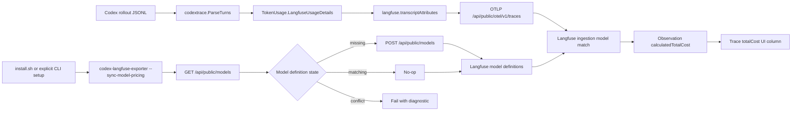

# Langfuse Cost Pricing Plan

## 1. Title and metadata

- Project name: Codex Langfuse Tracer
- Version: 1.0
- Owners: repository maintainers
- Date: 2026-05-02
- Document ID: CLT-LF-COST-SRS-001
- Summary: This plan replaces the one-off live-cost check with a production path for Langfuse `Total Cost` columns. The exporter will keep one tracing path through OTLP generation spans, normalize token usage into Langfuse pricing keys, seed required Langfuse model definitions from one source-dated Go pricing catalog, and prove costs through deterministic Go tests plus one opt-in live Langfuse test for session `019de6d8-fb40-74a0-af20-46b088397c53`.

## 2. Design consensus and trade-offs

| Topic | Verdict | Rationale |
|---|---|---|
| Native Langfuse cost calculation | FOR | `README.md` states that the exporter sends `langfuse.observation.model.name` and `langfuse.observation.usage_details` and does not emit `cost_details`. Local Langfuse code at `/home/kirill/p/langfuse/worker/src/services/IngestionService/index.ts` multiplies matching `usage_details` keys by model pricing keys and stores `calculatedTotalCost`. |
| Exporter-side cost multiplication | AGAINST | The repository has no durable source for pricing policy, model aliases, cached-token rules, or future model price changes. Adding `cost_details` would create a second cost engine beside Langfuse. |
| Direct public ingestion check | AGAINST | The one-off check proved the Langfuse API path, but production traces already use OTLP at `/api/public/otel/v1/traces` through `internal/langfuse/export.go`. Keeping a direct ingestion path would duplicate export behavior. |
| Langfuse model definition sync | DECISION | Add one setup path that creates missing custom model definitions using `GET /api/public/models` and `POST /api/public/models`. The local Langfuse API definition at `/home/kirill/p/langfuse/fern/apis/server/definition/models.yml` supports `modelName`, `matchPattern`, `unit`, and `pricingTiers`. |
| Pricing tiers over flat prices | DECISION | Langfuse marks flat `inputPrice`, `outputPrice`, and `totalPrice` as deprecated in the model API definition and documents `pricingTiers` as the preferred shape. |
| Pricing storage | DECISION | Store pricing in one source-dated Go catalog under `internal/langfuse`; do not add a user pricing config file or a separate pricing data parser. |
| Usage key normalization | DECISION | Current exporter emits `cached_input` and `reasoning_output`; Langfuse default model prices use keys such as `input_cached_tokens` and `output_reasoning_tokens`. A single `TokenUsage.LangfuseUsageDetails()` method will map Codex token counts to pricing keys. |
| Cached and reasoning token accounting | DECISION | Full-rate parent buckets must exclude detailed buckets: `input = InputTokens - CachedInputTokens`, `output = OutputTokens - ReasoningOutputTokens`. This avoids charging cached or reasoning tokens twice when separate pricing keys exist. |
| Conflicting existing custom model definitions | DECISION | If a project already has a custom definition for a managed Codex model name with different match pattern or prices, the sync command fails with a diagnostic. It does not mutate user-owned pricing silently. |
| Model coverage scope | DECISION | Seed only explicit catalog entries: `gpt-5.5`, `gpt-5.4`, `gpt-5.4-mini`, and `gpt-5.3-codex-spark`. `gpt-5.3-codex-spark` uses the official `gpt-5.3-codex` price record by explicit decision, not fallback aliasing. Tests validate repository fixture model coverage, but install/setup does not scan recent rollout history. New model names require an explicit pricing data change and tests. |
| Observability producer boundary | DECISION | The tracer is an observation producer. It emits model and usage facts through OTLP; Langfuse joins those facts to rate cards and materializes costs. This mirrors OpenTelemetry semantic attribution and cloud-billing usage-record/rate-card separation. |
| Direct model setup | DECISION | `--sync-model-pricing` shall use one direct setup function: list existing models, create missing required definitions, accept exact matches, and fail on conflicts. It shall not update or delete existing definitions. |
| Runtime versus setup separation | DECISION | The watcher runtime remains parse-and-export only. Model definition sync runs from explicit CLI setup and `install.sh`, so a normal completed Codex turn does not pay external model-list latency before export. |
| Install failure behavior | DECISION | `install.sh` fails before restarting `codex-langfuse-watch.service` when model pricing setup fails. A warning-only install would make a cost-broken service look healthy. |
| Live validation scope | DECISION | Use one known-session live proof plus deterministic setup/export tests. Do not add a fresh-session generator to the automated plan. |
| Formal plan with small implementation | DECISION | Keep ISO-style traceability in this document, but implement the smallest direct code path: one usage projection, one model setup function, one CLI setup mode, one install invocation, and one live proof. |
| Decision-focused tests | DECISION | Unit tests must cover decision outcomes rather than only line coverage: missing model, matching model, conflicting model, API failure, cached-token subtraction, reasoning-token subtraction, and live post-sync cost readback. |
| Package-private helpers over a new framework | DECISION | Shared HTTP request construction and JSON decoding stay inside `internal/langfuse`; no separate client framework or compatibility code is introduced. |

### Architectural pattern mapping

| Pattern | Applied design choice | Repository anchor |
|---|---|---|
| Usage record plus rate card | Codex token counts are usage records; Langfuse model definitions are rate cards; `calculatedTotalCost` is derived data. | `internal/codextrace/model.go`, `internal/langfuse/export.go`, `/home/kirill/p/langfuse/worker/src/services/IngestionService/index.ts` |
| OpenTelemetry semantic producer | Exporter emits stable semantic attributes and does not compute backend-specific aggregates. | `internal/langfuse/export.go` and README OTLP path `/api/public/otel/v1/traces` |
| Desired-state setup | One setup function creates missing model definitions without overwriting conflicting user-owned state. | planned `internal/langfuse/models.go` and `cmd/codex-langfuse-exporter --sync-model-pricing` |
| FinOps showback | Costs are visible in Langfuse trace/session UI after usage is joined with source-dated prices. | `internal/langfuse/live_cost_test.go` |
| ISO/IEC/IEEE 29148 traceability | Requirements are typed and mapped to exact tests. | Section 4 and Section 10 |
| ISO/IEC/IEEE 29119-3 verification | Each test has command, location, fixtures, deterministic controls, pass criteria, and runtime. | Section 7.3 |
| ISO/IEC/IEEE 12207 implementation process | Phases separate requirements, implementation, integration, qualification, and execution logging. | Section 5 and Section 11 |

## 3. PRD / stakeholder and system needs

- Problem: New Codex sessions show token counts in Langfuse but `Total Cost` remains `0` because `gpt-5.5` has no matching Langfuse model definition in the local project and usage keys do not match Langfuse pricing keys for cached and reasoning tokens.
- Users: Heavy Codex users reviewing Langfuse traces, maintainers of this tracer, and future LLM agents modifying this repository.
- Value: Cost columns become native Langfuse fields, so trace tables, observations, sessions, dashboards, and API reads all use the same cost source.
- Business goals:
  - Make cost visible for current and future Codex sessions.
  - Keep the exporter small and maintainable.
  - Avoid a second pricing engine in this repository.
  - Preserve the always-on watcher model documented in `README.md`.
- Success metrics:
  - `codex.transcript` observations for `gpt-5.5` have non-null `modelId`, positive `inputPrice`, positive `outputPrice`, and `calculatedTotalCost > 0` after re-export.
  - Trace API for session `019de6d8-fb40-74a0-af20-46b088397c53` returns `totalCost > 0`.
  - Default Go suite passes with the live test skipped when `LIVE_LANGFUSE_SESSION_ID` is unset.
  - `install.sh` creates missing model definitions before restarting `codex-langfuse-watch.service`.
  - `install.sh` exits nonzero and does not restart `codex-langfuse-watch.service` when model pricing setup fails.
  - Model sync reports one of three deterministic outcomes for every required model: created, already matching, or conflict.
  - Repository fixture model names are covered by the source-dated Go pricing catalog.
  - Watcher export latency is not coupled to model definition reads during normal `--watch` operation.
- Scope:
  - Token usage normalization in `internal/codextrace`.
  - Langfuse model pricing sync and one Go pricing catalog in `internal/langfuse`.
  - CLI mode `--sync-model-pricing` in `cmd/codex-langfuse-exporter`.
  - Install integration in `install.sh`.
  - Tests and documentation updates.
  - Decision-table tests for model setup outcomes and token bucket projection.
- Non-goals:
  - No local `cost_details` emission on spans.
  - No direct ingestion API export path.
  - No pricing UI automation.
  - No background model setup inside `--watch`.
  - No automatic overwrite of existing custom Langfuse model definitions.
  - No install-time scan of recent rollout history to infer model names.
  - No user-managed pricing config file.
  - No automated fresh-session generator for live validation.
  - No historical trace migration beyond explicit session re-export commands.
  - No support for arbitrary future model names without a pricing record.
- Dependencies:
  - Go `1.26.0` from `go.mod`.
  - Existing Langfuse credentials loaded from `[mcp_servers.langfuse.env]` in `~/.codex/config.toml` by `internal/config/config.go`.
  - Langfuse public model API `/api/public/models`.
  - Langfuse OTLP ingestion `/api/public/otel/v1/traces`.
  - Official OpenAI API pricing page, captured on 2026-05-02: https://openai.com/api/pricing/
- Risks:
  - Langfuse project has an existing custom definition for a Codex model with different prices.
  - OpenAI pricing changes after implementation.
  - Existing traces need re-export because Langfuse calculates costs during ingestion.
  - Cached token semantics differ between Codex rollout counts and OpenAI API billing.
  - A future maintainer could reintroduce local `cost_details` as a fast fix unless static tests reject that path.
- Assumptions:
  - Codex rollout `token_count` payloads provide `input_tokens`, `output_tokens`, `total_tokens`, `cached_input_tokens`, and `reasoning_output_tokens`.
  - `reasoning_output_tokens` are charged at the same output rate as visible output tokens.
  - `gpt-5.5`, `gpt-5.4`, `gpt-5.4-mini`, and `gpt-5.3-codex-spark` are the only Codex model names that need initial pricing records in this repository.
  - Live validation can use local Langfuse host and keys from `~/.codex/config.toml`.

## 4. SRS / canonical requirements

### Functional requirements

- REQ-401 type func: `codextrace.TokenUsage` shall expose one canonical Langfuse usage-detail projection. Acceptance: cached input and reasoning output are represented with Langfuse pricing keys and subtracted from full-rate parent buckets.
- REQ-402 type func: `codex.transcript` shall use the canonical usage-detail projection for `langfuse.observation.usage_details`. Acceptance: exporter tests show `input_cached_tokens` and `output_reasoning_tokens` when fixture token details exist.
- REQ-403 type func: The trace contract shall use the same canonical usage-detail projection as the exporter. Acceptance: fixture golden files and `tracecontract.Trace.TokenUsage` use the same keys as the Langfuse span attributes.
- REQ-404 type func: The Langfuse package shall sync required Codex model definitions through public Langfuse APIs from the explicit source-dated Go pricing catalog. Acceptance: missing required models are posted with one `Standard` pricing tier and repository fixture model names are covered by the catalog.
- REQ-405 type func: Model definition sync shall be idempotent. Acceptance: when existing custom definitions match required definitions, no POST request is sent.
- REQ-406 type func: Conflicting existing custom model definitions shall stop the sync with a diagnostic that names the model and mismatched fields. Acceptance: no conflicting model is overwritten.
- REQ-407 type func: The exporter CLI shall support `--sync-model-pricing` as a source mode. Acceptance: the mode loads config, calls model definition sync, prints a non-secret summary unless `--quiet` is set, and exits without parsing rollout sessions.
- REQ-408 type func: `install.sh` shall execute `~/.codex/bin/codex-langfuse-exporter --sync-model-pricing --quiet` after building the binary and before restarting `codex-langfuse-watch.service`. Acceptance: install integration tests observe the sync invocation and prove setup failure exits nonzero before service restart.
- REQ-409 type func: Live cost validation shall prove that the target session returns `calculatedTotalCost > 0` on `codex.transcript` and `totalCost > 0` on the trace. Acceptance: the existing opt-in live test passes after install and explicit session re-export.

### Non-functional requirements

- REQ-410 type reliability: Default tests shall not require a running Langfuse service. Acceptance: `go test ./... -count=1` passes with `LIVE_LANGFUSE_SESSION_ID` unset.
- REQ-411 type security: Secrets shall not be logged by sync, tests, live failures, or install output. Acceptance: tests use fake keys and failure summaries omit `LANGFUSE_SECRET_KEY`.
- REQ-412 type nfr: The repository shall keep one cost path. Acceptance: no production code emits `cost_details` or calls `/api/public/ingestion` for Codex trace export.
- REQ-413 type perf: Model definition sync shall complete within 5 seconds against `httptest` and within 30 seconds against local Langfuse under normal workstation conditions. Acceptance: test runtime budgets stay below thresholds.
- REQ-414 type reliability: The watcher shall keep its current export behavior after pricing sync is added to install. Acceptance: systemd service file still runs `codex-langfuse-exporter --watch`.

### Interface/API requirements

- REQ-415 type int: Langfuse model listing shall use `GET /api/public/models?page=1&limit=100` with Basic auth from `langfuse.AuthHeader`.
- REQ-416 type int: Langfuse model creation shall use `POST /api/public/models` with JSON containing `modelName`, `matchPattern`, `unit: "TOKENS"`, and `pricingTiers`.
- REQ-417 type int: OTLP trace export shall remain `/api/public/otel/v1/traces` through `ExportTurn`; model sync shall not replace OTLP export.

### Data requirements

- REQ-418 type data: Pricing records shall store USD per token values, not USD per million tokens, in one Go catalog under `internal/langfuse`. Acceptance: `gpt-5.5` input is `0.000005`, cached input is `0.0000005`, output is `0.00003`, and reasoning output is `0.00003` from the 2026-05-02 official OpenAI pricing page; `gpt-5.3-codex-spark` input is `0.00000175`, cached input is `0.000000175`, output is `0.000014`, and reasoning output is `0.000014` from the 2026-05-02 official GPT-5.3-Codex model page.
- REQ-419 type data: Required pricing keys shall be exactly `input`, `input_cached_tokens`, `output`, and `output_reasoning_tokens`. Acceptance: static tests reject obsolete `cached_input` and `reasoning_output` in exported/golden cost usage.
- REQ-420 type data: Pricing records shall include `sourceURL` and `sourceDate` metadata in code or documentation. Acceptance: static docs tests find the OpenAI pricing URL and `2026-05-02`.
- REQ-421 type reliability: Model definition sync shall use one deterministic setup function with only three per-model outcomes: created, already matching, or conflict. Acceptance: decision-table tests cover all outcomes and no PATCH, PUT, or DELETE path exists.
- REQ-422 type nfr: Normal `--watch`, `--latest`, `--path`, and `--session-id` exports shall not call `/api/public/models`. Acceptance: CLI and HTTP tests show model sync is only invoked by `--sync-model-pricing` and `install.sh`.

### Error handling and telemetry expectations

- API read or create failure returns an error with endpoint path, HTTP status, and response message when available.
- Invalid or conflicting model definitions return a non-secret error that includes model name and mismatched fields.
- Sync summary reports counts for existing, created, and conflicting definitions.
- Install exits nonzero if pricing sync fails, so the service is not restarted with missing cost prerequisites.
- Live cost failures include cost-relevant public fields only: `model`, `modelId`, `usageDetails`, `calculatedTotalCost`, `inputPrice`, `outputPrice`, `usagePricingTierName`, and trace ID.

### Acceptance criteria at requirement level

- All default tests pass.
- Live session cost test passes after `./install.sh` and session re-export.
- `README.md` documents cost setup and re-export.
- No production code contains a second cost calculation path.
- No trace export code uses the direct public ingestion endpoint.
- Normal watcher export performs no model-definition setup.

### Architecture diagram



```text
System: Codex Langfuse Tracer cost attribution

Person: Codex user
  Uses Codex normally and opens Langfuse UI to inspect trace Total Cost.

Container: codex-langfuse-exporter
  Parses rollout JSONL, emits OTLP spans, and provides --sync-model-pricing.

Container: systemd user service
  Runs codex-langfuse-exporter --watch.

Container: Langfuse API
  Accepts model definitions, OTLP traces, and trace/observation reads.

Component: internal/codextrace.TokenUsage
  Converts Codex token counts into Langfuse usage_details keys.

Component: internal/langfuse model sync
  Creates missing model definitions with pricing tiers.

Data store: Langfuse project
  Stores model definitions, observations, calculated costs, and traces.
```

## 5. Iterative implementation and test plan

### Phase strategy

- P00: Normalize token usage once and remove duplicated usage map construction.
- P01: Add the model pricing catalog and Langfuse model sync package behind httptest.
- P02: Add CLI and install integration.
- P03: Document and statically guard the one-path cost contract.
- P04: Reinstall, re-export the target session, and pass live cost validation.

### Compute controls

- branch_limits: maximum 3 active implementation branches per phase; branch paths are usage normalization, model sync, and install/docs.
- reflection_passes: 2 per phase; one after RED failure and one after GREEN pass.
- early_stop%: 92; stop a phase when the phase command, suite command, and metric command meet exit gates with no uncovered REQ in the phase.

### Risk register

| Risk | Trigger | Mitigation |
|---|---|---|
| Pricing drift | Official OpenAI API pricing changes | Store `sourceURL` and `sourceDate`; any price-value change requires ADR-004 update. |
| Existing custom model conflict | `/api/public/models` returns a custom `gpt-5.5` with different prices | Fail sync with model name and mismatched keys; user can edit Langfuse model definition or accept a follow-up ADR. |
| Cost still zero after sync | Trace was ingested before model definition existed | Re-export target session after sync; live test reads new observation and trace cost. |
| Double-charged cached tokens | Parent input still includes cached input | `TokenUsage.LangfuseUsageDetails()` subtracts detailed buckets from parent buckets. |
| Live test instability | Langfuse ingestion delay exceeds polling window | Live test remains opt-in; runtime budget is 60 seconds with deterministic session ID. |
| Secret exposure | HTTP errors include full Authorization header | Tests inspect output and failure summaries for fake secret leakage. |

### Suspension/resumption criteria

- Suspend if Langfuse `/api/public/models` rejects pricing tiers on the local version.
- Suspend if official pricing no longer publishes the required model names.
- Suspend if Codex rollout token payload no longer includes cached or reasoning token counts.
- Resume after adding a documented ADR that changes pricing source, required model scope, or token accounting policy.

### Phase P00: Canonical Usage Projection

- Scope and objectives: Implement one usage projection for `REQ-401`, `REQ-402`, `REQ-403`, `REQ-411`, `REQ-419`.
- Restore point: run `git tag -f langfuse-cost-pricing-P00-start`; expected PASS because Git records the pre-phase commit.
- Step 1 RED: create/update `TEST-401` in `internal/codextrace/model_test.go` for `REQ-401` and `REQ-419`; run `go test ./internal/codextrace -run TestTokenUsageLangfuseUsageDetails -count=1`; expected FAIL because `TokenUsage.LangfuseUsageDetails` does not exist.
- Step 2 GREEN: implement minimal code change; run `go test ./internal/codextrace -run TestTokenUsageLangfuseUsageDetails -count=1`; expected PASS.
- Step 3 RED: create/update `TEST-402` in `internal/langfuse/spans_test.go` for `REQ-402` and `REQ-412`; run `go test ./internal/langfuse -run TestLangfuseGenerationModelUsageAndNoCostDetails -count=1`; expected FAIL because the exporter still emits obsolete usage keys.
- Step 4 GREEN: implement minimal code change; run `go test ./internal/langfuse -run TestLangfuseGenerationModelUsageAndNoCostDetails -count=1`; expected PASS.
- Step 5 RED: create/update `TEST-403` in `internal/tracecontract/contract_test.go` and `test/contract_test.go` for `REQ-403`; run `go test ./internal/tracecontract ./test -run 'TestFromTurnNormalizesTrace|TestGoldenTraceContract|TestFullAcceptanceLangfuseFilterCostContract' -count=1`; expected FAIL because golden contracts still contain obsolete keys.
- Step 6 GREEN: implement minimal code change; run `go test ./internal/tracecontract ./test -run 'TestFromTurnNormalizesTrace|TestGoldenTraceContract|TestFullAcceptanceLangfuseFilterCostContract' -count=1`; expected PASS.
- Step 7 REFACTOR: remove duplicate usage map builders from `internal/langfuse/export.go` and `internal/tracecontract/contract.go`; run `go test ./internal/codextrace ./internal/langfuse ./internal/tracecontract ./test -run 'TestTokenUsageLangfuseUsageDetails|TestLangfuseGenerationModelUsageAndNoCostDetails|TestFromTurnNormalizesTrace|TestGoldenTraceContract|TestFullAcceptanceLangfuseFilterCostContract' -count=1`; expected PASS.
- Step 8 MEASURE: run `go test ./internal/codextrace ./internal/langfuse ./internal/tracecontract -count=1`; expected thresholds met for `EVAL-401`.
- Exit gates:
  - Green criteria: canonical usage keys appear in exporter attributes and golden contract output.
  - Yellow criteria: fixtures without cached or reasoning tokens omit those keys.
  - Red criteria: any `cached_input` or `reasoning_output` usage key remains in exported or golden cost usage.
- Phase metrics:
  - Confidence %: 88; direct unit and contract tests cover the high-risk token accounting branch.
  - Long-term robustness %: 92; one helper removes drift between exporter and contract.
  - Internal interactions: 3; `codextrace`, `langfuse`, and `tracecontract`.
  - External interactions: 0; all tests use local fixtures.
  - Complexity %: 20; small pure function plus call-site replacement.
  - Feature creep %: 5; no new CLI or API behavior in this phase.
  - Technical debt %: 8; duplicate usage builders are removed.
  - YAGNI score: 94; implementation maps only token fields that Codex records.
  - MoSCoW: Must.
  - Local/non-local scope: Local.
  - Architectural changes count: 1.

### Phase P01: Langfuse Model Pricing Sync

- Scope and objectives: Add model pricing catalog and HTTP sync for `REQ-404`, `REQ-405`, `REQ-406`, `REQ-411`, `REQ-413`, `REQ-415`, `REQ-416`, `REQ-418`, `REQ-420`, `REQ-421`.
- Restore point: run `git tag -f langfuse-cost-pricing-P01-start`; expected PASS because Git records the pre-phase commit.
- Step 1 RED: create/update `TEST-404` in `internal/langfuse/models_test.go` for `REQ-404`, `REQ-415`, `REQ-416`, `REQ-418`, and `REQ-421`; run `go test ./internal/langfuse -run 'TestModelDefinitionSyncCreatesMissingModels|TestModelPricingCatalogUsesOpenAIKeys|TestModelPricingCatalogCoversRepositoryFixtures' -count=1`; expected FAIL because no model sync package, pricing catalog, created outcome, or fixture coverage guard exists.
- Step 2 GREEN: implement minimal code change; run `go test ./internal/langfuse -run 'TestModelDefinitionSyncCreatesMissingModels|TestModelPricingCatalogUsesOpenAIKeys|TestModelPricingCatalogCoversRepositoryFixtures' -count=1`; expected PASS.
- Step 3 RED: create/update `TEST-405` in `internal/langfuse/models_test.go` for `REQ-405`, `REQ-406`, and `REQ-421`; run `go test ./internal/langfuse -run 'TestModelDefinitionSyncIsIdempotent|TestModelDefinitionSyncRejectsConflictingModel' -count=1`; expected FAIL because idempotency, conflict detection, and the setup decision table are not implemented.
- Step 4 GREEN: implement minimal code change; run `go test ./internal/langfuse -run 'TestModelDefinitionSyncIsIdempotent|TestModelDefinitionSyncRejectsConflictingModel' -count=1`; expected PASS.
- Step 5 RED: create/update `TEST-411` in `internal/langfuse/models_test.go` for `REQ-411`; run `go test ./internal/langfuse -run TestModelDefinitionSyncDoesNotLeakSecrets -count=1`; expected FAIL because sync error handling does not yet sanitize fake secret values.
- Step 6 GREEN: implement minimal code change; run `go test ./internal/langfuse -run TestModelDefinitionSyncDoesNotLeakSecrets -count=1`; expected PASS.
- Step 7 REFACTOR: keep one package-private helper for Langfuse HTTP request construction and JSON decoding without changing `ExportTurn`; run `go test ./internal/langfuse -count=1`; expected PASS.
- Step 8 MEASURE: run `go test ./internal/langfuse -count=1`; expected thresholds met for `EVAL-401`.
- Exit gates:
  - Green criteria: missing models create exactly one POST per model and matching models create zero POSTs.
  - Yellow criteria: HTTP 409 or 400 returns a user-readable error without secrets.
  - Red criteria: sync mutates or deletes an existing model definition.
- Phase metrics:
  - Confidence %: 86; httptest covers create, no-op, conflict, and secret-handling branches.
  - Long-term robustness %: 88; pricing data is centralized and source-dated.
  - Internal interactions: 2; `langfuse` and `config`.
  - External interactions: 1; Langfuse model API.
  - Complexity %: 34; HTTP sync adds stateful API behavior but no watcher coupling.
  - Feature creep %: 12; scope is limited to required Codex models.
  - Technical debt %: 10; no direct ingestion or local cost calculation.
  - YAGNI score: 86; sync handles only missing, matching, and conflicting definitions.
  - MoSCoW: Must.
  - Local/non-local scope: Non-local.
  - Architectural changes count: 1.

### Phase P02: CLI and Install Integration

- Scope and objectives: Add a single setup mode and wire install for `REQ-407`, `REQ-408`, `REQ-410`, `REQ-414`, `REQ-417`, `REQ-422`.
- Restore point: run `git tag -f langfuse-cost-pricing-P02-start`; expected PASS because Git records the pre-phase commit.
- Step 1 RED: create/update `TEST-406` in `cmd/codex-langfuse-exporter/cli_test.go` for `REQ-407`, `REQ-417`, and `REQ-422`; run `go test ./cmd/codex-langfuse-exporter -run TestSyncModelPricingMode -count=1`; expected FAIL because `--sync-model-pricing` is not parsed and export modes are not proven isolated from model sync.
- Step 2 GREEN: implement minimal code change; run `go test ./cmd/codex-langfuse-exporter -run TestSyncModelPricingMode -count=1`; expected PASS.
- Step 3 RED: create/update `TEST-407` in `test/install_test.go` for `REQ-408` and `REQ-414`; run `go test ./test -run TestInstallUninstallScripts -count=1`; expected FAIL because `install.sh` does not invoke pricing sync before service restart and does not prove setup failure blocks restart.
- Step 4 GREEN: implement minimal code change; run `go test ./test -run TestInstallUninstallScripts -count=1`; expected PASS.
- Step 5 REFACTOR: keep `options.Mode()` as the single source-mode selector and avoid a second setup binary; run `go test ./cmd/codex-langfuse-exporter ./test -run 'TestCLIFlags|TestSyncModelPricingMode|TestInstallUninstallScripts|TestEvalInstallRuntimeSurface' -count=1`; expected PASS.
- Step 6 MEASURE: run `bash -n install.sh uninstall.sh && systemd-analyze --user verify systemd/codex-langfuse-watch.service && git diff --check`; expected thresholds met for `EVAL-403`.
- Exit gates:
  - Green criteria: CLI mode and install script both call the same sync function.
  - Yellow criteria: sync failure exits nonzero before service restart.
  - Red criteria: watcher export path changes from `--watch`, export modes call `/api/public/models`, or install restarts the service after pricing setup failure.
- Phase metrics:
  - Confidence %: 84; CLI and install tests cover the new user-facing surfaces.
  - Long-term robustness %: 87; setup is centralized in the installed binary.
  - Internal interactions: 3; CLI, installer, langfuse sync package.
  - External interactions: 2; Langfuse API and systemd user service.
  - Complexity %: 28; one flag and one install invocation.
  - Feature creep %: 10; no extra setup commands or wrappers.
  - Technical debt %: 9; no duplicate script-level HTTP implementation.
  - YAGNI score: 88; no background periodic pricing sync.
  - MoSCoW: Must.
  - Local/non-local scope: Non-local.
  - Architectural changes count: 1.

### Phase P03: Documentation and Static Contract Guards

- Scope and objectives: Document the robust cost path and reject regression to local costs for `REQ-410`, `REQ-411`, `REQ-412`, `REQ-420`.
- Restore point: run `git tag -f langfuse-cost-pricing-P03-start`; expected PASS because Git records the pre-phase commit.
- Step 1 RED: create/update `TEST-408` in `test/docs_static_test.go` for `REQ-420`; run `go test ./test -run TestDocsLangfuseCostPricing -count=1`; expected FAIL because README lacks source-dated model pricing sync documentation.
- Step 2 GREEN: implement minimal documentation change; run `go test ./test -run TestDocsLangfuseCostPricing -count=1`; expected PASS.
- Step 3 RED: create/update `TEST-409` in `test/docs_static_test.go` for `REQ-411` and `REQ-412`; run `go test ./test -run TestNoLocalCostDetailsOrDirectIngestionShortcut -count=1`; expected FAIL because no static guard rejects production `cost_details` emission and `/api/public/ingestion` trace export shortcuts.
- Step 4 GREEN: implement minimal static-test or production-code change; run `go test ./test -run TestNoLocalCostDetailsOrDirectIngestionShortcut -count=1`; expected PASS.
- Step 5 REFACTOR: keep README cost setup concise and move implementation details into tests and code names; run `go test ./test -run 'TestDocsLangfuseCostPricing|TestNoLocalCostDetailsOrDirectIngestionShortcut|TestFullAcceptanceLangfuseFilterCostContract' -count=1`; expected PASS.
- Step 6 MEASURE: run `go test ./... -count=1`; expected thresholds met for `EVAL-402`.
- Exit gates:
  - Green criteria: documentation states install-time model sync, source-dated pricing, and explicit re-export for old traces.
  - Yellow criteria: live test remains opt-in and documented with exact environment variable.
  - Red criteria: docs describe local cost multiplication as normal behavior.
- Phase metrics:
  - Confidence %: 82; static tests prevent future drift in a repo maintained by LLM agents.
  - Long-term robustness %: 90; documentation and tests describe one cost path.
  - Internal interactions: 2; docs and static tests.
  - External interactions: 0; no network dependency.
  - Complexity %: 16; static text and contract guards only.
  - Feature creep %: 4; no new runtime behavior.
  - Technical debt %: 6; static guards reduce drift.
  - YAGNI score: 92; docs cover only user-visible setup and validation.
  - MoSCoW: Should.
  - Local/non-local scope: Local.
  - Architectural changes count: 0.

### Phase P04: Live Cost Validation and Target Session Re-export

- Scope and objectives: Prove the implemented path against local Langfuse for `REQ-409`, `REQ-410`, `REQ-411`, `REQ-413`, `REQ-417`, `REQ-418`.
- Restore point: run `git tag -f langfuse-cost-pricing-P04-start`; expected PASS because Git records the pre-phase commit.
- Step 1 RED: create/update `TEST-306` in `internal/langfuse/live_cost_test.go` for `REQ-409`, `REQ-411`, and `REQ-413`; run `LIVE_LANGFUSE_SESSION_ID=019de6d8-fb40-74a0-af20-46b088397c53 go test ./internal/langfuse -run TestLiveLangfuseTranscriptModelUsageAndCost -count=1`; expected FAIL because the current local Langfuse project has no matching `gpt-5.5` model definition or the target trace was ingested before sync.
- Step 2 GREEN: implement minimal operational change by running `./install.sh` and `~/.codex/bin/codex-langfuse-exporter --session-id 019de6d8-fb40-74a0-af20-46b088397c53 --no-verify`; run `LIVE_LANGFUSE_SESSION_ID=019de6d8-fb40-74a0-af20-46b088397c53 go test ./internal/langfuse -run TestLiveLangfuseTranscriptModelUsageAndCost -count=1`; expected PASS.
- Step 3 REFACTOR: remove one-off validation shell fragments from notes and keep `internal/langfuse/live_cost_test.go` as the only live cost validation; run `go test ./... -count=1`; expected PASS.
- Step 4 MEASURE: run `LIVE_LANGFUSE_SESSION_ID=019de6d8-fb40-74a0-af20-46b088397c53 go test ./internal/langfuse -run TestLiveLangfuseTranscriptModelUsageAndCost -count=1`; expected thresholds met for `EVAL-404`.
- Exit gates:
  - Green criteria: trace total cost and transcript calculated total cost are both positive.
  - Yellow criteria: local Langfuse returns HTTP 404 during ingestion delay but passes before runtime budget expires.
  - Red criteria: `modelId` remains null, `inputPrice <= 0`, or `outputPrice <= 0` after reinstall and re-export.
- Phase metrics:
  - Confidence %: 90; live validation exercises the same API fields that back the Langfuse UI cost column.
  - Long-term robustness %: 86; old traces need explicit re-export but new traces use install-time pricing sync.
  - Internal interactions: 2; live test and installed exporter.
  - External interactions: 2; Langfuse API and systemd user service.
  - Complexity %: 24; operational validation only after code path exists.
  - Feature creep %: 3; no extra live tooling.
  - Technical debt %: 7; one-off validation script is not retained.
  - YAGNI score: 90; validates one real session and no broad historical migration.
  - MoSCoW: Must.
  - Local/non-local scope: Non-local.
  - Architectural changes count: 0.

## 6. Evaluations

```yaml
evals:
  - id: EVAL-401
    purpose: dev
    metrics:
      - package_exit_code
      - model_sync_branch_coverage
      - usage_key_contract
      - model_setup_outcomes
    thresholds:
      package_exit_code: 0
      usage_key_contract: "no obsolete cached_input or reasoning_output keys"
      model_setup_outcomes: "created, matching, conflict, api_error"
      runtime_seconds_max: 5
    seeds:
      - complete-tools fixture
      - httptest fixed responses
    runtime_budget: "5s"
  - id: EVAL-402
    purpose: dev
    metrics:
      - repo_exit_code
      - live_test_skip_without_env
      - static_contract_pass
      - no_runtime_model_api_calls
    thresholds:
      repo_exit_code: 0
      no_runtime_model_api_calls: true
      runtime_seconds_max: 45
    seeds:
      - testdata/manifest.json
      - testdata/rollouts/complete-tools.jsonl
      - testdata/rollouts/failed-command.jsonl
    runtime_budget: "45s"
  - id: EVAL-403
    purpose: dev
    metrics:
      - shell_syntax_exit_code
      - systemd_verify_exit_code
      - diff_check_exit_code
    thresholds:
      shell_syntax_exit_code: 0
      systemd_verify_exit_code: 0
      diff_check_exit_code: 0
      runtime_seconds_max: 10
    seeds:
      - systemd/codex-langfuse-watch.service
      - install.sh
      - uninstall.sh
    runtime_budget: "10s"
  - id: EVAL-404
    purpose: holdout
    metrics:
      - transcript_calculated_total_cost
      - trace_total_cost
      - transcript_model_id_present
      - transcript_pricing_tier_present
    thresholds:
      transcript_calculated_total_cost: "> 0"
      trace_total_cost: "> 0"
      transcript_model_id_present: true
      transcript_pricing_tier_present: true
      runtime_seconds_max: 60
    seeds:
      - LIVE_LANGFUSE_SESSION_ID=019de6d8-fb40-74a0-af20-46b088397c53
    runtime_budget: "60s"
```

## 7. Tests

### 7.1 Test inventory

- Test frameworks/runners:
  - Go `testing` across `cmd/`, `internal/`, and `test/`.
  - Shell syntax validation with `bash -n`.
  - systemd user service validation with `systemd-analyze --user verify`.
  - Git whitespace validation with `git diff --check`.
- Existing commands:
  - `go test ./... -count=1`
  - `go test ./... -parallel 8`
  - `go test ./... -run 'TestEval' -count=3 -parallel 8`
  - `bash -n install.sh uninstall.sh`
  - `systemd-analyze --user verify systemd/codex-langfuse-watch.service`
  - `git diff --check`
  - `LIVE_LANGFUSE_SESSION_ID=019de6d8-fb40-74a0-af20-46b088397c53 go test ./internal/langfuse -run TestLiveLangfuseTranscriptModelUsageAndCost -count=1`
- File globs/locations:
  - `cmd/**/*.go`
  - `internal/**/*.go`
  - `test/**/*.go`
  - `testdata/rollouts/*.jsonl`
  - `testdata/golden/*.normalized.json`
  - `install.sh`
  - `uninstall.sh`
  - `systemd/codex-langfuse-watch.service`
- Traceability tag rule: every created or modified test file in this plan must place a grep-able `// TEST-###` comment immediately above each new or materially changed test.
- Missing commands:
  - No package.json, Makefile, or CI workflow commands are present in the current repository. P02 creates the CLI mode before any install path relies on it.

### 7.2 Test suites overview

| name | purpose | runner | command | runtime budget | when it runs |
|---|---|---|---|---|---|
| Unit | Pure parser, usage, exporter attribute, sync, and CLI behavior | Go testing | `go test ./internal/codextrace ./internal/langfuse ./internal/tracecontract ./cmd/codex-langfuse-exporter -count=1` | 15s | local pre-commit |
| Integration | Install script, fixture contracts, and full repo behavior | Go testing | `go test ./test -count=1` | 30s | local pre-commit |
| E2E | Live Langfuse cost readback for one known session | Go testing with env-gated live API | `LIVE_LANGFUSE_SESSION_ID=019de6d8-fb40-74a0-af20-46b088397c53 go test ./internal/langfuse -run TestLiveLangfuseTranscriptModelUsageAndCost -count=1` | 60s | local release gate |
| Perf | Watcher package performance guard | Go testing | `go test ./internal/watch -run TestEvalWatchExportLatency -count=1` | 10s | local pre-commit |
| Data Drift | Golden fixture and docs/static contract drift | Go testing | `go test ./test -run 'TestGoldenTraceContract|TestDocs' -count=1` | 20s | local pre-commit |
| Static | Shell, systemd, and whitespace validation | bash/systemd/git | `bash -n install.sh uninstall.sh && systemd-analyze --user verify systemd/codex-langfuse-watch.service && git diff --check` | 10s | local pre-commit |

### 7.3 Test definitions

- id: TEST-401
  - name: Token usage Langfuse usage details
  - type: unit
  - verifies: REQ-401, REQ-419
  - location: `internal/codextrace/model_test.go`
  - command: `go test ./internal/codextrace -run TestTokenUsageLangfuseUsageDetails -count=1`
  - fixtures/mocks/data: table cases for empty usage, normal usage, cached input, reasoning output, and overlarge detail bucket clamping.
  - deterministic controls: no wall clock, no network, no filesystem.
  - pass_criteria: output maps contain `input_cached_tokens` and `output_reasoning_tokens`, parent buckets subtract detail buckets, zero values are omitted.
  - expected_runtime: 1s
- id: TEST-402
  - name: Langfuse generation model usage and no cost details
  - type: unit
  - verifies: REQ-402, REQ-411, REQ-412
  - location: `internal/langfuse/spans_test.go`
  - command: `go test ./internal/langfuse -run TestLangfuseGenerationModelUsageAndNoCostDetails -count=1`
  - fixtures/mocks/data: existing `completeTurn(t)` fixture.
  - deterministic controls: in-memory exporter, no network, fixed fixture token counts.
  - pass_criteria: transcript has model `gpt-5.5`, canonical usage keys, and no `cost_details` attribute.
  - expected_runtime: 1s
- id: TEST-403
  - name: Trace contract canonical token usage
  - type: integration
  - verifies: REQ-403, REQ-419
  - location: `internal/tracecontract/contract_test.go`, `test/contract_test.go`
  - command: `go test ./internal/tracecontract ./test -run 'TestFromTurnNormalizesTrace|TestGoldenTraceContract|TestFullAcceptanceLangfuseFilterCostContract' -count=1`
  - fixtures/mocks/data: `testdata/rollouts/complete-tools.jsonl`, `testdata/golden/complete-tools.normalized.json`, `testdata/manifest.json`.
  - deterministic controls: fixture files only, no network.
  - pass_criteria: trace contract token usage equals canonical usage keys and golden fixtures match parser output.
  - expected_runtime: 5s
- id: TEST-404
  - name: Model definition sync creates missing models and validates pricing catalog
  - type: unit
  - verifies: REQ-404, REQ-415, REQ-416, REQ-418, REQ-420, REQ-421
  - location: `internal/langfuse/models_test.go`
  - command: `go test ./internal/langfuse -run 'TestModelDefinitionSyncCreatesMissingModels|TestModelPricingCatalogUsesOpenAIKeys|TestModelPricingCatalogCoversRepositoryFixtures' -count=1`
  - fixtures/mocks/data: `httptest.Server` returning empty model list and capturing POST bodies; repository rollout fixtures named in `testdata/manifest.json`.
  - deterministic controls: fixed model catalog, fake Basic auth keys, fixture files only, no external network.
  - pass_criteria: POST bodies include `gpt-5.5`, `gpt-5.4`, `gpt-5.4-mini`, `gpt-5.3-codex-spark`, `unit:"TOKENS"`, one default tier, expected price keys, official source URL, and source date; every non-empty fixture model is present in the Go pricing catalog.
  - expected_runtime: 2s
- id: TEST-405
  - name: Model definition sync idempotency and conflict handling
  - type: unit
  - verifies: REQ-405, REQ-406, REQ-411, REQ-421
  - location: `internal/langfuse/models_test.go`
  - command: `go test ./internal/langfuse -run 'TestModelDefinitionSyncIsIdempotent|TestModelDefinitionSyncRejectsConflictingModel' -count=1`
  - fixtures/mocks/data: `httptest.Server` returning matching and conflicting model definitions plus an API-error response.
  - deterministic controls: fixed response payloads, fake keys, no external network.
  - pass_criteria: matching definitions produce zero POSTs; conflicting definitions return an error that names the model and mismatched fields; API errors return a non-secret endpoint/status diagnostic; no PATCH, PUT, or DELETE request is sent.
  - expected_runtime: 2s
- id: TEST-406
  - name: CLI sync model pricing mode
  - type: unit
  - verifies: REQ-407, REQ-417, REQ-422
  - location: `cmd/codex-langfuse-exporter/cli_test.go`
  - command: `go test ./cmd/codex-langfuse-exporter -run TestSyncModelPricingMode -count=1`
  - fixtures/mocks/data: argument slices for `--sync-model-pricing`, invalid mixed source modes, and `--quiet`.
  - deterministic controls: no network if sync function is injected or stubbed in test.
  - pass_criteria: mode is mutually exclusive with rollout source modes; `--watch`, `--latest`, `--path`, and `--session-id` do not call the model-sync function; `--sync-model-pricing` does not parse rollout sessions.
  - expected_runtime: 1s
- id: TEST-407
  - name: Install invokes model pricing sync
  - type: integration
  - verifies: REQ-408, REQ-414
  - location: `test/install_test.go`
  - command: `go test ./test -run TestInstallUninstallScripts -count=1`
  - fixtures/mocks/data: temporary `HOME`, fake `systemctl`, isolated `CODEX_HOME`, existing Go module cache.
  - deterministic controls: fake systemctl log, temp filesystem, no real service restart.
  - pass_criteria: install builds binary, invokes `--sync-model-pricing --quiet` before `restart codex-langfuse-watch.service`, exits nonzero without restart when the setup command fails, and service still runs `.codex/bin/codex-langfuse-exporter --watch`.
  - expected_runtime: 20s
- id: TEST-408
  - name: Documentation for Langfuse cost pricing
  - type: static
  - verifies: REQ-410, REQ-420
  - location: `test/docs_static_test.go`
  - command: `go test ./test -run TestDocsLangfuseCostPricing -count=1`
  - fixtures/mocks/data: `README.md`.
  - deterministic controls: filesystem read only.
  - pass_criteria: README documents model pricing sync, source URL `https://openai.com/api/pricing/`, source date `2026-05-02`, and re-export for old traces.
  - expected_runtime: 1s
- id: TEST-409
  - name: No local cost details or direct ingestion shortcut
  - type: static
  - verifies: REQ-411, REQ-412, REQ-417
  - location: `test/docs_static_test.go`
  - command: `go test ./test -run TestNoLocalCostDetailsOrDirectIngestionShortcut -count=1`
  - fixtures/mocks/data: `internal/langfuse/*.go`, `cmd/codex-langfuse-exporter/*.go`, `README.md`.
  - deterministic controls: filesystem read only.
  - pass_criteria: production trace export code does not emit `cost_details` and does not call `/api/public/ingestion`; README keeps OTLP as the trace export path.
  - expected_runtime: 1s
- id: TEST-306
  - name: Live Langfuse transcript model usage and cost
  - type: e2e
  - verifies: REQ-409, REQ-410, REQ-411, REQ-413, REQ-418
  - location: `internal/langfuse/live_cost_test.go`
  - command: `LIVE_LANGFUSE_SESSION_ID=019de6d8-fb40-74a0-af20-46b088397c53 go test ./internal/langfuse -run TestLiveLangfuseTranscriptModelUsageAndCost -count=1`
  - fixtures/mocks/data: local Langfuse project from `~/.codex/config.toml`, session `019de6d8-fb40-74a0-af20-46b088397c53`.
  - deterministic controls: fixed session ID, test skipped when env var is unset, cost threshold positive only.
  - pass_criteria: transcript model and modelId are non-empty, inputPrice and outputPrice are positive, usageDetails include nonzero input/output/total, `calculatedTotalCost > 0`, and trace `totalCost > 0`.
  - expected_runtime: 60s
- id: TEST-305
  - name: Full acceptance Langfuse filter and cost contract
  - type: integration
  - verifies: REQ-403, REQ-410, REQ-412, REQ-419
  - location: `test/full_acceptance_test.go`
  - command: `go test ./test -run TestFullAcceptanceLangfuseFilterCostContract -count=1`
  - fixtures/mocks/data: complete-tools and failed-command fixture contracts.
  - deterministic controls: fixture files only.
  - pass_criteria: contract has expected model, canonical token usage, and no forbidden duplicate cost/navigation keys.
  - expected_runtime: 5s
- id: TEST-411
  - name: Model definition sync secret redaction
  - type: unit
  - verifies: REQ-411
  - location: `internal/langfuse/models_test.go`
  - command: `go test ./internal/langfuse -run TestModelDefinitionSyncDoesNotLeakSecrets -count=1`
  - fixtures/mocks/data: `httptest.Server` returning an error while config contains fake secret `sk-lf-test-secret`.
  - deterministic controls: fake key values, local server.
  - pass_criteria: returned error and sync summary do not contain fake secret or Basic auth header.
  - expected_runtime: 2s

### 7.4 Manual checks, optional

- No CHECK entries are required. Live API behavior is covered by TEST-306 and the public Langfuse trace/observation fields used by the UI.

## 8. Data contract

### Schema snapshot

```go
type TokenUsage struct {
    InputTokens           int
    OutputTokens          int
    TotalTokens           int
    CachedInputTokens     int
    ReasoningOutputTokens int
}

type LangfuseUsageDetails map[string]int
// Allowed keys: input, input_cached_tokens, output, output_reasoning_tokens, total.

type CodexModelPricing struct {
    ModelName    string
    MatchPattern string
    Unit         string // TOKENS
    SourceURL    string
    SourceDate   string // YYYY-MM-DD
    Prices       map[string]float64
}
```

### Pricing snapshot

| Model | Match pattern | input | input_cached_tokens | output | output_reasoning_tokens | Source |
|---|---|---:|---:|---:|---:|---|
| gpt-5.5 | `(?i)^(openai/)?gpt-5[.]5$` | 0.000005 | 0.0000005 | 0.00003 | 0.00003 | https://openai.com/api/pricing/ on 2026-05-02 |
| gpt-5.4 | `(?i)^(openai/)?gpt-5[.]4$` | 0.0000025 | 0.00000025 | 0.000015 | 0.000015 | https://openai.com/api/pricing/ on 2026-05-02 |
| gpt-5.4-mini | `(?i)^(openai/)?gpt-5[.]4-mini$` | 0.00000075 | 0.000000075 | 0.0000045 | 0.0000045 | https://openai.com/api/pricing/ on 2026-05-02 |
| gpt-5.3-codex-spark | `(?i)^(openai/)?gpt-5[.]3-codex-spark$` | 0.00000175 | 0.000000175 | 0.000014 | 0.000014 | https://developers.openai.com/api/docs/models/gpt-5.3-codex on 2026-05-02 |

### Invariants

- `total` remains the Codex-provided total token count.
- `input` is never negative after subtracting cached input.
- `output` is never negative after subtracting reasoning output.
- The Go pricing catalog under `internal/langfuse` is the only pricing policy source.
- Runtime config remains credential/configuration only and does not carry price values.
- Every non-empty model name in repository rollout fixtures appears in the pricing catalog or causes a deterministic test failure.
- A model definition contains exactly one default pricing tier named `Standard`.
- A model definition price map contains no `total` price when input/output prices exist.
- Sync never deletes model definitions.
- Sync never mutates conflicting model definitions.

### Privacy/data quality constraints

- No API secret appears in logs, errors, docs, or test output.
- Live failure summaries omit prompt and output text.
- Pricing data has a source URL and source date.
- Token usage maps omit zero-value keys except `total` when Codex reports a nonzero total.

## 9. Reproducibility

- Seeds:
  - `testdata/rollouts/complete-tools.jsonl`
  - `testdata/rollouts/failed-command.jsonl`
  - `testdata/manifest.json`
  - `LIVE_LANGFUSE_SESSION_ID=019de6d8-fb40-74a0-af20-46b088397c53`
- Hardware assumptions:
  - Linux workstation capable of building Go `1.26.0` module.
  - Local or network Langfuse instance reachable from the workstation for TEST-306.
- OS/driver/container tag:
  - Linux with `systemd --user`.
  - No container runtime required by this repository.
- Relevant environment variables:
  - `CODEX_HOME`
  - `XDG_CONFIG_HOME`
  - `LIVE_LANGFUSE_SESSION_ID`
  - `LANGFUSE_HOST`
  - `LANGFUSE_PUBLIC_KEY`
  - `LANGFUSE_SECRET_KEY`
- Fresh Codex session generation is not part of reproducibility; live validation uses the fixed `LIVE_LANGFUSE_SESSION_ID` plus deterministic local tests.

## 10. Requirements Traceability Matrix

| Phase | REQ-### | TEST-### | Test Path | Command |
|---|---|---|---|---|
| P00 | REQ-401 | TEST-401 | internal/codextrace/model_test.go | `go test ./internal/codextrace -run TestTokenUsageLangfuseUsageDetails -count=1` |
| P00 | REQ-402 | TEST-402 | internal/langfuse/spans_test.go | `go test ./internal/langfuse -run TestLangfuseGenerationModelUsageAndNoCostDetails -count=1` |
| P00 | REQ-403 | TEST-403 | internal/tracecontract/contract_test.go, test/contract_test.go | `go test ./internal/tracecontract ./test -run 'TestFromTurnNormalizesTrace|TestGoldenTraceContract|TestFullAcceptanceLangfuseFilterCostContract' -count=1` |
| P01 | REQ-404 | TEST-404 | internal/langfuse/models_test.go | `go test ./internal/langfuse -run 'TestModelDefinitionSyncCreatesMissingModels|TestModelPricingCatalogUsesOpenAIKeys|TestModelPricingCatalogCoversRepositoryFixtures' -count=1` |
| P01 | REQ-405 | TEST-405 | internal/langfuse/models_test.go | `go test ./internal/langfuse -run 'TestModelDefinitionSyncIsIdempotent|TestModelDefinitionSyncRejectsConflictingModel' -count=1` |
| P01 | REQ-406 | TEST-405 | internal/langfuse/models_test.go | `go test ./internal/langfuse -run 'TestModelDefinitionSyncIsIdempotent|TestModelDefinitionSyncRejectsConflictingModel' -count=1` |
| P02 | REQ-407 | TEST-406 | cmd/codex-langfuse-exporter/cli_test.go | `go test ./cmd/codex-langfuse-exporter -run TestSyncModelPricingMode -count=1` |
| P02 | REQ-408 | TEST-407 | test/install_test.go | `go test ./test -run TestInstallUninstallScripts -count=1` |
| P04 | REQ-409 | TEST-306 | internal/langfuse/live_cost_test.go | `LIVE_LANGFUSE_SESSION_ID=019de6d8-fb40-74a0-af20-46b088397c53 go test ./internal/langfuse -run TestLiveLangfuseTranscriptModelUsageAndCost -count=1` |
| P03 | REQ-410 | TEST-408 | test/docs_static_test.go | `go test ./test -run TestDocsLangfuseCostPricing -count=1` |
| P01 | REQ-411 | TEST-411 | internal/langfuse/models_test.go | `go test ./internal/langfuse -run TestModelDefinitionSyncDoesNotLeakSecrets -count=1` |
| P03 | REQ-412 | TEST-409 | test/docs_static_test.go | `go test ./test -run TestNoLocalCostDetailsOrDirectIngestionShortcut -count=1` |
| P04 | REQ-413 | TEST-306 | internal/langfuse/live_cost_test.go | `LIVE_LANGFUSE_SESSION_ID=019de6d8-fb40-74a0-af20-46b088397c53 go test ./internal/langfuse -run TestLiveLangfuseTranscriptModelUsageAndCost -count=1` |
| P02 | REQ-414 | TEST-407 | test/install_test.go | `go test ./test -run TestInstallUninstallScripts -count=1` |
| P01 | REQ-415 | TEST-404 | internal/langfuse/models_test.go | `go test ./internal/langfuse -run 'TestModelDefinitionSyncCreatesMissingModels|TestModelPricingCatalogUsesOpenAIKeys|TestModelPricingCatalogCoversRepositoryFixtures' -count=1` |
| P01 | REQ-416 | TEST-404 | internal/langfuse/models_test.go | `go test ./internal/langfuse -run 'TestModelDefinitionSyncCreatesMissingModels|TestModelPricingCatalogUsesOpenAIKeys|TestModelPricingCatalogCoversRepositoryFixtures' -count=1` |
| P02 | REQ-417 | TEST-406 | cmd/codex-langfuse-exporter/cli_test.go | `go test ./cmd/codex-langfuse-exporter -run TestSyncModelPricingMode -count=1` |
| P01 | REQ-418 | TEST-404 | internal/langfuse/models_test.go | `go test ./internal/langfuse -run 'TestModelDefinitionSyncCreatesMissingModels|TestModelPricingCatalogUsesOpenAIKeys|TestModelPricingCatalogCoversRepositoryFixtures' -count=1` |
| P00 | REQ-419 | TEST-401 | internal/codextrace/model_test.go | `go test ./internal/codextrace -run TestTokenUsageLangfuseUsageDetails -count=1` |
| P03 | REQ-420 | TEST-408 | test/docs_static_test.go | `go test ./test -run TestDocsLangfuseCostPricing -count=1` |
| P01 | REQ-421 | TEST-404 | internal/langfuse/models_test.go | `go test ./internal/langfuse -run 'TestModelDefinitionSyncCreatesMissingModels|TestModelPricingCatalogUsesOpenAIKeys|TestModelPricingCatalogCoversRepositoryFixtures' -count=1` |
| P01 | REQ-421 | TEST-405 | internal/langfuse/models_test.go | `go test ./internal/langfuse -run 'TestModelDefinitionSyncIsIdempotent|TestModelDefinitionSyncRejectsConflictingModel' -count=1` |
| P02 | REQ-422 | TEST-406 | cmd/codex-langfuse-exporter/cli_test.go | `go test ./cmd/codex-langfuse-exporter -run TestSyncModelPricingMode -count=1` |

## 11. Execution log template

- Phase Status: Pending/Done
- Completed Steps:
- Quantitative Results:
  - metrics mean +/- std:
  - 95% CI:
- Issues/Resolutions:
- Failed Attempts:
- Deviations:
- Lessons Learned:
- ADR Updates:

## 12. Appendix: ADR index

- ADR-001: Langfuse owns cost calculation; exporter emits model and usage details only.
- ADR-002: Use Langfuse pricing tiers, not deprecated flat model price fields.
- ADR-003: Install-time model definition sync is the single setup path.
- ADR-004: Any pricing threshold or price-value change requires source-date update and tests.
- ADR-005: Direct public ingestion was one-off validation only and is not production export behavior.
- ADR-006: Source-dated Go pricing catalog is the only pricing policy source.
- ADR-007: Known-session live proof plus deterministic tests is the validation scope; no fresh-session generator.

## 13. Consistency check

- All REQ entries REQ-401 through REQ-422 appear in the RTM.
- All TEST IDs referenced in phases, evaluations, and RTM are defined in Section 7.3.
- Every phase has RED, GREEN, REFACTOR, and MEASURE steps.
- Every phase has populated metrics.
- Every verification step includes a TEST or EVAL ID plus an exact command.
- No package.json, Makefile, scripts directory, or CI workflow command was referenced.
- No production direct-ingestion export path is planned.
- No local `cost_details` cost engine is planned.
