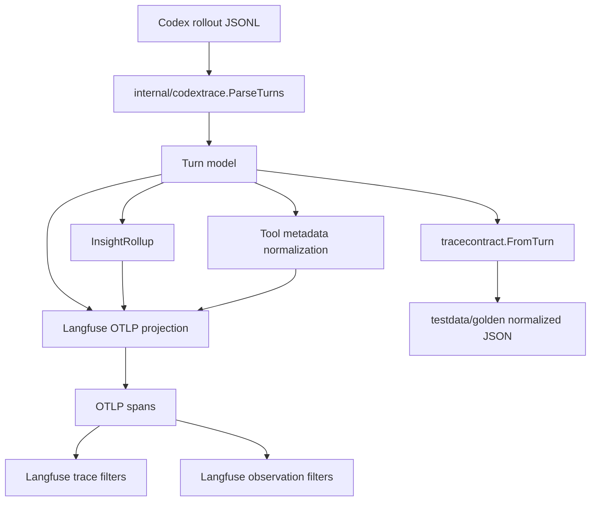

# Langfuse Filter and Cost Attribution Plan

## 1. Title and metadata

- Project name: Codex Langfuse Tracer
- Version: 1.0
- Owners: repository maintainer and implementation agent
- Date: 2026-05-01
- Document ID: CLT-LFC-PLAN-001
- Summary: This plan upgrades the Go-based Codex-to-Langfuse exporter so Langfuse trace and observation filters expose the available repository data as first-class fields where possible. Scope covers first-class generation model and token usage for cost inference, trace navigation facets, low-cardinality tags, version/release propagation, error levels, structured tool metadata, normalized contract fixtures, and documentation. The plan does not add local token-price multiplication by default because current repository data lacks an authoritative dated pricing source.

## 2. Design consensus and trade-offs

| Topic | Verdict | Rationale grounded in repository/context constraints |
|---|---|---|
| Langfuse cost computation | DECISION | Use Langfuse cost inference as the primary path by emitting first-class `langfuse.observation.model.name` and `langfuse.observation.usage_details` on `codex.transcript`. Current code in `internal/langfuse/export.go` exports usage but stores model only under observation metadata. Local multiplication would require a dated pricing source for cached input, output, reasoning output, and model aliases. |
| Local `cost_details` emission | AGAINST | Do not emit `langfuse.observation.cost_details` unless a future ADR adds an exact pricing catalog and tests. Emitting guessed costs would make Langfuse Total Cost filters look authoritative when pricing may be stale. |
| First-class model field | FOR | `codextrace.Turn.Model` is already parsed from `session_meta` or `turn_context` in `internal/codextrace/parser.go`. Emitting it as `langfuse.observation.model.name` lets Langfuse use the Model filter and cost inference path. |
| Trace metadata facets | FOR | Current `InsightRollup.Metadata()` exposes compact counts but not direct facets such as `is_read_only`, `has_file_changes`, `ran_search_command`, or `used_web_search`. Langfuse trace filters are more useful when bounded booleans and counts are top-level metadata. |
| Observation drill-down metadata | FOR | Detailed fields such as `command_kind`, `failure_type`, `changed_files`, and `changed_file_count` already belong on tool observations. Trace metadata should remain compact and avoid raw command output, diffs, or full changed-file lists. |
| Tags | FOR | Emit low-cardinality tags such as `codex`, `read-only`, `changed-files`, `tool-web-search`, and `verification-failed`. Do not tag CWD, trace ID, turn ID, or full file paths because those are high-cardinality. |
| Version and release | FOR | `internal/buildinfo/buildinfo.go` already contains `Version = "0.1.0"`. Use it for `langfuse.version` and `langfuse.release` so Langfuse Version and Release filters can separate exporter versions. |
| User ID | AGAINST | The rollout schema parsed by this repository has session IDs but no explicit end-user identity. Emitting OS username or local account name would create unnecessary privacy exposure. |
| Prompt name | AGAINST | The repository exports Codex CLI turns, not Langfuse prompt-management invocations. The rollout fixtures have no prompt name or prompt version field. |
| Scores | AGAINST | Scores are evaluation artifacts, not raw trace ingestion data. This plan does not create human or model-judge scores from exporter state. A future evaluator pipeline can attach scores through the Langfuse API. |
| Comments and bookmarks | AGAINST | Comments and bookmarks are Langfuse review workflow state. The exporter should not mutate review state during ingestion. |
| Available and called tools | DECISION | Represent called tools through existing `codex.tool.*` observations and add bounded `tool_name`/`available_tool_names` metadata where the rollout provides structured data, especially `tool_search_output.tools`. |
| Error level | FOR | Failed commands are already classified by `failure_type`; map nonzero exits and timeouts to `langfuse.observation.level=ERROR` with a concise status message so Level filters work. |

## 3. PRD / stakeholder and system needs

- Problem: Langfuse exposes trace and observation filters for environment, model, version, release, tags, level, metadata, token counts, costs, and tool fields. The exporter currently uses only a subset, so operators must open traces or inspect child observations for common questions.
- Users: Codex power users reviewing local CLI work in Langfuse; maintainers debugging exporter behavior; future evaluators that consume Langfuse traces.
- Value:
  - Faster trace-table navigation for read-only turns, file-changing turns, failed verification, search/read/test commands, web search, MCP calls, and patch use.
  - Model and token fields that allow Langfuse cost inference without local pricing guesses.
  - Observation filters that keep command details and tool details queryable.
- Business goals:
  - Reduce trace-review time by making common filters available at table level.
  - Improve cost visibility while preserving pricing accuracy.
  - Keep the exporter small, deterministic, and explainable.
- Success metrics:
  - 100% of new first-class Langfuse attributes covered by unit tests.
  - 100% of new normalized contract metadata covered by golden fixture tests.
  - 0 exported local `cost_details` values without an exact pricing catalog.
  - `go test ./... -count=1` passes on Linux amd64 with Go 1.26.0.
  - `go test ./... -run 'TestEval' -count=3 -parallel 8` passes with existing eval thresholds.
- Scope:
  - `internal/langfuse/export.go`
  - `internal/codextrace/insight.go`
  - `internal/codextrace/parser.go`
  - `internal/tracecontract/contract.go`
  - focused tests under `internal/**` and `test/**`
  - fixture updates under `testdata/golden/*.normalized.json`
  - documentation updates in `README.md` and `TESTING.md`
- Non-goals:
  - No local pricing table with production prices.
  - No Langfuse score creation.
  - No comments, bookmarks, or annotation queue mutation.
  - No new Codex wrapper behavior.
  - No raw command output, diffs, hidden reasoning, or full changed-file lists in trace metadata.
- Dependencies:
  - Go module in `go.mod` using Go 1.26.0.
  - OpenTelemetry packages already required by `go.mod`.
  - Existing rollout fixtures in `testdata/rollouts/`.
  - Existing normalized contracts in `testdata/golden/`.
  - Langfuse OTLP attributes consumed by `/api/public/otel/v1/traces`.
- Risks:
  - Langfuse model definitions may not match Codex model aliases such as `gpt-5.5`.
  - Tags can become noisy if high-cardinality values are added.
  - Trace metadata can become cluttered if raw detail moves from observations to traces.
  - Cost fields can become inaccurate if local multiplication uses stale pricing.
- Assumptions:
  - `codex.transcript` remains the only generation observation for a turn.
  - `codex.tool.*` observation names remain stable.
  - Rollout JSONL does not contain authoritative billing rates.
  - Langfuse can infer costs when generation model and usage details match project model definitions.

## 4. SRS / canonical requirements

### Functional requirements

- REQ-201 type func: The exporter shall emit `langfuse.observation.model.name` on `codex.transcript` when `Turn.Model` is non-empty. Acceptance: the transcript span contains the exact model parsed from `testdata/rollouts/complete-tools.jsonl`.
- REQ-202 type func: The exporter shall continue emitting `langfuse.observation.usage_details` on `codex.transcript` using `input`, `output`, `total`, `cached_input`, and `reasoning_output` keys when present. Acceptance: usage matches the fixture token count event.
- REQ-203 type func: The exporter shall not emit `langfuse.observation.cost_details` unless a future ADR adds an exact pricing catalog and cost tests. Acceptance: fixture spans with usage and model contain no local cost details.
- REQ-204 type func: The exporter shall emit low-cardinality trace tags derived from bounded turn facts: `codex`, read-only/file-change state, tool families, command families, and verification status. Acceptance: tags exclude CWD, session ID, turn ID, trace ID, command text, and file paths.
- REQ-205 type func: The exporter shall expose trace navigation facets under `langfuse.trace.metadata.codex_insight.*` for file changes, read-only status, command family counts, command family booleans, tool family counts, and tool family booleans. Acceptance: metadata contains stable keys for zero and nonzero command families.
- REQ-206 type func: The exporter shall preserve existing observation-level command and patch metadata semantics. Acceptance: `codex.tool.exec_command` still exposes `command_kind`, `status`, `exit_code`, `duration_ms`, and `failure_type`; `codex.tool.apply_patch` still exposes changed-file metadata.
- REQ-207 type func: The parser shall add bounded tool metadata for called tools and available tools when rollout events provide structured tool data. Acceptance: `tool_search_output.tools` names become `available_tool_names`, and each `codex.tool.*` observation has a normalized `tool_name`.
- REQ-208 type func: Failed command observations shall emit `langfuse.observation.level=ERROR` and `langfuse.observation.status_message` with a concise failure reason. Acceptance: the failed-command fixture marks the failing command span as error-level without marking successful commands as errors.
- REQ-209 type func: The exporter shall emit `langfuse.version` and `langfuse.release` using `buildinfo.Version` on every exported span. Acceptance: all spans from the memory exporter contain the same version and release values.
- REQ-210 type func: The exporter shall not emit `langfuse.user.id` or `user.id` from local OS or Git identity. Acceptance: exported spans contain no user ID attribute.
- REQ-211 type func: Documentation shall describe which Langfuse filters are supported through first-class fields, metadata, tags, inferred cost, and unsupported UI workflow state. Acceptance: docs name trace filters, observation filters, and the cost inference policy.

### Non-functional requirements

- REQ-212 type reliability: Insight metadata and tags shall be deterministic for identical parsed turns. Acceptance: repeated rollup calls produce byte-identical JSON for metadata and tags.
- REQ-213 type perf: Rollup and projection overhead shall remain bounded. Acceptance: 100 rollups of the complete-tools fixture complete within the existing `TestEvalInsightRollupLatency` 10 ms threshold unless an ADR changes the threshold.
- REQ-214 type security: Trace-level metadata and tags shall not contain raw command output, patch diffs, hidden reasoning, secrets, full changed-file lists, CWD, or user identity. Acceptance: golden fixture scans reject existing secret sentinels and forbidden root fields.
- REQ-215 type reliability: New field projection shall be covered by normalized contract fixtures. Acceptance: golden JSON includes the new root metadata and token/model contract while excluding transport-only OTLP fields.

### Interface/API requirements

- REQ-216 type int: The OTLP export shall continue sending traces to `<LANGFUSE_HOST>/api/public/otel/v1/traces` with Basic auth and `x-langfuse-ingestion-version: 4`. Acceptance: existing fake HTTP server tests still observe the exact path and headers.
- REQ-217 type int: Langfuse field prefixes shall use documented first-class attributes where available: `langfuse.trace.name`, `langfuse.session.id`, `langfuse.environment`, `langfuse.trace.input`, `langfuse.trace.output`, `langfuse.trace.tags`, `langfuse.version`, `langfuse.release`, `langfuse.observation.type`, `langfuse.observation.input`, `langfuse.observation.output`, `langfuse.observation.model.name`, `langfuse.observation.usage_details`, `langfuse.observation.level`, and `langfuse.observation.status_message`. Acceptance: memory-exported spans contain these prefixes only when their source data exists.

### Data requirements

- REQ-218 type data: Normalized contracts shall expose a stable `metadata` object with bounded scalar, boolean, integer, and sorted string-array values only. Acceptance: arrays are sorted and raw detail remains on observations.
- REQ-219 type data: Tool family names shall use short normalized names in trace metadata and tags: `exec_command`, `apply_patch`, `mcp`, `web_search`, `tool_search`, or a sanitized suffix from `codex.tool.<name>`. Acceptance: complete-tools fixture produces sorted tool names.
- REQ-220 type data: Cost-export mode shall be represented as `codex_insight.cost_export_mode=usage_plus_model` when usage and model are exported without local cost details. Acceptance: trace metadata communicates the exporter cost policy without claiming computed dollars.

### Error handling and telemetry expectations

- Unknown command kinds map to `other` and increment `other_command_count`.
- Unknown tool names map to a sanitized short suffix and increment tool counts.
- Missing token usage omits `usage_details` and leaves `cost_export_mode` absent.
- Missing model omits `langfuse.observation.model.name` and leaves `cost_export_mode` absent.
- Failed commands emit error level on the failing tool observation only.
- The exporter keeps returning an error for non-2xx OTLP responses through existing `ExportTurn` behavior.

### Architecture diagram



```text
System: Codex Langfuse Tracer

Container: Go exporter
  Component: cmd/codex-langfuse-exporter
    - selects rollout source and export mode
  Component: internal/codextrace
    - parses JSONL into Turn and Observation values
    - classifies commands and derives insight rollups
  Component: internal/langfuse
    - maps Turn data into OTLP spans with Langfuse attributes
    - exports to Langfuse OTLP endpoint
  Component: internal/tracecontract
    - creates normalized semantic contracts for tests

External system: Langfuse
  - receives OTLP traces
  - powers trace filters, observation filters, usage, and inferred cost
```

## 5. Iterative implementation and test plan

### Phase strategy

- Build from source contracts outward: parser and rollup tests first, OTLP projection tests second, normalized fixture tests third, full acceptance last.
- Keep one implementation path for metadata and tag derivation.
- Add no production price constants in this plan.
- Add git restore tags before and after each phase:
  - `git tag -f restore/langfuse-filter-cost-Pxx-start`
  - `git tag -f restore/langfuse-filter-cost-Pxx-done`
- Add or preserve grep-able traceability comments in every changed Go test file, using `// TEST-###` for tests and `// EVAL-###` for evals.
- Compute controls:
  - branch_limits: maximum 1 phase per execution batch, maximum 5 production files touched per phase, maximum 2 documentation files touched per documentation phase.
  - reflection_passes: 2 per phase, one after RED and one before done tag.
  - early_stop%: 95; stop a phase once phase tests, phase evals, and exit gates pass with no red criteria.
- Any metric threshold change requires an ADR before implementation continues.

### Risk register

| Risk | Trigger | Mitigation |
|---|---|---|
| Cost inference absent in Langfuse | Langfuse project lacks model definitions for Codex model aliases | Emit model and usage correctly; document model-definition setup; do not emit guessed cost. |
| High-cardinality tags | Tags include paths, commands, IDs, or CWD | Unit tests reject forbidden tag sources. |
| Trace metadata bloat | Full changed-file lists or raw command text appear at trace root | Contract tests reject full raw fields in root metadata. |
| Existing observation filters regress | Command metadata keys move or rename | Tests assert current observation metadata remains. |
| Flaky latency eval | Machine is loaded during eval | Repeat with `-count=3`; keep existing 10 ms threshold unless ADR changes it. |
| Langfuse OTEL mapping drift | Langfuse changes accepted field names | Keep all field names centralized in `internal/langfuse/export.go`; live API smoke is optional CHECK-201. |

### Suspension/resumption criteria

- Suspend when a phase RED test cannot fail for the intended reason after two implementation-free attempts.
- Suspend when existing unrelated tests fail before phase edits and the failure is outside impacted files.
- Suspend when a required Langfuse field has no documented OTLP attribute and no fixture-visible source data.
- Resume from the latest `restore/langfuse-filter-cost-Pxx-start` or `restore/langfuse-filter-cost-Pxx-done` tag and re-execute the phase command set.

### Phase P00: First-Class Generation Model and Cost Policy

- Scope and objectives: Implement first-class model projection for `codex.transcript`, preserve usage details, reject unpriced local cost details, and reject implicit user IDs. Impacted requirements: REQ-201, REQ-202, REQ-203, REQ-210, REQ-217, REQ-220.
- Restore start: `git tag -f restore/langfuse-filter-cost-P00-start`
- Step 1 RED: create/update TEST-201, TEST-202, TEST-203, and TEST-210 in `internal/langfuse/spans_test.go` for REQ-201, REQ-202, REQ-203, REQ-210, REQ-217, and REQ-220; run `go test ./internal/langfuse -run 'TestLangfuseFirstClassGenerationFields|TestLangfuseCostPolicyNoUnpricedCostDetails|TestLangfuseNoImplicitUserID' -count=1`; expected FAIL because the transcript span lacks `langfuse.observation.model.name`, cost policy metadata, and explicit no-user assertions.
- Step 2 GREEN: implement minimal projection changes in `internal/langfuse/export.go`; run `go test ./internal/langfuse -run 'TestLangfuseFirstClassGenerationFields|TestLangfuseCostPolicyNoUnpricedCostDetails|TestLangfuseNoImplicitUserID' -count=1`; expected PASS.
- Step 3 REFACTOR: extract transcript generation attribute construction into a helper in `internal/langfuse/export.go`; run `go test ./internal/langfuse -count=1`; expected PASS.
- Step 4 MEASURE: run EVAL-201 with `go test ./internal/langfuse -run 'TestEvalInsightMetadataProjection|TestEvalCostProjectionNoFalsePrecision' -count=3 -parallel 8`; expected thresholds met.
- Restore done: `git tag -f restore/langfuse-filter-cost-P00-done`
- Exit gates:
  - Green criteria: focused command and package command pass.
  - Yellow criteria: model missing in fixtures that intentionally omit model; omission is documented in test names.
  - Red criteria: any span emits `langfuse.observation.cost_details` without an exact pricing catalog.
- Phase metrics:
  - Confidence %: 90; direct memory exporter tests cover the affected attributes.
  - Long-term robustness %: 86; centralized helper reduces field-name drift.
  - Internal interactions: 3; Turn model, Langfuse exporter, memory exporter tests.
  - External interactions: 1; Langfuse OTLP field contract.
  - Complexity %: 18; projection-only change.
  - Feature creep %: 10; cost math is intentionally excluded.
  - Technical debt %: 12; model metadata duplication may remain for backward-compatible filters.
  - YAGNI score: 92; no pricing catalog added without source data.
  - MoSCoW: Must.
  - Local/non-local scope: Local.
  - Architectural changes count: 1.

### Phase P01: Deterministic Trace Navigation Facets

- Scope and objectives: Extend `InsightRollup` with command family counts, command family booleans, tool family counts, tool family booleans, `command_kinds`, `tool_names`, `has_file_changes`, and `is_read_only`. Impacted requirements: REQ-204, REQ-205, REQ-206, REQ-212, REQ-213, REQ-218, REQ-219.
- Restore start: `git tag -f restore/langfuse-filter-cost-P01-start`
- Step 1 RED: create/update TEST-204 and TEST-213 in `internal/codextrace/insight_test.go` for REQ-204, REQ-205, REQ-206, REQ-212, REQ-213, REQ-218, and REQ-219; run `go test ./internal/codextrace -run 'TestInsightNavigationFacets|TestInsightRollup|TestEvalInsightRollupLatency' -count=1`; expected FAIL because current metadata lacks navigation facets and tool-name arrays.
- Step 2 GREEN: implement minimal rollup fields and metadata emission in `internal/codextrace/insight.go`; run `go test ./internal/codextrace -run 'TestInsightNavigationFacets|TestInsightRollup|TestEvalInsightRollupLatency' -count=1`; expected PASS.
- Step 3 REFACTOR: consolidate command-kind and tool-name counter helpers in `internal/codextrace/insight.go`; run `go test ./internal/codextrace -count=1`; expected PASS.
- Step 4 MEASURE: run EVAL-202 with `go test ./internal/codextrace -run 'TestEvalInsightRollupLatency|TestEvalNavigationFacetDeterminism' -count=3 -parallel 8`; expected thresholds met.
- Restore done: `git tag -f restore/langfuse-filter-cost-P01-done`
- Exit gates:
  - Green criteria: rollup tests pass with sorted arrays and stable zero-count fields.
  - Yellow criteria: unclassified command increments `other_command_count`.
  - Red criteria: root metadata contains raw command text, command output, full changed-file list, or diffs.
- Phase metrics:
  - Confidence %: 88; fixture-driven tests cover read-only, file-change, and mixed tool turns.
  - Long-term robustness %: 90; bounded enums limit metadata drift.
  - Internal interactions: 4; parser output, rollup, metadata map, contract users.
  - External interactions: 1; Langfuse trace metadata filters.
  - Complexity %: 34; multiple facets share helper logic.
  - Feature creep %: 16; all facets map to explicit UI filter needs.
  - Technical debt %: 14; command classification remains heuristic.
  - YAGNI score: 84; raw details stay out of trace root.
  - MoSCoW: Must.
  - Local/non-local scope: Local.
  - Architectural changes count: 1.

### Phase P02: Tags, Version, Release, and Error Level Projection

- Scope and objectives: Propagate low-cardinality tags, version, release, environment, and trace name across spans; map failed commands to Langfuse error level. Impacted requirements: REQ-204, REQ-208, REQ-209, REQ-212, REQ-214, REQ-217.
- Restore start: `git tag -f restore/langfuse-filter-cost-P02-start`
- Step 1 RED: create/update TEST-205 and TEST-208 in `internal/langfuse/spans_test.go` for REQ-204, REQ-208, REQ-209, REQ-212, REQ-214, and REQ-217; run `go test ./internal/langfuse -run 'TestLangfuseTraceTagsVersionRelease|TestLangfuseErrorLevelProjection' -count=1`; expected FAIL because current spans lack tags, version/release, and explicit error-level attributes.
- Step 2 GREEN: implement minimal tag, version, release, level, and status-message projection in `internal/langfuse/export.go`; run `go test ./internal/langfuse -run 'TestLangfuseTraceTagsVersionRelease|TestLangfuseErrorLevelProjection' -count=1`; expected PASS.
- Step 3 REFACTOR: centralize propagated trace attributes and observation severity mapping in `internal/langfuse/export.go`; run `go test ./internal/langfuse -count=1`; expected PASS.
- Step 4 MEASURE: run EVAL-203 with `go test ./internal/langfuse -run 'TestEvalInsightMetadataProjection|TestEvalTagProjectionDeterminism' -count=3 -parallel 8`; expected thresholds met.
- Restore done: `git tag -f restore/langfuse-filter-cost-P02-done`
- Exit gates:
  - Green criteria: all spans carry version and release; tags are sorted and bounded; failed command is error-level.
  - Yellow criteria: no tool tags for turns with no tools.
  - Red criteria: tags include IDs, CWD, command text, or file paths.
- Phase metrics:
  - Confidence %: 86; memory exporter tests inspect raw span attributes.
  - Long-term robustness %: 84; centralized propagated attributes ease Langfuse mapping changes.
  - Internal interactions: 3; buildinfo, rollup tags, exporter.
  - External interactions: 1; Langfuse filter surface.
  - Complexity %: 28; tag policy is bounded but crosses trace and observation concerns.
  - Feature creep %: 18; tags duplicate some metadata for UI ergonomics.
  - Technical debt %: 16; release value equals build version until release metadata exists.
  - YAGNI score: 80; no user or prompt attributes added.
  - MoSCoW: Must.
  - Local/non-local scope: Local.
  - Architectural changes count: 1.

### Phase P03: Tool Called and Available Metadata

- Scope and objectives: Add normalized tool names to tool observations, extract available tool names from `tool_search_output.tools`, and feed tool availability into trace facets without duplicating large tool payloads. Impacted requirements: REQ-207, REQ-212, REQ-214, REQ-218, REQ-219.
- Restore start: `git tag -f restore/langfuse-filter-cost-P03-start`
- Step 1 RED: create/update TEST-207 in `internal/codextrace/tools_test.go` for REQ-207, REQ-212, REQ-214, REQ-218, and REQ-219; run `go test ./internal/codextrace -run 'TestToolAvailabilityAndCalledMetadata|TestToolObservationParity' -count=1`; expected FAIL because tool observations lack normalized `tool_name` and `available_tool_names` metadata.
- Step 2 GREEN: implement minimal parser metadata changes in `internal/codextrace/parser.go` and matching rollup ingestion in `internal/codextrace/insight.go`; run `go test ./internal/codextrace -run 'TestToolAvailabilityAndCalledMetadata|TestToolObservationParity' -count=1`; expected PASS.
- Step 3 REFACTOR: move tool-name normalization into one helper used by parser and rollup; run `go test ./internal/codextrace -count=1`; expected PASS.
- Step 4 MEASURE: run EVAL-204 with `go test ./internal/codextrace -run 'TestEvalToolMetadataDeterminism|TestEvalInsightRollupLatency' -count=3 -parallel 8`; expected thresholds met.
- Restore done: `git tag -f restore/langfuse-filter-cost-P03-done`
- Exit gates:
  - Green criteria: `complete-tools.jsonl` yields `available_tool_names=["langfuse.trace"]` on tool-search metadata and sorted trace tool names.
  - Yellow criteria: unknown tool payload shapes omit available-tool names while preserving output.
  - Red criteria: full tool payloads move into trace metadata.
- Phase metrics:
  - Confidence %: 84; fixture has a concrete `tool_search_output.tools` shape.
  - Long-term robustness %: 82; helper handles known and unknown `codex.tool.*` names.
  - Internal interactions: 4; parser, model metadata, rollup, tests.
  - External interactions: 1; Langfuse observation metadata filters.
  - Complexity %: 36; data shape parsing adds edge cases.
  - Feature creep %: 14; only existing rollout fields are used.
  - Technical debt %: 18; available-tool extraction remains limited to recorded tool-search output.
  - YAGNI score: 82; no speculative available-tool registry.
  - MoSCoW: Should.
  - Local/non-local scope: Local.
  - Architectural changes count: 1.

### Phase P04: Normalized Contract and Golden Fixture Updates

- Scope and objectives: Update semantic contract projection and golden fixtures so new metadata, model, usage, tags, and cost policy are covered outside raw OTLP span tests. Impacted requirements: REQ-205, REQ-211, REQ-215, REQ-218, REQ-220.
- Restore start: `git tag -f restore/langfuse-filter-cost-P04-start`
- Step 1 RED: create/update TEST-215 in `test/contract_fixture_test.go` and TEST-211 in `test/docs_static_test.go` for REQ-205, REQ-211, REQ-215, REQ-218, and REQ-220; run `go test ./test -run 'TestGoldenLangfuseFilterAndCostCoverage|TestDocsLangfuseFilterAndCostGuidance' -count=1`; expected FAIL because golden fixtures and docs lack new field coverage and cost policy guidance.
- Step 2 GREEN: update `internal/tracecontract/contract.go`, `testdata/golden/*.normalized.json`, `README.md`, and `TESTING.md` with the minimal new contract fields and docs; run `go test ./test -run 'TestGoldenLangfuseFilterAndCostCoverage|TestDocsLangfuseFilterAndCostGuidance' -count=1`; expected PASS.
- Step 3 REFACTOR: remove duplicated expected-metadata key lists in `test/contract_fixture_test.go`; run `go test ./test -count=1`; expected PASS.
- Step 4 MEASURE: run EVAL-205 with `go test ./test -run 'TestEvalInsightFixtureCoverage|TestEvalGoldenFixtureCoverage' -count=3 -parallel 8`; expected thresholds met.
- Restore done: `git tag -f restore/langfuse-filter-cost-P04-done`
- Exit gates:
  - Green criteria: golden fixture coverage includes navigation facets and cost-export mode.
  - Yellow criteria: fixtures without token usage omit cost-export mode.
  - Red criteria: normalized golden contains raw OTLP transport fields, secret sentinels, or local cost dollars.
- Phase metrics:
  - Confidence %: 87; golden fixtures lock semantic output.
  - Long-term robustness %: 88; contract tests catch drift outside memory exporter tests.
  - Internal interactions: 4; tracecontract, fixtures, docs tests, README.
  - External interactions: 0; no live service dependency.
  - Complexity %: 30; fixture updates are mechanical but broad.
  - Feature creep %: 12; docs limited to supported filters and explicit non-goals.
  - Technical debt %: 10; duplicated fixture expectations are reduced.
  - YAGNI score: 86; no UI configuration files added.
  - MoSCoW: Must.
  - Local/non-local scope: Local.
  - Architectural changes count: 1.

### Phase P05: HTTP Export and CLI Acceptance

- Scope and objectives: Confirm full exporter behavior still preserves OTLP endpoint contract, CLI acceptance, install expectations, and new Langfuse field projection. Impacted requirements: REQ-211, REQ-214, REQ-216, REQ-217.
- Restore start: `git tag -f restore/langfuse-filter-cost-P05-start`
- Step 1 RED: create/update TEST-216 in `internal/langfuse/otlp_http_test.go` and TEST-218 in `test/full_acceptance_test.go` for REQ-211, REQ-214, REQ-216, and REQ-217; run `go test ./internal/langfuse ./test -run 'TestOTLPHTTPExport|TestFullAcceptance' -count=1`; expected FAIL because acceptance assertions do not yet cover the new projection contract.
- Step 2 GREEN: implement minimal acceptance assertions and any missing projection fixes; run `go test ./internal/langfuse ./test -run 'TestOTLPHTTPExport|TestFullAcceptance' -count=1`; expected PASS.
- Step 3 REFACTOR: simplify repeated span-attribute assertion helpers in `internal/langfuse/spans_test.go` or `internal/langfuse/memory_test.go`; run `go test ./internal/langfuse ./test -count=1`; expected PASS.
- Step 4 MEASURE: run EVAL-206 with `go test ./... -run 'TestEval' -count=3 -parallel 8`; expected thresholds met.
- Restore done: `git tag -f restore/langfuse-filter-cost-P05-done`
- Exit gates:
  - Green criteria: package acceptance command and eval command pass.
  - Yellow criteria: packages with no matching eval tests report no tests and pass.
  - Red criteria: OTLP endpoint path, auth header behavior, or ingestion-version header changes unexpectedly.
- Phase metrics:
  - Confidence %: 91; acceptance covers exporter integration boundaries.
  - Long-term robustness %: 85; HTTP contract remains explicitly tested.
  - Internal interactions: 5; CLI, exporter, config, tests, fixtures.
  - External interactions: 1; fake HTTP server simulates Langfuse endpoint.
  - Complexity %: 24; mostly assertion and integration coverage.
  - Feature creep %: 8; no new runtime mode.
  - Technical debt %: 9; helper cleanup reduces duplicated assertions.
  - YAGNI score: 90; no live Langfuse dependency in required tests.
  - MoSCoW: Must.
  - Local/non-local scope: Local.
  - Architectural changes count: 0.

### Phase P06: Final Repository Gate

- Scope and objectives: Execute complete repository validation and static diff quality after all changes. Impacted requirements: REQ-201 through REQ-220.
- Restore start: `git tag -f restore/langfuse-filter-cost-P06-start`
- Step 1 RED: create/update TEST-220 in `test/full_acceptance_test.go` for REQ-201 through REQ-220; run `go test ./... -count=1`; expected FAIL because full acceptance has not yet required all new fields across repository packages.
- Step 2 GREEN: implement minimal fixes found by full repository validation; run `go test ./... -count=1`; expected PASS.
- Step 3 REFACTOR: apply final code simplifications only within files changed by this plan; run `go test ./... -count=1`; expected PASS.
- Step 4 MEASURE: run EVAL-207 with `git diff --check`; expected no whitespace or conflict-marker findings.
- Restore done: `git tag -f restore/langfuse-filter-cost-P06-done`
- Exit gates:
  - Green criteria: full repository command passes and diff quality command has no findings.
  - Yellow criteria: no live Langfuse smoke executed; optional CHECK-201 remains available.
  - Red criteria: any required test fails or a changed file contains conflict markers.
- Phase metrics:
  - Confidence %: 94; full repository command covers all Go packages.
  - Long-term robustness %: 88; final gate catches cross-package drift.
  - Internal interactions: 6; all packages and docs tests.
  - External interactions: 0; local-only gate.
  - Complexity %: 20; validation-focused phase.
  - Feature creep %: 5; no new features beyond acceptance fixes.
  - Technical debt %: 8; final cleanup limited to touched files.
  - YAGNI score: 93; live smoke stays optional.
  - MoSCoW: Must.
  - Local/non-local scope: Local.
  - Architectural changes count: 0.

## 6. Evaluations

```yaml
evaluations:
  - id: EVAL-201
    purpose: dev
    metrics:
      - no_false_cost_details_rate
      - generation_projection_pass_rate
    thresholds:
      no_false_cost_details_rate: 1.0
      generation_projection_pass_rate: 1.0
    seeds:
      - testdata/rollouts/complete-tools.jsonl
    runtime_budget: 20s
    command: "go test ./internal/langfuse -run 'TestEvalInsightMetadataProjection|TestEvalCostProjectionNoFalsePrecision' -count=3 -parallel 8"
  - id: EVAL-202
    purpose: dev
    metrics:
      - rollup_latency_100_iterations_ms
      - deterministic_metadata_rate
    thresholds:
      rollup_latency_100_iterations_ms: 10
      deterministic_metadata_rate: 1.0
    seeds:
      - testdata/rollouts/complete-tools.jsonl
      - testdata/rollouts/failed-command.jsonl
    runtime_budget: 20s
    command: "go test ./internal/codextrace -run 'TestEvalInsightRollupLatency|TestEvalNavigationFacetDeterminism' -count=3 -parallel 8"
  - id: EVAL-203
    purpose: dev
    metrics:
      - deterministic_tags_rate
      - projection_pass_rate
    thresholds:
      deterministic_tags_rate: 1.0
      projection_pass_rate: 1.0
    seeds:
      - testdata/rollouts/complete-tools.jsonl
      - testdata/rollouts/failed-command.jsonl
    runtime_budget: 20s
    command: "go test ./internal/langfuse -run 'TestEvalInsightMetadataProjection|TestEvalTagProjectionDeterminism' -count=3 -parallel 8"
  - id: EVAL-204
    purpose: dev
    metrics:
      - deterministic_tool_metadata_rate
      - rollup_latency_100_iterations_ms
    thresholds:
      deterministic_tool_metadata_rate: 1.0
      rollup_latency_100_iterations_ms: 10
    seeds:
      - testdata/rollouts/complete-tools.jsonl
    runtime_budget: 20s
    command: "go test ./internal/codextrace -run 'TestEvalToolMetadataDeterminism|TestEvalInsightRollupLatency' -count=3 -parallel 8"
  - id: EVAL-205
    purpose: holdout
    metrics:
      - fixture_schema_pass_rate
      - forbidden_payload_pass_rate
    thresholds:
      fixture_schema_pass_rate: 1.0
      forbidden_payload_pass_rate: 1.0
    seeds:
      - testdata/manifest.json
    runtime_budget: 60s
    command: "go test ./test -run 'TestEvalInsightFixtureCoverage|TestEvalGoldenFixtureCoverage' -count=3 -parallel 8"
  - id: EVAL-206
    purpose: holdout
    metrics:
      - eval_suite_pass_rate
    thresholds:
      eval_suite_pass_rate: 1.0
    seeds:
      - testdata/manifest.json
    runtime_budget: 180s
    command: "go test ./... -run 'TestEval' -count=3 -parallel 8"
  - id: EVAL-207
    purpose: adversarial
    metrics:
      - diff_quality_findings
    thresholds:
      diff_quality_findings: 0
    seeds:
      - git diff
    runtime_budget: 10s
    command: "git diff --check"
```

## 7. Tests

### 7.1 Test inventory

- Test framework: Go `testing` package.
- Module file: `go.mod`.
- Package manager scripts: none; no `package.json`, `Makefile`, `scripts/`, `Taskfile.yml`, `justfile`, or `.github/workflows/*` exists in the current repository snapshot.
- Existing exact commands used by this plan:
  - `go test ./internal/codextrace -count=1`
  - `go test ./internal/langfuse -count=1`
  - `go test ./internal/langfuse ./test -run 'TestOTLPHTTPExport|TestFullAcceptance' -count=1`
  - `go test ./internal/tracecontract -count=1`
  - `go test ./test -count=1`
  - `go test ./... -count=1`
  - `go test ./... -run 'TestEval' -count=3 -parallel 8`
  - `git diff --check`
- Test file globs and locations:
  - Unit and package tests: `internal/**/*_test.go`, `cmd/**/*_test.go`
  - Contract and acceptance tests: `test/**/*_test.go`
  - Fixture inputs: `testdata/rollouts/*.jsonl`
  - Golden contracts: `testdata/golden/*.normalized.json`

### 7.2 Test suites overview

| name | purpose | runner | command | runtime budget | when it runs |
|---|---|---|---|---:|---|
| Unit | Parser, rollup, privacy, projection helpers | Go testing | `go test ./internal/codextrace ./internal/langfuse ./internal/tracecontract -count=1` | 60s | pre-commit |
| Integration | CLI, fake OTLP HTTP, watch state | Go testing | `go test ./cmd/codex-langfuse-exporter ./internal/watch ./internal/langfuse -count=1` | 90s | pre-commit |
| E2E | Semantic contract and full acceptance | Go testing | `go test ./test -count=1` | 90s | pre-commit |
| Perf | Existing eval and latency tests | Go testing | `go test ./... -run 'TestEval' -count=3 -parallel 8` | 180s | CI |
| Data Drift | Golden fixture contract drift | Go testing | `go test ./test -run 'TestGolden|TestEvalGolden' -count=1` | 60s | CI |
| Static | Documentation and diff quality | Go testing plus Git | `go test ./test -run TestDocs -count=1` and `git diff --check` | 30s | pre-commit |

### 7.3 Test definitions

- id: TEST-201
  - name: First-class generation model projection
  - type: unit
  - verifies: REQ-201, REQ-217
  - location: `internal/langfuse/spans_test.go`
  - command: `go test ./internal/langfuse -run 'TestLangfuseFirstClassGenerationFields|TestLangfuseCostPolicyNoUnpricedCostDetails|TestLangfuseNoImplicitUserID' -count=1`
  - fixtures/mocks/data: `testdata/rollouts/complete-tools.jsonl`, `memoryExporter`
  - deterministic controls: no network, fixed fixture timestamps, stable span IDs
  - pass_criteria: `codex.transcript` contains `langfuse.observation.model.name="gpt-5.5"`
  - expected_runtime: 10s
- id: TEST-202
  - name: Generation token usage projection remains intact
  - type: unit
  - verifies: REQ-202, REQ-217
  - location: `internal/langfuse/spans_test.go`
  - command: `go test ./internal/langfuse -run 'TestLangfuseFirstClassGenerationFields|TestLangfuseCostPolicyNoUnpricedCostDetails|TestLangfuseNoImplicitUserID' -count=1`
  - fixtures/mocks/data: `testdata/rollouts/complete-tools.jsonl`, `memoryExporter`
  - deterministic controls: fixed token event with input 100, output 40, total 140, cached input 20, reasoning output 10
  - pass_criteria: transcript `langfuse.observation.usage_details` JSON contains exact fixture token values
  - expected_runtime: 10s
- id: TEST-203
  - name: No unpriced local cost details
  - type: unit
  - verifies: REQ-203, REQ-220
  - location: `internal/langfuse/spans_test.go`
  - command: `go test ./internal/langfuse -run 'TestLangfuseFirstClassGenerationFields|TestLangfuseCostPolicyNoUnpricedCostDetails|TestLangfuseNoImplicitUserID' -count=1`
  - fixtures/mocks/data: `testdata/rollouts/complete-tools.jsonl`, `memoryExporter`
  - deterministic controls: no pricing catalog in repository
  - pass_criteria: transcript span has no `langfuse.observation.cost_details`; root metadata contains `codex_insight.cost_export_mode=usage_plus_model`
  - expected_runtime: 10s
- id: TEST-204
  - name: Insight navigation facets
  - type: unit
  - verifies: REQ-204, REQ-205, REQ-206, REQ-212, REQ-218, REQ-219
  - location: `internal/codextrace/insight_test.go`
  - command: `go test ./internal/codextrace -run 'TestInsightNavigationFacets|TestInsightRollup' -count=1`
  - fixtures/mocks/data: synthetic turns in test code plus `testdata/rollouts/complete-tools.jsonl`
  - deterministic controls: fixed observation lists, sorted map-key helpers
  - pass_criteria: metadata includes stable command/tool counts, booleans, sorted arrays, read-only/file-change state, and preserved existing rollup fields
  - expected_runtime: 10s
- id: TEST-205
  - name: Tags, version, and release projection
  - type: unit
  - verifies: REQ-204, REQ-209, REQ-212, REQ-214, REQ-217
  - location: `internal/langfuse/spans_test.go`
  - command: `go test ./internal/langfuse -run 'TestLangfuseTraceTagsVersionRelease|TestLangfuseErrorLevelProjection' -count=1`
  - fixtures/mocks/data: `testdata/rollouts/complete-tools.jsonl`, `memoryExporter`
  - deterministic controls: fixed buildinfo version, sorted tags, no environment mutation
  - pass_criteria: all spans contain `langfuse.version`, `langfuse.release`, and bounded `langfuse.trace.tags`; tags exclude IDs, CWD, paths, and command text
  - expected_runtime: 10s
- id: TEST-207
  - name: Tool called and available metadata
  - type: unit
  - verifies: REQ-207, REQ-212, REQ-214, REQ-218, REQ-219
  - location: `internal/codextrace/tools_test.go`
  - command: `go test ./internal/codextrace -run 'TestToolAvailabilityAndCalledMetadata|TestToolObservationParity' -count=1`
  - fixtures/mocks/data: `testdata/rollouts/complete-tools.jsonl`
  - deterministic controls: fixed `tool_search_output.tools` payload with `langfuse.trace`
  - pass_criteria: each `codex.tool.*` observation has normalized `tool_name`; tool-search metadata contains sorted `available_tool_names`
  - expected_runtime: 10s
- id: TEST-208
  - name: Error level projection for failed commands
  - type: unit
  - verifies: REQ-208, REQ-217
  - location: `internal/langfuse/spans_test.go`
  - command: `go test ./internal/langfuse -run 'TestLangfuseTraceTagsVersionRelease|TestLangfuseErrorLevelProjection' -count=1`
  - fixtures/mocks/data: `testdata/rollouts/failed-command.jsonl`, `memoryExporter`
  - deterministic controls: fixed nonzero command fixture
  - pass_criteria: failing command span has `langfuse.observation.level=ERROR` and a non-empty status message; successful command spans lack error level
  - expected_runtime: 10s
- id: TEST-210
  - name: No implicit user ID
  - type: unit
  - verifies: REQ-210, REQ-214
  - location: `internal/langfuse/spans_test.go`
  - command: `go test ./internal/langfuse -run 'TestLangfuseFirstClassGenerationFields|TestLangfuseCostPolicyNoUnpricedCostDetails|TestLangfuseNoImplicitUserID' -count=1`
  - fixtures/mocks/data: `testdata/rollouts/complete-tools.jsonl`, `memoryExporter`
  - deterministic controls: no OS user lookup in test or production path
  - pass_criteria: no span contains `langfuse.user.id` or `user.id`
  - expected_runtime: 10s
- id: TEST-211
  - name: Documentation for Langfuse filters and cost policy
  - type: static
  - verifies: REQ-211
  - location: `test/docs_static_test.go`
  - command: `go test ./test -run 'TestGoldenLangfuseFilterAndCostCoverage|TestDocsLangfuseFilterAndCostGuidance' -count=1`
  - fixtures/mocks/data: `README.md`, `TESTING.md`
  - deterministic controls: static file reads only
  - pass_criteria: docs name supported trace filters, observation filters, model/usage cost inference, and unsupported scores/comments/bookmarks
  - expected_runtime: 10s
- id: TEST-213
  - name: Insight rollup latency threshold
  - type: perf
  - verifies: REQ-213
  - location: `internal/codextrace/insight_test.go`
  - command: `go test ./internal/codextrace -run 'TestInsightNavigationFacets|TestInsightRollup|TestEvalInsightRollupLatency' -count=1`
  - fixtures/mocks/data: `testdata/rollouts/complete-tools.jsonl`
  - deterministic controls: fixed fixture, in-process loop, no filesystem writes after fixture read
  - pass_criteria: existing `TestEvalInsightRollupLatency` threshold remains 100 rollups within 10 ms
  - expected_runtime: 10s
- id: TEST-215
  - name: Golden Langfuse filter and cost coverage
  - type: integration
  - verifies: REQ-205, REQ-215, REQ-218, REQ-220
  - location: `test/contract_fixture_test.go`
  - command: `go test ./test -run 'TestGoldenLangfuseFilterAndCostCoverage|TestDocsLangfuseFilterAndCostGuidance' -count=1`
  - fixtures/mocks/data: `testdata/manifest.json`, `testdata/golden/*.normalized.json`
  - deterministic controls: committed fixtures only, sorted expected keys
  - pass_criteria: complete-tools golden includes new bounded metadata and cost-export mode; root metadata excludes raw fields and local costs
  - expected_runtime: 30s
- id: TEST-216
  - name: OTLP HTTP export contract
  - type: integration
  - verifies: REQ-216, REQ-217
  - location: `internal/langfuse/otlp_http_test.go`
  - command: `go test ./internal/langfuse ./test -run 'TestOTLPHTTPExport|TestFullAcceptance' -count=1`
  - fixtures/mocks/data: fake HTTP server in existing test
  - deterministic controls: local server, fixed config, no external network
  - pass_criteria: request path, auth header, and ingestion-version header remain unchanged while new attributes serialize successfully
  - expected_runtime: 20s
- id: TEST-218
  - name: Full acceptance covers new field surface
  - type: e2e
  - verifies: REQ-211, REQ-214, REQ-216, REQ-217
  - location: `test/full_acceptance_test.go`
  - command: `go test ./internal/langfuse ./test -run 'TestOTLPHTTPExport|TestFullAcceptance' -count=1`
  - fixtures/mocks/data: `testdata/rollouts/complete-tools.jsonl`, systemd service file, install artifact expectations
  - deterministic controls: local files only
  - pass_criteria: full acceptance observes new metadata, preserved command metadata, no secret sentinel leakage, and unchanged Go exporter service command
  - expected_runtime: 45s
- id: TEST-220
  - name: Full repository validation
  - type: e2e
  - verifies: REQ-201, REQ-202, REQ-203, REQ-204, REQ-205, REQ-206, REQ-207, REQ-208, REQ-209, REQ-210, REQ-211, REQ-212, REQ-213, REQ-214, REQ-215, REQ-216, REQ-217, REQ-218, REQ-219, REQ-220
  - location: `test/full_acceptance_test.go`
  - command: `go test ./... -count=1`
  - fixtures/mocks/data: all Go tests, all committed fixtures
  - deterministic controls: no live Langfuse dependency; package tests use fake servers or memory exporters
  - pass_criteria: all packages pass under Go 1.26.0
  - expected_runtime: 180s

### 7.4 Manual checks, optional

- CHECK-201: Live Langfuse cost inference smoke
  - Procedure:
    1. Confirm `~/.codex/config.toml` has `[mcp_servers.langfuse.env]` with `LANGFUSE_HOST`, `LANGFUSE_PUBLIC_KEY`, and `LANGFUSE_SECRET_KEY`.
    2. Execute `~/.codex/bin/codex-langfuse-exporter --path testdata/rollouts/complete-tools.jsonl --no-verify`.
    3. Fetch the trace with `curl -s -u "$LANGFUSE_PUBLIC_KEY:$LANGFUSE_SECRET_KEY" "$LANGFUSE_HOST/api/public/traces/<TRACE_ID>"`.
    4. Inspect the response for model, usage, and any Langfuse-inferred cost fields.
  - Expected result: model and usage are present; costs appear only if the Langfuse project has a matching model definition.
  - RTM inclusion: excluded by design because it depends on external Langfuse project configuration.

## 8. Data contract

### Schema snapshot

```yaml
trace:
  name: codex.turn.transcript
  session_id: string
  input: string
  output: string
  environment: string
  version: buildinfo.Version
  release: buildinfo.Version
  tags:
    - codex
    - read-only | changed-files
    - verification-not-applicable | verification-not-run | verification-passed | verification-failed
    - tool-<tool_name>
    - command-<command_kind>
  metadata:
    codex_session_id: string
    codex_turn_id: string
    codex_transcript_exported: true
    codex_insight:
      tool_count: integer
      command_count: integer
      failed_command_count: integer
      patch_count: integer
      changed_file_count: integer
      has_file_changes: boolean
      is_read_only: boolean
      command_kinds: [string]
      tool_names: [string]
      cost_export_mode: usage_plus_model
      ran_<command_kind>_command: boolean
      <command_kind>_command_count: integer
      used_<tool_name>: boolean
      <tool_name>_tool_count: integer
      verification_command_count: integer
      verification_status: string
      last_verification_command: string
      last_verification_status: string
      changed_extensions: [string]
      touched_test_files: [string]
observations:
  - name: codex.agent
    type: agent
  - name: codex.transcript
    type: generation
    model_name: string
    usage_details:
      input: integer
      output: integer
      total: integer
      cached_input: integer
      reasoning_output: integer
    cost_details: absent in this plan
  - name: codex.tool.exec_command
    type: tool
    metadata:
      tool_name: exec_command
      command_kind: string
      status: string
      exit_code: integer
      duration_ms: integer
      failure_type: string
  - name: codex.tool.tool_search
    type: tool
    metadata:
      tool_name: tool_search
      available_tool_names: [string]
```

### Invariants

- Root metadata contains only bounded values.
- Arrays in metadata and tags are sorted.
- Full changed-file lists stay on `codex.tool.apply_patch` observation metadata.
- Command output stays in the tool observation output, not trace metadata.
- Patch diffs stay in the patch observation output, not trace metadata.
- Cost details are absent without an exact local pricing catalog.
- Model and usage details are present only on `generation` observations.

### Privacy/data quality constraints

- Do not emit local OS username, Git user, CWD in tags, trace ID in tags, session ID in tags, turn ID in tags, command text in tags, or file paths in tags.
- Existing redaction via `codextrace.ExportText` remains applied to inputs and outputs.
- Existing golden tests continue rejecting `sk-lf-live-secret` and `ghp_live_secret` sentinels.
- Hidden reasoning content and encrypted reasoning content remain excluded.

## 9. Reproducibility

- Seeds:
  - `testdata/rollouts/complete-tools.jsonl`
  - `testdata/rollouts/complete-no-tools.jsonl`
  - `testdata/rollouts/failed-command.jsonl`
  - `testdata/rollouts/web-search-contract.jsonl`
  - `testdata/manifest.json`
- Hardware assumptions:
  - Developer workstation capable of executing Go tests.
  - No GPU required.
- OS/driver/container tag:
  - `linux-amd64-go1.26.0`
- Relevant environment variables:
  - `CODEX_HOME` is used by existing tests when they isolate Codex home directories.
  - `LANGFUSE_HOST`, `LANGFUSE_PUBLIC_KEY`, and `LANGFUSE_SECRET_KEY` are required only for optional CHECK-201.
  - Required test commands do not depend on live Langfuse credentials.

## 10. Requirements Traceability Matrix

| Phase | REQ-### | TEST-### | Test Path | Command |
|---|---|---|---|---|
| P00 | REQ-201 | TEST-201 | `internal/langfuse/spans_test.go` | `go test ./internal/langfuse -run 'TestLangfuseFirstClassGenerationFields|TestLangfuseCostPolicyNoUnpricedCostDetails|TestLangfuseNoImplicitUserID' -count=1` |
| P00 | REQ-202 | TEST-202 | `internal/langfuse/spans_test.go` | `go test ./internal/langfuse -run 'TestLangfuseFirstClassGenerationFields|TestLangfuseCostPolicyNoUnpricedCostDetails|TestLangfuseNoImplicitUserID' -count=1` |
| P00 | REQ-203 | TEST-203 | `internal/langfuse/spans_test.go` | `go test ./internal/langfuse -run 'TestLangfuseFirstClassGenerationFields|TestLangfuseCostPolicyNoUnpricedCostDetails|TestLangfuseNoImplicitUserID' -count=1` |
| P02 | REQ-204 | TEST-205 | `internal/langfuse/spans_test.go` | `go test ./internal/langfuse -run 'TestLangfuseTraceTagsVersionRelease|TestLangfuseErrorLevelProjection' -count=1` |
| P01 | REQ-205 | TEST-204 | `internal/codextrace/insight_test.go` | `go test ./internal/codextrace -run 'TestInsightNavigationFacets|TestInsightRollup' -count=1` |
| P01 | REQ-206 | TEST-204 | `internal/codextrace/insight_test.go` | `go test ./internal/codextrace -run 'TestInsightNavigationFacets|TestInsightRollup' -count=1` |
| P03 | REQ-207 | TEST-207 | `internal/codextrace/tools_test.go` | `go test ./internal/codextrace -run 'TestToolAvailabilityAndCalledMetadata|TestToolObservationParity' -count=1` |
| P02 | REQ-208 | TEST-208 | `internal/langfuse/spans_test.go` | `go test ./internal/langfuse -run 'TestLangfuseTraceTagsVersionRelease|TestLangfuseErrorLevelProjection' -count=1` |
| P02 | REQ-209 | TEST-205 | `internal/langfuse/spans_test.go` | `go test ./internal/langfuse -run 'TestLangfuseTraceTagsVersionRelease|TestLangfuseErrorLevelProjection' -count=1` |
| P00 | REQ-210 | TEST-210 | `internal/langfuse/spans_test.go` | `go test ./internal/langfuse -run 'TestLangfuseFirstClassGenerationFields|TestLangfuseCostPolicyNoUnpricedCostDetails|TestLangfuseNoImplicitUserID' -count=1` |
| P04 | REQ-211 | TEST-211 | `test/docs_static_test.go` | `go test ./test -run 'TestGoldenLangfuseFilterAndCostCoverage|TestDocsLangfuseFilterAndCostGuidance' -count=1` |
| P01 | REQ-212 | TEST-204 | `internal/codextrace/insight_test.go` | `go test ./internal/codextrace -run 'TestInsightNavigationFacets|TestInsightRollup' -count=1` |
| P01 | REQ-213 | TEST-213 | `internal/codextrace/insight_test.go` | `go test ./internal/codextrace -run 'TestInsightNavigationFacets|TestInsightRollup|TestEvalInsightRollupLatency' -count=1` |
| P02 | REQ-214 | TEST-205 | `internal/langfuse/spans_test.go` | `go test ./internal/langfuse -run 'TestLangfuseTraceTagsVersionRelease|TestLangfuseErrorLevelProjection' -count=1` |
| P04 | REQ-215 | TEST-215 | `test/contract_fixture_test.go` | `go test ./test -run 'TestGoldenLangfuseFilterAndCostCoverage|TestDocsLangfuseFilterAndCostGuidance' -count=1` |
| P05 | REQ-216 | TEST-216 | `internal/langfuse/otlp_http_test.go` | `go test ./internal/langfuse ./test -run 'TestOTLPHTTPExport|TestFullAcceptance' -count=1` |
| P05 | REQ-217 | TEST-216 | `internal/langfuse/otlp_http_test.go` | `go test ./internal/langfuse ./test -run 'TestOTLPHTTPExport|TestFullAcceptance' -count=1` |
| P04 | REQ-218 | TEST-215 | `test/contract_fixture_test.go` | `go test ./test -run 'TestGoldenLangfuseFilterAndCostCoverage|TestDocsLangfuseFilterAndCostGuidance' -count=1` |
| P03 | REQ-219 | TEST-207 | `internal/codextrace/tools_test.go` | `go test ./internal/codextrace -run 'TestToolAvailabilityAndCalledMetadata|TestToolObservationParity' -count=1` |
| P00 | REQ-220 | TEST-203 | `internal/langfuse/spans_test.go` | `go test ./internal/langfuse -run 'TestLangfuseFirstClassGenerationFields|TestLangfuseCostPolicyNoUnpricedCostDetails|TestLangfuseNoImplicitUserID' -count=1` |

## 11. Execution log template

### Phase Status: Pending/Done

- Phase:
- Start restore tag:
- End restore tag:
- Completed Steps:
  - RED:
  - GREEN:
  - REFACTOR:
  - MEASURE:
- Quantitative Results: metrics mean +/- std, 95% CI
  - Metric:
  - Mean:
  - Std:
  - 95% CI:
- Issues/Resolutions:
  - Issue:
  - Resolution:
- Failed Attempts:
  - Attempt:
  - Cause:
  - Result:
- Deviations:
  - Deviation:
  - Reason:
  - Approval/ADR:
- Lessons Learned:
  - Lesson:
- ADR Updates:
  - ADR:
  - Decision:

## 12. Appendix: ADR index

- ADR-001: Use Langfuse cost inference by default through model plus usage; do not locally multiply token counts without an exact pricing catalog.
- ADR-002: Keep trace metadata bounded and move raw detail only to observations.
- ADR-003: Use low-cardinality tags for UI ergonomics; reject IDs, paths, CWD, command text, and file names in tags.
- ADR-004: Do not emit user ID from local machine identity.
- ADR-005: Treat scores, comments, and bookmarks as out-of-band Langfuse workflow state, not exporter ingestion data.
- ADR-006: Any metric threshold or production pricing catalog change requires a new ADR before code changes.

## 13. Consistency check

- All REQs appear in the RTM.
- All TEST IDs referenced in phases or RTM are defined in Section 7.3.
- Every phase has RED, GREEN, REFACTOR, and MEASURE steps.
- Every phase has populated metrics.
- Every verification step includes a TEST-### or EVAL-### plus an exact command.
- No required test depends on live Langfuse credentials.
- No local cost multiplication is planned without an ADR-backed exact pricing catalog.
- No command in the plan depends on package scripts, Makefile targets, CI workflows, or scripts absent from the current repository snapshot.
