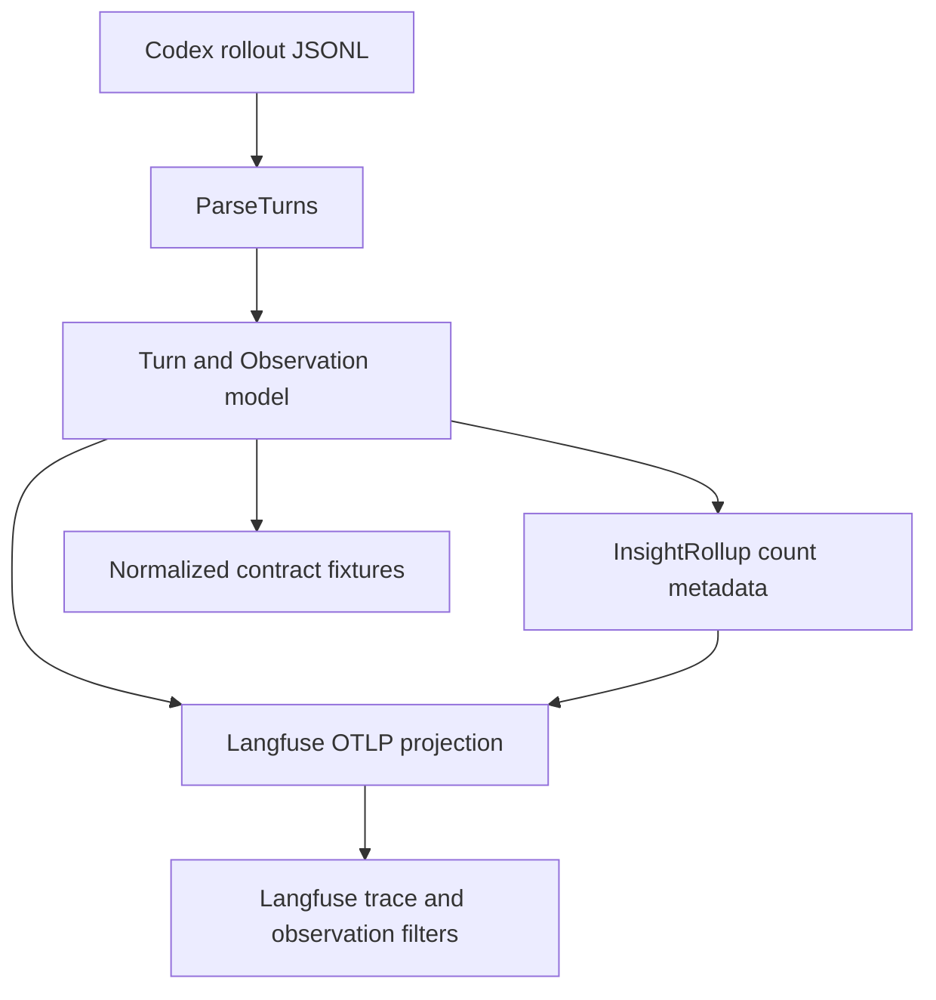

# Langfuse Filter and Cost Attribution Plan

## 1. Title and metadata

- Project name: Codex Langfuse Tracer
- Version: 2.0
- Owners: repository maintainer and implementation agent
- Date: 2026-05-01
- Document ID: CLT-LFC-PLAN-002
- Summary: This plan tightens Langfuse filter and cost attribution work to one maintainable path. The exporter will use first-class Langfuse model and usage fields for cost inference, count-based trace metadata for trace-table navigation, existing observation names and metadata for drill-down, first-class version/release and error level fields where they add direct filter value, and no local pricing fallback, dynamic tag scheme, duplicate boolean/count fields, or speculative tool-availability projection.

## 2. Design consensus and trade-offs

| Topic | Verdict | Rationale grounded in repository/context constraints |
|---|---|---|
| Cost tracking | DECISION | Emit `langfuse.observation.model.name` and existing `langfuse.observation.usage_details` on `codex.transcript`; let Langfuse infer cost from project model definitions. Current code already exports usage in `internal/langfuse/export.go` and parses `Turn.Model` in `internal/codextrace/parser.go`. |
| Local cost multiplication | AGAINST | Do not add a local price catalog or `cost_details`. The repository has no authoritative dated pricing source, and local multiplication would add drift, pricing policy, cached-token policy, and model-alias maintenance. |
| Trace navigation fields | DECISION | Use count fields as the single trace-navigation mechanism. Do not add duplicate `ran_*` booleans when `*_count > 0` answers the same question. |
| Tags | AGAINST | Do not add dynamic tags in this pass. Tags would duplicate trace metadata and trace name. One path is easier to maintain: trace metadata for turn-level navigation and observation filters for drill-down. |
| Tool filters | DECISION | Keep tool drill-down based on existing observation names such as `codex.tool.exec_command`, `codex.tool.apply_patch`, `codex.tool.web_search`, `codex.tool.mcp`, and `codex.tool.tool_search`. Do not add duplicate `tool_name` metadata. |
| Available tools | AGAINST | Do not project `available_tool_names` from `tool_search_output.tools`. That event records deferred tool search results, not the complete tool set available to the model invocation. |
| Version and release | FOR | Emit `langfuse.version` and `langfuse.release` from `buildinfo.Version`; these are first-class filters and do not duplicate existing metadata. |
| Error level | FOR | Emit `langfuse.observation.level=ERROR` only for failed command observations. This directly powers the Level filter and reuses existing `failure_type` classification. |
| User ID, prompt name, scores, comments, bookmarks | AGAINST | The rollout fixtures contain no explicit user ID or prompt-management data. Scores, comments, and bookmarks are review/evaluation workflow state, not ingestion facts. |

## 3. PRD / stakeholder and system needs

- Problem: Langfuse exposes useful filters, but the exporter currently leaves model/cost inference and some trace navigation fields underused. The previous plan overreached by adding duplicate booleans, tags, tool metadata aliases, future cost modes, and optional live checks.
- Users: Codex CLI users reviewing traces in Langfuse and maintainers keeping the tracer small.
- Value:
  - Cost columns can work through Langfuse model definitions.
  - Trace filters can find search/read/test/build/git/network/tool usage through one count-based metadata scheme.
  - Observation filters continue to find exact tool calls and command details without duplicate metadata.
- Business goals:
  - Improve Langfuse table usability with minimal code.
  - Keep one way to represent each fact.
  - Avoid pricing, tag, and fallback systems that are not required by current repo data.
- Success metrics:
  - `codex.transcript` spans contain model and usage when fixture data exists.
  - No span emits `langfuse.observation.cost_details`.
  - Trace metadata has command/tool count fields and no duplicate `ran_*` or `used_*` booleans.
  - Failed commands emit Langfuse error level.
  - `go test ./... -count=1` passes.
- Scope:
  - `internal/langfuse/export.go`
  - `internal/codextrace/insight.go`
  - `internal/langfuse/spans_test.go`
  - `internal/codextrace/insight_test.go`
  - `test/contract_fixture_test.go`
  - `testdata/golden/*.normalized.json`
  - `README.md`
- Non-goals:
  - No local pricing catalog.
  - No `cost_details`.
  - No dynamic tags.
  - No new parser branch for available tools.
  - No duplicated tool-name metadata.
  - No user ID, prompt name, scores, comments, or bookmarks.
- Dependencies:
  - Go module in `go.mod`.
  - Existing fixtures under `testdata/rollouts/`.
  - Existing golden contracts under `testdata/golden/`.
  - Existing in-memory exporter test helpers under `internal/langfuse`.
- Risks:
  - Langfuse cost remains empty until model definitions match `Turn.Model` values.
  - Metadata count filters may be less convenient than booleans, but they avoid duplicate state.
  - Command classification is heuristic and remains scoped to existing classifier behavior.
- Assumptions:
  - `codex.transcript` remains the generation observation.
  - `codex.tool.*` observation names remain the canonical tool identifiers.
  - Langfuse metadata filters can filter numeric count fields.

## 4. SRS / canonical requirements

### Functional requirements

- REQ-301 type func: The exporter shall emit `langfuse.observation.model.name` on `codex.transcript` when `Turn.Model` is non-empty. Acceptance: the complete-tools fixture emits `gpt-5.5` on the transcript span.
- REQ-302 type func: The exporter shall keep emitting `langfuse.observation.usage_details` on `codex.transcript` with existing token keys. Acceptance: the complete-tools fixture emits input, output, total, cached input, and reasoning output counts.
- REQ-303 type func: The exporter shall not emit `langfuse.observation.cost_details`. Acceptance: span tests reject `cost_details` on all spans.
- REQ-304 type func: Trace metadata shall use count fields as the only turn-level navigation representation for command and tool families. Acceptance: metadata includes `search_command_count`, `read_command_count`, `git_command_count`, `test_command_count`, `build_command_count`, `lint_command_count`, `format_command_count`, `install_command_count`, `systemd_command_count`, `network_command_count`, `other_command_count`, `exec_command_tool_count`, `apply_patch_tool_count`, `web_search_tool_count`, `mcp_tool_count`, and `tool_search_tool_count`.
- REQ-305 type func: Trace metadata shall not add duplicate boolean aliases for count fields. Acceptance: metadata omits keys matching `ran_*_command`, `used_*`, `has_file_changes`, and `is_read_only`.
- REQ-306 type func: Existing observation-level command and patch metadata shall remain unchanged. Acceptance: command observations still expose `command_kind`, `status`, `exit_code`, `duration_ms`, and `failure_type`; patch observations still expose changed-file metadata.
- REQ-307 type func: Failed command observations shall emit `langfuse.observation.level=ERROR` and a concise `langfuse.observation.status_message`. Acceptance: failed-command fixture marks only the failed command observation as error level.
- REQ-308 type func: Every exported span shall emit `langfuse.version` and `langfuse.release` from `buildinfo.Version`. Acceptance: memory-exported spans contain equal version and release values.
- REQ-309 type func: Documentation shall explain the one-way field policy: first-class model/usage for cost inference, count metadata for trace navigation, observation names/metadata for drill-down, and no local cost calculation.

### Non-functional requirements

- REQ-310 type reliability: Insight metadata shall be deterministic for identical parsed turns. Acceptance: repeated rollup calls produce byte-identical JSON.
- REQ-311 type security: Trace metadata shall not contain raw command output, patch diffs, hidden reasoning, secrets, CWD, user identity, or full changed-file lists. Acceptance: golden fixture checks reject those fields and existing secret sentinels.
- REQ-312 type maintainability: New implementation shall not introduce a second representation of the same fact. Acceptance: tests reject duplicate booleans and duplicate tool-name metadata.

### Interface/API requirements

- REQ-313 type int: OTLP export shall keep using `<LANGFUSE_HOST>/api/public/otel/v1/traces`, Basic auth, and `x-langfuse-ingestion-version: 4`. Acceptance: existing HTTP export tests still pass.
- REQ-314 type int: Langfuse field projection shall use existing direct attributes only: trace name, session ID, environment, trace input/output, observation type/input/output, observation model name, usage details, observation level/status message, version, and release. Acceptance: span tests assert these fields and reject unsupported new field families.

### Data requirements

- REQ-315 type data: Normalized contracts shall include the count-based trace metadata and exclude duplicate booleans, tags, local costs, and duplicated tool names. Acceptance: golden fixtures reflect the single representation.

### Error handling and telemetry expectations

- Missing model omits `langfuse.observation.model.name`.
- Missing token usage omits `usage_details`.
- Unknown command kinds continue to map to `other`.
- Unknown tool observation names are not specially normalized in this pass.
- Failed command level is derived from existing `failure_type`; successful commands do not get error level.

### Architecture diagram



```text
System: Codex Langfuse Tracer
  Parser: internal/codextrace/parser.go
    - Reads rollout JSONL into Turn and Observation values.
  Rollup: internal/codextrace/insight.go
    - Computes count metadata for trace navigation.
  Exporter: internal/langfuse/export.go
    - Projects canonical fields into Langfuse OTLP attributes.
  Contract: internal/tracecontract/contract.go
    - Normalizes semantic output for fixture tests.
```

## 5. Iterative implementation and test plan

### Phase strategy

- Keep implementation order source-to-sink: rollup counts, Langfuse projection, contracts/docs, final gate.
- Use existing tests and package commands only.
- Add git restore tags before and after each phase:
  - `git tag -f restore/langfuse-filter-cost-Pxx-start`
  - `git tag -f restore/langfuse-filter-cost-Pxx-done`
- Every changed Go test file must include grep-able comments such as `// TEST-301` or `// EVAL-301`.
- Compute controls:
  - branch_limits: maximum 1 implementation concern per phase.
  - reflection_passes: 1 before each done tag.
  - early_stop%: 95; stop a phase once focused tests, package tests, and measure command pass.

### Risk register

| Risk | Trigger | Mitigation |
|---|---|---|
| Cost column remains empty | Langfuse model definitions do not match Codex model names | Document that pricing belongs in Langfuse model definitions; do not add exporter fallback. |
| Metadata grows again | New booleans or arrays duplicate count fields | Tests reject duplicate boolean aliases. |
| Observation filters regress | Command metadata changes while adding level fields | Tests assert current command metadata remains. |
| Plan scope expands | Tags or tool-name aliases return | Keep tags and duplicate aliases explicit non-goals. |

### Suspension/resumption criteria

- Suspend if a RED test requires a new runtime feature outside listed scope.
- Suspend if a change requires local pricing data.
- Resume from the latest restore tag and re-run the phase command.

### Phase P00: Model, Usage, and No Local Cost

- Scope and objectives: Add first-class transcript model projection, preserve token usage projection, and explicitly reject local cost details. Impacted requirements: REQ-301, REQ-302, REQ-303, REQ-314.
- Step 1 RED: create/update TEST-301 in `internal/langfuse/spans_test.go` for REQ-301, REQ-302, REQ-303, and REQ-314; run `go test ./internal/langfuse -run 'TestLangfuseGenerationModelUsageAndNoCostDetails' -count=1`; expected FAIL because the transcript lacks `langfuse.observation.model.name`.
- Step 2 GREEN: implement minimal transcript attribute changes in `internal/langfuse/export.go`; run `go test ./internal/langfuse -run 'TestLangfuseGenerationModelUsageAndNoCostDetails' -count=1`; expected PASS.
- Step 3 REFACTOR: keep model and usage projection in the existing transcript attribute function; run `go test ./internal/langfuse -count=1`; expected PASS.
- Step 4 MEASURE: run EVAL-301 with `go test ./internal/langfuse -run 'TestEvalInsightMetadataProjection' -count=3 -parallel 8`; expected PASS.
- Exit gates:
  - Green criteria: transcript model and usage are present for complete-tools fixture.
  - Yellow criteria: fixtures without model omit model field.
  - Red criteria: any span emits `cost_details`.
- Phase metrics:
  - Confidence %: 92; direct span assertions cover the behavior.
  - Long-term robustness %: 90; no pricing fallback to maintain.
  - Internal interactions: 2; exporter and span tests.
  - External interactions: 1; Langfuse model/cost inference.
  - Complexity %: 12; small projection change.
  - Feature creep %: 4; no new cost system.
  - Technical debt %: 5; no parallel representation added.
  - YAGNI score: 96.
  - MoSCoW: Must.
  - Local/non-local scope: Local.
  - Architectural changes count: 0.

### Phase P01: One Count-Based Trace Metadata Scheme

- Scope and objectives: Add command and tool family counts as the single trace navigation representation. Impacted requirements: REQ-304, REQ-305, REQ-306, REQ-310, REQ-311, REQ-312.
- Step 1 RED: create/update TEST-302 in `internal/codextrace/insight_test.go` for REQ-304, REQ-305, REQ-306, REQ-310, REQ-311, and REQ-312; run `go test ./internal/codextrace -run 'TestInsightCountMetadataSingleRepresentation|TestInsightRollup' -count=1`; expected FAIL because family counts are missing.
- Step 2 GREEN: implement count fields in `internal/codextrace/insight.go` using one helper for sorted command/tool families; run `go test ./internal/codextrace -run 'TestInsightCountMetadataSingleRepresentation|TestInsightRollup' -count=1`; expected PASS.
- Step 3 REFACTOR: remove any duplicated count construction and keep existing command classifier as the only classifier; run `go test ./internal/codextrace -count=1`; expected PASS.
- Step 4 MEASURE: run EVAL-302 with `go test ./internal/codextrace -run 'TestEvalInsightRollupLatency' -count=3 -parallel 8`; expected PASS with the existing threshold.
- Exit gates:
  - Green criteria: metadata contains count fields and current rollup fields.
  - Yellow criteria: unknown commands increment `other_command_count`.
  - Red criteria: metadata contains duplicate `ran_*`, `used_*`, `has_file_changes`, or `is_read_only` keys.
- Phase metrics:
  - Confidence %: 88; fixture and synthetic tests cover the metadata contract.
  - Long-term robustness %: 91; one representation avoids drift.
  - Internal interactions: 3; observations, rollup, tests.
  - External interactions: 1; Langfuse metadata filters.
  - Complexity %: 24; shared helper handles count families.
  - Feature creep %: 6; no tags or aliases.
  - Technical debt %: 8; classifier remains existing heuristic.
  - YAGNI score: 90.
  - MoSCoW: Must.
  - Local/non-local scope: Local.
  - Architectural changes count: 1.

### Phase P02: Version, Release, Error Level, and Contracts

- Scope and objectives: Add first-class version/release and failed-command level projection, then update normalized contracts and docs. Impacted requirements: REQ-307, REQ-308, REQ-309, REQ-313, REQ-314, REQ-315.
- Step 1 RED: create/update TEST-303 in `internal/langfuse/spans_test.go` and TEST-304 in `test/contract_fixture_test.go` for REQ-307, REQ-308, REQ-309, REQ-313, REQ-314, and REQ-315; run `go test ./internal/langfuse ./test -run 'TestLangfuseVersionReleaseAndFailedCommandLevel|TestGoldenLangfuseSingleRepresentation' -count=1`; expected FAIL because version/release, error level, and golden count metadata are incomplete.
- Step 2 GREEN: implement minimal projection in `internal/langfuse/export.go`, update golden fixtures, and update `README.md`; run `go test ./internal/langfuse ./test -run 'TestLangfuseVersionReleaseAndFailedCommandLevel|TestGoldenLangfuseSingleRepresentation' -count=1`; expected PASS.
- Step 3 REFACTOR: consolidate repeated test attribute assertions in existing test helpers; run `go test ./internal/langfuse ./test -count=1`; expected PASS.
- Step 4 MEASURE: run EVAL-303 with `go test ./test -run 'TestEvalInsightFixtureCoverage|TestEvalGoldenFixtureCoverage' -count=3 -parallel 8`; expected PASS.
- Exit gates:
  - Green criteria: failed command level, version/release, docs, and golden fixtures pass.
  - Yellow criteria: successful commands omit error level.
  - Red criteria: tags, cost details, duplicate booleans, or duplicated tool-name metadata appear.
- Phase metrics:
  - Confidence %: 90; span and golden tests cover projection and contract.
  - Long-term robustness %: 88; first-class fields are centralized.
  - Internal interactions: 4; exporter, fixtures, docs, tests.
  - External interactions: 1; Langfuse first-class filters.
  - Complexity %: 20; no new parser logic.
  - Feature creep %: 5; no optional live workflow.
  - Technical debt %: 7; docs match implementation.
  - YAGNI score: 92.
  - MoSCoW: Must.
  - Local/non-local scope: Local.
  - Architectural changes count: 0.

### Phase P03: Final Gate

- Scope and objectives: Validate the full repository and diff quality. Impacted requirements: REQ-301 through REQ-315.
- Step 1 RED: create/update TEST-305 in `test/full_acceptance_test.go` for REQ-301 through REQ-315; run `go test ./... -count=1`; expected FAIL until full acceptance covers the new single-representation contract.
- Step 2 GREEN: implement minimal acceptance fixes; run `go test ./... -count=1`; expected PASS.
- Step 3 REFACTOR: remove local duplication introduced during implementation; run `go test ./... -count=1`; expected PASS.
- Step 4 MEASURE: run EVAL-304 with `git diff --check`; expected PASS.
- Exit gates:
  - Green criteria: full test suite and diff quality pass.
  - Yellow criteria: live Langfuse cost inference is not exercised by required tests.
  - Red criteria: any required test fails.
- Phase metrics:
  - Confidence %: 94; full repository tests cover cross-package drift.
  - Long-term robustness %: 90; final refactor removes duplication.
  - Internal interactions: 6; all packages.
  - External interactions: 0; local validation only.
  - Complexity %: 12; validation-focused.
  - Feature creep %: 2.
  - Technical debt %: 4.
  - YAGNI score: 96.
  - MoSCoW: Must.
  - Local/non-local scope: Local.
  - Architectural changes count: 0.

## 6. Evaluations

```yaml
evaluations:
  - id: EVAL-301
    purpose: dev
    metrics:
      - generation_projection_pass_rate
      - false_cost_details_count
    thresholds:
      generation_projection_pass_rate: 1.0
      false_cost_details_count: 0
    seeds:
      - testdata/rollouts/complete-tools.jsonl
    runtime_budget: 20s
    command: "go test ./internal/langfuse -run 'TestEvalInsightMetadataProjection' -count=3 -parallel 8"
  - id: EVAL-302
    purpose: dev
    metrics:
      - rollup_latency_pass_rate
      - duplicate_metadata_field_count
    thresholds:
      rollup_latency_pass_rate: 1.0
      duplicate_metadata_field_count: 0
    seeds:
      - testdata/rollouts/complete-tools.jsonl
    runtime_budget: 20s
    command: "go test ./internal/codextrace -run 'TestEvalInsightRollupLatency' -count=3 -parallel 8"
  - id: EVAL-303
    purpose: holdout
    metrics:
      - fixture_schema_pass_rate
      - forbidden_payload_pass_rate
    thresholds:
      fixture_schema_pass_rate: 1.0
      forbidden_payload_pass_rate: 1.0
    seeds:
      - testdata/manifest.json
    runtime_budget: 60s
    command: "go test ./test -run 'TestEvalInsightFixtureCoverage|TestEvalGoldenFixtureCoverage' -count=3 -parallel 8"
  - id: EVAL-304
    purpose: adversarial
    metrics:
      - diff_quality_findings
    thresholds:
      diff_quality_findings: 0
    seeds:
      - git diff
    runtime_budget: 10s
    command: "git diff --check"
```

## 7. Tests

### 7.1 Test inventory

- Test framework: Go `testing`.
- Existing commands:
  - `go test ./internal/langfuse -count=1`
  - `go test ./internal/codextrace -count=1`
  - `go test ./internal/langfuse ./test -count=1`
  - `go test ./... -count=1`
  - `git diff --check`
- Test locations:
  - `internal/**/*_test.go`
  - `cmd/**/*_test.go`
  - `test/**/*_test.go`
  - `testdata/rollouts/*.jsonl`
  - `testdata/golden/*.normalized.json`

### 7.2 Test suites overview

| name | purpose | runner | command | runtime budget | when it runs |
|---|---|---|---|---:|---|
| Unit | Parser, rollup, and projection checks | Go testing | `go test ./internal/codextrace ./internal/langfuse -count=1` | 60s | pre-commit |
| Contract | Golden fixture and docs contract | Go testing | `go test ./test -count=1` | 90s | pre-commit |
| Full | All packages | Go testing | `go test ./... -count=1` | 180s | CI |
| Static | Diff whitespace and conflict markers | Git | `git diff --check` | 10s | pre-commit |

### 7.3 Test definitions

- id: TEST-301
  - name: Generation model, usage, and no cost details
  - type: unit
  - verifies: REQ-301, REQ-302, REQ-303, REQ-314
  - location: `internal/langfuse/spans_test.go`
  - command: `go test ./internal/langfuse -run 'TestLangfuseGenerationModelUsageAndNoCostDetails' -count=1`
  - fixtures/mocks/data: `testdata/rollouts/complete-tools.jsonl`, `memoryExporter`
  - deterministic controls: fixed fixture and in-memory spans
  - pass_criteria: transcript has model and usage; no span has `cost_details`
  - expected_runtime: 10s
- id: TEST-302
  - name: Count metadata single representation
  - type: unit
  - verifies: REQ-304, REQ-305, REQ-306, REQ-310, REQ-311, REQ-312
  - location: `internal/codextrace/insight_test.go`
  - command: `go test ./internal/codextrace -run 'TestInsightCountMetadataSingleRepresentation|TestInsightRollup' -count=1`
  - fixtures/mocks/data: `testdata/rollouts/complete-tools.jsonl` plus synthetic observations
  - deterministic controls: fixed observation inputs and sorted metadata keys
  - pass_criteria: expected count fields exist; duplicate boolean aliases and raw root details are absent
  - expected_runtime: 10s
- id: TEST-303
  - name: Version, release, and failed command level
  - type: unit
  - verifies: REQ-307, REQ-308, REQ-313, REQ-314
  - location: `internal/langfuse/spans_test.go`
  - command: `go test ./internal/langfuse ./test -run 'TestLangfuseVersionReleaseAndFailedCommandLevel|TestGoldenLangfuseSingleRepresentation' -count=1`
  - fixtures/mocks/data: `testdata/rollouts/failed-command.jsonl`, `memoryExporter`
  - deterministic controls: fixed fixture and `buildinfo.Version`
  - pass_criteria: spans carry version/release; failed command has error level and status message
  - expected_runtime: 20s
- id: TEST-304
  - name: Golden single representation contract
  - type: integration
  - verifies: REQ-309, REQ-315
  - location: `test/contract_fixture_test.go`
  - command: `go test ./internal/langfuse ./test -run 'TestLangfuseVersionReleaseAndFailedCommandLevel|TestGoldenLangfuseSingleRepresentation' -count=1`
  - fixtures/mocks/data: `testdata/golden/*.normalized.json`
  - deterministic controls: committed fixtures only
  - pass_criteria: golden fixtures include count metadata and omit duplicate booleans, tags, local costs, and duplicated tool-name metadata
  - expected_runtime: 30s
- id: TEST-305
  - name: Full repository validation
  - type: e2e
  - verifies: REQ-301, REQ-302, REQ-303, REQ-304, REQ-305, REQ-306, REQ-307, REQ-308, REQ-309, REQ-310, REQ-311, REQ-312, REQ-313, REQ-314, REQ-315
  - location: `test/full_acceptance_test.go`
  - command: `go test ./... -count=1`
  - fixtures/mocks/data: all committed tests and fixtures
  - deterministic controls: no live Langfuse dependency
  - pass_criteria: all packages pass
  - expected_runtime: 180s

### 7.4 Manual checks, optional

- No manual checks are part of this plan.

## 8. Data contract

### Schema snapshot

```yaml
trace_metadata:
  tool_count: integer
  command_count: integer
  failed_command_count: integer
  patch_count: integer
  changed_file_count: integer
  verification_command_count: integer
  verification_status: string
  last_verification_command: string
  last_verification_status: string
  changed_extensions: [string]
  touched_test_files: [string]
  search_command_count: integer
  read_command_count: integer
  git_command_count: integer
  test_command_count: integer
  build_command_count: integer
  lint_command_count: integer
  format_command_count: integer
  install_command_count: integer
  systemd_command_count: integer
  network_command_count: integer
  other_command_count: integer
  exec_command_tool_count: integer
  apply_patch_tool_count: integer
  web_search_tool_count: integer
  mcp_tool_count: integer
  tool_search_tool_count: integer
generation_observation:
  name: codex.transcript
  type: generation
  model_name: string
  usage_details:
    input: integer
    output: integer
    total: integer
    cached_input: integer
    reasoning_output: integer
command_observation:
  name: codex.tool.exec_command
  type: tool
  metadata:
    command_kind: string
    status: string
    exit_code: integer
    duration_ms: integer
    failure_type: string
```

### Invariants

- Count fields are the only trace-navigation representation for command and tool families.
- No `ran_*`, `used_*`, `has_file_changes`, or `is_read_only` metadata aliases.
- No dynamic tags.
- No local cost fields.
- Tool observation names are canonical; no duplicate `tool_name` metadata.
- Full changed-file lists remain only on patch observations.

### Privacy/data quality constraints

- Do not emit local user identity.
- Do not put CWD, command text, command output, patch diffs, hidden reasoning, or full changed-file lists in trace metadata.
- Continue existing secret redaction and fixture checks.

## 9. Reproducibility

- Seeds:
  - `testdata/rollouts/complete-tools.jsonl`
  - `testdata/rollouts/failed-command.jsonl`
  - `testdata/manifest.json`
- Hardware assumptions:
  - Linux workstation capable of Go tests.
- OS/driver/container tag:
  - `linux-amd64-go1.26.0`
- Relevant environment variables:
  - Required tests do not depend on live Langfuse credentials.

## 10. Requirements Traceability Matrix

| Phase | REQ-### | TEST-### | Test Path | Command |
|---|---|---|---|---|
| P00 | REQ-301 | TEST-301 | `internal/langfuse/spans_test.go` | `go test ./internal/langfuse -run 'TestLangfuseGenerationModelUsageAndNoCostDetails' -count=1` |
| P00 | REQ-302 | TEST-301 | `internal/langfuse/spans_test.go` | `go test ./internal/langfuse -run 'TestLangfuseGenerationModelUsageAndNoCostDetails' -count=1` |
| P00 | REQ-303 | TEST-301 | `internal/langfuse/spans_test.go` | `go test ./internal/langfuse -run 'TestLangfuseGenerationModelUsageAndNoCostDetails' -count=1` |
| P01 | REQ-304 | TEST-302 | `internal/codextrace/insight_test.go` | `go test ./internal/codextrace -run 'TestInsightCountMetadataSingleRepresentation|TestInsightRollup' -count=1` |
| P01 | REQ-305 | TEST-302 | `internal/codextrace/insight_test.go` | `go test ./internal/codextrace -run 'TestInsightCountMetadataSingleRepresentation|TestInsightRollup' -count=1` |
| P01 | REQ-306 | TEST-302 | `internal/codextrace/insight_test.go` | `go test ./internal/codextrace -run 'TestInsightCountMetadataSingleRepresentation|TestInsightRollup' -count=1` |
| P02 | REQ-307 | TEST-303 | `internal/langfuse/spans_test.go` | `go test ./internal/langfuse ./test -run 'TestLangfuseVersionReleaseAndFailedCommandLevel|TestGoldenLangfuseSingleRepresentation' -count=1` |
| P02 | REQ-308 | TEST-303 | `internal/langfuse/spans_test.go` | `go test ./internal/langfuse ./test -run 'TestLangfuseVersionReleaseAndFailedCommandLevel|TestGoldenLangfuseSingleRepresentation' -count=1` |
| P02 | REQ-309 | TEST-304 | `test/contract_fixture_test.go` | `go test ./internal/langfuse ./test -run 'TestLangfuseVersionReleaseAndFailedCommandLevel|TestGoldenLangfuseSingleRepresentation' -count=1` |
| P01 | REQ-310 | TEST-302 | `internal/codextrace/insight_test.go` | `go test ./internal/codextrace -run 'TestInsightCountMetadataSingleRepresentation|TestInsightRollup' -count=1` |
| P01 | REQ-311 | TEST-302 | `internal/codextrace/insight_test.go` | `go test ./internal/codextrace -run 'TestInsightCountMetadataSingleRepresentation|TestInsightRollup' -count=1` |
| P01 | REQ-312 | TEST-302 | `internal/codextrace/insight_test.go` | `go test ./internal/codextrace -run 'TestInsightCountMetadataSingleRepresentation|TestInsightRollup' -count=1` |
| P02 | REQ-313 | TEST-303 | `internal/langfuse/spans_test.go` | `go test ./internal/langfuse ./test -run 'TestLangfuseVersionReleaseAndFailedCommandLevel|TestGoldenLangfuseSingleRepresentation' -count=1` |
| P00 | REQ-314 | TEST-301 | `internal/langfuse/spans_test.go` | `go test ./internal/langfuse -run 'TestLangfuseGenerationModelUsageAndNoCostDetails' -count=1` |
| P02 | REQ-315 | TEST-304 | `test/contract_fixture_test.go` | `go test ./internal/langfuse ./test -run 'TestLangfuseVersionReleaseAndFailedCommandLevel|TestGoldenLangfuseSingleRepresentation' -count=1` |

## 11. Execution log template

### Phase Status: Pending/Done

- Phase:
- Completed Steps:
  - RED:
  - GREEN:
  - REFACTOR:
  - MEASURE:
- Quantitative Results: metrics mean +/- std, 95% CI
  - Metric:
  - Mean:
  - Std:
  - 95% CI:
- Issues/Resolutions:
  - Issue:
  - Resolution:
- Failed Attempts:
  - Attempt:
  - Cause:
  - Result:
- Deviations:
  - Deviation:
  - Reason:
  - Approval/ADR:
- Lessons Learned:
  - Lesson:
- ADR Updates:
  - ADR:
  - Decision:

## 12. Appendix: ADR index

- ADR-001: Do not compute costs locally; emit model and usage so Langfuse model definitions own pricing.
- ADR-002: Use count metadata as the single turn-level navigation representation.
- ADR-003: Do not add dynamic tags or duplicate tool-name metadata in this pass.
- ADR-004: Any future local pricing catalog requires a separate ADR and tests before implementation.

## 13. Consistency check

- All REQs appear in the RTM.
- All TEST IDs referenced in phases, evals, or RTM are defined in Section 7.3.
- Every phase has RED, GREEN, REFACTOR, and MEASURE steps.
- Every phase has populated metrics.
- Every verification step includes a TEST-### or EVAL-### plus an exact command.
- The plan has one representation per fact: model/usage for cost inference, counts for trace navigation, observation names/metadata for drill-down.
- The plan excludes local cost fallback, dynamic tags, duplicate booleans, duplicated tool-name metadata, and speculative available-tool projection.
