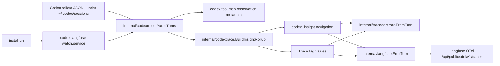

# Langfuse Tags and MCP Usage Plan

## 1. Title and Metadata

- Project name: Codex Langfuse Tracer
- Version: 1.0
- Owners: repository maintainers for `/home/kirill/p/codex-langfuse-tracer`
- Date: 2026-05-01
- Document ID: CLT-TAGS-MCP-SRS-TEST-PLAN-001
- Summary: This plan adds deterministic low-cardinality Langfuse trace tags and observed MCP server usage to the existing Go exporter. The implementation keeps the current installed watcher path, keeps `codex_insight.navigation` as the canonical trace filter index, adds exact MCP server/tool metadata to `codex.tool.mcp` observations, derives trace tags as the existing navigation values plus observed MCP server tags, and avoids tags for configured-but-unused MCPs or high-cardinality exact MCP tool names.

## 2. Design Consensus and Trade-Offs

| Topic | Verdict | Rationale |
| --- | --- | --- |
| Tags vs metadata | DECISION | Keep `codex_insight.navigation` in `internal/codextrace/insight.go` as the complete trace-table filter index. Add tags as the same navigation values plus observed MCP server tags, because Langfuse exposes tags directly in trace filtering while metadata remains more structured. |
| One canonical derivation path | DECISION | Generate tags from the same rollup data that feeds `navigation`; do not add independent tag parsing or a curated tag subset in `internal/langfuse/export.go`. This matches the repository preference for one way of doing things and prevents drift between metadata filters and tag filters. |
| Command tag scope | DECISION | Emit command tags for every observed `command_kind` enum value already produced by `CommandInsightMetadata` and counted by `BuildInsightRollup`. A selected subset such as only `search`, `network`, and `install` would create a second taxonomy. |
| Observed MCPs vs configured MCPs | DECISION | Tag only MCP servers observed in a trace through `mcp_tool_call_end` events parsed by `internal/codextrace/parser.go`. Configured-but-unused MCPs describe availability, not behavior, and would make trace tags misleading. |
| Exact MCP tool tags | AGAINST | Do not emit tags such as `mcp:github:issues/list`. Exact tool names are useful drill-down data and belong on `codex.tool.mcp` observation metadata as `mcp_tool`; tags remain low-cardinality trace buckets. |
| MCP server tags | DECISION | Emit `mcp:<server>` for every non-empty MCP server observed in the trace. This is more maintainable than a static MCP server list and keeps one rule for built-in, plugin, and user-defined MCP servers. |
| Install behavior | DECISION | Do not add an installer mode or separate MCP watcher. `install.sh` already builds `~/.codex/bin/codex-langfuse-exporter` and restarts `codex-langfuse-watch.service`; new exports produced by `--watch` receive tags automatically after installation. |
| Backfill behavior | AGAINST | Do not add automatic Langfuse backfill in this change. Existing manual export modes in `cmd/codex-langfuse-exporter/main.go` already support `--path`, `--session-id`, and `--latest`; old traces can be re-exported explicitly when needed. |
| Tag attribute API | DECISION | Emit OpenTelemetry attribute `langfuse.trace.tags` from the root `codex.agent` span and child spans using one shared tag slice. The repository already uses Langfuse OTel attributes in `internal/langfuse/export.go`; Langfuse documents tags as trace/observation filters and maps `langfuse.trace.tags` to trace tags: https://langfuse.com/docs/observability/features/tags and https://langfuse.com/integrations/native/opentelemetry. Child spans must not repeat `codex_insight` metadata. |

## 3. PRD / Stakeholder and System Needs

- Problem: Trace saved views are useful for metadata filtering, but tags are faster for humans to scan and filter in Langfuse. The current exporter does not emit tags and does not expose MCP server/tool names as structured observation metadata.
- Users: Codex CLI users who inspect traces in local or hosted Langfuse; maintainers debugging tool-heavy sessions; operators comparing traces by file-change, verification, command, web-search, and MCP-server usage.
- Value: Users can filter traces by visible tags such as `files:changed`, `tool:mcp`, and `mcp:github` without typing metadata paths, while detailed MCP tool calls stay queryable on observations.
- Business goals:
  - Reduce trace navigation friction in Langfuse.
  - Preserve the current install-once watcher experience.
  - Keep telemetry compact, deterministic, and low-cardinality.
  - Avoid another taxonomy, translation layer, or compatibility branch.
- Success metrics:
  - 100% of new `TEST-###` tests pass locally.
  - `go test ./... -count=1` passes.
  - `git diff --check` passes.
  - All emitted tags are sorted, unique, and derived from `codex_insight.navigation` values plus observed `mcp:<server>` values.
  - `codex.tool.mcp` observations include `mcp_server` and `mcp_tool` when rollout invocation data is present.
- Scope:
  - Parser metadata for MCP observations.
  - Rollup support for observed MCP server facets.
  - Trace tags derived from canonical rollup data.
  - Normalized contract and golden fixture coverage.
  - Langfuse OTel projection tests.
  - Documentation for the navigation-derived tag rule, observed MCP server tag rule, install behavior, and backfill behavior.
- Non-goals:
  - No new CLI flags.
  - No new configuration file format.
  - No automatic backfill of existing Langfuse traces.
  - No tags for exact MCP tools.
  - No tags for available-but-unused MCPs.
  - No tags for session IDs, cwd, file paths, user prompts, outputs, or secrets.
- Dependencies:
  - Go module in `go.mod`.
  - Existing parser and rollup code in `internal/codextrace`.
  - Existing OTel exporter code in `internal/langfuse/export.go`.
  - Existing normalized fixture corpus under `testdata/rollouts` and `testdata/golden`.
  - Existing `install.sh` and `systemd/codex-langfuse-watch.service` install path.
  - Langfuse OTel tag mapping for `langfuse.trace.tags`.
- Risks:
  - Langfuse tag attribute serialization may differ from local span snapshot expectations.
  - Tag clutter can grow if MCP server names are treated like exact tool names or per-call values.
  - Contract tests can miss live Langfuse behavior if only in-memory OTel spans are tested.
  - Re-exported fixture traces can retain stale metadata in a local Langfuse instance when trace IDs are reused.
- Assumptions:
  - Codex rollout files continue to record MCP usage as `mcp_tool_call_end` events with `payload.invocation.server` and `payload.invocation.tool`.
  - `codex.tool.mcp` remains the observation name for MCP calls.
  - The installed watcher exports future completed turns after `install.sh` restarts the service.
  - The tag set should stay small enough for the Langfuse tag filter UI to remain useful because navigation values are bounded by existing file-state, verification-status, command-kind, and tool-family enums.

## 4. SRS / Canonical Requirements

### Functional Requirements

- REQ-401 type func: The parser shall add `mcp_server` and `mcp_tool` metadata to each `codex.tool.mcp` observation when `mcp_tool_call_end.payload.invocation.server` and `.tool` are present. Acceptance: `testdata/rollouts/complete-tools.jsonl` produces `mcp_server=github` and `mcp_tool=issues/list` in the MCP observation.
- REQ-402 type func: The trace rollup shall derive MCP server facets only from observed `codex.tool.mcp` observations. Acceptance: a turn with one GitHub MCP observation contains `mcp:github`; a turn without MCP observations contains no `mcp:*` facets.
- REQ-403 type func: The exporter shall support trace tags for every value emitted by `InsightRollup.navigationValues()` plus one `mcp:<server>` tag for each non-empty observed MCP server. Acceptance: tag derivation includes observed command tags for all `command_kind` enum values when present, includes observed tool-family tags when present, and omits exact MCP tool names.
- REQ-404 type func: Tags shall be derived from the same rollup data used by `codex_insight.navigation`. Acceptance: no duplicate parser or exporter branch recomputes file state, command family, web search, or MCP server facts.
- REQ-405 type func: Normalized trace contracts shall include tags so fixture drift is visible in `testdata/golden/*.normalized.json`. Acceptance: `tracecontract.Trace` has a deterministic `tags` field for exportable traces.
- REQ-406 type func: Langfuse OTel export shall attach trace tags to `codex.agent` and child spans using `langfuse.trace.tags`. Acceptance: the in-memory span snapshot for `codex.agent` and at least one child span contains the same expected tag attribute, and child observations do not repeat `langfuse.trace.metadata.codex_insight.*` metadata.
- REQ-407 type func: The installed watcher shall apply tags to future exports without an additional watcher process. Acceptance: `install.sh` still installs and restarts `codex-langfuse-watch.service`, and docs state that future `--watch` exports receive tags after installation.
- REQ-408 type func: Exact MCP tool names shall not become trace tags. Acceptance: `mcp_tool=issues/list` appears in observation metadata and no tag contains `issues/list`.
- REQ-409 type func: Configured-but-unused MCPs shall not become trace tags. Acceptance: a fixture with no MCP observation has no `tool:mcp` or `mcp:*` tags.
- REQ-410 type func: Documentation shall describe the navigation-derived tag rule, observed MCP server tag rule, MCP observation metadata fields, install behavior, and explicit backfill behavior. Acceptance: `README.md` and `TESTING.md` describe the tags and existing commands.

### Non-Functional Requirements

- REQ-411 type nfr: Tags shall be sorted, unique, deterministic, and lowercase. Acceptance: repeated rollup calls return identical canonical JSON and tag ordering.
- REQ-412 type security: Tags shall not contain prompts, command output, file paths, cwd, session IDs, trace IDs, secrets, or exact MCP tool names. Acceptance: fixture tests reject forbidden substrings and high-cardinality fields in tags.
- REQ-413 type perf: Tag derivation shall remain linear in the number of observations and shall not add measurable latency to normal rollup. Acceptance: 100 rollups over the complete fixture complete within 10ms on the local development machine, matching the current `TestEvalInsightRollupLatency` threshold.
- REQ-414 type reliability: Missing MCP invocation fields shall not fail parsing. Acceptance: missing `server` or `tool` fields omit the corresponding metadata and tag while preserving the MCP observation.

### Interface/API Requirements

- REQ-415 type int: The CLI interface shall remain unchanged. Acceptance: `cmd/codex-langfuse-exporter/cli_test.go` still accepts the same source modes and rejects mutually exclusive source modes.
- REQ-416 type int: Langfuse tag export shall use the OTel attribute key `langfuse.trace.tags` in `internal/langfuse/export.go`. Acceptance: span tests inspect that exact key on `codex.agent` and child spans.
- REQ-417 type int: The install interface shall remain `./install.sh`, which builds `~/.codex/bin/codex-langfuse-exporter`, installs `codex-langfuse-watch.service`, reloads systemd, enables the service, and restarts it. Acceptance: installer tests continue to validate the same service name and installed binary path.

### Data Requirements

- REQ-418 type data: `codex.tool.mcp` metadata shall include compact scalar strings only: `mcp_server` and `mcp_tool`. Acceptance: raw `invocation`, raw `result`, and raw `duration` remain omitted from MCP observation metadata.
- REQ-419 type data: Trace tags shall be represented as a deterministic string array in the normalized contract and as an OTel string-slice attribute in Langfuse export. Acceptance: golden JSON and span snapshots agree on tag values.
- REQ-420 type data: User-defined MCP servers shall follow the same observed-server tag rule as built-in MCP servers. Acceptance: a test fixture with `server=private-test-server` contains `mcp_server=private-test-server` and `mcp:private-test-server`.

### Error Handling and Telemetry Expectations

- Parser behavior: Missing or malformed MCP invocation fields produce no parser error; the observation is still emitted with existing metadata such as `call_id` and `type`.
- Export behavior: An empty tag list shall omit `langfuse.trace.tags`; it shall not emit an empty string or metadata key named `tags`.
- Privacy behavior: Tag derivation shall use only low-cardinality categorical facts from the rollup: navigation values and observed MCP server identifiers.
- Telemetry behavior: Trace tags are trace navigation data emitted through `langfuse.trace.tags`; exact MCP call details remain observation-level metadata.

### Architecture Diagram



```text
System: Codex Langfuse Tracer

  [Codex CLI]
      writes rollout JSONL
          |
          v
  [Watcher: codex-langfuse-exporter --watch]
      internal/watch scans completed turns
          |
          v
  [Parser: internal/codextrace]
      creates codex.tool.mcp observations with mcp_server/mcp_tool
          |
          v
  [Rollup: BuildInsightRollup]
      one source for navigation facets and tag values
          |
          +--> [Trace contract: internal/tracecontract] -> testdata/golden
          |
          +--> [Langfuse exporter: internal/langfuse] -> langfuse.trace.tags
```

## 5. Iterative Implementation and Test Plan

### Phase Strategy

- P00 adds MCP observation metadata without changing trace tags.
- P01 adds canonical tag derivation and MCP server rollup data.
- P02 adds normalized contract and golden fixture coverage.
- P03 adds Langfuse OTel tag export.
- P04 updates docs and install behavior documentation.
- P05 runs full acceptance and release-gate validation.

Compute controls:

- branch_limits: 1 primary implementation path per phase, 1 rejected alternative recorded in ADRs when encountered.
- reflection_passes: 2 per phase, before GREEN implementation and before phase exit.
- early_stop%: 100% for required tests in the active phase; 95% confidence threshold for moving from focused suites to full suite.

Risk register:

| Risk | Trigger | Mitigation |
| --- | --- | --- |
| Tag schema drift | `navigation` and tags disagree in tests | Derive both from one rollup helper and test both from the same fixture. |
| Tag clutter | Exact MCP tools or per-call values become tags | Keep exact MCP tools in observation metadata and tag only the observed MCP server name. |
| Privacy leak | Prompt/output/file path appears in tags | Add fixture assertions rejecting path-like, secret-like, and exact MCP tool substrings in tags. |
| Langfuse mapping mismatch | In-memory tags pass but live Langfuse does not show tags | Keep the OTel attribute key isolated in one exporter helper; validate through local Langfuse after implementation when credentials are available. |
| Backfill confusion | Existing rows do not show new tags | Document that `install.sh` applies to future exports and that old rows need explicit re-export. |

Suspension criteria:

- Suspend the active phase if adding tags requires a second watcher, a new CLI mode, or a new configuration file.
- Suspend the active phase if Langfuse rejects `langfuse.trace.tags` in local OTel export.
- Suspend the active phase if a test requires fixture secrets, live private data, or non-deterministic timestamps.

Resumption criteria:

- Resume when the design returns to one installed watcher path and one rollup-derived tag path.
- Resume when a failing Langfuse mapping has a minimal reproducible test in `internal/langfuse`.
- Resume when fixture data is synthetic and deterministic.

### Phase P00: MCP Observation Metadata

Scope and objectives: Add exact MCP server/tool metadata to `codex.tool.mcp` observations. Impacted requirements: REQ-401, REQ-414, REQ-418.

Steps:

- Step 0 RESTORE POINT: run `git tag -f restore/langfuse-tags-mcp-P00-start`.
- Step 1 RED: create/update `TEST-401` in `internal/codextrace/tools_test.go` for `REQ-401`, `REQ-414`, and `REQ-418`; run `go test ./internal/codextrace -run TestMCPObservationMetadata -count=1`; expected FAIL because `codex.tool.mcp` metadata currently omits `mcp_server` and `mcp_tool`.
- Step 2 GREEN: implement minimal MCP metadata extraction in `internal/codextrace/parser.go`; run `go test ./internal/codextrace -run TestMCPObservationMetadata -count=1`; expected PASS.
- Step 3 REFACTOR: extract one parser helper for MCP metadata and keep raw `invocation`, `result`, and `duration` excluded; run `go test ./internal/codextrace -run 'TestMCPObservationMetadata|TestToolObservationParity' -count=1`; expected PASS.
- Step 4 MEASURE: run `EVAL-401` command `go test ./internal/codextrace -run TestEvalMCPMetadataParsing -count=5 -parallel 4`; expected thresholds met.
- Step 5 RESTORE POINT: run `git tag -f restore/langfuse-tags-mcp-P00-done`.

Exit gates:

- Green criteria: `mcp_server` and `mcp_tool` appear for `complete-tools`; missing fields do not fail parsing.
- Yellow criteria: metadata exists but helper naming duplicates another parser helper.
- Red criteria: raw MCP invocation/result returns to observation metadata or parser errors on missing MCP fields.

Phase metrics:

- Confidence %: 92, because fixture data already contains a GitHub MCP invocation.
- Long-term robustness %: 88, because scalar metadata is stable and easy to extend.
- Internal interactions: 2, parser and parser tests.
- External interactions: 0, no Langfuse call in this phase.
- Complexity %: 18, one event case gains compact metadata extraction.
- Feature creep %: 8, exact MCP tool tags are out of scope.
- Technical debt %: 10, one helper prevents repeated map access.
- YAGNI score: 90, no configuration parser is added.
- MoSCoW: Must.
- Local/non-local scope: Local.
- Architectural changes count: 0.

### Phase P01: Canonical Tag Facets

Scope and objectives: Derive low-cardinality trace tag values from the same rollup data used for navigation, including every navigation value and observed MCP server facets. Impacted requirements: REQ-402, REQ-403, REQ-404, REQ-408, REQ-409, REQ-411, REQ-412, REQ-413, REQ-420.

Steps:

- Step 0 RESTORE POINT: run `git tag -f restore/langfuse-tags-mcp-P01-start`.
- Step 1 RED: create/update `TEST-402` in `internal/codextrace/insight_test.go` for `REQ-402`, `REQ-403`, `REQ-404`, `REQ-408`, `REQ-409`, `REQ-411`, `REQ-412`, and `REQ-420`; run `go test ./internal/codextrace -run TestInsightTagFacets -count=1`; expected FAIL because the rollup currently exposes `navigation` but no trace tag values or MCP server facets.
- Step 2 GREEN: implement minimal rollup additions for observed MCP server counts and a single sorted tag-value helper that returns `navigationValues()` plus observed `mcp:<server>` values; run `go test ./internal/codextrace -run TestInsightTagFacets -count=1`; expected PASS.
- Step 3 REFACTOR: keep `Metadata()["navigation"]` and tag values routed through the same canonical facet helper without a curated tag subset; run `go test ./internal/codextrace -run 'TestInsightCountMetadataSingleRepresentation|TestInsightTagFacets|TestInsightRollupDeterminism' -count=1`; expected PASS.
- Step 4 MEASURE: run `EVAL-402` command `go test ./internal/codextrace -run TestEvalInsightTagFacetDeterminism -count=5 -parallel 4`; expected thresholds met.
- Step 5 RESTORE POINT: run `git tag -f restore/langfuse-tags-mcp-P01-done`.

Exit gates:

- Green criteria: tags are sorted, unique, low-cardinality, lowercase, include every navigation value, and omit exact MCP tool names.
- Yellow criteria: helper names are clear but tests reveal minor repeated expected tag literals.
- Red criteria: tags include exact MCP tool names, configured-but-unused MCPs, file paths, or prompt/output text.

Phase metrics:

- Confidence %: 88, because this phase changes shared rollup behavior.
- Long-term robustness %: 90, because the tag rules are low-cardinality and derived from one source.
- Internal interactions: 3, parser metadata, rollup, rollup tests.
- External interactions: 0, no Langfuse call in this phase.
- Complexity %: 28, MCP server counts add a new rollup dimension.
- Feature creep %: 8, one navigation-derived tag rule plus one observed-server rule avoids maintaining another tag taxonomy.
- Technical debt %: 6, one helper eliminates duplicated taxonomy.
- YAGNI score: 86, no dynamic tag config is introduced.
- MoSCoW: Must.
- Local/non-local scope: Local.
- Architectural changes count: 1.

### Phase P02: Normalized Contract and Golden Fixtures

Scope and objectives: Add trace tags to the repo-level normalized contract and fixture expectations. Impacted requirements: REQ-405, REQ-408, REQ-409, REQ-412, REQ-419, REQ-420.

Steps:

- Step 0 RESTORE POINT: run `git tag -f restore/langfuse-tags-mcp-P02-start`.
- Step 1 RED: create/update `TEST-403` in `test/contract_fixture_test.go` for `REQ-405`, `REQ-408`, `REQ-409`, `REQ-412`, `REQ-419`, and `REQ-420`; run `go test ./test -run TestGoldenLangfuseTagsContract -count=1`; expected FAIL because `tracecontract.Trace` and golden fixtures currently have no `tags` field.
- Step 2 GREEN: add `Tags []string` to `internal/tracecontract.Trace`, populate it from the rollup tag helper, and update `testdata/golden/*.normalized.json`; run `go test ./test -run TestGoldenLangfuseTagsContract -count=1`; expected PASS.
- Step 3 REFACTOR: keep contract tag assertions in one helper and reuse the forbidden-tag substring list; run `go test ./test -run 'TestGoldenTraceContract|TestGoldenLangfuseTagsContract|TestGoldenLangfuseSingleRepresentation' -count=1`; expected PASS.
- Step 4 MEASURE: run `EVAL-403` command `go test ./test -run TestEvalGoldenFixtureCoverage -count=3 -parallel 4`; expected thresholds met.
- Step 5 RESTORE POINT: run `git tag -f restore/langfuse-tags-mcp-P02-done`.

Exit gates:

- Green criteria: golden fixtures contain deterministic tags for exportable traces and no tags for non-exportable fixtures.
- Yellow criteria: golden files are correct but expected tag literals are repeated in more than one test helper.
- Red criteria: contract output differs from golden files or tags contain exact MCP tool names.

Phase metrics:

- Confidence %: 86, because golden fixture churn is broad but deterministic.
- Long-term robustness %: 92, because normalized contract catches drift before live export.
- Internal interactions: 3, tracecontract, fixtures, test helpers.
- External interactions: 0, no Langfuse call in this phase.
- Complexity %: 24, schema addition is small but affects all exportable fixtures.
- Feature creep %: 10, the contract records only tags, not tag explanations.
- Technical debt %: 9, one fixture helper avoids repeated forbidden-list logic.
- YAGNI score: 84, no second fixture registry is added.
- MoSCoW: Must.
- Local/non-local scope: Local.
- Architectural changes count: 1.

### Phase P03: Langfuse OTel Tag Export

Scope and objectives: Emit trace tags to Langfuse through OTel on root and child spans without copying root `codex_insight` metadata to child observations. Impacted requirements: REQ-406, REQ-416, REQ-419.

Steps:

- Step 0 RESTORE POINT: run `git tag -f restore/langfuse-tags-mcp-P03-start`.
- Step 1 RED: create/update `TEST-404` in `internal/langfuse/spans_test.go` for `REQ-406`, `REQ-416`, and `REQ-419`; run `go test ./internal/langfuse -run TestLangfuseTraceTagsExportedOnSpans -count=1`; expected FAIL because spans currently lack `langfuse.trace.tags`.
- Step 2 GREEN: append `langfuse.trace.tags` to `codex.agent` and child span attributes from the canonical rollup tag helper in `internal/langfuse/export.go`; run `go test ./internal/langfuse -run TestLangfuseTraceTagsExportedOnSpans -count=1`; expected PASS.
- Step 3 REFACTOR: keep tag attribute serialization in one exporter helper next to `insightMetadataAttributes`; run `go test ./internal/langfuse -run 'TestCountMetadataExportedOnAgent|TestLangfuseTraceTagsExportedOnSpans|TestLangfuseVersionReleaseAndFailedCommandLevel' -count=1`; expected PASS.
- Step 4 MEASURE: run `EVAL-404` command `go test ./internal/langfuse -run TestEvalLangfuseTagProjection -count=5 -parallel 4`; expected thresholds met.
- Step 5 RESTORE POINT: run `git tag -f restore/langfuse-tags-mcp-P03-done`.

Exit gates:

- Green criteria: `codex.agent` and child spans contain the same `langfuse.trace.tags` values and child observations do not repeat root `codex_insight` metadata.
- Yellow criteria: in-memory serialization differs visually from expected Langfuse UI display but OTel attributes are correct.
- Red criteria: exporter emits a metadata key named `tags`, recomputes tags per child span, repeats root `codex_insight` metadata on every child span, or drops existing trace metadata.

Phase metrics:

- Confidence %: 84, because OTel tag mapping depends on Langfuse ingestion behavior.
- Long-term robustness %: 87, because a single exporter helper isolates the mapping.
- Internal interactions: 2, exporter and span tests.
- External interactions: 1, Langfuse OTel semantic mapping.
- Complexity %: 20, one root attribute is added.
- Feature creep %: 7, no live backfill behavior is added.
- Technical debt %: 7, one shared tag-attribute helper prevents scattered attribute code.
- YAGNI score: 88, no translation or config layer is added.
- MoSCoW: Must.
- Local/non-local scope: Local with external API semantics.
- Architectural changes count: 0.

### Phase P04: Documentation and Install Behavior

Scope and objectives: Document the navigation-derived tag rule, observed MCP server tag rule, MCP metadata, future-export install behavior, and backfill path. Impacted requirements: REQ-407, REQ-410, REQ-415, REQ-417.

Steps:

- Step 0 RESTORE POINT: run `git tag -f restore/langfuse-tags-mcp-P04-start`.
- Step 1 RED: create/update `TEST-405` in `test/docs_static_test.go` for `REQ-407`, `REQ-410`, `REQ-415`, and `REQ-417`; run `go test ./test -run TestDocsTagsAndMCPUsage -count=1`; expected FAIL because `README.md` and `TESTING.md` do not yet describe the navigation-derived tag rule, observed MCP server tag rule, MCP metadata fields, or install/backfill behavior.
- Step 2 GREEN: update `README.md` and `TESTING.md` with the navigation-derived tag rule, observed MCP server tag rule, observation metadata fields, no-new-CLI statement, and existing install watcher behavior; run `go test ./test -run TestDocsTagsAndMCPUsage -count=1`; expected PASS.
- Step 3 REFACTOR: keep tag documentation in `README.md` and keep `TESTING.md` focused on commands; run `go test ./test -run 'TestDocsNavigationFacetsAndSavedViews|TestDocsTagsAndMCPUsage|TestInstallUninstallScripts' -count=1`; expected PASS.
- Step 4 MEASURE: run `EVAL-405` command `go test ./test -run TestEvalDocsTraceContractCompleteness -count=3 -parallel 2`; expected thresholds met.
- Step 5 RESTORE POINT: run `git tag -f restore/langfuse-tags-mcp-P04-done`.

Exit gates:

- Green criteria: docs describe tags as `codex_insight.navigation` values plus observed `mcp:<server>` tags, say tags apply to future watcher exports after `install.sh`, and describe explicit re-export for old rows.
- Yellow criteria: docs are correct but repeat tag derivation rules outside one concise section.
- Red criteria: docs imply a new watcher, a new CLI flag, or automatic backfill.

Phase metrics:

- Confidence %: 93, because docs are static and covered by existing doc tests.
- Long-term robustness %: 84, because docs must stay aligned with code constants.
- Internal interactions: 3, README, TESTING, static docs tests.
- External interactions: 0, no Langfuse call in this phase.
- Complexity %: 12, documentation-only after code behavior exists.
- Feature creep %: 6, no new user workflow is introduced.
- Technical debt %: 6, one docs section reduces tag-contract drift.
- YAGNI score: 91, no installer change is planned.
- MoSCoW: Should.
- Local/non-local scope: Local.
- Architectural changes count: 0.

### Phase P05: Full Acceptance and Production Gate

Scope and objectives: Prove the combined parser, rollup, contract, exporter, docs, and install-surface behavior works as one repo feature. Impacted requirements: REQ-401 through REQ-420.

Steps:

- Step 0 RESTORE POINT: run `git tag -f restore/langfuse-tags-mcp-P05-start`.
- Step 1 RED: create/update `TEST-406` in `test/full_acceptance_test.go` for `REQ-401` through `REQ-420`; run `go test ./test -run TestFullAcceptanceLangfuseTagsAndMCP -count=1`; expected FAIL because full acceptance does not yet assert MCP metadata, tags, and unchanged install interface together.
- Step 2 GREEN: add full acceptance assertions over `complete-tools`, `complete-no-tools`, and a user-defined-MCP fixture if introduced in P01; run `go test ./test -run TestFullAcceptanceLangfuseTagsAndMCP -count=1`; expected PASS.
- Step 3 REFACTOR: remove duplicated expected tag slices from acceptance by using a local helper that compares sorted string slices; run `go test ./... -count=1`; expected PASS.
- Step 4 MEASURE: run `EVAL-406` command `go test ./... -run 'TestEval' -count=3 -parallel 8`; expected thresholds met.
- Step 5 MEASURE: run `EVAL-407` command `git diff --check`; expected PASS.
- Step 6 RESTORE POINT: run `git tag -f restore/langfuse-tags-mcp-final`.

Exit gates:

- Green criteria: full suite, eval suite, diff check, and CHECK-401 production smoke pass.
- Yellow criteria: all automated tests pass but CHECK-401 has not been exercised in the current shell.
- Red criteria: any required test fails, diff check fails, or tag behavior depends on a new runtime flag.

Phase metrics:

- Confidence %: 90, because full acceptance covers the integrated behavior.
- Long-term robustness %: 91, because golden fixtures and span tests catch future drift.
- Internal interactions: 6, parser, rollup, contract, exporter, docs, install tests.
- External interactions: 1, Langfuse OTel tag mapping.
- Complexity %: 22, integration assertions are broad but not architecturally complex.
- Feature creep %: 5, no extra runtime behavior is added.
- Technical debt %: 6, final helper cleanup lowers repetition.
- YAGNI score: 89, no backfill automation is implemented.
- MoSCoW: Must.
- Local/non-local scope: Local with external API semantics.
- Architectural changes count: 1.

## 6. Evaluations

```yaml
evaluations:
  - id: EVAL-401
    purpose: dev
    metrics:
      metadata_accuracy: "mcp_server and mcp_tool match fixture invocation"
      missing_field_resilience: "parser preserves observation when invocation fields are absent"
    thresholds:
      metadata_accuracy: "100%"
      missing_field_resilience: "100%"
    seeds:
      - "testdata/rollouts/complete-tools.jsonl"
    runtime_budget: "5s"
  - id: EVAL-402
    purpose: dev
    metrics:
      determinism: "canonical tag JSON identical across repeated rollups"
      tag_contract: "tags are navigation values or mcp:<observed-server> values"
    thresholds:
      determinism: "100%"
      tag_contract: "100%"
    seeds:
      - "complete-tools"
      - "complete-no-tools"
      - "unknown-mcp-server synthetic turn inside test"
    runtime_budget: "5s"
  - id: EVAL-403
    purpose: holdout
    metrics:
      fixture_contract_coverage: "manifest categories include mcp_tool, web_search, apply_patch_metadata, verification_metadata, no_tools"
      forbidden_tag_leaks: "no forbidden strings in contract tags"
    thresholds:
      fixture_contract_coverage: "100%"
      forbidden_tag_leaks: "0"
    seeds:
      - "testdata/manifest.json"
    runtime_budget: "10s"
  - id: EVAL-404
    purpose: dev
    metrics:
      span_projection_accuracy: "codex.agent and child spans have expected langfuse.trace.tags"
      child_metadata_policy: "children do not repeat root codex_insight metadata"
    thresholds:
      span_projection_accuracy: "100%"
      child_metadata_policy: "100%"
    seeds:
      - "testdata/rollouts/complete-tools.jsonl"
    runtime_budget: "5s"
  - id: EVAL-405
    purpose: holdout
    metrics:
      docs_contract_terms: "README and TESTING include navigation-derived tag rule, observed MCP server tag rule, MCP metadata, install behavior, and backfill wording"
    thresholds:
      docs_contract_terms: "100%"
    seeds:
      - "README.md"
      - "TESTING.md"
    runtime_budget: "5s"
  - id: EVAL-406
    purpose: adversarial
    metrics:
      eval_suite_pass_rate: "all TestEval tests pass across repo"
      user_defined_mcp: "missing MCP fields remain exportable and user-defined MCP server is tagged"
    thresholds:
      eval_suite_pass_rate: "100%"
      user_defined_mcp: "100%"
    seeds:
      - "go test ./... -run 'TestEval' -count=3 -parallel 8"
    runtime_budget: "180s"
  - id: EVAL-407
    purpose: dev
    metrics:
      whitespace_integrity: "git diff whitespace and conflict-marker scan"
    thresholds:
      whitespace_integrity: "PASS"
    seeds:
      - "git diff --check"
    runtime_budget: "5s"
```

## 7. Tests

### 7.1 Test Inventory

- Test framework: Go standard `testing` package.
- Module file: `go.mod`.
- Existing package test locations:
  - `cmd/codex-langfuse-exporter/*_test.go`
  - `internal/codextrace/*_test.go`
  - `internal/langfuse/*_test.go`
  - `internal/tracecontract/*_test.go`
  - `internal/watch/*_test.go`
  - `test/*_test.go`
- Existing commands from `TESTING.md`:
  - `go test ./... -count=1`
  - `go test ./test -run TestGoldenTraceContract -count=1`
  - `go test ./internal/codextrace -count=1`
  - `go test ./internal/watch -count=1`
  - `go test ./internal/langfuse -count=1`
  - `go test ./internal/codextrace -run TestInsightCountMetadataSingleRepresentation -count=1`
  - `go test ./test -run TestGoldenLangfuseSingleRepresentation -count=1`
  - `go test ./internal/langfuse -run TestCountMetadataExportedOnAgent -count=1`
  - `go test ./test -run TestDocsNavigationFacetsAndSavedViews -count=1`
  - `go test ./internal/codextrace -run '^$' -fuzz=FuzzParseTurnsDoesNotPanic -fuzztime=10s`
  - `go test ./internal/codextrace -run '^$' -fuzz=FuzzExportTextRedactsSentinels -fuzztime=10s`
  - `go test ./... -coverpkg=./... -coverprofile=/tmp/codex-langfuse-tracer.all.cover`
  - `git diff --check`
- Current package.json scripts: no `package.json` exists in the repository root.
- Current Makefile targets: no `Makefile` exists in the repository root.
- Current scripts directory: no `scripts/` directory exists in the repository root.
- Current CI config: no `.github/workflows` file was found by `rg --files | rg '(^Makefile$|package.json$|^scripts/|\\.github/workflows|go.mod$)'`.
- Commands added by this plan are direct `go test` invocations against new test functions in existing Go test files; no package script is required before referencing them.

### 7.2 Test Suites Overview

| name | purpose | runner | command | runtime budget | when it runs |
| --- | --- | --- | --- | --- | --- |
| Unit | Parser, rollup, tag derivation, and span attribute behavior | Go `testing` | `go test ./internal/codextrace ./internal/langfuse -count=1` | 30s | pre-commit and CI |
| Integration | Normalized trace contract and full acceptance over fixtures | Go `testing` | `go test ./test -count=1` | 60s | pre-commit and CI |
| E2E | Watcher and CLI surfaces through existing tests | Go `testing` | `go test ./cmd/codex-langfuse-exporter ./internal/watch ./test -count=1` | 90s | CI |
| Perf | Eval tests for parser, rollup, projection, docs, and fixture coverage | Go `testing` | `go test ./... -run 'TestEval' -count=3 -parallel 8` | 180s | release gate |
| Data Drift | Manifest and golden fixture schema | Go `testing` | `go test ./test -run 'TestGoldenTraceContract|TestGoldenLangfuseTagsContract|TestGoldenLangfuseSingleRepresentation' -count=1` | 45s | pre-commit and CI |
| Static | Docs and whitespace checks | Go `testing` and git | `go test ./test -run 'TestDocsNavigationFacetsAndSavedViews|TestDocsTagsAndMCPUsage' -count=1 && git diff --check` | 30s | pre-commit and CI |

### 7.3 Test Definitions

- id: TEST-401
  - name: MCP observation metadata
  - type: unit
  - verifies: REQ-401, REQ-414, REQ-418
  - location: `internal/codextrace/tools_test.go`
  - command: `go test ./internal/codextrace -run TestMCPObservationMetadata -count=1`
  - fixtures/mocks/data: `testdata/rollouts/complete-tools.jsonl`; synthetic in-test turn with missing MCP invocation fields
  - deterministic controls: no wall-clock assertions; fixture timestamps are fixed; test uses `t.Parallel()`
  - pass_criteria: file contains `// TEST-401`; GitHub MCP observation has `mcp_server=github` and `mcp_tool=issues/list`; missing fields preserve the observation and omit absent scalar metadata
  - expected_runtime: 2s
- id: TEST-402
  - name: Insight tag facets
  - type: unit
  - verifies: REQ-402, REQ-403, REQ-404, REQ-408, REQ-409, REQ-411, REQ-412, REQ-420
  - location: `internal/codextrace/insight_test.go`
  - command: `go test ./internal/codextrace -run TestInsightTagFacets -count=1`
  - fixtures/mocks/data: `parseCompleteFixture(t)` from `testdata/rollouts/complete-tools.jsonl`; synthetic no-MCP and user-defined-MCP turns built in test code
  - deterministic controls: sorted string comparison; no random input; one observed-server rule
  - pass_criteria: file contains `// TEST-402`; tags exactly match navigation values plus expected observed-MCP values for fixture turns; no exact MCP tool name appears; user-defined MCP server appears in metadata and as an `mcp:<server>` tag
  - expected_runtime: 2s
- id: TEST-403
  - name: Golden Langfuse tags contract
  - type: integration
  - verifies: REQ-405, REQ-408, REQ-409, REQ-412, REQ-419, REQ-420
  - location: `test/contract_fixture_test.go`
  - command: `go test ./test -run TestGoldenLangfuseTagsContract -count=1`
  - fixtures/mocks/data: `testdata/manifest.json`, `testdata/rollouts/*.jsonl`, `testdata/golden/*.normalized.json`
  - deterministic controls: golden JSON uses sorted arrays; fixture timestamps and IDs are fixed
  - pass_criteria: file contains `// TEST-403`; exportable fixtures have expected `tags`; non-exportable fixtures do not require tags; forbidden tag substrings are absent
  - expected_runtime: 5s
- id: TEST-404
  - name: Langfuse trace tags exported on spans
  - type: unit
  - verifies: REQ-406, REQ-416, REQ-419
  - location: `internal/langfuse/spans_test.go`
  - command: `go test ./internal/langfuse -run TestLangfuseTraceTagsExportedOnSpans -count=1`
  - fixtures/mocks/data: in-memory exporter in `internal/langfuse/memory_test.go`; `testdata/rollouts/complete-tools.jsonl`
  - deterministic controls: fixed span IDs from existing ID generator; no network; no live Langfuse dependency
  - pass_criteria: file contains `// TEST-404`; `codex.agent` and child spans have the same `langfuse.trace.tags`; expected tags include every navigation value from `complete-tools` plus `mcp:github`; tags omit `issues/list` and child spans omit `langfuse.trace.metadata.codex_insight.*`
  - expected_runtime: 2s
- id: TEST-405
  - name: Docs tags and MCP usage
  - type: static
  - verifies: REQ-407, REQ-410, REQ-415, REQ-417
  - location: `test/docs_static_test.go`
  - command: `go test ./test -run TestDocsTagsAndMCPUsage -count=1`
  - fixtures/mocks/data: `README.md`, `TESTING.md`, `install.sh`
  - deterministic controls: exact substring assertions; no network
  - pass_criteria: file contains `// TEST-405`; docs include the navigation-derived tag rule, observed MCP server tag rule, `mcp_server`, `mcp_tool`, `langfuse.trace.tags`, `install.sh`, `codex-langfuse-watch.service`, and explicit old-trace re-export wording
  - expected_runtime: 2s
- id: TEST-406
  - name: Full acceptance Langfuse tags and MCP
  - type: e2e
  - verifies: REQ-401, REQ-402, REQ-403, REQ-404, REQ-405, REQ-406, REQ-407, REQ-408, REQ-409, REQ-410, REQ-411, REQ-412, REQ-413, REQ-414, REQ-415, REQ-416, REQ-417, REQ-418, REQ-419, REQ-420
  - location: `test/full_acceptance_test.go`
  - command: `go test ./test -run TestFullAcceptanceLangfuseTagsAndMCP -count=1`
  - fixtures/mocks/data: `complete-tools`, `complete-no-tools`, `failed-command`, and user-defined-MCP synthetic fixture if introduced in P01
  - deterministic controls: fixture-only data; exact sorted tag comparisons; no live Langfuse dependency
  - pass_criteria: file contains `// TEST-406`; acceptance validates MCP metadata, navigation-derived tag derivation, root and child span tag export, no exact MCP tool tags, no tags for unused MCPs, no CLI surface change, and install script service name
  - expected_runtime: 10s

### 7.4 Manual Checks, Optional

- CHECK-401: Required before declaring production-ready; optional for local code acceptance after all automated gates pass:
  - Build the exporter with `go build -o ~/.codex/bin/codex-langfuse-exporter ./cmd/codex-langfuse-exporter`.
  - Export the fixture with `~/.codex/bin/codex-langfuse-exporter --path testdata/rollouts/complete-tools.jsonl --no-verify`.
  - Open `http://localhost:3000/project/codex-local/traces`.
  - Confirm the latest exported trace displays tags including `files:changed`, `command:other`, `tool:apply_patch`, `tool:mcp`, `mcp:github`, and `tool:web_search`.
  - Open the trace observations and confirm an observation span carries the same trace tag set for observation-level tag filtering while not carrying `langfuse.trace.metadata.codex_insight.*`.
  - Record the trace ID and timestamp in the execution log.

## 8. Data Contract

Schema snapshot:

```yaml
tracecontract.Trace:
  schema_version: integer
  name: string
  trace_id: string
  session_id: string
  turn_id: string
  input: string
  output: string
  model: string
  cwd: string
  metadata:
    codex_insight.navigation: string
    *_command_count: integer
    *_tool_count: integer
    verification_status: string
    changed_file_count: integer
  tags:
    type: array
    items:
      one_of:
        - enum:
            - files:changed
            - files:read_only
            - verification:not_applicable
            - verification:not_run
            - verification:passed
            - verification:failed
            - command:test
            - command:build
            - command:lint
            - command:format
            - command:git
            - command:read
            - command:search
            - command:install
            - command:systemd
            - command:network
            - command:other
            - tool:exec_command
            - tool:apply_patch
            - tool:web_search
            - tool:mcp
            - tool:tool_search
        - pattern: "^mcp:[a-z0-9][a-z0-9._-]*$"
          source: "observed codex.tool.mcp mcp_server metadata"
  observations:
    - name: codex.tool.mcp
      metadata:
        mcp_server: string
        mcp_tool: string
```

Invariants:

- Tags are sorted ascending and unique.
- Tags are emitted only when the underlying navigation value or observed MCP server fact appears in the exported turn.
- Non-MCP-server tags match `InsightRollup.navigationValues()` exactly.
- `files:changed` and `files:read_only` are mutually exclusive.
- `verification:failed` is emitted only when `verification_status == "failed"`.
- `command:<kind>` tags are emitted for every observed `command_kind` enum value.
- `tool:<family>` tags are emitted for every observed tool family counted by `BuildInsightRollup`.
- `tool:mcp` is emitted only when `mcp_tool_count > 0`.
- `mcp:<server>` tags are emitted only for observed MCP servers in the trace.
- `mcp_tool` metadata may contain slash-separated tool names; tags may not.
- Raw MCP `invocation`, `result`, and `duration` remain outside MCP metadata.

Privacy/data quality constraints:

- Tags must not contain user prompt text, assistant output text, command stdout/stderr, file paths, cwd, session IDs, trace IDs, token values, public keys, secret keys, or exact MCP tool names.
- Each tag length must remain below the Langfuse documented 200-character limit.
- User-defined MCP server values follow the same observed-server tag rule as built-in MCP server values.

## 9. Reproducibility

- Seeds:
  - `testdata/rollouts/complete-tools.jsonl`
  - `testdata/rollouts/complete-no-tools.jsonl`
  - `testdata/rollouts/failed-command.jsonl`
  - Synthetic in-test turns for missing MCP fields and user-defined MCP servers.
- Hardware assumptions:
  - Linux development workstation.
  - Go toolchain available on PATH.
  - Local filesystem supports normal temp files and git tags.
- OS/driver/container tag:
  - Linux with `systemd --user` for installed watcher behavior.
  - No container is required for automated unit, integration, contract, or docs tests.
- Relevant environment variables:
  - `CODEX_HOME`: optional; defaults to `$HOME/.codex` in `install.sh` and CLI code.
  - `XDG_CONFIG_HOME`: optional; controls systemd user unit destination in `install.sh`.
  - Langfuse credentials in `~/.codex/config.toml` under `[mcp_servers.langfuse.env]` for live export outside automated tests.

## 10. Requirements Traceability Matrix

| Phase | REQ-### | TEST-### | Test Path | Command |
| --- | --- | --- | --- | --- |
| P00 | REQ-401 | TEST-401 | `internal/codextrace/tools_test.go` | `go test ./internal/codextrace -run TestMCPObservationMetadata -count=1` |
| P01 | REQ-402 | TEST-402 | `internal/codextrace/insight_test.go` | `go test ./internal/codextrace -run TestInsightTagFacets -count=1` |
| P01 | REQ-403 | TEST-402 | `internal/codextrace/insight_test.go` | `go test ./internal/codextrace -run TestInsightTagFacets -count=1` |
| P01 | REQ-404 | TEST-402 | `internal/codextrace/insight_test.go` | `go test ./internal/codextrace -run TestInsightTagFacets -count=1` |
| P02 | REQ-405 | TEST-403 | `test/contract_fixture_test.go` | `go test ./test -run TestGoldenLangfuseTagsContract -count=1` |
| P03 | REQ-406 | TEST-404 | `internal/langfuse/spans_test.go` | `go test ./internal/langfuse -run TestLangfuseTraceTagsExportedOnSpans -count=1` |
| P04 | REQ-407 | TEST-405 | `test/docs_static_test.go` | `go test ./test -run TestDocsTagsAndMCPUsage -count=1` |
| P01 | REQ-408 | TEST-402 | `internal/codextrace/insight_test.go` | `go test ./internal/codextrace -run TestInsightTagFacets -count=1` |
| P01 | REQ-409 | TEST-402 | `internal/codextrace/insight_test.go` | `go test ./internal/codextrace -run TestInsightTagFacets -count=1` |
| P04 | REQ-410 | TEST-405 | `test/docs_static_test.go` | `go test ./test -run TestDocsTagsAndMCPUsage -count=1` |
| P01 | REQ-411 | TEST-402 | `internal/codextrace/insight_test.go` | `go test ./internal/codextrace -run TestInsightTagFacets -count=1` |
| P01 | REQ-412 | TEST-402 | `internal/codextrace/insight_test.go` | `go test ./internal/codextrace -run TestInsightTagFacets -count=1` |
| P01 | REQ-413 | TEST-402 | `internal/codextrace/insight_test.go` | `go test ./internal/codextrace -run TestInsightTagFacets -count=1` |
| P00 | REQ-414 | TEST-401 | `internal/codextrace/tools_test.go` | `go test ./internal/codextrace -run TestMCPObservationMetadata -count=1` |
| P04 | REQ-415 | TEST-405 | `test/docs_static_test.go` | `go test ./test -run TestDocsTagsAndMCPUsage -count=1` |
| P03 | REQ-416 | TEST-404 | `internal/langfuse/spans_test.go` | `go test ./internal/langfuse -run TestLangfuseTraceTagsExportedOnSpans -count=1` |
| P04 | REQ-417 | TEST-405 | `test/docs_static_test.go` | `go test ./test -run TestDocsTagsAndMCPUsage -count=1` |
| P00 | REQ-418 | TEST-401 | `internal/codextrace/tools_test.go` | `go test ./internal/codextrace -run TestMCPObservationMetadata -count=1` |
| P02 | REQ-419 | TEST-403 | `test/contract_fixture_test.go` | `go test ./test -run TestGoldenLangfuseTagsContract -count=1` |
| P01 | REQ-420 | TEST-402 | `internal/codextrace/insight_test.go` | `go test ./internal/codextrace -run TestInsightTagFacets -count=1` |
| P05 | REQ-401 | TEST-406 | `test/full_acceptance_test.go` | `go test ./test -run TestFullAcceptanceLangfuseTagsAndMCP -count=1` |
| P05 | REQ-402 | TEST-406 | `test/full_acceptance_test.go` | `go test ./test -run TestFullAcceptanceLangfuseTagsAndMCP -count=1` |
| P05 | REQ-403 | TEST-406 | `test/full_acceptance_test.go` | `go test ./test -run TestFullAcceptanceLangfuseTagsAndMCP -count=1` |
| P05 | REQ-404 | TEST-406 | `test/full_acceptance_test.go` | `go test ./test -run TestFullAcceptanceLangfuseTagsAndMCP -count=1` |
| P05 | REQ-405 | TEST-406 | `test/full_acceptance_test.go` | `go test ./test -run TestFullAcceptanceLangfuseTagsAndMCP -count=1` |
| P05 | REQ-406 | TEST-406 | `test/full_acceptance_test.go` | `go test ./test -run TestFullAcceptanceLangfuseTagsAndMCP -count=1` |
| P05 | REQ-407 | TEST-406 | `test/full_acceptance_test.go` | `go test ./test -run TestFullAcceptanceLangfuseTagsAndMCP -count=1` |
| P05 | REQ-408 | TEST-406 | `test/full_acceptance_test.go` | `go test ./test -run TestFullAcceptanceLangfuseTagsAndMCP -count=1` |
| P05 | REQ-409 | TEST-406 | `test/full_acceptance_test.go` | `go test ./test -run TestFullAcceptanceLangfuseTagsAndMCP -count=1` |
| P05 | REQ-410 | TEST-406 | `test/full_acceptance_test.go` | `go test ./test -run TestFullAcceptanceLangfuseTagsAndMCP -count=1` |
| P05 | REQ-411 | TEST-406 | `test/full_acceptance_test.go` | `go test ./test -run TestFullAcceptanceLangfuseTagsAndMCP -count=1` |
| P05 | REQ-412 | TEST-406 | `test/full_acceptance_test.go` | `go test ./test -run TestFullAcceptanceLangfuseTagsAndMCP -count=1` |
| P05 | REQ-413 | TEST-406 | `test/full_acceptance_test.go` | `go test ./test -run TestFullAcceptanceLangfuseTagsAndMCP -count=1` |
| P05 | REQ-414 | TEST-406 | `test/full_acceptance_test.go` | `go test ./test -run TestFullAcceptanceLangfuseTagsAndMCP -count=1` |
| P05 | REQ-415 | TEST-406 | `test/full_acceptance_test.go` | `go test ./test -run TestFullAcceptanceLangfuseTagsAndMCP -count=1` |
| P05 | REQ-416 | TEST-406 | `test/full_acceptance_test.go` | `go test ./test -run TestFullAcceptanceLangfuseTagsAndMCP -count=1` |
| P05 | REQ-417 | TEST-406 | `test/full_acceptance_test.go` | `go test ./test -run TestFullAcceptanceLangfuseTagsAndMCP -count=1` |
| P05 | REQ-418 | TEST-406 | `test/full_acceptance_test.go` | `go test ./test -run TestFullAcceptanceLangfuseTagsAndMCP -count=1` |
| P05 | REQ-419 | TEST-406 | `test/full_acceptance_test.go` | `go test ./test -run TestFullAcceptanceLangfuseTagsAndMCP -count=1` |
| P05 | REQ-420 | TEST-406 | `test/full_acceptance_test.go` | `go test ./test -run TestFullAcceptanceLangfuseTagsAndMCP -count=1` |

## 11. Execution Log Template

Phase Status: Pending/Done

Completed Steps:

-

Quantitative Results: metrics mean +/- std, 95% CI

-

Issues/Resolutions:

-

Failed Attempts:

-

Deviations:

-

Lessons Learned:

-

ADR Updates:

-

## 12. Appendix: ADR Index

- ADR-CLT-TAGS-001: Keep `codex_insight.navigation` as the complete metadata filter index and emit tags as a low-cardinality projection.
- ADR-CLT-TAGS-002: Tag observed MCP server usage only; do not tag configured-but-unused MCPs.
- ADR-CLT-TAGS-003: Keep exact MCP tool names in observation metadata, not trace tags.
- ADR-CLT-TAGS-004: Use `install.sh` and the existing `codex-langfuse-watch.service`; do not add a second MCP watcher.
- ADR-CLT-TAGS-005: Use `langfuse.trace.tags` for Langfuse OTel tag export.

## 13. Consistency Check

- All REQ IDs REQ-401 through REQ-420 appear in the RTM.
- All TEST IDs referenced in phases and RTM are defined in Section 7.3.
- Every phase P00 through P05 has RED, GREEN, REFACTOR, and MEASURE steps.
- Every phase P00 through P05 has populated phase metrics.
- Every verification step includes a TEST ID or EVAL ID plus an exact command.
- Commands are direct existing repository commands: `go test`, `go build`, `git diff --check`, and `git tag`.
- No package.json, Makefile, scripts directory, or CI command is referenced as present.
- No automatic backfill, second watcher, new CLI flag, or exact MCP tool tag remains in scope.
