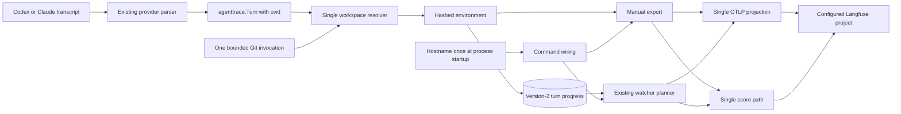

# Langfuse Workspace Identity Remap Plan

- Project name: `codex-langfuse-tracer`
- Version: 2.0
- Owners: Repository maintainer Kirill Igumenshchev; implementation owner coding agent
- Date: 2026-08-16
- Document ID: CLT-PLAN-WORKSPACE-IDENTITY-001
- Status: Repository implementation complete; CHECK-701 awaits separate operational authorization
- Standards basis: ISO/IEC/IEEE 29148-inspired requirements structure, ISO/IEC/IEEE 29119-3-inspired verification documentation, and ISO/IEC/IEEE 12207-inspired lifecycle evidence. This plan is standards-informed and is not a certification claim.
- Compute controls: `branch_limits: 1`, `reflection_passes: 1`, `early_stop%: 95`. Follow one implementation path. Stop design exploration after one review pass finds no unresolved correctness issue and at least 95% of binding evidence is green; phase exit still requires every mandatory gate.

This change maps the Git repository folder and export-time branch to `langfuse.environment` and always maps the Linux runtime hostname to `langfuse.user.id`. It removes `LANGFUSE_USER_ID_MODE`, `--environment`, `options.Environment`, and `buildinfo.DefaultEnvironment`. One resolver owns workspace derivation, one normalization function always appends a stable hash, one version-2 state schema stores only the environment needed for progressive consistency, and existing OTLP and deterministic-score paths consume explicit values. Version-1 state is discarded rather than migrated. No legacy mode, alias, compatibility reader, fallback projector, alternate state, provider branch, or duplicated normalization path is retained.

## Design consensus and trade-offs

### Topic: Repository and branch environment

- Verdict: DECISION
- Rationale: Repository folder and branch describe the coding workspace. For an attached worktree, the environment is a normalized `repository-folder--branch` display plus a stable six-character hash. Detached HEAD uses branch token `detached`. A non-Git, missing, unreadable, or timed-out working directory uses `default`.

### Topic: Always-on hostname user ID

- Verdict: FOR
- Rationale: Every supported Linux runtime has a hostname. The exporter resolves it once at process startup for manual and watcher export modes and always emits it as `langfuse.user.id`. There is no mode, omission branch, override, persisted hostname, DNS lookup, or physical-host discovery.

### Topic: Identity overrides

- Verdict: AGAINST
- Rationale: `LANGFUSE_USER_ID_MODE` and `--environment` create alternate identity paths. Remove their parser fields, constants, examples, tests, and call-site plumbing. Unknown `--environment` input fails through the standard flag parser. A stale `LANGFUSE_USER_ID_MODE` entry has no exporter code path and is removed from documented configuration.

### Topic: Environment normalization

- Verdict: DECISION
- Rationale: Use one algorithm for every Git workspace. Normalize repository and branch components to lowercase Langfuse-safe slugs, join them with `--`, reserve seven characters, truncate the readable portion when needed, and always append `-` plus the first six lowercase hexadecimal SHA-256 characters of `raw_repository + NUL + raw_branch`. Always hashing removes collision-specific branches while retaining readable repository and branch text within the 40-character limit. Prefix the readable portion with `repo-` when it would start with reserved `langfuse`.

### Topic: Repository and branch source

- Verdict: DECISION
- Rationale: One bounded `git -C cwd rev-parse --show-toplevel --abbrev-ref HEAD` invocation supplies the worktree root and export-time branch. Use the worktree-root basename, including for linked worktrees. Do not inspect remotes, package metadata, the common Git directory, commit history, or transcript-specific provider data. Historical session-time branch reconstruction is outside scope.

### Topic: Progressive identity

- Verdict: DECISION
- Rationale: Persist only `environment` in `turn_progress[trace_id]` before the first network attempt. Reuse it for partial spans, final spans, and scores. Hostname remains process-scoped because Linux hostname changes during one exporter process are not a supported scenario. This keeps state and watcher callback APIs smaller.

### Topic: State cutover

- Verdict: FOR breaking replacement
- Rationale: Change the sole state schema from version 1 to version 2. Version 2 requires an environment on every progress entry. The generic state loader rejects every unsupported version. Operators stop the watcher, remove the exact old state file, and restart so existing initialization creates version 2. Processed IDs, queued requests, and partial progress from version 1 are intentionally not preserved. No migration command, adapter, compatibility decoder, backup state path, or automatic state mutation is added.

### Topic: Provider and fixture scope

- Verdict: AGAINST expansion
- Rationale: The shared `agenttrace.Turn.CWD` contract covers Codex and Claude. Tests use temporary Git repositories and synthetic hostnames. `testdata/manifest.json` remains the sole fixture inventory; no identity fixture registry, provider-specific resolver, Claude polling, wrapper execution, native telemetry, or per-file observation fanout is introduced.

## PRD / stakeholder and system needs

### Problem

The current optional workspace mode combines path, branch, and hostname in `langfuse.user.id`, while spans and deterministic scores use caller-selected or fixed environment values. This makes the Langfuse User dimension ambiguous and leaves Environment unable to group repository branches consistently.

### Users

- Developers filtering coding-agent traces by repository and branch.
- Operators grouping traces by producer machine.
- Maintainers requiring one small identity derivation and projection path.
- Public users who need explicit disclosure that hostname is always exported.

### Value

- Make Environment represent workspace and User represent machine.
- Keep partial spans, final spans, and scores under one environment.
- Preserve exact CWD and branch metadata for diagnostics.
- Remove configuration and state compatibility surfaces.

### Business goals

- Improve built-in Langfuse filtering without dashboards or custom tags.
- Keep code and documentation direct, public, and secret-free.
- Reduce support burden from aliases, overrides, and migrations.
- Preserve one general implementation across supported providers.

### Success metrics

- 100% of defined Git workspace cases produce environments matching `^(?!langfuse)[a-z0-9-_]{1,40}$`.
- 100% of Git workspace environments end in the stable hash derived from raw repository and branch components.
- 100% of emitted spans contain the startup hostname only as `langfuse.user.id`.
- 100% of spans and scores for one progressive trace use its persisted environment.
- Zero runtime references remain to `LANGFUSE_USER_ID_MODE`, `UserIDMode`, `--environment`, `options.Environment`, or `DefaultEnvironment`.
- State loader accepts version 2 and rejects version 1 before scanning or network submission.
- Existing CWD, branch, trace ID, span ID, redaction, score, and endpoint assertions remain green.
- `go test ./... -count=1` and `git diff --check` pass before handoff.

### Scope

- Workspace root and export-time branch resolution.
- One deterministic environment normalization algorithm.
- One startup hostname user ID.
- OTLP resource and span attributes.
- Deterministic-score environment.
- Version-2 progressive state with environment only.
- Watcher and manual CLI wiring.
- README, TESTING, example config, and static guards.

### Non-goals

- State migration or preservation of version-1 processed IDs, queue, watermark, or progress.
- User-ID or environment configuration.
- Human identity, email identity, host inventory, DNS canonicalization, or physical-host detection.
- Repository identity from remotes, GitHub owner/name, modules, packages, or primary worktree discovery.
- Session-time branch recovery, commit SHA, dirty state, tags, pull request, or deployment tier.
- Custom delimiters, hash length, slug templates, or environment retention controls.
- Langfuse v4 score-endpoint migration, historical trace rewriting, or bulk re-export.
- Alternate state, fixture, export, provider, gateway, reconciliation, or telemetry paths.

### Dependencies

- Go 1.26.0 from `go.mod`.
- Linux `os.Hostname` behavior and the existing systemd user-service deployment.
- Git executable and the existing 750 ms subprocess bound in `internal/langfuse/workspace.go`.
- `agenttrace.Turn.CWD` and `agenttrace.Turn.GitBranch`.
- Existing OTLP projection in `internal/langfuse/export.go`.
- Existing deterministic-score ingestion in `internal/langfuse/scores.go`.
- Existing state locking and initialization in `internal/exportstate/state.go` and `internal/watch/watch.go`.
- Existing test commands in `TESTING.md`.
- Langfuse environment regex and 40-character limit.
- Current configured Langfuse v3 ingestion behavior; score endpoint migration remains separate.

### Risks

- Removing state discards deduplication history and may re-export turns from recently modified session files.
- Export-time branch can differ from the branch used when a historical turn occurred.
- Linked worktree basename can differ from the primary repository folder.
- Branch-per-environment creates persistent environment cardinality in Langfuse.
- Hostname disclosure can expose workstation naming to the configured project.
- Git failure maps unrelated non-Git workspaces to `default`.
- A future Langfuse v4 deployment may reject the existing deterministic-score ingestion endpoint.

### Assumptions

- Breaking CLI, config, state, and operational changes are accepted.
- Version-1 state data does not need preservation.
- Runtime hostname is the intended host identity for native Linux, WSL, and containers.
- Hostname remains stable for one exporter process.
- Current branch at first export is the intended branch identity.
- Worktree-root basename is the intended repository folder.
- Branch-level environment cardinality is intentional.
- Repository-local implementation does not authorize service restart, state deletion, config mutation, deployment, or a live write unless separately requested.

## SRS / canonical requirements

### Functional requirements

- REQ-701, type `func`: The exporter shall resolve worktree-root basename and export-time branch in one Git invocation bounded by 750 ms.
  - Acceptance criteria: Nested directories use the worktree root; attached HEAD returns its symbolic branch; detached HEAD returns `detached`; Git failure returns no repository context.
- REQ-702, type `func`: The exporter shall derive one Langfuse environment from repository and branch or use `default` when repository context is unavailable.
  - Acceptance criteria: Every Git environment contains readable normalized repository and branch text, ends in the six-character hash, matches the Langfuse regex, and is at most 40 characters.
- REQ-703, type `func`: Manual and watcher export modes shall resolve the local hostname once at process startup and use it for every emitted `langfuse.user.id`.
  - Acceptance criteria: Every emitted span contains the same trimmed non-empty hostname; hostname failure stops before state mutation or network submission.
- REQ-704, type `func`: OTLP spans and deterministic scores shall consume explicit environment values, and OTLP spans shall consume the explicit startup hostname.
  - Acceptance criteria: Resource, partial, final, transcript, terminal, observation, and score assertions use the expected values without projector-side derivation.
- REQ-705, type `func`: Exact CWD and export-time branch metadata behavior shall remain available.
  - Acceptance criteria: Existing trace and observation metadata tests retain CWD and branch, with branch omitted when Git context is unavailable.
- REQ-706, type `func`: The watcher shall persist environment before the first network attempt and reuse it through span and score completion.
  - Acceptance criteria: Branch changes and retries do not change a trace environment; score-only retry reads the stored environment without Git or hostname resolution.

### Non-functional requirements

- REQ-707, type `reliability`: The sole state schema shall be version 2 and reject every other version before scanning.
  - Acceptance criteria: Version-2 state survives save/load and atomic updates; incomplete progress environment fails validation; version 1 returns the generic unsupported-version error.
- REQ-708, type `perf`: Watcher behavior shall remain within the existing five-second scan and ten-second logical p95 thresholds.
  - Acceptance criteria: The existing serial five-run watcher evaluation passes without special caching or alternate resolution logic.
- REQ-709, type `nfr`: The repository shall contain one workspace resolver, one environment normalizer, one OTLP projection, one score path, one watcher state file, and one fixture manifest.
  - Acceptance criteria: No adapter, compatibility reader, duplicate normalizer, provider-specific identity branch, or alternate active path is introduced.
- REQ-710, type `security`: Production exports shall disclose hostname, while tests, logs, documentation examples, and committed files shall contain no real private hostname or credential.
  - Acceptance criteria: Tests use synthetic hostnames; new logs contain only existing trace IDs, counts, status, and paths already allowed by repository policy.

### Interface/API requirements

- REQ-711, type `int`: The exporter shall remove `LangfuseConfig.UserIDMode`, all user-ID mode constants and parsing, `options.Environment`, `--environment`, and `buildinfo.DefaultEnvironment`.
  - Acceptance criteria: Base Langfuse config still loads; `--environment` returns the standard unknown-flag error; stale symbols and literals have zero runtime or public-documentation matches.
- REQ-712, type `int`: Watcher callbacks shall receive environment explicitly, while the command layer captures one startup hostname for span callbacks.
  - Acceptance criteria: `internal/watch` does not import `internal/langfuse`; score callbacks receive environment only; no callback carries persisted hostname state.

### Data requirements

- REQ-713, type `data`: Version-2 `TurnProgress` shall contain `exported_observation_count`, `final_spans_exported`, and required `environment` only.
  - Acceptance criteria: Environment round-trips, remains immutable until progress removal, and disappears with the progress entry after successful scores.
- REQ-714, type `data`: Public documentation shall define always-on hostname disclosure, hashed repository-branch environments, export-time branch semantics, removed overrides, and destructive version-1 state reset.
  - Acceptance criteria: README, TESTING, and example config contain one consistent contract and no legacy setup instructions.

### Error handling and telemetry expectations

- Empty or failed hostname resolution returns an error before state or network activity.
- Git timeout, missing CWD, unreadable CWD, and non-Git status map to environment `default` without logging Git output.
- Empty normalized repository or branch components use literal `repo` or `branch` before hashing.
- Environment validation failure returns an implementation error before state or network activity.
- Unsupported state version returns the existing generic path-specific error before scanning.
- Version-2 progress without environment returns a state-validation error before export.
- State persistence failure stops the trace attempt before network submission.
- OTLP failure retains environment and existing span checkpoints.
- Score failure retains environment and `final_spans_exported=true`.
- Logs do not add hostname, raw branch, prompt, output, Git output, or credentials.

### Architecture diagram



```text
System: codex-langfuse-tracer

  [Codex CLI or Claude Code]
              |
              v
  [Existing provider parser]
              |
              v
  [agenttrace.Turn with cwd]
              |
              v
  [Workspace resolver] <----> [Git]
              |
              v
  [Hashed environment] <----> [Version-2 state]
              |
       +------+------+
       v             v
  [Manual CLI]    [Watcher]
       ^             ^
       +------v------+
       [Startup hostname]
              |
       +------+------+
       v             v
  [OTLP spans]   [Deterministic scores]
       |             |
       +------v------+
       [Langfuse project]
```

## Iterative implementation and test plan

### Phase P00: Canonical identity primitives and projector core are ready

- Phase goal: Resolve one hashed repository-branch environment, validate one hostname, and make the projector core consume explicit identity values before runtime wiring changes.
- Scope and objectives: Implement REQ-701 through REQ-705 and the normalization and projection portions of REQ-709, REQ-710, and REQ-713.
- Impacted surfaces: `internal/langfuse/workspace.go`, `internal/langfuse/workspace_test.go`, `internal/langfuse/export.go`, `internal/langfuse/spans_test.go`, `internal/langfuse/scores.go`, `internal/langfuse/scores_test.go`, and `internal/langfuse/otlp_http_test.go`.
- Lifecycle evidence:
  - Requirements evidence: Resolver, hostname, span, score, and metadata assertions linked to REQ-701 through REQ-705, REQ-709, REQ-710, and REQ-713.
  - Design/code surface evidence: One resolver and normalizer, one hostname helper, and explicit projector-core inputs.
  - Verification method: TEST-701, TEST-702, and EVAL-701.
  - Validation purpose: Demonstrate readable valid identity fields and direct projector inputs before the atomic runtime cutover in P01.
  - Configuration checkpoint: Record Git SHA, Go version, focused command outputs, and environment corpus metrics.
  - Risks and assumptions: Git temporary repositories behave like production worktrees; synthetic hostname injection does not add a production mode; current score ingestion accepts environment.

- P00.S01 Inspect identity ownership and stale surfaces
  - Action: Inventory resolver, config, CLI, projection, score, tests, and docs references before edits.
  - Why now: Removal scope must be complete before failing coverage is written.
  - Files/surfaces: `internal/`, `cmd/`, `test/`, `README.md`, `TESTING.md`, and `examples/`.
  - Requirement link: REQ-709, REQ-711.
  - Verification link: N/A.
  - Verification mode: VERIFY.
  - Command/procedure: `rg -n 'DefaultEnvironment|options\.Environment|--environment|UserIDMode|workspaceUserID|LANGFUSE_USER_ID_MODE|langfuse\.environment|langfuse\.user\.id' internal cmd test README.md TESTING.md examples`
  - Expected result: Every current identity owner and stale surface has a named implementation or deletion step in P00 or P02.
  - Evidence produced: Inventory output in the P00 execution record.
  - Stop/escalate condition: Stop if a repository-owned external contract requires an arbitrary environment or user-ID mode.
  - Unlocks: P00.S02.

- P00.S02 Add failing resolver coverage
  - Action: Add table-driven temporary-Git tests for nested worktree, attached branch, slash branch, uppercase and Unicode names, long names, reserved prefix, detached HEAD, non-Git, missing CWD, deterministic hash, hostname success, and hostname failure. Add `// TEST-701` tags.
  - Why now: Resolver and deletion behavior need executable expectations before implementation.
  - Files/surfaces: `internal/langfuse/workspace_test.go`.
  - Requirement link: REQ-701, REQ-702, REQ-703, REQ-709, REQ-713.
  - Verification link: TEST-701.
  - Verification mode: RED.
  - Command/procedure: `go test ./internal/langfuse -run '^TestWorkspaceIdentity$' -count=1`
  - Expected result: The command fails because the canonical resolver, always-hashed environment, and hostname helper are absent.
  - Evidence produced: Tagged failing tests and focused failure output.
  - Stop/escalate condition: Stop if Git cannot create attached and detached temporary repositories on supported Linux.
  - Unlocks: P00.S03.

- P00.S03 Implement canonical resolver primitives
  - Action: Add one Git resolver, one always-hashed normalizer, and one hostname helper without changing command or watcher wiring yet.
  - Why now: TEST-701 fixes resolver and hostname outputs.
  - Files/surfaces: `internal/langfuse/workspace.go`.
  - Requirement link: REQ-701, REQ-702, REQ-703, REQ-709, REQ-713.
  - Verification link: TEST-701.
  - Verification mode: GREEN.
  - Command/procedure: `go test ./internal/langfuse -run '^TestWorkspaceIdentity$' -count=1`
  - Expected result: Resolver and hostname cases pass with one normalizer and stable hash contract.
  - Evidence produced: Resolver diff and green TEST-701 output.
  - Stop/escalate condition: Stop if implementation adds another normalizer, hostname override, remote lookup, or provider branch.
  - Unlocks: P00.S04.

- P00.S04 Add failing projection coverage
  - Action: Replace composite and default identity expectations with explicit environment and synthetic startup-host assertions on resources, partial spans, final spans, observations, transcript, terminal, metadata, and every score event. Add `// TEST-702` tags.
  - Why now: Payload behavior must fail before projection signatures change.
  - Files/surfaces: `internal/langfuse/spans_test.go`, `internal/langfuse/scores_test.go`, and `internal/langfuse/otlp_http_test.go`.
  - Requirement link: REQ-703, REQ-704, REQ-705, REQ-710, REQ-713.
  - Verification link: TEST-702.
  - Verification mode: RED.
  - Command/procedure: `go test ./cmd/codex-langfuse-exporter ./internal/watch ./internal/langfuse -run '^(TestWorkspaceIdentityProjection|TestCreateDeterministicScores|TestOTLPHTTPExport)$' -count=1`
  - Expected result: The command fails because projection still derives composite user identity or receives fixed environment values.
  - Evidence produced: Tagged failing payload tests and focused failure output.
  - Stop/escalate condition: Stop if captured OTLP or score payloads cannot expose first-class environment deterministically.
  - Unlocks: P00.S05.

- P00.S05 Project explicit identity values in the core
  - Action: Make the internal span projector consume explicit environment and hostname and make score creation consume explicit environment; keep current command and watcher wiring unchanged until P01 performs the atomic cutover.
  - Why now: TEST-702 defines the projection boundary.
  - Files/surfaces: `internal/langfuse/export.go`, `internal/langfuse/scores.go`, `internal/langfuse/spans_test.go`, `internal/langfuse/scores_test.go`, and `internal/langfuse/otlp_http_test.go`.
  - Requirement link: REQ-703, REQ-704, REQ-705, REQ-709, REQ-713.
  - Verification link: TEST-702.
  - Verification mode: GREEN.
  - Command/procedure: `go test ./cmd/codex-langfuse-exporter ./internal/watch ./internal/langfuse -run '^(TestWorkspaceIdentityProjection|TestCreateDeterministicScores|TestOTLPHTTPExport)$' -count=1`
  - Expected result: Projector-core tests use explicit environment and hostname, score tests use explicit environment, command and watcher packages compile, and existing metadata and ID assertions pass.
  - Evidence produced: Projection signature diff and green TEST-702 output.
  - Stop/escalate condition: Stop if scores require a second environment transformation or spans require projector-side workspace discovery.
  - Unlocks: P00.S06.

- P00.S06 Confirm no primitive-level refactor is needed
  - Action: Review the new resolver, normalizer, hostname helper, and projector inputs for duplicate logic before runtime cutover.
  - Why now: Green primitives should have one owner before P01 wires them.
  - Files/surfaces: `internal/langfuse/workspace.go`, `internal/langfuse/export.go`, and `internal/langfuse/scores.go`.
  - Requirement link: REQ-709, REQ-713.
  - Verification link: TEST-701, TEST-702.
  - Verification mode: VERIFY.
  - Command/procedure: `go test ./internal/langfuse -run '^TestWorkspaceIdentity$' -count=1 && go test ./cmd/codex-langfuse-exporter ./internal/watch ./internal/langfuse -run '^(TestWorkspaceIdentityProjection|TestCreateDeterministicScores|TestOTLPHTTPExport)$' -count=1`
  - Expected result: No refactor needed because resolver, normalization, hostname, spans, and scores each have one owner; focused tests remain green.
  - Evidence produced: Review note and focused green output.
  - Stop/escalate condition: Stop if duplicate normalization, identity validation, or projector forwarding appears.
  - Unlocks: P00.S07.

- P00.S07 Measure environment corpus quality
  - Action: Execute one deterministic adversarial corpus covering normalization, truncation, reserved prefix, detached state, and named collision pairs. Add `// EVAL-701` to the evaluation.
  - Why now: Data-quality evidence follows the final normalization implementation.
  - Files/surfaces: `internal/langfuse/eval_test.go`.
  - Requirement link: REQ-702, REQ-709, REQ-713.
  - Verification link: EVAL-701.
  - Verification mode: MEASURE.
  - Command/procedure: `go test ./internal/langfuse -run '^TestEvalEnvironmentCorpus$' -count=1 -v`
  - Expected result: Validity and stable-hash rates are 100%, defined collision count is zero, maximum length is 40, and runtime is at most five seconds.
  - Evidence produced: Tagged evaluation and verbose metrics.
  - Stop/escalate condition: Stop on an invalid value, unstable hash, defined collision, or threshold breach.
  - Unlocks: Phase P00 exit.

- Exit gates:
  - Proceed: TEST-701, TEST-702, and EVAL-701 pass; canonical primitives and projector core are ready for one runtime cutover.
  - Escalate: Langfuse rejects a valid environment or repository-owned code requires an override.
  - Stop: Acceptance requires a second resolver, normalizer, hostname source, or projector core.
- Phase metrics:
  - Confidence: 94% — current identity logic and payload tests are localized.
  - Long-term robustness: 95% — always-hashed normalized environments use one algorithm.
  - Internal interactions: 5 — config, resolver, command wiring, spans, and scores interact.
  - External interactions: 2 — Git and local HTTP payload contracts are exercised.
  - Complexity: 32% — most work deletes fields and changes direct signatures.
  - Feature creep: 1% — no new identity feature beyond the requested mapping is added.
  - Technical debt: 4% — final removal is deliberately deferred to the atomic P01 cutover.
  - YAGNI score: 98% — no migration, customization, or alternate identity source is added.
  - MoSCoW: Must — requested field semantics depend on this phase.
  - Local/non-local scope: Local implementation with local test servers.
  - Architectural changes count: 1 — identity derivation becomes one explicit boundary.

### Phase P01: Progressive export uses version-2 environment state

- Phase goal: Replace version-1 state with one version-2 environment checkpoint and wire manual and watcher exports through the canonical resolver.
- Scope and objectives: Implement REQ-706 through REQ-709 and complete REQ-711 through REQ-713.
- Impacted surfaces: `internal/exportstate/state.go`, `internal/exportstate/state_test.go`, `internal/exportstate/queue_test.go`, `internal/watch/watch.go`, `internal/watch/watch_test.go`, `internal/watch/perf_test.go`, `internal/config/config.go`, `internal/config/config_test.go`, `internal/buildinfo/buildinfo.go`, `cmd/codex-langfuse-exporter/main.go`, `cmd/codex-langfuse-exporter/cli_test.go`, `cmd/codex-langfuse-exporter/main_integration_test.go`, and `test/static_architecture_test.go`.
- Lifecycle evidence:
  - Requirements evidence: State-version, retry, branch-change, score-only, CLI, and callback assertions linked to REQ-706 through REQ-709 and REQ-711 through REQ-713.
  - Design/code surface evidence: Environment-only `TurnProgress`, one resolver callback, process-scoped hostname closure, and direct callback signatures.
  - Verification method: TEST-703, TEST-704, and EVAL-702.
  - Validation purpose: Demonstrate stable progressive environment without hostname state or version-1 behavior.
  - Configuration checkpoint: Record version rejection, version-2 JSON, retry output, CLI output, and watcher metrics.
  - Risks and assumptions: State reset is accepted; environment persistence precedes network; no network call occurs under the state lock.

- P01.S01 Add failing version-2 state coverage
  - Action: Add tests for fresh version-2 save/load, generic version-1 rejection, required environment, atomic mutation, processed-entry removal, queue preservation within version 2, and file mode. Add `// TEST-703` tags.
  - Why now: The state contract must fail before schema implementation.
  - Files/surfaces: `internal/exportstate/state_test.go` and `internal/exportstate/queue_test.go`.
  - Requirement link: REQ-707, REQ-709, REQ-713.
  - Verification link: TEST-703.
  - Verification mode: RED.
  - Command/procedure: `go test ./internal/exportstate -run '^(TestVersion2State|TestStateUpdatePreservesQueue)$' -count=1`
  - Expected result: The command fails because state still writes version 1 and progress has no required environment.
  - Evidence produced: Tagged failing state tests and focused failure output.
  - Stop/escalate condition: Stop if version 2 requires another file, migration helper, or compatibility decoder.
  - Unlocks: P01.S02.

- P01.S02 Implement version-2 environment state
  - Action: Set state version to 2, add required `environment` to `TurnProgress`, validate progress on load and save, preserve it in existing atomic updates, and keep the generic unsupported-version error.
  - Why now: TEST-703 defines the sole accepted state shape.
  - Files/surfaces: `internal/exportstate/state.go`.
  - Requirement link: REQ-707, REQ-709, REQ-713.
  - Verification link: TEST-703.
  - Verification mode: GREEN.
  - Command/procedure: `go test ./internal/exportstate -run '^(TestVersion2State|TestStateUpdatePreservesQueue)$' -count=1`
  - Expected result: Version 2 round-trips, version 1 fails, incomplete progress fails, queue mutation preserves version-2 progress, and processed traces remove progress.
  - Evidence produced: State schema diff and green TEST-703 output.
  - Stop/escalate condition: Stop if implementation reads, transforms, or preserves version-1 state.
  - Unlocks: P01.S03.

- P01.S03 Add failing runtime-cutover coverage
  - Action: Add tests for removed user-ID config, unknown `--environment`, absent environment option field, one startup hostname, manual environment reuse across spans and scores, environment persistence before failed OTLP, branch-change retry, score-only retry without resolution, version-1 startup failure, and stale-symbol absence. Add `// TEST-704` tags.
  - Why now: Wiring and ordering need executable behavior before callback changes.
  - Files/surfaces: `internal/config/config_test.go`, `cmd/codex-langfuse-exporter/cli_test.go`, `cmd/codex-langfuse-exporter/main_integration_test.go`, `internal/watch/watch_test.go`, `internal/langfuse/otlp_http_test.go`, and `test/static_architecture_test.go`.
  - Requirement link: REQ-703, REQ-704, REQ-706, REQ-707, REQ-711, REQ-712, REQ-713.
  - Verification link: TEST-704.
  - Verification mode: RED.
  - Command/procedure: `go test ./internal/config ./cmd/codex-langfuse-exporter ./internal/watch ./internal/langfuse ./test -run '^(TestLoadConfig|TestRemovedIdentityOverrides|TestCLIIdentityFlags|TestManualWorkspaceIdentity|TestWatchEnvironmentSnapshot|TestWatchEnvironmentRetry|TestOTLPProgressiveThenFinal)$' -count=1`
  - Expected result: The command fails because config and CLI retain overrides, old workspace formatting remains reachable, and watcher callbacks do not persist or receive environment.
  - Evidence produced: Tagged failing integration tests and focused failure output.
  - Stop/escalate condition: Stop if persistence before network requires HTTP under the state lock or a Langfuse import in `internal/watch`.
  - Unlocks: P01.S04.

- P01.S04 Perform the atomic runtime cutover
  - Action: Capture hostname once for export modes, resolve manual environment once per turn, add one workspace resolver callback to `ScanOptions`, persist first environment before network, pass environment to span and score callbacks, and delete user-ID mode config, composite workspace formatting, fixed environment, and environment CLI plumbing.
  - Why now: TEST-703 provides state and TEST-704 fixes callback ordering.
  - Files/surfaces: `internal/config/config.go`, `internal/buildinfo/buildinfo.go`, `internal/langfuse/workspace.go`, `internal/langfuse/export.go`, `cmd/codex-langfuse-exporter/main.go`, `internal/watch/watch.go`, and callback call sites and tests.
  - Requirement link: REQ-703, REQ-704, REQ-706, REQ-707, REQ-709, REQ-711, REQ-712, REQ-713.
  - Verification link: TEST-704.
  - Verification mode: GREEN.
  - Command/procedure: `go test ./internal/config ./cmd/codex-langfuse-exporter ./internal/watch ./internal/langfuse ./test -run '^(TestLoadConfig|TestRemovedIdentityOverrides|TestCLIIdentityFlags|TestManualWorkspaceIdentity|TestWatchEnvironmentSnapshot|TestWatchEnvironmentRetry|TestOTLPProgressiveThenFinal)$' -count=1`
  - Expected result: Config and CLI overrides are absent; CLI rejects `--environment`; manual and watcher spans use startup hostname; one environment persists before network and remains shared by spans and scores.
  - Evidence produced: Direct wiring diff and green TEST-704 output.
  - Stop/escalate condition: Stop if implementation adds hostname to state, resolves Git for score-only retry, or introduces another callback path.
  - Unlocks: P01.S05.

- P01.S05 Simplify progressive identity flow
  - Action: Remove obsolete callback adapters, repeated state reads, hostname forwarding through watcher state, and duplicate environment validation; retain one mutation owner and direct signatures.
  - Why now: Green integration behavior exposes unnecessary wiring.
  - Files/surfaces: `internal/watch/watch.go`, `internal/exportstate/state.go`, and `cmd/codex-langfuse-exporter/main.go`.
  - Requirement link: REQ-706, REQ-709, REQ-712, REQ-713.
  - Verification link: TEST-703, TEST-704.
  - Verification mode: REFACTOR.
  - Command/procedure: `go test ./internal/exportstate -run '^(TestVersion2State|TestStateUpdatePreservesQueue)$' -count=1 && go test ./internal/config ./cmd/codex-langfuse-exporter ./internal/watch ./internal/langfuse ./test -run '^(TestLoadConfig|TestRemovedIdentityOverrides|TestCLIIdentityFlags|TestManualWorkspaceIdentity|TestWatchEnvironmentSnapshot|TestWatchEnvironmentRetry|TestOTLPProgressiveThenFinal)$' -count=1`
  - Expected result: Focused lifecycle tests pass with one state file, one resolver callback, one environment checkpoint, and no hostname state.
  - Evidence produced: Reduced watcher diff and focused green output.
  - Stop/escalate condition: Stop if simplification changes checkpoint ordering or at-least-once behavior.
  - Unlocks: P01.S06.

- P01.S06 Measure watcher latency
  - Action: Execute the existing watcher evaluation five times serially with the canonical resolver path. Add `// EVAL-702` only if the existing evaluation lacks a traceability tag.
  - Why now: Git resolution and pre-network persistence affect watcher latency.
  - Files/surfaces: `internal/watch/perf_test.go`.
  - Requirement link: REQ-708.
  - Verification link: EVAL-702.
  - Verification mode: MEASURE.
  - Command/procedure: `go test -p=1 ./internal/watch -run '^TestEvalWatchExportLatency$' -parallel=1 -count=5 -v`
  - Expected result: Every sample stays within five-second scan and ten-second logical p95 thresholds with no duplicate batch per trace per scan.
  - Evidence produced: Five verbose evaluation samples.
  - Stop/escalate condition: Stop on a threshold breach; any threshold change requires an ADR.
  - Unlocks: Phase P01 exit.

- Exit gates:
  - Proceed: TEST-703, TEST-704, and EVAL-702 pass; version 2 is the only state contract.
  - Escalate: State persistence conflicts with queue mutation or watcher latency exceeds binding thresholds.
  - Stop: Consistency requires version-1 decoding, another state file, hostname persistence, or network activity under lock.
- Phase metrics:
  - Confidence: 91% — current progress state and callback boundaries are explicit.
  - Long-term robustness: 94% — state stores only the value that can drift during a trace.
  - Internal interactions: 5 — state, watcher, command, spans, and scores interact.
  - External interactions: 1 — Git is invoked only before span attempts.
  - Complexity: 40% — pre-network persistence ordering is the main difficulty.
  - Feature creep: 2% — version 2 adds one required string.
  - Technical debt: 3% — version-1 behavior and callback adapters are absent.
  - YAGNI score: 97% — no migration or hostname checkpoint is retained.
  - MoSCoW: Must — progressive traces must not split environment.
  - Local/non-local scope: Local state and process behavior.
  - Architectural changes count: 1 — progress gains one environment checkpoint.

### Phase P02: Public contract and repository gates are complete

- Phase goal: Publish the destructive one-way migration and pass all repository-local acceptance gates without stale identity surfaces.
- Scope and objectives: Implement REQ-710, REQ-711, and REQ-714 documentation behavior and validate REQ-701 through REQ-714.
- Impacted surfaces: `README.md`, `TESTING.md`, `examples/codex-config.toml`, `test/docs_static_test.go`, all modified Go files, and the final Git diff.
- Lifecycle evidence:
  - Requirements evidence: Required and forbidden documentation literals, complete test output, traceability matrix, and diff hygiene.
  - Design/code surface evidence: README behavior, TESTING commands, concise example config, and no additional guide.
  - Verification method: TEST-705, TEST-706, TEST-707, and optional CHECK-701.
  - Validation purpose: Demonstrate one public setup, one destructive state transition, and no stale runtime or documentation path.
  - Configuration checkpoint: Record Git SHA, branch, Go version, full command output, diff summary, and optional live match booleans.
  - Risks and assumptions: Repository-local acceptance performs no state deletion, service restart, config mutation, or live write.

- P02.S01 Add failing documentation coverage
  - Action: Rename the static documentation test and require always-on hostname disclosure, hashed environment format, export-time branch, non-Git default, removed overrides, version-2 state, and exact destructive reset procedure. Add `// TEST-705` tags.
  - Why now: Public prose needs executable expectations before edits.
  - Files/surfaces: `test/docs_static_test.go`.
  - Requirement link: REQ-710, REQ-711, REQ-714.
  - Verification link: TEST-705.
  - Verification mode: RED.
  - Command/procedure: `go test ./test -run '^TestDocsWorkspaceIdentity$' -count=1`
  - Expected result: The command fails because current docs retain workspace mode, composite user ID, fixed environment, and version-1 state instructions.
  - Evidence produced: Tagged failing static test and focused failure output.
  - Stop/escalate condition: Stop if another public document outside README, TESTING, and example config owns normative identity behavior.
  - Unlocks: P02.S02.

- P02.S02 Publish one-way identity documentation
  - Action: Update README, TESTING, and example config; remove legacy identity key and environment flag; document hashed environment, always-on hostname, export-time branch, version-1 state deletion, version-2 initialization, and live validation.
  - Why now: TEST-705 defines the complete public contract.
  - Files/surfaces: `README.md`, `TESTING.md`, `examples/codex-config.toml`, and `test/docs_static_test.go`.
  - Requirement link: REQ-710, REQ-711, REQ-714.
  - Verification link: TEST-705.
  - Verification mode: GREEN.
  - Command/procedure: `go test ./test -run '^TestDocsWorkspaceIdentity$' -count=1`
  - Expected result: Static documentation coverage passes with one setup and no legacy literals.
  - Evidence produced: Documentation diff and green TEST-705 output.
  - Stop/escalate condition: Stop if documentation adds a migration script, compatibility command, alternate state, or automatic config mutation.
  - Unlocks: P02.S03.

- P02.S03 Confirm no documentation refactor is needed
  - Action: Review topic ownership and retain README for behavior, TESTING for commands, and example config for concise configuration only.
  - Why now: Green documentation can reveal duplicated normative instructions.
  - Files/surfaces: `README.md`, `TESTING.md`, `examples/codex-config.toml`, and `test/docs_static_test.go`.
  - Requirement link: REQ-709, REQ-714.
  - Verification link: TEST-705.
  - Verification mode: VERIFY.
  - Command/procedure: `go test ./test -run '^TestDocsWorkspaceIdentity$' -count=1`
  - Expected result: No refactor needed because each source-of-truth file retains one distinct role and the command remains green.
  - Evidence produced: Review note and repeated green TEST-705 output.
  - Stop/escalate condition: Stop if the same normative procedure appears in more than one owner file beyond a short cross-reference.
  - Unlocks: P02.S04.

- P02.S04 Execute full repository acceptance
  - Action: Execute every Go package test without cache reuse.
  - Why now: Focused behavior and documentation are green.
  - Files/surfaces: `cmd/**/*_test.go`, `internal/**/*_test.go`, `test/**/*_test.go`, and `testdata/manifest.json` corpus consumers.
  - Requirement link: REQ-701 through REQ-714.
  - Verification link: TEST-706.
  - Verification mode: VERIFY.
  - Command/procedure: `go test ./... -count=1`
  - Expected result: Every package passes with zero failures.
  - Evidence produced: Full uncached Go test output.
  - Stop/escalate condition: Stop on any failure and classify it before changing implementation or thresholds.
  - Unlocks: P02.S05.

- P02.S05 Validate final diff and removed surfaces
  - Action: Validate whitespace and assert that legacy symbols, literals, test names, and override surfaces have zero matches in runtime and public sources.
  - Why now: Repository hygiene is the final local gate.
  - Files/surfaces: Entire Git diff plus `README.md`, `TESTING.md`, `examples/`, `internal/`, `cmd/`, and `test/`.
  - Requirement link: REQ-709, REQ-711, REQ-714.
  - Verification link: TEST-707.
  - Verification mode: VERIFY.
  - Command/procedure: `git diff --check && ! rg -n 'app\(main\)@devbox|folder\(branch\)@hostname|LANGFUSE_USER_ID_MODE|UserIDMode|workspaceUserID|DefaultEnvironment|options\.Environment|--environment' README.md TESTING.md examples internal cmd -g '!**/*_test.go' && ! rg -n 'WorkspaceUserID|WORKSPACE_USER' internal cmd test`
  - Expected result: Git reports no whitespace errors and the stale-surface search returns no matches.
  - Evidence produced: Zero-exit output and final diff summary.
  - Stop/escalate condition: Stop on whitespace errors, stale surfaces, unrelated changes, or a second identity path.
  - Unlocks: Phase P02 exit.

- Exit gates:
  - Proceed: TEST-705, TEST-706, and TEST-707 pass; CHECK-701 passes only when operational execution is separately authorized.
  - Escalate: Live Langfuse displays values different from local payload captures or the target upgrades to an incompatible score endpoint before release.
  - Stop: Public behavior cannot be described without a legacy path, fallback, or alternate configuration.
- Phase metrics:
  - Confidence: 96% — static guards and full Go acceptance cover the public contract.
  - Long-term robustness: 95% — stale setup becomes an executable failure.
  - Internal interactions: 4 — docs, static tests, full suite, and diff hygiene interact.
  - External interactions: 0 mandatory — live validation requires separate authorization.
  - Complexity: 18% — work is deletion, concise documentation, and verification.
  - Feature creep: 0% — no runtime behavior is added in this phase.
  - Technical debt: 1% — legacy terminology and setup are removed.
  - YAGNI score: 99% — no extra guide or migration utility is added.
  - MoSCoW: Must for local gates; Should for authorized live validation.
  - Local/non-local scope: Local acceptance with one optional non-local observation.
  - Architectural changes count: 0 — this phase documents and validates the code contract.

### Risk register

| Risk | Trigger | Mitigation |
|---|---|---|
| State history loss | Operator removes version-1 state | Accept the breaking reset, document exact impact, and create no preservation path |
| Recent turn re-export | Fresh watermark includes a recently modified multi-turn session | Accept deterministic re-ingestion as part of the reset and perform no dedupe migration |
| Branch drift | Branch changes after partial export | Persist environment before first network attempt |
| Historical branch mismatch | Old transcript is exported after checkout changes | Define branch as export-time branch and preserve exact metadata |
| Linked worktree naming | Worktree folder differs from primary repository | Use worktree-root basename consistently |
| Hostname disclosure | Target project is shared | Document unconditional disclosure; provide no omission mode |
| Environment cardinality | Many branches are exported | Accept branch-level cardinality; add no retention or template surface |
| Langfuse score incompatibility | Target moves to v4 `events_only` | Suspend release and scope score ingestion as separate work |
| Watcher latency | Git and state mutation exceed existing thresholds | Fail EVAL-702; favor general code before any optimization proposal |

### Suspension and resumption criteria

- Suspend if Langfuse rejects a TEST-701-valid environment or score and span environments differ after local payload tests pass.
- Suspend if the configured target upgrades to Langfuse v4 behavior that rejects deterministic-score ingestion.
- Suspend if environment persistence requires another state file, version-1 decoder, hostname state, remote lookup, or network activity under lock.
- Suspend on any unclassified failure in `go test ./... -count=1`.
- Resume after the external contract or failure is reproduced by a focused test and the affected requirement is amended.
- Any watcher threshold change requires an ADR update before resumption.
- Stop if acceptance requires a legacy alias, fallback, adapter, duplicate normalizer, migration utility, or historical Langfuse mutation.

## Evaluations

```yaml
evaluations:
  - id: EVAL-701
    purpose: adversarial
    metrics:
      - environment_validity_rate
      - stable_hash_rate
      - defined_pair_collision_count
      - maximum_environment_length
    thresholds:
      environment_validity_rate: 1.0
      stable_hash_rate: 1.0
      defined_pair_collision_count: 0
      maximum_environment_length: 40
    seeds: [701]
    runtime_budget: 5s
  - id: EVAL-702
    purpose: holdout
    metrics:
      - scan_wall_time_seconds
      - logical_p95_eligibility_seconds
      - duplicate_batches_per_trace
    thresholds:
      scan_wall_time_seconds: 5
      logical_p95_eligibility_seconds: 10
      duplicate_batches_per_trace: 0
    seeds: [601]
    runtime_budget: 30s
```

## Tests

### 7.1 Test inventory

- Runner: Go `testing` through `go test`; module version is Go 1.26.0.
- Unit tests: `internal/**/*_test.go` and `cmd/codex-langfuse-exporter/*_test.go`.
- Integration tests: `internal/langfuse/otlp_http_test.go`, `internal/watch/watch_test.go`, and command integration tests.
- Static tests: `test/static_architecture_test.go` and `test/docs_static_test.go`.
- Contract tests: `test/contract_fixture_test.go`, `test/contract_test.go`, `test/full_acceptance_test.go`, and `testdata/manifest.json`.
- Performance tests: `internal/watch/perf_test.go`.
- Fuzz tests: `internal/codextrace/fuzz_test.go`.
- Live tests: environment-gated tests under `internal/langfuse/`.
- Default command: `go test ./... -count=1`.
- Contract command: `go test ./test -run TestGoldenTraceContract -count=1`.
- Watcher evaluation: `go test -p=1 ./internal/watch -run '^TestEvalWatchExportLatency$' -parallel=1 -count=5 -v`.
- Hygiene command: `git diff --check`.
- No package script, Make target, checked-in script directory, or CI workflow defines another test runner.

### 7.2 Test suites overview

- name: Unit
  - purpose: Validate identity, config deletion, projection, and state.
  - runner: Go `testing`.
  - command: `go test ./internal/langfuse ./internal/config ./internal/exportstate -count=1`
  - runtime budget: 20 seconds.
  - when it runs: pre-commit and CI-equivalent local gate.
- name: Integration
  - purpose: Validate CLI, watcher, OTLP HTTP, and score ingestion with local servers.
  - runner: Go `testing` and `httptest`.
  - command: `go test ./cmd/codex-langfuse-exporter ./internal/watch ./internal/langfuse -count=1`
  - runtime budget: 45 seconds.
  - when it runs: pre-commit and CI-equivalent local gate.
- name: E2E
  - purpose: Validate one installed export against the configured project when separately authorized.
  - runner: Exporter CLI and Langfuse UI inspection.
  - command: `~/.codex/bin/codex-langfuse-exporter --latest --json`
  - runtime budget: 60 seconds.
  - when it runs: deployment validation.
- name: Perf
  - purpose: Protect watcher scan and eligibility latency.
  - runner: Go `testing` with serial package execution.
  - command: `go test -p=1 ./internal/watch -run '^TestEvalWatchExportLatency$' -parallel=1 -count=5 -v`
  - runtime budget: 30 seconds.
  - when it runs: pre-release after watcher changes.
- name: Data Drift
  - purpose: Preserve normalized trace fixtures and the single manifest.
  - runner: Go `testing`.
  - command: `go test ./test -run TestGoldenTraceContract -count=1`
  - runtime budget: 15 seconds.
  - when it runs: pre-commit and CI-equivalent local gate.
- name: Static
  - purpose: Validate docs, architecture ownership, and removed surfaces.
  - runner: Go `testing`, `rg`, and Git.
  - command: `go test ./test -run '^(TestRemovedIdentityOverrides|TestDocsWorkspaceIdentity)$' -count=1`
  - runtime budget: 10 seconds.
  - when it runs: pre-commit and CI-equivalent local gate.

### 7.3 Test definitions

- id: TEST-701
  - name: Canonical workspace identity primitives
  - type: unit
  - verifies: REQ-701, REQ-702, REQ-703, REQ-709, REQ-713
  - location: `internal/langfuse/workspace_test.go`
  - command: `go test ./internal/langfuse -run '^TestWorkspaceIdentity$' -count=1`
  - fixtures/mocks/data: Temporary attached and detached Git repositories, nested directories, synthetic names, and injected hostname success and failure.
  - deterministic controls: Fixed raw names, SHA-256 contract, 750 ms production timeout, no network, and `-count=1`.
  - pass_criteria: Expected environments and host errors match; every Git environment is valid, hashed, and bounded.
  - expected_runtime: 8 seconds.
- id: TEST-702
  - name: Explicit identity projection
  - type: integration
  - verifies: REQ-703, REQ-704, REQ-705, REQ-710, REQ-713
  - location: `internal/langfuse/spans_test.go`; `internal/langfuse/scores_test.go`; `internal/langfuse/otlp_http_test.go`
  - command: `go test ./cmd/codex-langfuse-exporter ./internal/watch ./internal/langfuse -run '^(TestWorkspaceIdentityProjection|TestCreateDeterministicScores|TestOTLPHTTPExport)$' -count=1`
  - fixtures/mocks/data: Existing complete-turn helper, synthetic environment and hostname, in-memory span exporter, and local OTLP and score servers.
  - deterministic controls: Fixed IDs and timestamps, local HTTP only, no real hostname, and `-count=1`.
  - pass_criteria: Every span carries expected environment and hostname; every score carries expected environment; CWD, branch, IDs, endpoint, auth sentinel, and batch counts pass.
  - expected_runtime: 10 seconds.
- id: TEST-703
  - name: Version-2 environment state
  - type: unit
  - verifies: REQ-707, REQ-709, REQ-713
  - location: `internal/exportstate/state_test.go`; `internal/exportstate/queue_test.go`
  - command: `go test ./internal/exportstate -run '^(TestVersion2State|TestStateUpdatePreservesQueue)$' -count=1`
  - fixtures/mocks/data: Valid and invalid version-2 JSON, one version-1 JSON, synthetic queue request, and synthetic environment.
  - deterministic controls: Temporary files, fixed JSON, file mode assertion, package lock only, and `-count=1`.
  - pass_criteria: Version 2 round-trips; version 1 and missing environment fail; queue survives version-2 mutation; processed traces remove progress; file mode is 0600.
  - expected_runtime: 5 seconds.
- id: TEST-704
  - name: Manual and progressive environment wiring
  - type: integration
  - verifies: REQ-703, REQ-704, REQ-706, REQ-707, REQ-711, REQ-712, REQ-713
  - location: `internal/config/config_test.go`; `cmd/codex-langfuse-exporter/cli_test.go`; `cmd/codex-langfuse-exporter/main_integration_test.go`; `internal/watch/watch_test.go`; `internal/langfuse/otlp_http_test.go`; `test/static_architecture_test.go`
  - command: `go test ./internal/config ./cmd/codex-langfuse-exporter ./internal/watch ./internal/langfuse ./test -run '^(TestLoadConfig|TestRemovedIdentityOverrides|TestCLIIdentityFlags|TestManualWorkspaceIdentity|TestWatchEnvironmentSnapshot|TestWatchEnvironmentRetry|TestOTLPProgressiveThenFinal)$' -count=1`
  - fixtures/mocks/data: Minimal config, repository source text, completed and incomplete Codex fixtures, temporary Git repository and version-2 state, synthetic hostname, branch-change resolver sequence, failed OTLP response, and score capture.
  - deterministic controls: Fixed timestamps, zero poll delay, local HTTP only, one hostname value, and `-count=1`.
  - pass_criteria: Config and CLI overrides are absent; stale symbols are absent; CLI rejects environment override; hostname resolves once; environment persists before network, survives failure and branch change, and reaches final spans and scores; score-only retry skips resolution.
  - expected_runtime: 15 seconds.
- id: TEST-705
  - name: Public workspace identity documentation
  - type: static
  - verifies: REQ-710, REQ-711, REQ-714
  - location: `test/docs_static_test.go`
  - command: `go test ./test -run '^TestDocsWorkspaceIdentity$' -count=1`
  - fixtures/mocks/data: `README.md`, `TESTING.md`, and `examples/codex-config.toml` read as text.
  - deterministic controls: Exact required and forbidden literals, repository-relative paths, no network, and `-count=1`.
  - pass_criteria: Always-on hostname, hashed environment, export-time branch, destructive version-1 reset, and version-2 state are documented; legacy identity and override instructions are absent.
  - expected_runtime: 5 seconds.
- id: TEST-706
  - name: Full repository acceptance
  - type: integration
  - verifies: REQ-701, REQ-702, REQ-703, REQ-704, REQ-705, REQ-706, REQ-707, REQ-708, REQ-709, REQ-710, REQ-711, REQ-712, REQ-713, REQ-714
  - location: `cmd/**/*_test.go`; `internal/**/*_test.go`; `test/**/*_test.go`
  - command: `go test ./... -count=1`
  - fixtures/mocks/data: All registered fixtures, temporary repositories and files, local HTTP servers, and static repository documents.
  - deterministic controls: Uncached run, fixed fixture IDs and timestamps, live tests skipped unless explicitly enabled, and no default external network.
  - pass_criteria: Every package passes with zero failures.
  - expected_runtime: 60 seconds.
- id: TEST-707
  - name: Diff and stale-surface hygiene
  - type: static
  - verifies: REQ-709, REQ-711, REQ-714
  - location: Repository Git diff; `README.md`; `TESTING.md`; `examples/`; `internal/`; `cmd/`; `test/`
  - command: `git diff --check && ! rg -n 'app\(main\)@devbox|folder\(branch\)@hostname|LANGFUSE_USER_ID_MODE|UserIDMode|workspaceUserID|DefaultEnvironment|options\.Environment|--environment' README.md TESTING.md examples internal cmd -g '!**/*_test.go' && ! rg -n 'WorkspaceUserID|WORKSPACE_USER' internal cmd test`
  - fixtures/mocks/data: Current tracked diff and repository text.
  - deterministic controls: Exact regex, no generated files, no network.
  - pass_criteria: Git reports no whitespace errors and stale-surface search returns no matches.
  - expected_runtime: 5 seconds.

### 7.4 Manual checks

- id: CHECK-701
  - name: Authorized destructive cutover and live identity display
  - procedure:
    1. Confirm TEST-706 and TEST-707 are green.
    2. Obtain explicit authorization to change private config, stop and restart the user service, delete state, and write one live trace.
    3. Stop `codex-langfuse-watch.service`.
    4. Confirm `~/.codex/langfuse-export-state.json` is exporter state with `version` equal to `1`, then remove exactly that file without creating a compatibility copy.
    5. Remove `LANGFUSE_USER_ID_MODE` from `~/.codex/config.toml` without displaying other values.
    6. Execute `./install.sh` so startup creates version-2 state.
    7. Execute `~/.codex/bin/codex-langfuse-exporter --latest --json` and record only trace URL and timestamp.
    8. Compare Langfuse Environment with the locally derived hashed repository-branch value and User with `hostname` without copying hostname, CWD, prompt, output, or credentials into evidence.
    9. Confirm deterministic scores use the same Environment and metadata retains CWD and branch.
  - pass_criteria: Service is active with version-2 state; one live trace shows matching Environment, User, scores, CWD, and branch; no legacy config key or state remains.
  - evidence: Service status, state version, trace URL, timestamp, field-match booleans, and pass/fail result.

## Data contract

### Schema snapshot

```json
{
  "version": 2,
  "scan_watermark_ns": 0,
  "processed_trace_ids": [],
  "turn_progress": {
    "trace-id-key": {
      "exported_observation_count": 1,
      "final_spans_exported": false,
      "environment": "codex-langfuse-tracer--main-4d0d54"
    }
  },
  "queue": []
}
```

### Invariants

- State version is exactly 2.
- Every progress entry has one valid non-empty environment.
- Environment is persisted before first network submission and remains immutable until progress removal.
- Hostname is process-scoped and never stored in exporter state.
- Score-only retry reads environment without workspace or hostname resolution.
- Successful score completion removes the entire progress entry.
- Failed network submission does not advance observation or final-span checkpoints.
- Queue and progress mutations share the existing atomic lock.
- Raw CWD and branch remain projection metadata and are not duplicated in state.

### Privacy and data-quality constraints

- Every production span sends the startup Linux hostname as `langfuse.user.id`.
- No committed test or example contains a real private hostname or credential.
- Environment contains normalized worktree-folder and export-time branch text plus a stable hash.
- Hash input is `raw_repository + NUL + raw_branch`; only six lowercase hexadecimal characters are exposed.
- Environment uses no full path, remote URL, DNS name, credential, prompt, or output.
- Identity derivation performs no Git remote, DNS, GitHub, Langfuse read, or LLM call.

## Reproducibility

- Seeds: EVAL-701 uses fixed corpus seed `701`; EVAL-702 uses existing watcher seed `601`.
- Hardware assumptions: Linux or WSL2 workstation; no accelerator.
- OS/driver/container tag: `linux-amd64`, Go 1.26.0; containers use their runtime hostname.
- Relevant environment variables:
  - `CODEX_HOME` selects existing config, session, and state roots.
  - `LANGFUSE_HOST`, `LANGFUSE_PUBLIC_KEY`, and `LANGFUSE_SECRET_KEY` remain private project configuration.
  - Existing live-test variables remain opt-in; default tests perform no live write.
- Fixed controls:
  - Git timeout: 750 ms.
  - Environment maximum: 40 characters.
  - Hash suffix: six lowercase hexadecimal characters.
  - Watcher scan threshold: five seconds.
  - Watcher logical p95 threshold: ten seconds.
- Phase records capture Git SHA, branch, `go version`, exact command, exit code, runtime, and diff summary.

## Requirements Traceability Matrix

| Phase | REQ-### | TEST-### | Test Path | Command |
|---|---|---|---|---|
| P00 | REQ-701 | TEST-701 | `internal/langfuse/workspace_test.go` | `go test ./internal/langfuse -run '^TestWorkspaceIdentity$' -count=1` |
| P00 | REQ-702 | TEST-701 | `internal/langfuse/workspace_test.go` | `go test ./internal/langfuse -run '^TestWorkspaceIdentity$' -count=1` |
| P00 | REQ-703 | TEST-701 | `internal/langfuse/workspace_test.go` | `go test ./internal/langfuse -run '^TestWorkspaceIdentity$' -count=1` |
| P00 | REQ-704 | TEST-702 | `internal/langfuse/spans_test.go`; `internal/langfuse/scores_test.go`; `internal/langfuse/otlp_http_test.go` | `go test ./cmd/codex-langfuse-exporter ./internal/watch ./internal/langfuse -run '^(TestWorkspaceIdentityProjection|TestCreateDeterministicScores|TestOTLPHTTPExport)$' -count=1` |
| P00 | REQ-705 | TEST-702 | `internal/langfuse/spans_test.go`; `internal/langfuse/scores_test.go`; `internal/langfuse/otlp_http_test.go` | `go test ./cmd/codex-langfuse-exporter ./internal/watch ./internal/langfuse -run '^(TestWorkspaceIdentityProjection|TestCreateDeterministicScores|TestOTLPHTTPExport)$' -count=1` |
| P01 | REQ-706 | TEST-704 | `internal/config/config_test.go`; `cmd/codex-langfuse-exporter/cli_test.go`; `cmd/codex-langfuse-exporter/main_integration_test.go`; `internal/watch/watch_test.go`; `internal/langfuse/otlp_http_test.go`; `test/static_architecture_test.go` | `go test ./internal/config ./cmd/codex-langfuse-exporter ./internal/watch ./internal/langfuse ./test -run '^(TestLoadConfig|TestRemovedIdentityOverrides|TestCLIIdentityFlags|TestManualWorkspaceIdentity|TestWatchEnvironmentSnapshot|TestWatchEnvironmentRetry|TestOTLPProgressiveThenFinal)$' -count=1` |
| P01 | REQ-707 | TEST-703 | `internal/exportstate/state_test.go`; `internal/exportstate/queue_test.go` | `go test ./internal/exportstate -run '^(TestVersion2State|TestStateUpdatePreservesQueue)$' -count=1` |
| P01 | REQ-708 | TEST-706 | `cmd/**/*_test.go`; `internal/**/*_test.go`; `test/**/*_test.go` | `go test ./... -count=1` |
| P00 | REQ-709 | TEST-701 | `internal/langfuse/workspace_test.go` | `go test ./internal/langfuse -run '^TestWorkspaceIdentity$' -count=1` |
| P02 | REQ-710 | TEST-705 | `test/docs_static_test.go` | `go test ./test -run '^TestDocsWorkspaceIdentity$' -count=1` |
| P01 | REQ-711 | TEST-704 | `internal/config/config_test.go`; `cmd/codex-langfuse-exporter/cli_test.go`; `cmd/codex-langfuse-exporter/main_integration_test.go`; `internal/watch/watch_test.go`; `internal/langfuse/otlp_http_test.go`; `test/static_architecture_test.go` | `go test ./internal/config ./cmd/codex-langfuse-exporter ./internal/watch ./internal/langfuse ./test -run '^(TestLoadConfig|TestRemovedIdentityOverrides|TestCLIIdentityFlags|TestManualWorkspaceIdentity|TestWatchEnvironmentSnapshot|TestWatchEnvironmentRetry|TestOTLPProgressiveThenFinal)$' -count=1` |
| P01 | REQ-712 | TEST-704 | `internal/config/config_test.go`; `cmd/codex-langfuse-exporter/cli_test.go`; `cmd/codex-langfuse-exporter/main_integration_test.go`; `internal/watch/watch_test.go`; `internal/langfuse/otlp_http_test.go`; `test/static_architecture_test.go` | `go test ./internal/config ./cmd/codex-langfuse-exporter ./internal/watch ./internal/langfuse ./test -run '^(TestLoadConfig|TestRemovedIdentityOverrides|TestCLIIdentityFlags|TestManualWorkspaceIdentity|TestWatchEnvironmentSnapshot|TestWatchEnvironmentRetry|TestOTLPProgressiveThenFinal)$' -count=1` |
| P01 | REQ-713 | TEST-703 | `internal/exportstate/state_test.go`; `internal/exportstate/queue_test.go` | `go test ./internal/exportstate -run '^(TestVersion2State|TestStateUpdatePreservesQueue)$' -count=1` |
| P02 | REQ-714 | TEST-705 | `test/docs_static_test.go` | `go test ./test -run '^TestDocsWorkspaceIdentity$' -count=1` |

## Execution log

### Plan deviation audit

- Requirements, architecture, public interfaces, state cutover, and operational design: No deviations.
- P01 test setup adjustment: Direct `ScanOnce` tests now initialize their state file before scanning. Pre-network environment persistence makes the file the authoritative mutation source, matching `WatchSessions` production behavior; adding an in-memory-to-file merge fallback would have created a second state path.
- P01 validation-order adjustment: Version-2 progress validation runs before normalization. This is stricter than the original step wording and prevents malformed progress from being silently removed when the same trace is also marked processed.
- P01 coverage completion: The generic version-1 loader rejection was initially tested directly; `TestWatchEnvironmentSnapshot` now also verifies that `WatchSessions` rejects version 1 before workspace resolution, state mutation, or network callbacks.
- P02 hygiene adjustment: A static test initially contained a stale symbol as a literal and therefore matched TEST-707 itself. The test now constructs that forbidden value from components so the repository-wide zero-match gate remains exact.
- ADR/KER impact: ADR-701 through ADR-706 remain unchanged because the implementation preserves every recorded decision. This repository has no separate KER artifact or KER convention, so no KER was created.

### Phase P00 execution record

- Phase Status: Complete
- Completed at: 2026-08-16
- Base Git SHA: `62271e260be932c87ad4e8a77bd5a5da66196c96`
- Branch and toolchain: `main`; `go version go1.26.0 linux/amd64`
- Completed Steps: P00.S01 through P00.S07
- Quantitative Results: Environment validity 100%; stable-hash rate 100%; defined collisions 0; maximum length 40; corpus runtime below 1 ms.
- Issues/Resolutions: None beyond the intentional RED tests for absent resolver and explicit projector inputs.
- Commands and exit codes: TEST-701, TEST-702, and EVAL-701 all exited 0.
- Evidence paths: `internal/langfuse/workspace_test.go`, `internal/langfuse/eval_test.go`, `internal/langfuse/spans_test.go`, `internal/langfuse/scores_test.go`, and `internal/langfuse/otlp_http_test.go`.

### Phase P01 execution record

- Phase Status: Complete
- Completed at: 2026-08-16
- Base Git SHA: `62271e260be932c87ad4e8a77bd5a5da66196c96`; changes remain in the working tree.
- Completed Steps: P01.S01 through P01.S06
- Quantitative Results: Five EVAL-702 samples passed; scan wall time ranged from 5.27 ms to 6.53 ms; logical p95 was 5 s in every sample; duplicate batches were 0.
- Issues/Resolutions: Direct `ScanOnce` tests were updated to initialize their state file before pre-network mutation. State validation was ordered before normalization so no malformed progress entry can be silently discarded.
- Commands and exit codes: TEST-703, TEST-704, and EVAL-702 all exited 0.
- Evidence paths: `internal/exportstate/state_test.go`, `internal/watch/watch_test.go`, `cmd/codex-langfuse-exporter/main_integration_test.go`, and `test/static_architecture_test.go`.

### Phase P02 execution record

- Phase Status: Complete for repository-local scope
- Completed at: 2026-08-16T19:53:46-07:00
- Completed Steps: P02.S01 through P02.S05
- Quantitative Results: TEST-705 passed; uncached TEST-706 passed every package with the acceptance package completing in 31.921 s; TEST-707 returned no stale-surface matches and no diff whitespace errors.
- Commands and exit codes: `go test ./... -count=1` and `git diff --check` exited 0; both stale-surface searches returned the expected no-match status.
- Evidence paths: `README.md`, `TESTING.md`, `examples/codex-config.toml`, `test/docs_static_test.go`, and the full Go test corpus.
- Residual risks: CHECK-701 was not run because it requires separate authorization to edit private config, stop or restart the user service, delete version-1 state, and write a live trace.

## Appendix: ADR index

- ADR-701: Use worktree-root basename plus export-time branch as the readable environment identity.
- ADR-702: Always append a six-character hash from raw repository and branch components.
- ADR-703: Always use one process-startup Linux hostname as `langfuse.user.id`.
- ADR-704: Remove user-ID mode and environment overrides without aliases.
- ADR-705: Replace state version 1 with environment-only version 2 and discard old state.
- ADR-706: Persist environment but not hostname for progressive traces.
- ADR-PERF-001: Keep existing watcher latency thresholds unchanged.
