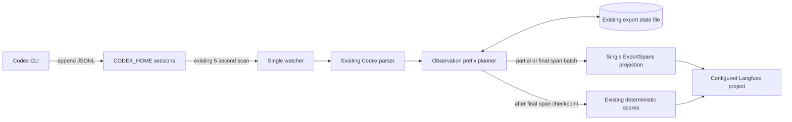

# Progressive Unfinished Codex Trace Export Plan

- Project name: `codex-langfuse-tracer`
- Version: 1.3
- Owners: Repository maintainers; product owner Kirill Igumenshchev
- Date: 2026-07-30
- Document ID: CLT-PLAN-PROGRESSIVE-TRACE-001
- Status: Implemented and accepted locally
- Standards basis: ISO/IEC/IEEE 29148-inspired requirements structure, ISO/IEC/IEEE 29119-3-inspired verification documentation, and ISO/IEC/IEEE 12207-inspired implementation lifecycle evidence. This plan is standards-informed and is not a claim of ISO, IEEE, FAA, DO-178C, or other certification compliance.
- Compute controls: `branch_limits: 2`, `reflection_passes: 2`, `early_stop%: 90`. Implementation uses the single design in this document; exploration stops after two review passes find no unresolved correctness issue and at least 90% of weighted acceptance evidence is green. Release still requires every mandatory gate.

This plan adds progressive visibility for unfinished Codex CLI turns by extending the existing five-second JSONL watcher and existing Langfuse OTLP projection. A live local feasibility gate first proves that Langfuse renders a deterministic child span before its future parent is ingested. Each successful partial export then advances one persisted observation-prefix count in the existing state file. Completion emits the final agent, transcript, terminal, and remaining observations, submits deterministic scores, and marks the trace processed. The design intentionally uses at-least-once delivery to the currently configured target and does not add destination reconciliation, Langfuse read-before-retry calls, automatic target synchronization, legacy state migration, a second exporter, or fallback paths.

## Design consensus and trade-offs

### Topic: Canonical source and trigger

- Verdict: DECISION
- Rationale: The append-only Codex rollout JSONL and `internal/watch/watch.go` remain the only automatic Codex source and trigger. The feature changes eligibility and batching inside that path instead of adding native Codex OTEL, hooks, wrapper execution, or another process.

### Topic: Inputs and outputs

- Verdict: DECISION
- Rationale: Input is one parsed `agenttrace.Turn`, its ordered completed `Observations`, and the persisted observation-prefix count. Output is either one partial OTLP batch, one final OTLP batch, one deterministic score batch, or no work. This contract is small enough to test without another orchestration abstraction.

### Topic: Progressive immutable deltas

- Verdict: FOR
- Rationale: Only completed observations already present in `Turn.Observations` are eligible before `task_complete`. Partial assistant text, usage, insight rollups, terminal aggregation, and final trace attributes remain excluded until completion because they can still change.

### Topic: Observation-prefix checkpoint

- Verdict: DECISION
- Rationale: Persist `exported_observation_count` instead of a set of span IDs or a delivery-state machine. The parser already returns observations in source order, so one prefix-stability test provides the necessary invariant with less state and code.

### Topic: Resending cumulative trace snapshots

- Verdict: AGAINST
- Rationale: Langfuse v4 observations are immutable. Each scan sends only observations after the persisted prefix. Finalization sends only the remaining observations and final-only spans. Reference: `https://langfuse.com/faq/all/tracing-data-updates`.

### Topic: Future agent parent

- Verdict: DECISION
- Rationale: Partial child spans use the deterministic final `codex.agent` span ID as a remote parent before that parent is ingested. A live local feasibility test must prove trace visibility, later parent attachment, and one resolved hierarchy before the full RED suite or production work begins. Failure stops this design; no flat-span or synthetic-parent fallback is implemented.

### Topic: Feasibility before implementation TDD

- Verdict: DECISION
- Rationale: Child-before-parent rendering is the only material external-contract uncertainty. Phase P00 adds a test-only probe against the configured loopback Langfuse project before the full RED suite. The probe uses existing configuration loading, OTLP dependencies, deterministic ID helpers, and live read helpers; it does not change production behavior.

### Topic: Synthetic turn-start span

- Verdict: AGAINST
- Rationale: It is not present in rollout data, changes observation cardinality, and is unnecessary for the requested outcome. An unfinished trace appears after its first completed observation.

### Topic: Export API shape

- Verdict: DECISION
- Rationale: Replace the internal `ExportTurn` function with one general `ExportSpans` operation parameterized by the first observation index and whether final-only spans are included. Manual and watcher callers invoke `ExportSpans` and `CreateDeterministicScores` directly. No compatibility façade or second projector remains.

### Topic: Delivery guarantee

- Verdict: DECISION
- Rationale: Checkpoint only after a successful OTLP response. Known failures retry from the persisted prefix. A timeout may be an ambiguous acknowledgement and a process failure after remote acceptance but before state persistence may cause a duplicate on retry. That rare risk is accepted; the implementation does not add pending batches, observation lookup, quarantine states, or distributed-transaction behavior.

### Topic: Span and score boundary

- Verdict: DECISION
- Rationale: Persist `final_spans_exported=true` before score submission. If scores fail, the next scan retries only deterministic scores. A completed trace moves to `processed_trace_ids` only after scores succeed.

### Topic: State evolution

- Verdict: DECISION
- Rationale: Add one optional `turn_progress` map to the current version-1 state document. Existing state files decode with an empty map through normal Go JSON semantics; there is no migration branch, alternate schema, legacy reader, or alternate state file.

### Topic: Concurrent state mutation

- Verdict: DECISION
- Rationale: Generalize the existing export-state lock into one atomic read-modify-write operation used by both watcher progress and the Claude hook queue. This removes duplicate mutation logic and prevents progressive saves from overwriting a concurrently enqueued request. Network calls remain outside the lock.

### Topic: Destination switching and synchronization

- Verdict: AGAINST for this feature
- Rationale: Local/Shaman switching and historical replay are operational concerns outside this repository's progressive-turn lifecycle. This plan adds no target fingerprints, target maps, database replication, automatic failover, or Langfuse-to-Langfuse synchronization. The watcher exports only to the currently configured target.

### Topic: Partial trace attributes

- Verdict: DECISION
- Rationale: Before completion, export only fields needed to find and understand completed observations: trace name and ID, session ID, workspace user ID, provider, environment, version, release, turn ID, observation type, observation input/output, and observation metadata. Completion-derived tags, trace output, transcript, terminal, usage, insight rollup, `transcript_exported`, CWD, and branch attributes remain final-only. The existing workspace user ID helper runs per export; the design does not persist another metadata snapshot for the unlikely case of a branch change during one turn.

### Topic: Full-file parsing

- Verdict: FOR
- Rationale: `internal/codextrace.ParseTurns` remains the sole parser owner. Reparsing a modified rollout is simpler and more recoverable than adding tail cursors or durable parser offsets. The existing watcher performance test remains the acceptance control.

## PRD / stakeholder and system needs

### Problem

`agenttrace.ExportableTurns` currently requires `turn.Completed`, visible input, and visible output. A long Codex turn can finish many commands and tool calls while remaining absent from Langfuse until the final answer. Operators therefore cannot observe useful progress or distinguish active work from a stalled session.

### Users

- Developers supervising long Codex CLI tasks.
- Operators diagnosing watcher or Langfuse delivery failures.
- Maintainers preserving the normalized trace contract and single-owner architecture.

### Value

- Display completed subcalls within one watcher polling cycle.
- Preserve one logical trace and the existing final hierarchy.
- Avoid duplicate observations during normal repeated scans and known-failure retries.
- Keep the implementation small enough to reason about from parser input through state checkpoint.

### Business goals

- Reduce uncertainty during long Codex tasks.
- Preserve the current public installation and operation model.
- Avoid support costs from parallel ingestion paths, duplicated projection logic, or unnecessary recovery infrastructure.

### Success metrics

- The live feasibility gate confirms that a child-only batch is queryable before parent ingestion and resolves under the later deterministic parent in one trace.
- At least 95% of completed observations become eligible for export within 10 seconds of their source timestamp under the default five-second poll interval in deterministic evaluation.
- Zero repeated observation IDs across unchanged scans, appended scans, and finalization after successful state checkpoints.
- A known OTLP failure retries the same delta and advances the prefix only after success.
- A score failure retries scores without another span request.
- Existing completed normalized golden output remains byte-equivalent.
- Secret sentinel leakage remains zero in partial and final payload tests.
- The existing five-second scan ceiling for 100 candidate rollout files remains unchanged.

### Scope

- One test-only local Langfuse feasibility probe before production TDD.
- Codex incomplete-turn eligibility in the existing watcher.
- Ordered observation-prefix planning and persistence.
- Partial child-span OTLP submission with deterministic IDs and future parent.
- Final-only agent, transcript, terminal, usage, trace output, insight, tags, and scores.
- One atomic state mutation owner shared with the existing Claude queue.
- Existing fixture, unit, integration, performance, documentation, and local deployment evidence.

### Non-goals

- Streaming tokens or partial model text.
- Synthetic turn-start observations.
- Native Codex OTEL ingestion, lifecycle hooks, wrapper execution, or another exporter binary.
- Claude polling, Claude wrapper execution, native Claude telemetry, alternate Claude state, or direct hook export.
- Destination-aware state, automatic failover, target synchronization, database replication, or Langfuse observation lookup.
- Exactly-once delivery across ambiguous network outcomes or process failure between remote acceptance and local persistence.
- Tail cursors, per-file workers, observation fanout requests, or parser offsets.
- New include/exclude configuration, alternate state files, or another fixture registry.
- Historical mutation of Langfuse observations.

### Dependencies

- Go 1.26 declared by `go.mod`.
- Existing OpenTelemetry Go packages declared by `go.mod`.
- Existing Langfuse OTLP HTTP endpoint `/api/public/otel/v1/traces` used by `internal/langfuse/export.go`.
- Existing Langfuse score ingestion endpoint `/api/public/ingestion` used by `internal/langfuse/scores.go`.
- Existing authenticated live read helpers in `internal/langfuse/live_cost_test.go` and configuration loading through `config.Load(config.DefaultConfigPath())`.
- Existing Codex rollout JSONL under `~/.codex/sessions/`.
- Existing state file from `config.DefaultStatePath()`.
- Existing systemd user unit installed by `install.sh`.

### Risks

- The deployed local Langfuse version can group a child by trace ID but fail to attach it under a parent ingested later.
- A network timeout can follow successful remote acceptance and cause a duplicate retry.
- A process can exit after remote acceptance but before state persistence and cause a duplicate retry.
- A future Codex format can reorder or rewrite earlier parsed observations.
- A child-before-parent span may render differently in the deployed Langfuse version.
- Frequent progress checkpoints can overlap Claude hook queue writes if state mutation is not unified.
- Full-file reparsing can become expensive for unusually large active rollouts.
- Switching the configured target during an unfinished turn does not transfer its checkpoint history.
- Changing Git branches during an unfinished turn can change the workspace user ID between partial and final batches.

### Assumptions

- Active rollout files are append-only.
- `Turn.Observations` contains only completed, immutable observations.
- Earlier observation order and content are prefix-stable as a rollout grows.
- Langfuse groups spans by trace ID when a child arrives before its deterministic parent.
- The configured feasibility target is loopback Langfuse; the probe refuses a non-loopback host.
- HTTP 2xx from OTLP means the batch can be checkpointed locally.
- One systemd watcher is authoritative for one `CODEX_HOME` and configured target.
- The workspace Git branch normally remains unchanged during one Codex turn; branch-change drift is accepted rather than stored in progress state.

## SRS / canonical requirements

### Functional requirements

- REQ-001, type `func`: The watcher shall consider an incomplete Codex turn eligible when it has a trace ID, visible user input, and at least one completed observation.
  - Acceptance criteria: The registered incomplete fixture produces a non-empty partial plan while remaining incomplete.
- REQ-002, type `func`: The watcher shall export only the ordered observation suffix after `exported_observation_count`.
  - Acceptance criteria: An unchanged scan sends nothing; appended observations produce one suffix batch.
- REQ-003, type `func`: Every partial observation shall use its final trace ID, deterministic observation span ID, and deterministic future agent parent ID.
  - Acceptance criteria: A live loopback Langfuse probe makes the child queryable before parent ingestion; after parent ingestion, partial and completed projections use identical IDs and one resolved hierarchy for the same observation.
- REQ-004, type `func`: Completion shall export remaining observations plus agent, transcript, and terminal spans without resending the persisted observation prefix.
  - Acceptance criteria: Finalization adds each final-only span once and retains prior child cardinality.
- REQ-005, type `func`: Deterministic scores shall run only after final span success, and a score retry shall not submit spans.
  - Acceptance criteria: One injected score failure produces two score attempts and one final span attempt.
- REQ-006, type `func`: Manual completed-turn export and watcher export shall call the same span projection and deterministic score functions directly.
  - Acceptance criteria: Existing manual CLI output and completed golden traces remain unchanged without an `ExportTurn` compatibility façade.

### Non-functional requirements

- REQ-007, type `reliability`: A known OTLP or score failure shall leave the corresponding checkpoint unchanged and retry on a later scan.
  - Acceptance criteria: Failure followed by success delivers the intended suffix and advances state once.
- REQ-008, type `perf`: Under the existing five-second poll, logical p95 eligibility latency shall be at most 10 seconds and a scan of 100 candidate files shall remain below five seconds.
  - Acceptance criteria: The existing watcher performance test, extended with an incomplete staged rollout, meets both thresholds.
- REQ-009, type `security`: Partial and final export shall use existing `agenttrace.ExportText`, field-size, authentication, and secret-free logging rules.
  - Acceptance criteria: Sentinel secrets are absent from OTLP bodies, logs, and state; the live feasibility probe refuses non-loopback hosts and does not print credentials or observation content.
- REQ-010, type `nfr`: The repository shall retain one parser owner, one watcher, one state file, one OTLP projection, and one fixture manifest.
  - Acceptance criteria: No new exporter path, native telemetry path, hook path, include/exclude surface, target adapter, or fixture registry is added.

### Interface/API requirements

- REQ-011, type `int`: `internal/langfuse.ExportSpans` shall accept a turn, first observation index, and finalization flag; it shall emit one batch containing exactly that projection.
  - Acceptance criteria: Watcher and manual CLI callers use this operation directly, the fixed ID generator receives IDs in emitted-span order, and the retained live test calls this production operation after feasibility is established.

### Data requirements

- REQ-012, type `data`: The current version-1 state file shall add `turn_progress[trace_id]` with `exported_observation_count` and `final_spans_exported` and shall keep the existing queue and processed-trace fields.
  - Acceptance criteria: A state file without `turn_progress` loads normally; atomic progress mutation preserves queued requests; processed traces have no progress entry.
- REQ-013, type `data`: The registered incomplete Codex fixture shall prove that every parsed observation prefix retains its order, content, and deterministic span ID as records are appended.
  - Acceptance criteria: `testdata/manifest.json` remains the only registry and the completed golden corpus does not change.

### Error handling and telemetry expectations

- OTLP non-2xx, timeout, or connection failure leaves `exported_observation_count` and `final_spans_exported` unchanged.
- State persistence occurs after OTLP success and before any dependent score request.
- State persistence failure stops the watcher and logs the trace ID without prompt or tool content.
- Score failure retains `final_spans_exported=true`, leaves the trace outside `processed_trace_ids`, and retries scores on a later scan.
- Corrupt rollout handling remains the warning-and-skip behavior already implemented in `internal/watch/watch.go`.
- Progress logs contain trace ID, observation range, final flag, and HTTP status; they exclude observation content and credentials.
- Ambiguous acknowledgement is treated as a failed request and may duplicate on retry; no remote lookup or alternate state is attempted.
- The feasibility probe exits without writing when the configured host is not `localhost`, `127.0.0.1`, or `::1`.

### Architecture diagram



```text
System: codex-langfuse-tracer

  [External System: Codex CLI]
       |
       v
  [Data Store: ~/.codex/sessions/**/rollout-*.jsonl]
       |
       v
  [Container: codex-langfuse-exporter]
       |-- [Component: existing rollout watcher]
       |-- [Component: existing codextrace parser]
       |-- [Component: observation-prefix planner]
       |-- [Component: canonical ExportSpans projection]
       |-- [Component: existing deterministic scores]
       |
       +<--> [Data Store: ~/.codex/langfuse-export-state.json]
       |
       v
  [External System: one configured Langfuse project]

  [Person: Codex operator] --> observes partial and completed traces in Langfuse
```

## Iterative implementation and test plan

### Phase P00: Future-parent rendering is proven on local Langfuse

- Phase goal: Establish that the configured loopback Langfuse project exposes a child-only trace and later resolves the child under its deterministic parent.
- Scope and objectives: Resolve the external-contract uncertainty in REQ-003, REQ-009, and REQ-011 before the full RED suite or production implementation begins.
- Impacted surfaces: `internal/langfuse/live_progressive_test.go` to be created, existing `internal/langfuse/live_cost_test.go` read helpers, `internal/langfuse/id_generator.go`, `internal/langfuse/export.go` authentication and endpoint construction, current OpenTelemetry dependencies in `go.mod`, and the configured loopback Langfuse project.
- Lifecycle evidence:
  - Requirements evidence: REQ-003, REQ-009, and REQ-011 feasibility record.
  - Design/code surface evidence: Test-only child and parent emitter using existing ID, authentication, and live-read helpers; no production diff.
  - Verification method: TEST-600 and EVAL-600 against one loopback Langfuse project.
  - Validation purpose: Prove the hierarchy on the real destination before committing to prefix projection architecture.
  - Configuration checkpoint: Record `git rev-parse HEAD`, `go version`, configured host without credentials, Langfuse health result, generated trace ID, child span ID, parent span ID, and probe timestamp.
  - Risks and assumptions: The probe writes one synthetic trace to the configured local project; it must reject hosted or non-loopback targets.
  - Unresolved decisions: None before execution; a failed probe reopens ADR-002 and stops the current design.

- P00.S01 Confirm loopback target and reusable probe surfaces
  - Action: Inspect configuration loading, OTLP exporter construction, deterministic ID generation, live trace reads, and the configured host; confirm the host resolves to `localhost`, `127.0.0.1`, or `::1` before adding the probe.
  - Why now: The feasibility test intentionally writes synthetic telemetry and must remain local and secret-free.
  - Files/surfaces: `internal/config/config.go`, `internal/langfuse/export.go`, `internal/langfuse/id_generator.go`, `internal/langfuse/live_cost_test.go`, `go.mod`, `~/.codex/config.toml` read through the existing loader.
  - Requirement link: REQ-003, REQ-009, REQ-011.
  - Verification link: N/A.
  - Verification mode: VERIFY.
  - Command/procedure: `rg -n 'func Load|func AuthHeader|otlptracehttp.New|newFixedIDGenerator|func liveGet' internal/config internal/langfuse && ~/.codex/bin/codex-langfuse-exporter --doctor --json`
  - Expected result: Existing code supplies configuration, authenticated OTLP, deterministic IDs, and authenticated trace reads; doctor reports the intended loopback host and healthy authentication.
  - Evidence produced: Source ownership list and content-redacted doctor JSON.
  - Stop/escalate condition: Stop if the configured host is non-loopback, doctor fails, or the probe would require another production exporter.
  - Unlocks: P00.S02.

- P00.S02 Add and execute live future-parent feasibility probe
  - Action: Create one opt-in Go test that generates a unique synthetic trace, emits one child with the deterministic future agent parent context, polls existing trace and observation APIs until the child is queryable, emits the parent, then confirms one trace, one child, one parent, and the resolved parent link. Reuse current authentication, deterministic ID, redaction, and live-read helpers; emit no prompt, tool payload, or credentials.
  - Why now: This result determines whether the selected architecture may proceed to full TDD.
  - Files/surfaces: `internal/langfuse/live_progressive_test.go`, `internal/langfuse/live_cost_test.go`, configured loopback Langfuse OTLP and public read APIs.
  - Requirement link: REQ-003, REQ-009, REQ-011.
  - Verification link: TEST-600, EVAL-600.
  - Verification mode: MEASURE.
  - Command/procedure: `LIVE_LANGFUSE_PROGRESSIVE_PROBE=1 go test ./internal/langfuse -run TestLiveProgressiveChildBeforeParent -count=1 -v`
  - Expected result: The child is queryable before parent ingestion, both observations remain in one trace after parent ingestion, the child references the deterministic agent span ID, duplicate observation IDs equal zero, and no credential or content appears in output.
  - Evidence produced: `// TEST-600` and `// EVAL-600` comments, passing output, trace/span IDs, visibility timestamps, and ADR-002 feasibility status.
  - Stop/escalate condition: Stop this design if the child is not independently visible, the later parent does not resolve, duplicate rows appear, or the API cannot prove the relationship; record evidence and revise ADR-002 without implementing a fallback.
  - Unlocks: Phase P00 exit and P01.S01.

- Exit gates:
  - Proceed: TEST-600 passes on loopback Langfuse, EVAL-600 meets every threshold, the test emits no sensitive content, and ADR-002 records the observed contract.
  - Escalate: Local health/auth is unavailable or API convergence exceeds the bounded runtime.
  - Stop: Child-before-parent rendering or linkage fails; do not begin P01.
- Phase metrics:
  - Confidence %: 86; the result is live and direct, but applies to the deployed local Langfuse version.
  - Long-term robustness %: 82; release still retains the live test and decoded OTLP tests against future drift.
  - Internal interactions: 4; config, IDs, OTLP construction, and live reads.
  - External interactions: 2; local OTLP ingestion and local public read API.
  - Complexity %: 18; the probe is test-only and bounded.
  - Feature creep %: 1; it validates one architectural assumption.
  - Technical debt %: 3; the test-only emitter is removed when `ExportSpans` becomes available in P02.
  - YAGNI score: 98; failure prevents unnecessary implementation.
  - MoSCoW: Must.
  - Local/non-local scope: Local repository test and loopback Langfuse only.
  - Architectural changes count: 0.

### Phase P01: Progressive behavior is executable as failing coverage

- Phase goal: Create focused failing coverage for partial eligibility, prefix state, OTLP shape, watcher transitions, and documentation before production behavior changes.
- Scope and objectives: Define executable contracts for REQ-001 through REQ-013 using existing fixtures and test files.
- Impacted surfaces: `testdata/sources/codex/incomplete-turn.jsonl`, `testdata/golden/incomplete-turn.normalized.json`, `internal/codextrace/parser_test.go`, `internal/exportstate/state_test.go`, `internal/exportstate/queue_test.go`, `internal/langfuse/otlp_http_test.go`, `internal/langfuse/spans_test.go`, `internal/watch/watch_test.go`, `internal/watch/perf_test.go`, `test/docs_static_test.go`.
- Lifecycle evidence:
  - Requirements evidence: REQ-001 through REQ-013 and RTM rows.
  - Design/code surface evidence: Fixture diff, failing tests, and ADR-001 through ADR-003.
  - Verification method: TEST-601 through TEST-605 and TEST-609.
  - Validation purpose: Prove the current completion-only watcher cannot satisfy the desired lifecycle.
  - Configuration checkpoint: Record `git rev-parse HEAD`, `go version`, and `internal/buildinfo.DefaultPollIntervalSeconds` in the execution log.
  - Risks and assumptions: The fixture must represent a completed tool result inside an incomplete turn without changing parser semantics.
  - Unresolved decisions: None; P00 must have accepted the future-parent contract.

- P01.S01 Inspect canonical owners and record architecture constraints
  - Action: Inspect completion eligibility, parsing, state locking, span emission order, deterministic IDs, score calls, fixtures, and public commands; record ADR-001 through ADR-003 as proposed.
  - Why now: Failing coverage needs one agreed input, output, and ownership model.
  - Files/surfaces: `internal/agenttrace/model.go`, `internal/codextrace/parser.go`, `internal/watch/watch.go`, `internal/exportstate/state.go`, `internal/langfuse/export.go`, `internal/langfuse/id_generator.go`, `internal/langfuse/scores.go`, `testdata/manifest.json`, `README.md`, `TESTING.md`.
  - Requirement link: REQ-003, REQ-006, REQ-010, REQ-011, REQ-012, REQ-013.
  - Verification link: N/A.
  - Verification mode: VERIFY.
  - Command/procedure: `rg -n 'ExportableTurns|ScanOnce|ProcessedTraceIDs|func ExportTurn|func emitTurn|newFixedIDGenerator|CreateDeterministicScores|DefaultPollIntervalSeconds' internal cmd README.md TESTING.md`
  - Expected result: One existing owner is identified for each concern and no second automatic Codex export path is present.
  - Evidence produced: Execution-log baseline and proposed ADR entries.
  - Stop/escalate condition: Stop if another active Codex exporter or state file is discovered.
  - Unlocks: P01.S02.

- P01.S02 Add failing coverage for incomplete eligibility and prefix planning
  - Action: Extend the existing incomplete fixture with a completed command observation, test parsed-prefix stability, and test observation-suffix planning.
  - Why now: Projection and watcher code require a fixed ordering contract.
  - Files/surfaces: `testdata/sources/codex/incomplete-turn.jsonl`, `testdata/golden/incomplete-turn.normalized.json`, `internal/codextrace/parser_test.go`, `internal/watch/watch_test.go`.
  - Requirement link: REQ-001, REQ-002, REQ-003, REQ-013.
  - Verification link: TEST-601.
  - Verification mode: RED.
  - Command/procedure: `go test ./internal/codextrace ./internal/watch -run 'TestIncompleteObservationPrefixStability|TestProgressiveSuffixPlan' -count=1`
  - Expected result: Tests compile and fail on missing suffix planning while fixture parsing itself succeeds.
  - Evidence produced: `// TEST-601` comments, fixture diff, and failing output.
  - Stop/escalate condition: Stop if appending valid rollout records changes an earlier observation's content or order.
  - Unlocks: P01.S03 and P03.S01.

- P01.S03 Add failing coverage for progress state mutation
  - Action: Test the additive progress fields, processed transition, and atomic queue-preserving state mutation.
  - Why now: The exporter must not write before the checkpoint contract is executable.
  - Files/surfaces: `internal/exportstate/state_test.go`, `internal/exportstate/queue_test.go`.
  - Requirement link: REQ-002, REQ-005, REQ-007, REQ-010, REQ-012.
  - Verification link: TEST-602.
  - Verification mode: RED.
  - Command/procedure: `go test ./internal/exportstate -run 'TestTurnProgressLifecycle|TestStateUpdatePreservesQueue' -count=1`
  - Expected result: Tests compile and fail on missing progress fields or atomic update behavior.
  - Evidence produced: `// TEST-602` comments and failing output.
  - Stop/escalate condition: Stop if queue preservation requires a second state path or lock.
  - Unlocks: P01.S04 and P02.S01.

- P01.S04 Add failing coverage for partial and final OTLP projection
  - Action: Extend existing OTLP and span tests to assert selected observation suffixes, future-parent IDs, final-only spans, stable-only partial attributes, and existing redaction.
  - Why now: The immutable wire shape must fail before the projector changes.
  - Files/surfaces: `internal/langfuse/otlp_http_test.go`, `internal/langfuse/spans_test.go`.
  - Requirement link: REQ-003, REQ-004, REQ-006, REQ-009, REQ-010, REQ-011.
  - Verification link: TEST-603.
  - Verification mode: RED.
  - Command/procedure: `go test ./internal/langfuse -run 'TestOTLPProgressiveThenFinal|TestProgressiveSpanAttributes' -count=1`
  - Expected result: Tests fail because selected projection does not exist.
  - Evidence produced: `// TEST-603` comments and failing output.
  - Stop/escalate condition: Stop if the fixed ID generator cannot emit a selected child with the deterministic agent parent context.
  - Unlocks: P01.S05 and P02.S02.

- P01.S05 Add failing coverage for watcher progression and retry
  - Action: Stage the registered rollout through incomplete prefixes, known OTLP failure, completion, score failure, and success; assert request sequence and persisted state after each scan.
  - Why now: The watcher is the only automatic lifecycle owner.
  - Files/surfaces: `internal/watch/watch_test.go`, `internal/watch/logging_test.go`.
  - Requirement link: REQ-001, REQ-002, REQ-004, REQ-005, REQ-007, REQ-009, REQ-012.
  - Verification link: TEST-604.
  - Verification mode: RED.
  - Command/procedure: `go test ./internal/watch -run 'TestWatchProgressiveLifecycle|TestWatchProgressiveFailureRetry|TestWatchLogs' -count=1`
  - Expected result: Lifecycle tests fail because `ScanOnce` selects completed turns only; the existing logging baseline remains green.
  - Evidence produced: `// TEST-604` comments, request sequence, state snapshots, and failing output.
  - Stop/escalate condition: Escalate if staged filesystem tests cannot model append and mtime changes deterministically.
  - Unlocks: P01.S06 and P03.S02.

- P01.S06 Add failing coverage for progressive latency
  - Action: Extend the existing 100-file watcher evaluation with a staged incomplete rollout and logical visibility measurements.
  - Why now: The performance contract must fail on completion-only behavior before watcher implementation.
  - Files/surfaces: `internal/watch/perf_test.go`.
  - Requirement link: REQ-002, REQ-008.
  - Verification link: TEST-609, EVAL-601.
  - Verification mode: RED.
  - Command/procedure: `go test ./internal/watch -run TestEvalWatchExportLatency -count=1 -v`
  - Expected result: The test fails because the incomplete observation is never exported; the existing five-second scan assertion remains measurable.
  - Evidence produced: `// TEST-609` and `// EVAL-601` comments and failing metric output.
  - Stop/escalate condition: Escalate if the existing fixture harness cannot express deterministic logical latency.
  - Unlocks: P01.S07 and P03.S04.

- P01.S07 Add failing coverage for public behavior
  - Action: Extend the existing documentation test with the first-observation, five-second polling, finalization, retry, at-least-once, and non-goal contract.
  - Why now: Public semantics must be explicit before implementation is accepted.
  - Files/surfaces: `test/docs_static_test.go`, `README.md`, `TESTING.md`.
  - Requirement link: REQ-006, REQ-007, REQ-008, REQ-010, REQ-012.
  - Verification link: TEST-605.
  - Verification mode: RED.
  - Command/procedure: `go test ./test -run TestDocsProgressiveCodexVisibility -count=1`
  - Expected result: The new test fails on missing progressive documentation.
  - Evidence produced: `// TEST-605` comment and failing output.
  - Stop/escalate condition: Stop if documentation requires a new command, target adapter, or configuration option.
  - Unlocks: Phase P01 exit and P04.S01.

- Exit gates:
  - Proceed: Every new focused test fails for the intended missing behavior, existing baseline assertions remain green, and ADR decisions are recorded.
  - Escalate: Parsed prefixes are unstable or future-parent construction is unsupported.
  - Stop: The outcome requires mutable observation updates, another ingestion source, or a second state path.
- Phase metrics:
  - Confidence %: 91; all behavior boundaries receive executable RED coverage.
  - Long-term robustness %: 87; the plan binds ordering, state, wire, and retry invariants.
  - Internal interactions: 6; parser, watcher, state, projector, scores, and CLI.
  - External interactions: 1; mocked Langfuse OTLP and score endpoints count as one destination boundary.
  - Complexity %: 30; production code remains unchanged.
  - Feature creep %: 3; target and reconciliation work is explicitly excluded.
  - Technical debt %: 3; no temporary production mechanism is added.
  - YAGNI score: 97; each test covers a required path or existing regression.
  - MoSCoW: Must.
  - Local/non-local scope: Local repository and loopback `httptest` only.
  - Architectural changes count: 0.

### Phase P02: One span projection and one progress checkpoint exist

- Phase goal: Provide the general partial/final span projection and minimal persisted progress model without watcher orchestration changes.
- Scope and objectives: Implement REQ-002 through REQ-007 and REQ-009 through REQ-013.
- Impacted surfaces: `internal/exportstate/state.go`, `internal/langfuse/export.go`, `internal/langfuse/id_generator.go`, `internal/langfuse/scores.go`, `internal/langfuse/live_progressive_test.go`, `cmd/codex-langfuse-exporter/main.go`, and P01 tests.
- Lifecycle evidence:
  - Requirements evidence: Passing TEST-602, TEST-603, and TEST-608.
  - Design/code surface evidence: `TurnProgress`, atomic state update, `ExportSpans`, and direct CLI composition.
  - Verification method: State filesystem tests and decoded OTLP request tests.
  - Validation purpose: Prove storage and wire behavior independently from polling.
  - Configuration checkpoint: Record the pre-phase repository SHA and unchanged dependency versions from `go.mod`.
  - Risks and assumptions: Partial attributes must not set final trace output, usage, tags, or insight metadata.
  - Unresolved decisions: None; the approved partial attribute set and direct API shape are binding.

- P02.S01 Implement minimal progress state and atomic mutation
  - Action: Add `TurnProgress` with observation count and final-span flag, add the optional trace-keyed map to `State`, normalize it, and replace direct watcher/queue save sequences with one locked read-modify-write operation that reloads current state before mutation.
  - Why now: Network success cannot be checkpointed safely until state updates preserve concurrent queue writes.
  - Files/surfaces: `internal/exportstate/state.go`, `internal/exportstate/state_test.go`, `internal/exportstate/queue_test.go`.
  - Requirement link: REQ-002, REQ-005, REQ-007, REQ-010, REQ-012.
  - Verification link: TEST-602.
  - Verification mode: GREEN.
  - Command/procedure: `go test ./internal/exportstate -run 'TestTurnProgressLifecycle|TestStateUpdatePreservesQueue' -count=1`
  - Expected result: Missing progress fields decode as empty, updates persist at mode `0600`, queue data survives interleaving, and processed traces have no progress record.
  - Evidence produced: State diff, serialized test state, and passing TEST-602 output.
  - Stop/escalate condition: Stop if the implementation needs another state file, migration mode, or network call under the lock.
  - Unlocks: P02.S02 and P03.S01.

- P02.S02 Replace whole-turn projection with general span selection
  - Action: Replace `ExportTurn` and `emitTurn` with `ExportSpans` and one internal emitter that accepts the first observation index and final flag; construct the fixed ID sequence in exact emission order, use the deterministic agent span as remote parent for child-only batches, and restrict partial attributes to trace name, session ID, workspace user ID, provider, environment, version, release, turn ID, observation type/input/output, and observation metadata.
  - Why now: This is the smallest shared primitive required by manual and watcher callers.
  - Files/surfaces: `internal/langfuse/export.go`, `internal/langfuse/id_generator.go`, `internal/langfuse/otlp_http_test.go`, `internal/langfuse/spans_test.go`.
  - Requirement link: REQ-002, REQ-003, REQ-004, REQ-006, REQ-009, REQ-010, REQ-011.
  - Verification link: TEST-603.
  - Verification mode: GREEN.
  - Command/procedure: `go test ./internal/langfuse -run 'TestOTLPProgressiveThenFinal|TestProgressiveSpanAttributes' -count=1`
  - Expected result: Partial payload contains only the selected suffix with final IDs and future parent; final payload contains final-only spans plus remaining children; protected text is redacted.
  - Evidence produced: Projection diff, decoded OTLP span table, and passing TEST-603 output.
  - Stop/escalate condition: Stop if partial emission changes the deterministic IDs used by the existing completed trace.
  - Unlocks: P02.S03 and P03.S02.

- P02.S03 Wire manual export directly to spans and scores
  - Action: Update all internal callers to call `ExportSpans` followed by `CreateDeterministicScores`, remove `ExportTurn`, and replace the feasibility test's test-only emitter with `ExportSpans` so no duplicate projection logic remains.
  - Why now: The new canonical primitive is green and duplicate projection entry points can now be removed.
  - Files/surfaces: `cmd/codex-langfuse-exporter/main.go`, `cmd/codex-langfuse-exporter/main_integration_test.go`, `internal/langfuse/otlp_http_test.go`, `internal/langfuse/live_progressive_test.go`, repository references returned by `rg`.
  - Requirement link: REQ-005, REQ-006, REQ-010, REQ-011.
  - Verification link: TEST-603, TEST-608.
  - Verification mode: REFACTOR.
  - Command/procedure: `go test ./internal/langfuse -run 'TestOTLPProgressiveThenFinal|TestProgressiveSpanAttributes' -count=1 && go test ./cmd/codex-langfuse-exporter ./test -run 'TestManualProviderExportCLIIntegration|TestManualExportCLINoExportableTurns|TestInstallUninstallScripts|TestEvalInstallRuntimeSurface|TestGoldenTraceContract|TestNoDuplicateAgentTraceLogic' -count=1`
  - Expected result: All focused tests pass; `rg -n 'ExportTurn|emitTurn' --glob '*.go' .` returns no production symbol or compatibility wrapper; `internal/langfuse/live_progressive_test.go` uses `ExportSpans` and contains no independent tracer-provider construction.
  - Evidence produced: Caller and live-test diff, passing output, and zero-symbol search result.
  - Stop/escalate condition: Escalate if manual JSON output or completed OTLP shape changes.
  - Unlocks: Phase P02 exit.

- Exit gates:
  - Proceed: TEST-602, TEST-603, and the manual portion of TEST-608 pass with one projection owner and one state mutation owner.
  - Escalate: Stable parent/child IDs or atomic state updates cannot use existing packages directly.
  - Stop: Selected projection requires a second exporter implementation or mutable trace updates.
- Phase metrics:
  - Confidence %: 92; state and wire contracts are decoded directly.
  - Long-term robustness %: 91; compact prefix state and single-owner mutation reduce drift.
  - Internal interactions: 5; state, IDs, projection, scores, and CLI.
  - External interactions: 1; mocked Langfuse endpoints.
  - Complexity %: 38; selected emission is the main new logic.
  - Feature creep %: 2; no new public surface is introduced.
  - Technical debt %: 4; obsolete internal entry points are removed in the same phase.
  - YAGNI score: 96; state has two fields and projection has two parameters.
  - MoSCoW: Must.
  - Local/non-local scope: Local code and loopback HTTP tests.
  - Architectural changes count: 2; general span projection and atomic progress state.

### Phase P03: The watcher exposes unfinished turns and converges once

- Phase goal: Make the existing watcher export each completed observation suffix, final spans, and scores in order from persisted state.
- Scope and objectives: Implement REQ-001 through REQ-009 and REQ-012 through REQ-013 without adding another watcher or recovery subsystem.
- Impacted surfaces: `internal/watch/watch.go`, `internal/watch/watch_test.go`, `internal/watch/logging_test.go`, `internal/watch/perf_test.go`, `cmd/codex-langfuse-exporter/main.go`, `internal/exportstate/state.go`, `internal/langfuse/export.go`.
- Lifecycle evidence:
  - Requirements evidence: Passing TEST-601, TEST-604, and TEST-609; EVAL-601 thresholds.
  - Design/code surface evidence: Prefix planner, ordered transitions, direct callbacks, and bounded logs.
  - Verification method: Staged filesystem scans, injected callbacks, fixed timestamps, and existing performance harness.
  - Validation purpose: Demonstrate useful pre-completion visibility and final convergence through the real orchestrator.
  - Configuration checkpoint: Record state JSON after partial success, known failure, final-span success, score failure, and completion.
  - Risks and assumptions: A known request failure is distinguishable from an HTTP 2xx response; ambiguous acceptance remains explicitly outside the guarantee.
  - Unresolved decisions: None; delivery remains at-least-once to one configured target.

- P03.S01 Implement the observation suffix planner
  - Action: Add a small watcher-local function that validates the persisted count, returns `[count:len(turn.Observations)]` for eligible incomplete or complete turns, and indicates whether final-only spans or scores remain.
  - Why now: The watcher needs one deterministic transition calculation before performing network work.
  - Files/surfaces: `internal/watch/watch.go`, `internal/watch/watch_test.go`, `internal/codextrace/parser_test.go`.
  - Requirement link: REQ-001, REQ-002, REQ-004, REQ-012, REQ-013.
  - Verification link: TEST-601.
  - Verification mode: GREEN.
  - Command/procedure: `go test ./internal/codextrace ./internal/watch -run 'TestIncompleteObservationPrefixStability|TestProgressiveSuffixPlan' -count=1`
  - Expected result: Incomplete eligible turns return only their uncheckpointed suffix, unchanged turns return no work, and completed turns request finalization.
  - Evidence produced: Planner diff and passing TEST-601 output.
  - Stop/escalate condition: Stop if planning needs filesystem, Langfuse, or content-derived deduplication.
  - Unlocks: P03.S02.

- P03.S02 Integrate partial, final, and score transitions into ScanOnce
  - Action: Iterate parsed Codex turns, load progress by trace ID, export a suffix when present, persist the new count after success, export final-only spans when complete, persist the final flag, submit scores, then replace progress with the existing processed trace ID.
  - Why now: Planner, state, and exporter contracts are green.
  - Files/surfaces: `internal/watch/watch.go`, `cmd/codex-langfuse-exporter/main.go`, `internal/watch/watch_test.go`.
  - Requirement link: REQ-001, REQ-002, REQ-004, REQ-005, REQ-006, REQ-007, REQ-012.
  - Verification link: TEST-604.
  - Verification mode: GREEN.
  - Command/procedure: `go test ./internal/watch -run 'TestWatchProgressiveLifecycle|TestWatchProgressiveFailureRetry|TestWatchLogs' -count=1`
  - Expected result: First partial scan sends one suffix, unchanged scan sends nothing, known failure leaves state unchanged, completion sends remaining and final spans once, and score retry sends no spans.
  - Evidence produced: Watcher diff, ordered request log, state snapshots, and passing TEST-604 output.
  - Stop/escalate condition: Stop if network calls occur while the state lock is held or if one successful span can advance more than one transition.
  - Unlocks: P03.S03.

- P03.S03 Consolidate transition and logging logic
  - Action: Remove completed-only and progressive duplicate branches, centralize state persistence calls, and extend existing logs with observation range and final flag while retaining content-free errors.
  - Why now: Green lifecycle behavior exposes the exact shared branch boundaries.
  - Files/surfaces: `internal/watch/watch.go`, `internal/watch/logging_test.go`, `internal/watch/watch_test.go`.
  - Requirement link: REQ-006, REQ-007, REQ-009, REQ-010, REQ-012.
  - Verification link: TEST-604.
  - Verification mode: REFACTOR.
  - Command/procedure: `go test ./internal/watch -run 'TestWatchProgressiveLifecycle|TestWatchProgressiveFailureRetry|TestWatchLogs' -count=1`
  - Expected result: Tests pass with one scan transition path for incomplete and complete Codex turns and no prompt or tool content in logs.
  - Evidence produced: Refactor diff and passing focused output.
  - Stop/escalate condition: Stop if consolidation changes queue-drain behavior for Claude hook requests.
  - Unlocks: P03.S04.

- P03.S04 Measure visibility and scan latency
  - Action: Extend the existing 100-file watcher evaluation with one staged incomplete rollout and 20 fixed scan offsets; report eligibility p95, maximum scan wall time, and maximum batches per turn per scan.
  - Why now: The completed orchestration can now be measured against the unchanged polling contract.
  - Files/surfaces: `internal/watch/perf_test.go`.
  - Requirement link: REQ-002, REQ-008.
  - Verification link: TEST-609, EVAL-601.
  - Verification mode: MEASURE.
  - Command/procedure: `go test ./internal/watch -run TestEvalWatchExportLatency -count=1 -v`
  - Expected result: Logical p95 is at most 10 seconds, maximum scan wall time is below five seconds, and at most one span batch is emitted per turn per scan.
  - Evidence produced: Tagged metric output with sample count, p50, p95, maximum scan time, and batch count.
  - Stop/escalate condition: Escalate through ADR-001 before changing either threshold.
  - Unlocks: Phase P03 exit.

- Exit gates:
  - Proceed: TEST-601, TEST-604, and TEST-609 pass; known failures retry; successful checkpoints do not repeat spans; EVAL-601 meets thresholds.
  - Escalate: Queue mutation regresses, prefix invariants fail, or performance exceeds ADR-001.
  - Stop: The watcher needs target reconciliation, read-before-write, or another process to meet core visibility.
- Phase metrics:
  - Confidence %: 94; staged scans exercise the real watcher state transitions.
  - Long-term robustness %: 92; one ordered path converges partial and completed turns.
  - Internal interactions: 6; scanner, parser, planner, state, spans, and scores.
  - External interactions: 2; rollout filesystem and mocked Langfuse destination.
  - Complexity %: 44; orchestration is linear and checkpoint-driven.
  - Feature creep %: 2; no target or reconciliation features are included.
  - Technical debt %: 5; ambiguous acknowledgement is a documented guarantee boundary, not hidden behavior.
  - YAGNI score: 95; retry handling covers known errors only.
  - MoSCoW: Must.
  - Local/non-local scope: Local watcher and loopback HTTP tests.
  - Architectural changes count: 1; watcher becomes prefix-progressive.

### Phase P04: Public contract and installed behavior are accepted

- Phase goal: Publish the behavior, pass repository gates, and demonstrate one unfinished trace in the configured local Langfuse project.
- Scope and objectives: Complete REQ-006 through REQ-010 and REQ-013 with documentation, regression, data-contract, installer, and live evidence.
- Impacted surfaces: `README.md`, `TESTING.md`, `test/docs_static_test.go`, `testdata/manifest.json`, `testdata/sources/`, `testdata/golden/`, `install.sh`, installed binary, existing systemd unit, and configured local Langfuse.
- Lifecycle evidence:
  - Requirements evidence: Passing TEST-605 through TEST-609, EVAL-602, and CHECK-601.
  - Design/code surface evidence: README/TESTING diff, complete repository diff, and installed binary hash.
  - Verification method: Existing golden, manual CLI, install, full-suite, diff, doctor, and live trace controls.
  - Validation purpose: Confirm that a real operator sees progress before the final response without changing existing completed behavior.
  - Configuration checkpoint: Record repository SHA, installed binary SHA-256, service start time, configured host, trace ID, and observation IDs without keys or contents.
  - Risks and assumptions: Local Langfuse and Docker Desktop are available for CHECK-601; machine mutation occurs only after automated gates pass.
  - Unresolved decisions: None; CHECK-601 is the single installed E2E path.

- P04.S01 Document progressive lifecycle and guarantee boundary
  - Action: Update README usage, state, safety, and troubleshooting sections plus TESTING focused commands; describe first-completed-observation visibility, final-only data, at-least-once retry, ambiguous-acknowledgement duplicate risk, and excluded target synchronization.
  - Why now: Runtime behavior is green and public wording can reflect actual code.
  - Files/surfaces: `README.md`, `TESTING.md`, `test/docs_static_test.go`.
  - Requirement link: REQ-006, REQ-007, REQ-008, REQ-010, REQ-012.
  - Verification link: TEST-605.
  - Verification mode: GREEN.
  - Command/procedure: `go test ./test -run TestDocsProgressiveCodexVisibility -count=1`
  - Expected result: Documentation test passes and names only the existing binary, watcher, state path, OTLP destination, and fixture manifest.
  - Evidence produced: README/TESTING diff and passing TEST-605 output.
  - Stop/escalate condition: Stop if accurate documentation needs a new option, helper script, or fallback route.
  - Unlocks: P04.S02.

- P04.S02 Validate completed contracts and existing runtime surfaces
  - Action: Execute the existing golden, manual CLI, installer, and architecture ownership tests without regenerating golden files automatically.
  - Why now: Progressive behavior must not alter completed traces or public installation.
  - Files/surfaces: `test/contract_test.go`, `testdata/manifest.json`, `cmd/codex-langfuse-exporter/main_integration_test.go`, `test/install_test.go`, `test/static_architecture_test.go`.
  - Requirement link: REQ-006, REQ-009, REQ-010, REQ-013.
  - Verification link: TEST-608, EVAL-602.
  - Verification mode: VERIFY.
  - Command/procedure: `go test ./cmd/codex-langfuse-exporter ./test -run 'TestManualProviderExportCLIIntegration|TestManualExportCLINoExportableTurns|TestInstallUninstallScripts|TestEvalInstallRuntimeSurface|TestGoldenTraceContract|TestNoDuplicateAgentTraceLogic' -count=1`
  - Expected result: Existing CLI behavior, installer surface, completed golden output, and single-owner architecture all pass; no completed golden diff appears.
  - Evidence produced: Passing output and zero completed-golden differences.
  - Stop/escalate condition: Escalate through ADR-002 if the completed normalized contract changes.
  - Unlocks: P04.S03.

- P04.S03 Execute repository acceptance gates
  - Action: Execute the repository-wide Go suite and Git diff validation required by `AGENTS.md`.
  - Why now: Focused behavior and regression controls are green.
  - Files/surfaces: All repository Go packages, fixtures, scripts, and documentation.
  - Requirement link: REQ-001 through REQ-013.
  - Verification link: TEST-606, TEST-607.
  - Verification mode: VERIFY.
  - Command/procedure: `go test ./... -count=1 && git diff --check`
  - Expected result: Zero failing packages and no diff validation output.
  - Evidence produced: Full-suite output, package durations, and clean diff result.
  - Stop/escalate condition: Stop installation on any failure, flaky retry, live-network attempt, or unexplained golden change.
  - Unlocks: P04.S04.

- P04.S04 Install and observe one local unfinished trace
  - Action: Install the accepted binary, confirm doctor and service status, start one controlled Codex turn with a completed `pwd` call followed by a separate 30-second read-only wait call, and compare the same trace before and after completion.
  - Why now: Repository acceptance is complete and operational mutation is now bounded.
  - Files/surfaces: `install.sh`, `~/.codex/bin/codex-langfuse-exporter`, `~/.config/systemd/user/codex-langfuse-watch.service`, `~/.codex/langfuse-export-state.json`, configured local Langfuse project.
  - Requirement link: REQ-001, REQ-002, REQ-003, REQ-004, REQ-005, REQ-008, REQ-009.
  - Verification link: CHECK-601.
  - Verification mode: VERIFY.
  - Command/procedure: Follow CHECK-601 exactly.
  - Expected result: The trace appears while the second call is active, then gains final-only spans and scores without repeating the first observation ID.
  - Evidence produced: Doctor JSON, service status, binary hash, trace ID, timestamps, pre/post observation ID lists, and content-redacted screenshots.
  - Stop/escalate condition: Stop if doctor does not name the intended local host, the trace appears only after completion, or a successful checkpoint repeats an observation.
  - Unlocks: P04.S05.

- P04.S05 Record release evidence and final consistency
  - Action: Populate the execution log, update ADR statuses, record changed files and installed artifacts, and audit the RTM and plan consistency list.
  - Why now: Handoff requires auditable evidence after live behavior is observed.
  - Files/surfaces: This plan's execution log and repository diff.
  - Requirement link: REQ-001 through REQ-013.
  - Verification link: TEST-606, TEST-607, EVAL-601, EVAL-602.
  - Verification mode: VERIFY.
  - Command/procedure: `go test ./... -count=1 && git diff --check`
  - Expected result: Gates remain green and evidence contains no credentials or observation content.
  - Evidence produced: Completed execution log, final RTM audit, ADR statuses, and release verdict.
  - Stop/escalate condition: Stop if mandatory evidence is absent or a post-install source diff is unexplained.
  - Unlocks: Phase P04 exit and handoff.

- Exit gates:
  - Proceed: TEST-605 through TEST-609 pass, CHECK-601 proves pre-completion visibility and final convergence, and traceability is complete.
  - Escalate: Local Langfuse is unavailable, installed source differs from accepted source, or child-before-parent rendering differs from the tested payload contract.
  - Stop: The implementation duplicates normal successful spans, leaks protected text, or creates another ingestion path.
- Phase metrics:
  - Confidence %: 96; automated and installed evidence cover the motivating workflow.
  - Long-term robustness %: 93; the public guarantee matches the deliberately small implementation.
  - Internal interactions: 5; docs, tests, installer, binary, and service.
  - External interactions: 3; Codex CLI, systemd, and local Langfuse.
  - Complexity %: 30; this phase is validation-heavy.
  - Feature creep %: 1; only requested visibility is documented.
  - Technical debt %: 4; no deferred compatibility layer remains.
  - YAGNI score: 97; live validation uses the exact long-turn case.
  - MoSCoW: Must.
  - Local/non-local scope: Repository plus one configured local deployment; no Shaman mutation.
  - Architectural changes count: 0.

## Risk register

| Risk | Trigger | Mitigation |
|---|---|---|
| Future parent does not resolve | TEST-600 cannot observe one child under the later deterministic parent | Stop before P01, preserve probe evidence, revise ADR-002, and do not implement a fallback |
| Duplicate after ambiguous acknowledgement | Timeout occurs after Langfuse accepted a batch | Accept as at-least-once boundary; deterministic IDs aid diagnosis; do not add lookup or transaction machinery |
| Duplicate after state-save failure | OTLP succeeds and state persistence fails | Stop watcher, retain explicit log, retry from persisted prefix; accept rare duplicate possibility |
| Lost observation | State advances without OTLP success | State update ordering and TEST-604 prohibit this transition |
| Parser prefix drift | Longer rollout changes prior observation order or content | TEST-601 blocks implementation and release |
| Child renders without final parent | Deployed Langfuse handles future parent differently | Decoded payload TEST-603 plus installed CHECK-601 |
| Claude queue clobber | Hook enqueue overlaps watcher checkpoint | One atomic read-modify-write owner and TEST-602 |
| Sensitive content leakage | Partial path bypasses existing redaction | Shared attribute helpers and TEST-603 |
| Scan latency regression | Active file reparsing exceeds the polling budget | Reuse TEST-609 and ADR-001 thresholds |
| Target changes during an active turn | Operator edits the configured host before completion | Document unsupported transfer semantics; do not add automatic failover |
| Workspace identity drifts | Operator changes Git branches before the turn completes | Accept the rare drift, retain the existing helper, and avoid another persisted metadata snapshot |
| Completed contract drift | Final projection order or attributes change | TEST-608 and ADR-002 gate |

## Suspension and resumption criteria

- Suspend implementation if TEST-600 cannot prove future-parent visibility and linkage, the future-parent ID cannot be represented, parsed prefixes are unstable, atomic state mutation cannot preserve the queue, a behavior change lacks prior RED evidence, or a metric threshold would change without an ADR.
- Record the failed command, output, state snapshot, requirement impact, and last passing subtask in the execution log.
- Resume only at the blocked subtask after its contract or ADR is resolved and the same command produces the expected result.
- Do not start a dependent subtask while its predecessor is blocked.
- Stop the project if core visibility requires mutable observations, a second automatic ingestion path, destination reconciliation, or a second state file.

## Evaluations

```yaml
evaluations:
  - id: EVAL-600
    purpose: dev
    metrics:
      - child_visible_before_parent
      - trace_count_after_parent
      - child_parent_link_matches
      - duplicate_observation_ids
    thresholds:
      child_visible_before_parent: 1
      trace_count_after_parent: 1
      child_parent_link_matches: 1
      duplicate_observation_ids: 0
    seeds: [20260730]
    runtime_budget: "60 seconds"
  - id: EVAL-601
    purpose: dev
    metrics:
      - logical_visibility_latency_seconds_p95
      - candidate_scan_wall_seconds_max
      - otlp_batches_per_turn_per_scan_max
    thresholds:
      logical_visibility_latency_seconds_p95: "<= 10"
      candidate_scan_wall_seconds_max: "< 5"
      otlp_batches_per_turn_per_scan_max: "<= 1"
    seeds: [20260730]
    runtime_budget: "20 seconds"
  - id: EVAL-602
    purpose: holdout
    metrics:
      - failing_go_tests
      - completed_golden_differences
      - duplicate_projection_owners
    thresholds:
      failing_go_tests: 0
      completed_golden_differences: 0
      duplicate_projection_owners: 0
    seeds: [0]
    runtime_budget: "120 seconds"
```

## Tests

### 7.1 Test inventory

- Framework and runner: Go standard `testing` package executed by `go test` under Go 1.26.
- HTTP integration: Existing Go `net/http/httptest` suites in `internal/langfuse` and CLI integration tests.
- Live integration: Opt-in Go tests in `internal/langfuse/live_*_test.go` use the configured Langfuse project and existing authenticated read helpers; TEST-600 additionally rejects non-loopback hosts.
- Contract fixtures: `testdata/manifest.json`, `testdata/sources/<provider>/*.jsonl`, and `testdata/golden/*.normalized.json` exercised by `test/contract_test.go`.
- Static documentation and architecture: Existing tests in `test/docs_static_test.go` and `test/static_architecture_test.go`.
- Performance: Existing `internal/watch/perf_test.go` with temporary rollout files and bounded wall-clock assertion.
- Installer integration: Existing `test/install_test.go` invokes `install.sh` and `uninstall.sh` in temporary homes with fake systemd commands.
- Existing repository commands used by this plan:
  - `go test ./... -count=1`
  - `go test ./test -run TestGoldenTraceContract -count=1`
  - `go test ./internal/codextrace -count=1`
  - `go test ./internal/exportstate -count=1`
  - `go test ./internal/watch -count=1`
  - `go test ./internal/langfuse -count=1`
  - `git diff --check`
  - `./install.sh`
  - `~/.codex/bin/codex-langfuse-exporter --doctor --json`
- Phase-created focused command:
  - `LIVE_LANGFUSE_PROGRESSIVE_PROBE=1 go test ./internal/langfuse -run TestLiveProgressiveChildBeforeParent -count=1 -v`, created in P00 before execution
- New focused test names are added in Phase P01 before their GREEN use.
- Every created or modified Go test function carries its listed `// TEST-###` and, where applicable, `// EVAL-###` comment immediately above the function.

### 7.2 Test suites overview

| Name | Purpose | Runner | Command | Runtime budget | When it runs |
|---|---|---|---|---|---|
| Unit | Prefix planning, parser stability, and state mutation | Go testing | `go test ./internal/codextrace ./internal/exportstate ./internal/watch -count=1` | 30 seconds | pre-commit and CI |
| Integration | OTLP projection, watcher lifecycle, scores, CLI, and installer | Go testing plus `httptest` | `go test ./internal/langfuse ./internal/watch ./cmd/codex-langfuse-exporter ./test -count=1` | 90 seconds | CI |
| E2E | Future-parent feasibility on loopback Langfuse | Go live integration test | `LIVE_LANGFUSE_PROGRESSIVE_PROBE=1 go test ./internal/langfuse -run TestLiveProgressiveChildBeforeParent -count=1 -v` | 60 seconds | nightly |
| E2E | Installed watcher against configured local Langfuse | Existing installer, systemd, Codex CLI, and Langfuse UI | Procedure CHECK-601 | 10 minutes | nightly |
| Perf | Progressive eligibility and scan ceiling | Existing Go performance test | `go test ./internal/watch -run TestEvalWatchExportLatency -count=1 -v` | 20 seconds | CI |
| Data Drift | Normalized trace contract | Existing Go contract test | `go test ./test -run TestGoldenTraceContract -count=1` | 15 seconds | pre-commit and CI |
| Static | Documentation, ownership, and diff validity | Go testing and Git | `go test ./test -run 'TestDocsProgressiveCodexVisibility|TestNoDuplicateAgentTraceLogic' -count=1 && git diff --check` | 15 seconds | pre-commit and CI |

### 7.3 Test definitions

- id: TEST-600
  - name: Live child-before-parent Langfuse feasibility
  - type: e2e
  - verifies: REQ-003, REQ-009, REQ-011
  - location: `internal/langfuse/live_progressive_test.go`
  - command: `LIVE_LANGFUSE_PROGRESSIVE_PROBE=1 go test ./internal/langfuse -run TestLiveProgressiveChildBeforeParent -count=1 -v`
  - fixtures/mocks/data: One synthetic child observation, one deterministic future agent parent, a unique trace suffix derived from the captured UTC probe start, current config loaded by `config.Load(config.DefaultConfigPath())`, and existing authenticated live read helpers.
  - deterministic controls: Seed `20260730` for deterministic ID input, explicit opt-in environment variable, loopback-host assertion, one trace per invocation, two-second request contexts, 60-second total polling deadline, and no prompt or tool content.
  - pass_criteria: Child is queryable before parent ingestion; after parent ingestion exactly one trace contains one child and one parent; child parent ID equals the deterministic agent span ID; duplicate IDs equal zero; output contains IDs and timing only.
  - expected_runtime: 60 seconds.

- id: TEST-601
  - name: Incomplete observation prefix and suffix planning
  - type: unit
  - verifies: REQ-001, REQ-002, REQ-003, REQ-013
  - location: `internal/codextrace/parser_test.go`, `internal/watch/watch_test.go`
  - command: `go test ./internal/codextrace ./internal/watch -run 'TestIncompleteObservationPrefixStability|TestProgressiveSuffixPlan' -count=1`
  - fixtures/mocks/data: Registered `testdata/sources/codex/incomplete-turn.jsonl` parsed at fixed line prefixes and its deterministic trace/span IDs.
  - deterministic controls: Checked-in UTC timestamps, no random input, no network, test cache disabled.
  - pass_criteria: Earlier observations retain order, content, and IDs after append; planner returns only the suffix after the persisted count and no work for an unchanged prefix.
  - expected_runtime: 5 seconds.

- id: TEST-602
  - name: Minimal progress state and atomic queue preservation
  - type: unit
  - verifies: REQ-002, REQ-005, REQ-007, REQ-010, REQ-012
  - location: `internal/exportstate/state_test.go`, `internal/exportstate/queue_test.go`
  - command: `go test ./internal/exportstate -run 'TestTurnProgressLifecycle|TestStateUpdatePreservesQueue' -count=1`
  - fixtures/mocks/data: Temporary version-1 state with and without `turn_progress`, one queue request, one partial trace, and fixed timestamps.
  - deterministic controls: Temporary directory, fixed data, no network, state mode assertion `0600`.
  - pass_criteria: Missing map decodes empty; observation count and final flag persist; processed transition removes progress; interleaved update retains the queue.
  - expected_runtime: 5 seconds.

- id: TEST-603
  - name: Partial and final OTLP projection
  - type: integration
  - verifies: REQ-003, REQ-004, REQ-006, REQ-009, REQ-010, REQ-011
  - location: `internal/langfuse/otlp_http_test.go`, `internal/langfuse/spans_test.go`
  - command: `go test ./internal/langfuse -run 'TestOTLPProgressiveThenFinal|TestProgressiveSpanAttributes' -count=1`
  - fixtures/mocks/data: Existing fixed complete turn, an incomplete prefix, decoded `httptest` OTLP bodies, and existing secret sentinels.
  - deterministic controls: Fixed trace/span IDs and UTC timestamps, two-second contexts, loopback only.
  - pass_criteria: Partial request contains only selected children with deterministic future parent and the approved stable attribute set; trace output, transcript, terminal, usage, insight, tags, `transcript_exported`, CWD, and branch are absent; final request contains final-only spans plus remaining children; no prior child or secret repeats.
  - expected_runtime: 10 seconds.

- id: TEST-604
  - name: Watcher progressive lifecycle and known-failure retry
  - type: integration
  - verifies: REQ-001, REQ-002, REQ-004, REQ-005, REQ-007, REQ-009, REQ-012
  - location: `internal/watch/watch_test.go`, `internal/watch/logging_test.go`
  - command: `go test ./internal/watch -run 'TestWatchProgressiveLifecycle|TestWatchProgressiveFailureRetry|TestWatchLogs' -count=1`
  - fixtures/mocks/data: Temporary `CODEX_HOME`, staged registered incomplete rollout, in-memory span and score callbacks, one injected OTLP error, and one injected score error.
  - deterministic controls: Fixed scan times and mtimes, zero wait in `ScanOnce`, fixed callback sequence, no network.
  - pass_criteria: Each successful suffix exports once; unchanged scan is silent; known failure does not advance state; completion emits final spans once; score retry emits no spans; logs contain no observation content.
  - expected_runtime: 10 seconds.

- id: TEST-605
  - name: Progressive public contract
  - type: static
  - verifies: REQ-006, REQ-007, REQ-008, REQ-010, REQ-012
  - location: `test/docs_static_test.go`
  - command: `go test ./test -run TestDocsProgressiveCodexVisibility -count=1`
  - fixtures/mocks/data: `README.md`, `TESTING.md`, `AGENTS.md`, and current runtime path constants.
  - deterministic controls: Read-only repository scan, no network.
  - pass_criteria: Documentation describes partial/final lifecycle, at-least-once boundary, state fields, focused command, and excluded alternative paths.
  - expected_runtime: 5 seconds.

- id: TEST-606
  - name: Repository-wide Go regression
  - type: integration
  - verifies: REQ-001, REQ-002, REQ-003, REQ-004, REQ-005, REQ-006, REQ-007, REQ-008, REQ-009, REQ-010, REQ-011, REQ-012, REQ-013
  - location: `./...`
  - command: `go test ./... -count=1`
  - fixtures/mocks/data: All repository packages, checked-in fixtures, temporary homes, and loopback HTTP servers.
  - deterministic controls: Test cache disabled; existing live tests remain guarded by their environment variables.
  - pass_criteria: Zero failing packages and zero unexpected external-network attempts.
  - expected_runtime: 120 seconds.

- id: TEST-607
  - name: Patch whitespace and conflict-marker validation
  - type: static
  - verifies: REQ-010, REQ-013
  - location: Repository working tree.
  - command: `git diff --check`
  - fixtures/mocks/data: Current Git diff.
  - deterministic controls: Existing Git working tree, no network.
  - pass_criteria: Command exits zero and emits no output.
  - expected_runtime: 2 seconds.

- id: TEST-608
  - name: Completed trace, manual CLI, installer, and ownership regression
  - type: integration
  - verifies: REQ-006, REQ-009, REQ-010, REQ-013
  - location: `cmd/codex-langfuse-exporter/main_integration_test.go`, `test/install_test.go`, `test/contract_test.go`, `test/static_architecture_test.go`
  - command: `go test ./cmd/codex-langfuse-exporter ./test -run 'TestManualProviderExportCLIIntegration|TestManualExportCLINoExportableTurns|TestInstallUninstallScripts|TestEvalInstallRuntimeSurface|TestGoldenTraceContract|TestNoDuplicateAgentTraceLogic' -count=1`
  - fixtures/mocks/data: Existing complete/incomplete fixtures, temporary homes, fake systemd, loopback Langfuse, and repository source scan.
  - deterministic controls: Fixed credentials and fixtures, isolated directories, no real service mutation, no external network.
  - pass_criteria: Manual completed export and no-exportable-turn behavior pass; installer retains one binary and watcher; every golden matches; one projection owner remains.
  - expected_runtime: 40 seconds.

- id: TEST-609
  - name: Progressive watcher latency and scan ceiling
  - type: perf
  - verifies: REQ-002, REQ-008
  - location: `internal/watch/perf_test.go`
  - command: `go test ./internal/watch -run TestEvalWatchExportLatency -count=1 -v`
  - fixtures/mocks/data: Existing 100 temporary rollout candidates plus one staged incomplete rollout and 20 fixed scan offsets.
  - deterministic controls: Seed `20260730`, fixed UTC clock and mtimes, in-memory callbacks, no network.
  - pass_criteria: Logical p95 eligibility latency is at most 10 seconds, maximum scan wall time is below five seconds, and at most one batch is emitted per turn per scan.
  - expected_runtime: 20 seconds.

### 7.4 Manual checks

- id: CHECK-601
  - name: Installed progressive trace lifecycle on local Langfuse
  - procedure:
    1. Execute `go test ./... -count=1 && git diff --check`; stop on nonzero status.
    2. Execute `~/.codex/bin/codex-langfuse-exporter --doctor --json` and record the configured host; continue only when it is the intended local Langfuse, health/auth are green, the watcher is active, and no credential appears in captured evidence.
    3. Execute `./install.sh` from the accepted repository SHA.
    4. Execute `~/.codex/bin/codex-langfuse-exporter --doctor --json` again and record the result.
    5. In a temporary Git repository, execute `codex exec --model gpt-5.4-mini -c model_reasoning_effort=low --sandbox read-only --skip-git-repo-check "Use separate shell calls. First run pwd. Then run sleep 30. Then reply exactly: progressive-trace-complete."`.
    6. While the 30-second call is active, open the configured Langfuse project, filter by the temporary repository workspace user ID, and record trace ID, first-visible timestamp, and observation IDs.
    7. After `codex exec` exits, reopen the same trace and record completion timestamp, final observation IDs, final agent/transcript/terminal presence, and score names.
    8. Compare the two ID lists: each pre-completion observation occurs exactly once after completion and each final-only span occurs once.
  - pass criteria: The trace is visible before `codex exec` completes, first visibility is within 10 seconds of the completed `pwd` result, the same trace later contains final spans and scores, and successful checkpoints produce no repeated observation ID.
  - evidence: Repository SHA, binary SHA-256, doctor JSON, service status, trace ID, timestamp table, pre/post observation ID lists, and content-redacted screenshots.

## Data contract

### Schema snapshot

```json
{
  "version": 1,
  "scan_watermark_ns": 0,
  "processed_trace_ids": [],
  "turn_progress": {
    "<trace-id>": {
      "exported_observation_count": 0,
      "final_spans_exported": false
    }
  },
  "queue": []
}
```

### Invariants

- `config.DefaultStatePath()` remains the only durable state path.
- State version remains `1`; absence of `turn_progress` means no unfinished trace has a checkpoint.
- `exported_observation_count` is between zero and the current parsed observation count.
- A successful partial export advances the count to the parsed observation length for that scan.
- `final_spans_exported=true` is written only after a successful final span response.
- A trace in `processed_trace_ids` has no `turn_progress` entry.
- A trace becomes processed only after deterministic scores succeed.
- Observation order, content, and IDs for an earlier rollout prefix remain unchanged in every later prefix.
- Partial spans contain trace name, session ID, workspace user ID, provider, environment, version, release, turn ID, observation type/input/output, and observation metadata; they exclude trace output, transcript, terminal, usage, insight rollup, completion-derived tags, `transcript_exported`, CWD, and branch attributes.
- Queue entries survive watcher progress updates.
- Existing redaction and field-length controls apply to partial and final payloads.

### Privacy and data quality constraints

- State stores trace IDs, counts, flags, watermark, and existing queue metadata; it stores no prompts, tool payloads, authorization headers, or Langfuse keys.
- Logs contain trace ID, count range, final flag, and status only.
- Fixture data is synthetic and uses existing secret sentinel conventions.
- Partial and final spans retain consistent trace ID, session ID, provider, environment, and stable workspace user identity inputs.

## Reproducibility

- Seeds: `20260730` for the staged latency evaluation; seed `0` for deterministic non-random suites.
- Hardware assumptions: x86_64 or arm64 host with two logical CPUs and 2 GiB free memory for the performance gate.
- OS assumptions: Linux or WSL2 for installer and systemd validation; Go unit and integration suites run wherever the repository's current Go and Bash requirements are met.
- Driver assumptions: No GPU or browser driver is required by automated suites.
- Container tag: Automated acceptance uses loopback `httptest` and no container. CHECK-601 records the local Langfuse image digests visible from the operator's existing Docker deployment.
- Relevant environment variables:
  - `CODEX_HOME`: temporary root in tests and default `~/.codex` when installed.
  - `LANGFUSE_HOST`, `LANGFUSE_PUBLIC_KEY`, `LANGFUSE_SECRET_KEY`, `LANGFUSE_USER_ID_MODE`: loaded through the existing config path; tests use fixed non-secret values.
  - `LIVE_LANGFUSE_PROGRESSIVE_PROBE`: explicit opt-in for TEST-600; the test still rejects a configured non-loopback host.
  - `HOME`, `XDG_CONFIG_HOME`, `GOMODCACHE`, `GOCACHE`, `PATH`: isolated by existing installer tests.
- Time controls: Fixture timestamps use UTC; watcher tests use `ScanOptions.Now`; performance output separates logical and wall-clock latency.
- Network controls: Default automated tests bind loopback `httptest` only; TEST-600 and CHECK-601 access only the configured loopback Langfuse project.

## Requirements Traceability Matrix

| Phase | REQ-### | TEST-### | Test Path | Command |
|---|---|---|---|---|
| P00 | REQ-003 | TEST-600 | `internal/langfuse/live_progressive_test.go` | `LIVE_LANGFUSE_PROGRESSIVE_PROBE=1 go test ./internal/langfuse -run TestLiveProgressiveChildBeforeParent -count=1 -v` |
| P00 | REQ-009 | TEST-600 | `internal/langfuse/live_progressive_test.go` | `LIVE_LANGFUSE_PROGRESSIVE_PROBE=1 go test ./internal/langfuse -run TestLiveProgressiveChildBeforeParent -count=1 -v` |
| P00 | REQ-011 | TEST-600 | `internal/langfuse/live_progressive_test.go` | `LIVE_LANGFUSE_PROGRESSIVE_PROBE=1 go test ./internal/langfuse -run TestLiveProgressiveChildBeforeParent -count=1 -v` |
| P01 | REQ-001 | TEST-601 | `internal/codextrace/parser_test.go`, `internal/watch/watch_test.go` | `go test ./internal/codextrace ./internal/watch -run 'TestIncompleteObservationPrefixStability|TestProgressiveSuffixPlan' -count=1` |
| P01 | REQ-002 | TEST-601 | `internal/codextrace/parser_test.go`, `internal/watch/watch_test.go` | `go test ./internal/codextrace ./internal/watch -run 'TestIncompleteObservationPrefixStability|TestProgressiveSuffixPlan' -count=1` |
| P02 | REQ-003 | TEST-603 | `internal/langfuse/otlp_http_test.go`, `internal/langfuse/spans_test.go` | `go test ./internal/langfuse -run 'TestOTLPProgressiveThenFinal|TestProgressiveSpanAttributes' -count=1` |
| P03 | REQ-004 | TEST-604 | `internal/watch/watch_test.go`, `internal/watch/logging_test.go` | `go test ./internal/watch -run 'TestWatchProgressiveLifecycle|TestWatchProgressiveFailureRetry|TestWatchLogs' -count=1` |
| P03 | REQ-005 | TEST-604 | `internal/watch/watch_test.go`, `internal/watch/logging_test.go` | `go test ./internal/watch -run 'TestWatchProgressiveLifecycle|TestWatchProgressiveFailureRetry|TestWatchLogs' -count=1` |
| P04 | REQ-006 | TEST-608 | `cmd/codex-langfuse-exporter/main_integration_test.go`, `test/install_test.go`, `test/contract_test.go`, `test/static_architecture_test.go` | `go test ./cmd/codex-langfuse-exporter ./test -run 'TestManualProviderExportCLIIntegration|TestManualExportCLINoExportableTurns|TestInstallUninstallScripts|TestEvalInstallRuntimeSurface|TestGoldenTraceContract|TestNoDuplicateAgentTraceLogic' -count=1` |
| P03 | REQ-007 | TEST-604 | `internal/watch/watch_test.go`, `internal/watch/logging_test.go` | `go test ./internal/watch -run 'TestWatchProgressiveLifecycle|TestWatchProgressiveFailureRetry|TestWatchLogs' -count=1` |
| P03 | REQ-008 | TEST-609 | `internal/watch/perf_test.go` | `go test ./internal/watch -run TestEvalWatchExportLatency -count=1 -v` |
| P02 | REQ-009 | TEST-603 | `internal/langfuse/otlp_http_test.go`, `internal/langfuse/spans_test.go` | `go test ./internal/langfuse -run 'TestOTLPProgressiveThenFinal|TestProgressiveSpanAttributes' -count=1` |
| P04 | REQ-010 | TEST-608 | `cmd/codex-langfuse-exporter/main_integration_test.go`, `test/install_test.go`, `test/contract_test.go`, `test/static_architecture_test.go` | `go test ./cmd/codex-langfuse-exporter ./test -run 'TestManualProviderExportCLIIntegration|TestManualExportCLINoExportableTurns|TestInstallUninstallScripts|TestEvalInstallRuntimeSurface|TestGoldenTraceContract|TestNoDuplicateAgentTraceLogic' -count=1` |
| P02 | REQ-011 | TEST-603 | `internal/langfuse/otlp_http_test.go`, `internal/langfuse/spans_test.go` | `go test ./internal/langfuse -run 'TestOTLPProgressiveThenFinal|TestProgressiveSpanAttributes' -count=1` |
| P02 | REQ-012 | TEST-602 | `internal/exportstate/state_test.go`, `internal/exportstate/queue_test.go` | `go test ./internal/exportstate -run 'TestTurnProgressLifecycle|TestStateUpdatePreservesQueue' -count=1` |
| P04 | REQ-013 | TEST-608 | `cmd/codex-langfuse-exporter/main_integration_test.go`, `test/install_test.go`, `test/contract_test.go`, `test/static_architecture_test.go` | `go test ./cmd/codex-langfuse-exporter ./test -run 'TestManualProviderExportCLIIntegration|TestManualExportCLINoExportableTurns|TestInstallUninstallScripts|TestEvalInstallRuntimeSurface|TestGoldenTraceContract|TestNoDuplicateAgentTraceLogic' -count=1` |

## Execution log template

#### Completed execution evidence

#### Plan deviation audit

| Phase | Planned execution | Actual execution | Reason and impact |
|---|---|---|---|
| P01 | Each later focused RED command would expose its own missing behavior after the tests compiled. | TEST-601 first introduced references to the intentionally absent `planTurn` and `TurnProgress` APIs. Because Go compiles every test file in `internal/watch` before applying `-run`, the same compile errors also masked the runtime failure signatures for TEST-604 and TEST-609 until production APIs existed. TEST-605 still produced its independent documentation failure. | Adding production declarations merely to reveal later RED assertions would have violated the verification-first ordering. All masked tests passed unchanged after their corresponding implementation, so requirement coverage and RED/GREEN command parity were preserved; only the granularity of captured RED output differed. |
| P02 | `ExportTurn` and `emitTurn` would disappear during P02.S02. | `ExportSpans` and `emitSpans` became the implementation in P02.S02, while the old public façade temporarily delegated to them until callers were migrated and the façade was removed in P02.S03. | Keeping the compiling caller boundary for one subtask avoided an unbuildable intermediate tree. The phase exit met the planned architecture: repository search found no legacy façade or duplicate projection implementation. |
| P02 | The live feasibility test would replace its test-only emitter with production projection while retaining the original two-observation probe shape. | Production finalization necessarily emitted `codex.transcript` as well as the future agent parent, so the production-path probe accepted three observations: child, agent, and transcript. | The additional observation is required final behavior, not a fallback or scope expansion. The binding checks remained child visibility before parent, deterministic parent linkage afterward, and zero duplicate IDs. |
| P03 | P03.S03 would be a distinct consolidation/refactor step after watcher integration. | The general `processTurn` transition owner and bounded logging were introduced directly in P03.S02; review found no second transition path to consolidate in P03.S03. | Splitting and recombining the same logic would have created churn without changing behavior. P03.S03 therefore became a no-additional-refactor verification, with TEST-604 and repository-wide tests proving the single path. |
| P04 | CHECK-601 would use one 30-second wait, inspect the UI before and after completion, and retain content-redacted screenshots. | The first 30-second trace completed before the pre-completion inspection. A second controlled trace used a 60-second wait. Its active state was verified through the authenticated observations API and state JSON; the UI was verified after completion. A transient final screenshot was captured but not retained. | The longer wait created a reliable observation window without changing exporter behavior. The API supplied exact IDs, counts, timestamps, and duplicate detection that the UI could not provide. The transient screenshot and browser snapshots were removed to satisfy public-repository and cleanup constraints; structured evidence remains in this log. |

No requirement, metric threshold, data schema version, guarantee, or architectural decision changed. No new ADR was required. There were no repository KER files or issue records for this feature before implementation; KER-001 below and the pull request are the canonical evidence and delivery records.

#### KER-001: Completion-only eligibility delayed long-turn visibility

- Problem evidence: Codex appended completed tool outputs and commentary to an active rollout, but the watcher iterated only `agenttrace.ExportableTurns`, which required `Completed=true`, and exported the whole graph only after completion.
- Root cause: Completion eligibility, immutable whole-turn projection, and processed-trace-only state were coupled in `internal/watch/watch.go`, `internal/langfuse/export.go`, and `internal/exportstate/state.go`.
- Correction: Parse the existing rollout on each changed-file scan, plan only the uncheckpointed completed-observation suffix, emit children with deterministic final IDs and future parent context, checkpoint the prefix after OTLP success, then emit final-only spans and scores in order.
- Prevention evidence: TEST-601 binds prefix stability and suffix planning; TEST-602 binds queue-preserving atomic progress; TEST-603 binds OTLP shape and partial attributes; TEST-604 binds lifecycle and retry; TEST-609 binds latency and scan cost; TEST-600 and CHECK-601 bind deployed Langfuse behavior.
- Residual boundary: Delivery remains at-least-once. Ambiguous remote acknowledgement can duplicate a batch; target synchronization and remote reconciliation remain intentionally outside scope under ADR-003.

- P00 status: Done.
  - Baseline SHA: `9f674fb27d7537efb83093002cbe70c0bfcc9fe3`; Go: `go1.26.0 linux/amd64`; configured target: `http://127.0.0.1:3031`.
  - TEST-600 and EVAL-600 passed first through the isolated feasibility emitter in 2.151 seconds, then through production `ExportSpans` in 1.731 seconds.
  - Production-projection live evidence: trace `42812413cb9bc6304a548c97c8ddf870`, child `b30e054149c768ed`, future parent `553f2c70df31a52e`; the later parent resolved without a duplicate ID.
- P01 status: Done.
  - TEST-601 failed on missing `planTurn` and `TurnProgress`; TEST-602 failed on missing progress and atomic update APIs; TEST-603 failed on missing selected projection; TEST-604 and TEST-609 failed on missing progressive watcher callbacks; TEST-605 failed on missing public documentation.
  - The registered incomplete fixture gained one completed synthetic command while remaining excluded from completed `agenttrace.ExportableTurns`; parsed observation content, order, trace ID, and span ID remained stable after appending completion.
- P02 status: Done.
  - TEST-602 and TEST-603 passed. `State.Update` became the one locked read-modify-write owner; `turn_progress` remained additive in state version 1; `ExportSpans` became the one partial/final projector.
  - Manual and watcher callers compose `ExportSpans` and `CreateDeterministicScores` directly. Searches found no `ExportTurn` or `emitTurn` production symbol.
- P03 status: Done.
  - TEST-601, TEST-604, and TEST-609 passed. The watcher processes partial suffix, final span, and score transitions in one ordered path and preserves the Claude queue through atomic progress saves.
  - EVAL-601 measured 20 progressive traces among 100 candidate rollouts: logical p95 eligibility latency `5s`; maximum observed scan wall time `2.029ms`; repeated batches per turn per scan `0`.
- P04 status: Done.
  - TEST-605, TEST-608, TEST-606, and TEST-607 passed. The full suite completed with every package green; the `test` package completed in `33.491s`; `git diff --check` emitted no output; completed golden files and `testdata/manifest.json` were unchanged.
  - Installation succeeded. Doctor returned `ok=true`, host `http://127.0.0.1:3031`, health/auth HTTP 200, project `codex-local`, queue `0`, watcher `active`, and recent error count `0`.
  - Installed binary SHA-256: `a999f04872969d84d9084a9a313024ac3f18e34a5e40176f96ea5278ccd888f4`.
  - CHECK-601 used session `019fb5af-a352-7351-acc5-c5ed94267334` and trace `58fb06fce494890a2960b03368a52b19`. At `2026-07-31T01:00:53Z`, while the wait command remained active, Langfuse returned 8 child observations and state recorded `exported_observation_count=8`, `final_spans_exported=false`.
  - After completion, the same trace returned 15 observations including `codex.agent`, `codex.transcript`, and `codex.terminal`; duplicate observation IDs were `0`; 8 deterministic score names were present; state contained the processed trace and no progress entry.
  - The authenticated Langfuse UI displayed the agent, transcript, terminal, duration, usage, cost, and deterministic scores for the same trace. The transient content-redacted screenshot and browser snapshots were deleted after this structured evidence was recorded; no browser artifact remains in the public repository or `/tmp`.
  - Deviation: the installed observation used a 60-second wait instead of the specified 30-second wait so pre-completion API and state evidence could be captured reliably. This increased the observation window without changing the input/output, security, or acceptance contract.
- Quantitative results: deterministic test and evaluation runs use fixed fixtures, so dispersion is `0` for logical p95 (`5s +/- 0s`, 95% CI `[5s, 5s]`) and duplicate-ID count (`0 +/- 0`, 95% CI `[0, 0]`). A single installed E2E trace is validation evidence and is not treated as a statistical sample.
- Issues and resolutions: The configured Playwright endpoint was initially absent; Chrome was started with the repository-prescribed DevTools profile, the local UI login password was transferred through the Windows clipboard without printing it, the trace was verified, and browser artifacts were moved out of the public working tree.
- Failed attempts: The first 30-second installed trace completed before its pre-completion API snapshot was captured; it still converged successfully. The 60-second trace supplied the binding before/after evidence.
- Lessons learned: The source event timestamp is suitable for deterministic logical-latency evaluation, while installed pre-completion acceptance needs a wait long enough to accommodate model startup plus one watcher poll.
- ADR updates: ADR-001 accepted; ADR-002 accepted and implemented; ADR-003 accepted and implemented.
- Unresolved decisions: None.

### Phase Pxx execution record

- Phase Status: Pending/Done
- Start timestamp:
- End timestamp:
- Repository SHA before phase:
- Repository SHA after phase:
- Completed Steps:
- Quantitative Results: metrics mean +/- std, 95% CI
- Test and evaluation commands:
- Test and evaluation results:
- Configuration checkpoint:
- Requirements evidence:
- Design/code surface evidence:
- Validation purpose evidence:
- Issues/Resolutions:
- Failed Attempts:
- Deviations:
- Risks realized:
- Assumptions invalidated:
- Lessons Learned:
- ADR Updates:
- Unresolved decisions:
- Next unlocked subtask or phase:

## Appendix: ADR index

- ADR-001, accepted: Keep the default five-second poll, adopt a 10-second p95 logical eligibility SLO, and retain the existing five-second 100-file scan ceiling.
- ADR-002, accepted and implemented: Require a passing live child-before-parent gate, then export immutable observation suffixes with deterministic future-parent IDs and final-only spans while preserving the completed normalized trace contract.
- ADR-003, accepted and implemented: Use post-success prefix checkpoints and at-least-once retry; accept rare duplicates after ambiguous acknowledgement or state-save failure rather than adding remote reconciliation.

## Consistency check

- All REQ-001 through REQ-013 appear in the RTM: Pass.
- All TEST-600 through TEST-609 referenced in phases or RTM are defined in Section 7.3: Pass.
- EVAL-600 through EVAL-602 are defined and linked to executable commands: Pass.
- Every phase has ordered Plan-and-Solve subtasks with explicit verification modes: Pass.
- Every behavior-changing implementation subtask is preceded by RED coverage in P01: Pass.
- Matching RED and GREEN subtasks use the same command and test names for each TEST ID: Pass.
- No behavior-changing implementation subtask uses CHECK-601 as its only verification: Pass.
- Every phase has populated metrics: Pass.
- Every subtask links an executable test, evaluation, check procedure, or bounded inspection: Pass.
- Every created or modified test function requires a grep-able traceability comment: Pass.
- Every requirement maps to at least one automated test in the RTM: Pass.
- Every RTM path and command matches Section 7.3: Pass.
- Visibility and scan thresholds are controlled by ADR-001; live hierarchy and immutable-projection thresholds are controlled by ADR-002: Pass.
- The plan adds no compatibility façade, migration branch, destination adapter, lookup reconciler, alternate state, alternate fixture registry, wrapper, native telemetry route, hook export, or fallback path: Pass.
- Repository commands are existing Go, Git, installer, doctor, and Codex CLI surfaces; TEST-600 is created in P00 before execution and remaining new test names are created in P01 before GREEN use: Pass.
- No context-dependent references or unresolved placeholders remain: Pass.
