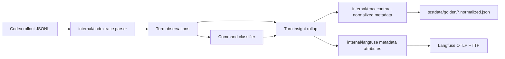

# Trace Insight Rollup Plan

## 1. Title and metadata
- Project name: Codex Langfuse Tracer
- Version: 1.0
- Owners: repository maintainer and implementation agent
- Date: 2026-05-01
- Document ID: CLT-INSIGHT-SRS-TEST-PLAN-001
- Purpose and scope: This plan defines a verification-first enhancement to the Go-based Codex Langfuse Tracer. The work adds compact derived metadata that improves understanding of Codex actions without adding new observation families, extra runtime paths, hidden reasoning export, per-file observation fanout, or configuration knobs. The implementation is limited to command classification, verification detection, turn outcome rollups, file impact rollups, failure metadata, Langfuse metadata projection, golden contract updates, and documentation.

## 2. Design consensus and trade-offs
| Topic | Verdict | Rationale grounded in repository/context constraints |
|---|---|---|
| More observations | AGAINST | `README.md` states the trace surface is intentionally small and excludes per-file fanout and native Codex OTEL runtime spans. More observation types would increase Langfuse noise and ingestion volume. |
| Compact metadata rollups | DECISION | Existing Go code already projects trace and observation metadata through `internal/langfuse/export.go`; adding derived metadata there improves filtering and table scanning without changing the observation graph. |
| Command classification | DECISION | `internal/codextrace` already builds `codex.tool.exec_command` observations. The fixed enum remains `test`, `build`, `lint`, `format`, `git`, `read`, `search`, `install`, `systemd`, `network`, and `other`; later expansion requires an ADR. |
| Verification detection | DECISION | A turn-level `verification_status` enum plus `verification_command_count` distinguishes `not_applicable`, `not_run`, `passed`, and `failed` without making chat-only turns look like failed validation. |
| File impact rollup | DECISION | `codex.tool.apply_patch` already carries full `changed_files`. Root metadata stays compact with counts, extensions, and touched test files; full paths remain on the patch observation. |
| Failure metadata | DECISION | Adding `failure_type`, `exit_code`, `status`, and normalized `duration_ms` to command observations makes failed runs filterable while excluding duplicate raw nested `duration` metadata. |
| Metadata placement | DECISION | Root insight metadata belongs on the trace or `codex.agent`; observation metadata describes one observation. Command-specific metadata stays on `codex.tool.exec_command`. |
| One insight implementation path | DECISION | `internal/codextrace/insight.go` is the only new implementation file for command classification, failure metadata, and turn rollups. Existing patch file metadata stays in `FileChangeMetadata`; `internal/tracecontract` and `internal/langfuse` call the insight package directly with no duplicate classifiers. |
| LLM-generated summaries | AGAINST | The repository should stay lean. Summaries would add model cost, nondeterminism, and another failure mode. |
| Hidden reasoning export | AGAINST | `README.md` and existing tests explicitly exclude hidden or encrypted reasoning content. This work must not change that boundary. |
| New config flags | AGAINST | The project has one automatic watcher path and minimal CLI flags. Derived metadata should be always-on because it is deterministic, bounded, and generated from already exported data. |
| Existing commands | DECISION | The repo already uses Go tests and shell checks. This plan uses `go test`, `bash -n`, `systemd-analyze --user verify`, and `git diff --check`; no package manager script or Makefile is introduced. |
| Test documentation tailoring | DECISION | This small repo uses one integrated plan file that maps ISO/IEC/IEEE 29148 requirements, ISO/IEC/IEEE 29119-3 test documentation, and ISO/IEC/IEEE 12207 implementation controls into one living artifact. |

## 3. PRD / stakeholder and system needs
- Problem: Current traces show prompts, final answers, terminal stream, tool calls, patch diffs, token usage, and timing, but the trace table and metadata filters do not quickly answer whether Codex edited files, ran verification commands, failed commands, or touched tests.
- Users:
  - Local operator running Codex CLI with the watcher service.
  - Maintainers reviewing whether Codex actions were reliable.
  - Future implementation agents debugging failed or unverified turns.
- Value:
  - Faster triage in Langfuse trace tables and filters.
  - Better distinction between thinking, editing, tool use, and verification.
  - More reliable production monitoring without storing hidden reasoning or noisy runtime spans.
- Business goals:
  - Preserve the lean trace contract while making Codex actions easier to audit.
  - Add deterministic metadata that supports filtering by verification, command kind, failure, and file impact.
  - Keep implementation small and testable with current Go tooling.
- Success metrics:
  - 100% of new `REQ-###` rows appear in the RTM.
  - 100% of new `TEST-###` tests pass locally.
  - `go test ./... -parallel 8` passes after implementation.
  - `go test ./... -run 'TestEval' -count=3 -parallel 8` passes after implementation.
  - Live smoke trace includes root metadata for `verification_command_count`, `verification_status`, `changed_file_count`, `changed_extensions`, `tool_count`, and command observation metadata for `command_kind`.
- Scope:
  - Add deterministic command classification in `internal/codextrace`.
  - Add command failure metadata in `internal/codextrace`.
  - Add turn insight rollup in `internal/codextrace/insight.go`.
  - Normalize existing apply-patch file path metadata in `internal/codextrace/format.go`.
  - Add root metadata to normalized contracts in `internal/tracecontract`.
  - Add Langfuse trace/agent metadata attributes in `internal/langfuse/export.go`.
  - Update `testdata/golden/complete-tools.normalized.json` and current tests.
  - Update `README.md` and `PROJECT_CONTEXT.md`.
- Non-goals:
  - No new observation types.
  - No per-file observation fanout.
  - No hidden reasoning export.
  - No LLM-generated action summaries.
  - No native Codex OTEL ingestion.
  - No new config file, environment flag, or CLI option.
  - No UI automation suite.
  - No language guessing beyond sorted changed file extensions.
  - No command-output substring classifiers for failure causes.
  - No full `changed_files` array in trace/root metadata; full paths remain on `codex.tool.apply_patch`.
- Dependencies:
  - Go module in `go.mod`.
  - Existing packages: `internal/codextrace`, `internal/tracecontract`, `internal/langfuse`, `test`, and `testdata`.
  - Existing commands: `go test`, `bash -n`, `systemd-analyze --user verify`, and `git diff --check`.
  - Langfuse credentials remain in `~/.codex/config.toml` and are not stored in the repo.
- Risks:
  - Classification can become too broad and noisy.
  - Metadata can duplicate existing patch metadata if not centralized.
  - Verification detection can be misleading if no verification command runs.
  - Root metadata can exceed Langfuse usefulness if large arrays are not bounded.
  - Golden contract drift can hide regressions if tests compare partial data only.
- Assumptions:
  - Command text in rollout JSONL remains available for `codex.tool.exec_command`.
  - `apply_patch` metadata remains the only structured source for changed files.
  - Linux/WSL2 with `systemd --user` remains the production target.
  - Existing live smoke flow remains `codex exec ... "Reply exactly: <marker>"`.
- Compute controls:
  ```yaml
  branch_limits:
    max_parallel_feature_branches: 1
    max_parallel_test_branches: 2
    rationale: keep one metadata implementation path while allowing independent package tests
  reflection_passes: 2
  early_stop%: 85
  ```

## 4. SRS / canonical requirements
### Functional requirements
- REQ-101 type func: The system shall classify each `codex.tool.exec_command` observation with a deterministic `command_kind` metadata value. Acceptance: supported values are `test`, `build`, `lint`, `format`, `git`, `read`, `search`, `install`, `systemd`, `network`, and `other`.
- REQ-102 type func: The system shall add verification metadata at turn level. Acceptance: `verification_command_count`, `verification_status`, `last_verification_command`, and `last_verification_status` are derived from command kinds `test`, `build`, `lint`, and `format`; `verification_status` is `not_applicable`, `not_run`, `passed`, or `failed`.
- REQ-103 type func: The system shall add turn outcome metadata. Acceptance: `tool_count`, `command_count`, `failed_command_count`, `patch_count`, and `changed_file_count` are derived from parsed observations.
- REQ-104 type func: The system shall add compact file impact metadata at turn level. Acceptance: `changed_file_count`, `changed_extensions`, and `touched_test_files` are derived from `apply_patch` metadata; full `changed_files` is not included in root metadata.
- REQ-105 type func: The system shall enrich command observations with failure metadata. Acceptance: command metadata includes `status`, `exit_code`, normalized `duration_ms`, and `failure_type` when source fields are available; raw nested `duration` is not exported in command metadata.
- REQ-106 type func: The system shall keep existing observation names unchanged. Acceptance: new insight data is metadata only and does not create new Langfuse observations.

### Non-functional requirements
- REQ-107 type nfr: The implementation shall stay lean and avoid new configuration. Acceptance: no new CLI flags, config fields, service units, or alternate export paths are added.
- REQ-108 type perf: Insight rollup computation shall complete within 10 milliseconds for the existing synthetic fixture. Acceptance: eval test records elapsed time below threshold.
- REQ-109 type security: The implementation shall not export hidden reasoning `content` or `encrypted_content`. Acceptance: existing reasoning tests continue to pass.
- REQ-110 type reliability: Metadata fields shall be deterministic for the same parsed turn. Acceptance: repeated contract generation produces byte-equivalent canonical JSON for metadata.

### Interface/API requirements
- REQ-111 type int: Langfuse projection shall attach insight rollup fields as `langfuse.trace.metadata.codex_insight.*` attributes on the trace or `codex.agent` path only. Acceptance: in-memory span tests observe those attributes on `codex.agent` and not on child observations.
- REQ-112 type int: Command observation metadata shall remain under `langfuse.observation.metadata`. Acceptance: in-memory span tests observe `command_kind`, `duration_ms`, and failure fields on `codex.tool.exec_command`.
- REQ-113 type int: Normalized golden contracts shall include root `metadata` and observation `metadata` fields for insight data. Acceptance: `testdata/golden/complete-tools.normalized.json` validates through `TestGoldenTraceContract`.

### Data requirements
- REQ-114 type data: `command_kind` shall be one of the enum values listed in REQ-101. Acceptance: classifier tests reject empty or unknown enum values except `other`.
- REQ-115 type data: `failure_type` shall be one of `none`, `nonzero_exit`, `timeout`, or `unknown`. Acceptance: failure classifier tests cover each value with deterministic status and exit-code input.
- REQ-116 type data: Full `changed_files` shall remain sorted, unique, and bounded on `codex.tool.apply_patch` observation metadata only. Acceptance: file rollup tests compare canonical order and confirm root metadata omits full paths.
- REQ-117 type data: `changed_extensions` shall be derived from changed file paths with deterministic lowercase extension extraction. Acceptance: duplicate extensions are removed, extensionless paths are omitted, and the result is sorted.

### Error handling and telemetry expectations
- REQ-118 type reliability: Missing command metadata shall not fail export. Acceptance: missing `status`, `exit_code`, or `duration` produces valid metadata with `command_kind=other`, `failure_type=unknown`, and no raw `duration` field.
- REQ-119 type nfr: Documentation shall list insight metadata fields and filter examples without changing the existing security caveats. Acceptance: docs static test finds required field names and existing hidden-reasoning caveat.

### Architecture diagram


C4-style ASCII representation:
```text
System: Codex Langfuse Tracer
  Container: internal/codextrace
    Parses rollout JSONL, builds observations, classifies commands, computes insight rollup.
  Container: internal/tracecontract
    Converts parsed turns into normalized contract JSON with root metadata.
  Container: internal/langfuse
    Projects insight metadata to Langfuse trace and observation attributes through Go OpenTelemetry.
  Container: testdata
    Stores language-agnostic rollout fixtures and normalized golden expectations.
  External system: Langfuse
    Receives the same observation graph with richer metadata.
```

## 5. Iterative implementation and test plan
Phase strategy:
- Freeze metadata contract before production code changes.
- Add command classification before rollup so later metadata uses one source of truth.
- Add rollup once command metadata is available.
- Project rollup into normalized contracts and Langfuse attributes.
- Update docs and execute final acceptance.
- Add git restore tags before and after each phase with `git tag -f restore/trace-insights-Pxx-start` and `git tag -f restore/trace-insights-Pxx-done`.

Risk register:
| Risk | Trigger | Mitigation |
|---|---|---|
| Classification overreach | Classifier adds many special cases | Keep enum fixed and table-driven in `internal/codextrace/insight_test.go` |
| Metadata duplication | Rollup logic repeats patch metadata extraction | Reuse parsed observation metadata from `apply_patch` and keep full paths on the patch observation |
| Misleading verification status | No verification command is treated as failure | Use `verification_status=not_applicable` for no-edit/no-verification turns and `verification_status=not_run` for edited turns without verification |
| Langfuse metadata drift | Contract and OTel attributes use different keys | Use the `codextrace.InsightRollup` values directly from tracecontract and langfuse |
| Privacy regression | Hidden reasoning appears in new metadata | Keep rollup based on observations and patch metadata only |

Suspension criteria:
- Stop phase execution when a RED command does not fail for the stated reason.
- Stop phase execution when GREEN requires a new observation family, config knob, or hidden reasoning access.
- Stop phase execution when a metric threshold would need to change; add an ADR before continuing.

Resumption criteria:
- Resume from the latest `restore/trace-insights-Pxx-start` or `restore/trace-insights-Pxx-done` tag.
- Record failed attempts in Section 11.
- Add an ADR before changing enum values, metric thresholds, or metadata key names.

### Phase P00: Metadata Contract Fixtures
- Scope and objectives: Add golden fixture expectations for root insight metadata and command observation metadata. Impacts `REQ-102`, `REQ-103`, `REQ-104`, `REQ-105`, `REQ-113`, `REQ-116`, `REQ-117`.
- Restore point before RED: `git tag -f restore/trace-insights-P00-start`.
- Step 1 RED: create/update `TEST-101` in `test/contract_fixture_test.go` for `REQ-113`; run `go test ./test -run TestGoldenInsightMetadataSchema -count=1`; expected FAIL because golden fixture metadata fields are absent.
- Step 2 GREEN: update `testdata/golden/complete-tools.normalized.json` with expected root `metadata` and command observation metadata; run `go test ./test -run TestGoldenInsightMetadataSchema -count=1`; expected PASS.
- Step 3 REFACTOR: move expected insight metadata key list into one helper in `test/contract_fixture_test.go`; run `go test ./test -run 'TestGoldenFixturesAreLanguageAgnostic|TestGoldenInsightMetadataSchema' -count=1`; expected PASS.
- Step 4 MEASURE: run `EVAL-101` command `go test ./test -run TestEvalInsightFixtureCoverage -count=3 -parallel 4`; expected thresholds met.
- Restore point after exit: `git tag -f restore/trace-insights-P00-done`.
- Exit gates:
  - Green criteria: golden fixture contains required metadata keys and no raw OTLP fields.
  - Yellow criteria: metadata key order differs but canonical JSON comparison passes.
  - Red criteria: fixture stores hidden reasoning content or introduces a new observation.
- Phase metrics:
  - Confidence %: 82, because fixture expectations are explicit before implementation.
  - Long-term robustness %: 80, because contract drift is blocked by golden checks.
  - Internal interactions: 2, test fixture and golden JSON.
  - External interactions: 0.
  - Complexity %: 18, metadata schema only.
  - Feature creep %: 4, no runtime behavior yet.
  - Technical debt %: 8, expected keys are centralized.
  - YAGNI score: 92, contract covers only selected metadata.
  - MoSCoW: Must.
  - Local/non-local scope: local.
  - Architectural changes count: 0.

### Phase P01: Command Classification and Failure Metadata
- Scope and objectives: Add deterministic command classification and failure metadata on `codex.tool.exec_command`. Impacts `REQ-101`, `REQ-105`, `REQ-114`, `REQ-115`, `REQ-118`.
- Restore point before RED: `git tag -f restore/trace-insights-P01-start`.
- Step 1 RED: create/update `TEST-102` in `internal/codextrace/insight_test.go` for `REQ-101` and `REQ-114`; run `go test ./internal/codextrace -run TestInsightCommandClassification -count=1`; expected FAIL because classifier functions are missing.
- Step 2 GREEN: implement minimal command classifier in `internal/codextrace/insight.go`; run `go test ./internal/codextrace -run TestInsightCommandClassification -count=1`; expected PASS.
- Step 3 RED: create/update `TEST-103` in `internal/codextrace/insight_test.go` for `REQ-105`, `REQ-115`, and `REQ-118`; run `go test ./internal/codextrace -run TestInsightFailureMetadata -count=1`; expected FAIL because failure metadata and normalized duration metadata are missing.
- Step 4 GREEN: add failure metadata computation, normalized `duration_ms`, and raw `duration` exclusion while building exec command observations; run `go test ./internal/codextrace -run TestInsightFailureMetadata -count=1`; expected PASS.
- Step 5 REFACTOR: replace duplicated command parsing snippets with one helper in `internal/codextrace/insight.go`; run `go test ./internal/codextrace -parallel 8`; expected PASS.
- Step 6 MEASURE: run `EVAL-102` command `go test ./internal/codextrace -run TestEvalInsightClassifierCoverage -count=3 -parallel 8`; expected thresholds met.
- Restore point after exit: `git tag -f restore/trace-insights-P01-done`.
- Exit gates:
  - Green criteria: every enum value has at least one deterministic test case.
  - Yellow criteria: one ambiguous command maps to `other` but all required cases pass.
  - Red criteria: classifier reads environment, filesystem, network, or command output beyond supplied strings.
- Phase metrics:
  - Confidence %: 85, because table-driven classifier coverage is direct.
  - Long-term robustness %: 82, because command kind enum is fixed.
  - Internal interactions: 3, parser, insight helper, tests.
  - External interactions: 0.
  - Complexity %: 30, string classifier with bounded rules.
  - Feature creep %: 6, no new runtime options.
  - Technical debt %: 10, one helper avoids duplicated classification.
  - YAGNI score: 88, no ML or config.
  - MoSCoW: Must.
  - Local/non-local scope: local.
  - Architectural changes count: 1.

### Phase P02: Turn Insight Rollup
- Scope and objectives: Compute root metadata from parsed observations: outcome counts, verification status, and file impact. Impacts `REQ-102`, `REQ-103`, `REQ-104`, `REQ-108`, `REQ-110`, `REQ-116`, `REQ-117`, `REQ-118`.
- Restore point before RED: `git tag -f restore/trace-insights-P02-start`.
- Step 1 RED: create/update `TEST-104` in `internal/codextrace/insight_test.go` for `REQ-102`, `REQ-103`, and `REQ-104`; run `go test ./internal/codextrace -run TestInsightRollup -count=1`; expected FAIL because turn rollup is missing.
- Step 2 GREEN: implement `InsightRollup` and `BuildInsightRollup` in `internal/codextrace/insight.go`; run `go test ./internal/codextrace -run TestInsightRollup -count=1`; expected PASS.
- Step 3 RED: create/update `TEST-105` in `internal/codextrace/insight_test.go` for `REQ-110`, `REQ-116`, and `REQ-117`; run `go test ./internal/codextrace -run TestInsightRollupDeterminism -count=1`; expected FAIL because sorting, dedupe, root path omission, and extension extraction rules are missing.
- Step 4 GREEN: sort existing patch path metadata in `internal/codextrace/format.go`, sort root extensions in `internal/codextrace/insight.go`, dedupe arrays, and keep full paths out of root metadata; run `go test ./internal/codextrace -run TestInsightRollupDeterminism -count=1`; expected PASS.
- Step 5 REFACTOR: keep rollup derivation in one file and remove repeated metadata key literals from tests through a local helper; run `go test ./internal/codextrace -parallel 8`; expected PASS.
- Step 6 MEASURE: run `EVAL-103` command `go test ./internal/codextrace -run TestEvalInsightRollupLatency -count=5 -parallel 4`; expected thresholds met.
- Restore point after exit: `git tag -f restore/trace-insights-P02-done`.
- Exit gates:
  - Green criteria: rollup fields match the complete-tools fixture.
  - Yellow criteria: extensionless changed files are omitted from `changed_extensions` while patch observation `changed_files` remains complete.
  - Red criteria: no-edit/no-verification turn reports `verification_status=failed` or edited/no-verification turn reports `verification_status=passed`.
- Phase metrics:
  - Confidence %: 86, because rollup is deterministic and fixture-backed.
  - Long-term robustness %: 84, because sorted metadata blocks nondeterministic traces.
  - Internal interactions: 4, observations, rollup, file metadata, tests.
  - External interactions: 0.
  - Complexity %: 38, count and enum derivation only.
  - Feature creep %: 5, no new observation family.
  - Technical debt %: 8, rollup derivation stays in one implementation file.
  - YAGNI score: 90, only high-signal fields are included.
  - MoSCoW: Must.
  - Local/non-local scope: local.
  - Architectural changes count: 1.

### Phase P03: Contract and Langfuse Projection
- Scope and objectives: Project insight rollup into normalized contracts and Langfuse metadata attributes. Impacts `REQ-106`, `REQ-111`, `REQ-112`, `REQ-113`.
- Restore point before RED: `git tag -f restore/trace-insights-P03-start`.
- Step 1 RED: create/update `TEST-106` in `test/contract_test.go` for `REQ-106` and `REQ-113`; run `go test ./test -run TestGoldenTraceContract -count=1`; expected FAIL because `internal/tracecontract` does not emit root metadata.
- Step 2 GREEN: add `Metadata` to `internal/tracecontract.Trace` and populate it from `codextrace.BuildInsightRollup`; run `go test ./test -run TestGoldenTraceContract -count=1`; expected PASS.
- Step 3 RED: create/update `TEST-107` in `internal/langfuse/spans_test.go` for `REQ-111` and `REQ-112`; run `go test ./internal/langfuse -run TestInsightMetadataExportedOnAgent -count=1`; expected FAIL because Langfuse attributes lack insight metadata.
- Step 4 GREEN: add root insight attributes to the `codex.agent` path only and command metadata to `codex.tool.exec_command`; run `go test ./internal/langfuse -run TestInsightMetadataExportedOnAgent -count=1`; expected PASS.
- Step 5 REFACTOR: centralize insight metadata key serialization in `internal/codextrace/insight.go` so `internal/tracecontract` and `internal/langfuse` use the same rollup fields without repeating root metadata on child observations; run `go test ./internal/langfuse ./internal/tracecontract ./test -parallel 8`; expected PASS.
- Step 6 MEASURE: run `EVAL-104` command `go test ./internal/langfuse -run TestEvalInsightMetadataProjection -count=3 -parallel 4`; expected thresholds met.
- Restore point after exit: `git tag -f restore/trace-insights-P03-done`.
- Exit gates:
  - Green criteria: normalized contract and `codex.agent` span contain the same root insight values, and command spans contain only command insight values.
  - Yellow criteria: Langfuse stores arrays as JSON strings but contract stores arrays structurally.
  - Red criteria: insight projection adds another observation, duplicates trace input/output on children, or repeats root rollup fields on child observations.
- Phase metrics:
  - Confidence %: 84, because both contract and OTel projection are tested.
  - Long-term robustness %: 82, because one rollup source avoids projection drift.
  - Internal interactions: 5, codextrace, tracecontract, langfuse, fixtures, tests.
  - External interactions: 0 in automated tests.
  - Complexity %: 42, serialization touches two projection paths.
  - Feature creep %: 5, metadata only.
  - Technical debt %: 10, shared keys reduce drift.
  - YAGNI score: 87, no new export mechanism.
  - MoSCoW: Must.
  - Local/non-local scope: local.
  - Architectural changes count: 1.

### Phase P04: Documentation and Final Acceptance
- Scope and objectives: Update docs, execute final local acceptance, and run the production smoke after automated checks pass. Impacts `REQ-107`, `REQ-109`, `REQ-119`.
- Restore point before RED: `git tag -f restore/trace-insights-P04-start`.
- Step 1 RED: create/update `TEST-108` in `test/docs_static_test.go` for `REQ-119`; run `go test ./test -run TestDocsTraceInsightMetadata -count=1`; expected FAIL because docs do not list insight metadata fields.
- Step 2 GREEN: update `README.md` and `PROJECT_CONTEXT.md` with metadata fields, filter examples, and unchanged security caveats; run `go test ./test -run TestDocsTraceInsightMetadata -count=1`; expected PASS.
- Step 3 RED: create/update `TEST-109` in `test/full_acceptance_test.go` for `REQ-107` and `REQ-109`; run `go test ./test -run TestFullAcceptance -count=1`; expected FAIL because full acceptance lacks insight metadata assertions.
- Step 4 GREEN: add final acceptance assertions for no new config flags, hidden reasoning exclusion, root metadata, and command metadata; run `go test ./test -run TestFullAcceptance -count=1`; expected PASS.
- Step 5 REFACTOR: remove duplicated required metadata key lists from docs and fixture tests by keeping one test helper list per package; run `go test ./... -parallel 8`; expected PASS.
- Step 6 MEASURE: run `EVAL-105` command `go test ./... -run 'TestEval' -count=3 -parallel 8`; expected thresholds met.
- Restore point after exit: `git tag -f restore/trace-insights-P04-done`.
- Exit gates:
  - Green criteria: all automated checks pass and docs describe the metadata contract.
  - Yellow criteria: live smoke is deferred but fake OTLP and contract tests pass.
  - Red criteria: full suite fails, docs weaken hidden reasoning caveat, or new config is introduced.
- Phase metrics:
  - Confidence %: 90, because full suite and eval suite close the change.
  - Long-term robustness %: 86, because docs, golden tests, and projection tests all cover the contract.
  - Internal interactions: 7, all modified packages plus docs.
  - External interactions: 1 live Langfuse smoke.
  - Complexity %: 45, final acceptance spans packages.
  - Feature creep %: 4, metadata only.
  - Technical debt %: 8, no new runtime path.
  - YAGNI score: 90, high-signal fields only.
  - MoSCoW: Must.
  - Local/non-local scope: non-local.
  - Architectural changes count: 1.

## 6. Evaluations
```yaml
evals:
  - id: EVAL-101
    purpose: dev
    metrics:
      required_metadata_key_coverage: 1.0
      raw_otlp_field_count_max: 0
      new_observation_count_max: 0
    thresholds:
      pass_rate: 1.0
    seeds: [101, 102, 103]
    runtime_budget: 20s
  - id: EVAL-102
    purpose: dev
    metrics:
      command_kind_enum_coverage: 1.0
      failure_type_enum_coverage: 1.0
    thresholds:
      pass_rate: 1.0
    seeds: [201, 202, 203]
    runtime_budget: 20s
  - id: EVAL-103
    purpose: dev
    metrics:
      rollup_latency_ms_p95_max: 10
      deterministic_metadata_rate: 1.0
    thresholds:
      pass_rate: 1.0
    seeds: [301, 302, 303, 304, 305]
    runtime_budget: 30s
  - id: EVAL-104
    purpose: dev
    metrics:
      langfuse_agent_metadata_key_coverage: 1.0
      command_observation_metadata_key_coverage: 1.0
    thresholds:
      pass_rate: 1.0
    seeds: [401, 402, 403]
    runtime_budget: 30s
  - id: EVAL-105
    purpose: holdout
    metrics:
      full_eval_pass_rate: 1.0
      go_test_runtime_seconds_p95_max: 120
    thresholds:
      pass_rate: 1.0
    seeds: [501, 502, 503]
    runtime_budget: 180s
```

## 7. Tests
### 7.1 Test inventory
- Current repository test frameworks/runners:
  - Go `testing` under `cmd/`, `internal/`, and `test/`.
  - Shell syntax validation with `bash -n install.sh uninstall.sh`.
  - systemd unit validation with `systemd-analyze --user verify systemd/codex-langfuse-watch.service`.
  - Git whitespace validation with `git diff --check`.
- Current package.json scripts: no `package.json` exists.
- Current Makefile targets: no `Makefile` exists.
- Current scripts directory: no `scripts/` directory exists.
- Current CI config: no `.github/workflows` files exist.
- Existing exact commands:
  - `go test ./... -parallel 8`
  - `go test ./... -run 'TestEval' -count=3 -parallel 8`
  - `bash -n install.sh uninstall.sh`
  - `systemd-analyze --user verify systemd/codex-langfuse-watch.service`
  - `git diff --check`
- Test file globs:
  - `cmd/**/*.go`
  - `internal/**/*.go`
  - `test/**/*.go`
  - `testdata/rollouts/*.jsonl`
  - `testdata/golden/*.normalized.json`

### 7.2 Test suites overview
| name | purpose | runner | command | runtime budget | when it runs |
|---|---|---|---|---|---|
| Unit | command classifier, failure metadata, rollup derivation | Go `testing` | `go test ./internal/codextrace -parallel 8` | 30s | pre-commit and CI |
| Integration | normalized contract and Langfuse metadata projection | Go `testing` | `go test ./internal/langfuse ./internal/tracecontract ./test -parallel 8` | 60s | pre-commit and CI |
| E2E | full repo acceptance over fixtures and service text | Go `testing` | `go test ./test -run TestFullAcceptance -count=1` | 45s | CI |
| Perf | rollup and projection evals | Go `testing` | `go test ./... -run 'TestEval' -count=3 -parallel 8` | 180s | release gate |
| Data Drift | golden metadata and fixture schema | Go `testing` | `go test ./test -run 'TestGoldenFixtures|TestGoldenTraceContract|TestGoldenInsightMetadataSchema' -count=1` | 45s | pre-commit and CI |
| Static | docs, service, shell, diff checks | Go `testing` and shell | `go test ./test -run 'TestDocs|TestFullAcceptance' -count=1` | 45s | pre-commit and CI |

### 7.3 Test definitions
- id: TEST-101
  - name: Golden insight metadata schema
  - type: static
  - verifies: `REQ-113`
  - location: `test/contract_fixture_test.go`
  - command: `go test ./test -run TestGoldenInsightMetadataSchema -count=1`
  - fixtures/mocks/data: `testdata/golden/complete-tools.normalized.json`
  - deterministic controls: fixed required key list in test helper; no network; no local home reads
  - pass_criteria: golden root metadata contains required compact insight keys, root metadata omits `changed_files`, command observation metadata contains `command_kind` and `duration_ms`, no raw OTLP or raw `duration` fields are present, and file contains `// TEST-101`
  - expected_runtime: 5s
- id: TEST-102
  - name: Insight command classification
  - type: unit
  - verifies: `REQ-101`, `REQ-114`
  - location: `internal/codextrace/insight_test.go`
  - command: `go test ./internal/codextrace -run TestInsightCommandClassification -count=1`
  - fixtures/mocks/data: table-driven command strings for every enum value
  - deterministic controls: no environment, filesystem, or network reads
  - pass_criteria: each command maps to expected `command_kind`, unknown commands map to `other`, and file contains `// TEST-102`
  - expected_runtime: 3s
- id: TEST-103
  - name: Insight failure metadata
  - type: unit
  - verifies: `REQ-105`, `REQ-115`, `REQ-118`
  - location: `internal/codextrace/insight_test.go`
  - command: `go test ./internal/codextrace -run TestInsightFailureMetadata -count=1`
  - fixtures/mocks/data: synthetic exec payload maps with status, exit code, and duration
  - deterministic controls: fixed payloads; no time.Now use
  - pass_criteria: status, exit code, duration_ms, and failure_type match expected enum values, missing fields produce `failure_type=unknown`, raw `duration` is absent from metadata, and file contains `// TEST-103`
  - expected_runtime: 3s
- id: TEST-104
  - name: Insight rollup
  - type: unit
  - verifies: `REQ-102`, `REQ-103`, `REQ-104`
  - location: `internal/codextrace/insight_test.go`
  - command: `go test ./internal/codextrace -run TestInsightRollup -count=1`
  - fixtures/mocks/data: `testdata/rollouts/complete-tools.jsonl`
  - deterministic controls: fixed rollout fixture; no network; no local home reads
  - pass_criteria: rollup returns expected tool counts, command counts, `verification_status`, verification command fields, and compact file impact values, and file contains `// TEST-104`
  - expected_runtime: 5s
- id: TEST-105
  - name: Insight rollup determinism
  - type: unit
  - verifies: `REQ-110`, `REQ-116`, `REQ-117`
  - location: `internal/codextrace/insight_test.go`
  - command: `go test ./internal/codextrace -run TestInsightRollupDeterminism -count=1`
  - fixtures/mocks/data: synthetic turn with unsorted duplicate changed files and mixed extensions
  - deterministic controls: fixed file paths and repeated rollup calls
  - pass_criteria: patch observation `changed_files` remains sorted and unique, root metadata omits `changed_files`, changed extensions are sorted and unique, extensionless paths are omitted from `changed_extensions`, canonical JSON is identical across repeated calls, and file contains `// TEST-105`
  - expected_runtime: 3s
- id: TEST-106
  - name: Golden trace contract includes insight metadata
  - type: integration
  - verifies: `REQ-106`, `REQ-113`
  - location: `test/contract_test.go`
  - command: `go test ./test -run TestGoldenTraceContract -count=1`
  - fixtures/mocks/data: `testdata/manifest.json`, `testdata/rollouts/*.jsonl`, `testdata/golden/*.normalized.json`
  - deterministic controls: fixed fixtures, stable JSON comparison, no real Langfuse, no real home reads
  - pass_criteria: normalized Go output matches golden metadata and observations without new observation names, and file contains `// TEST-106`
  - expected_runtime: 10s
- id: TEST-107
  - name: Insight metadata exported on agent
  - type: integration
  - verifies: `REQ-111`, `REQ-112`
  - location: `internal/langfuse/spans_test.go`
  - command: `go test ./internal/langfuse -run TestInsightMetadataExportedOnAgent -count=1`
  - fixtures/mocks/data: complete-tools fixture parsed through in-memory span exporter
  - deterministic controls: fixed trace/span IDs, fixed rollout fixture, no HTTP server
  - pass_criteria: `codex.agent` span contains `langfuse.trace.metadata.codex_insight.*` attributes, child observations do not repeat root insight attributes, `codex.tool.exec_command` metadata contains command insight fields, and file contains `// TEST-107`
  - expected_runtime: 5s
- id: TEST-108
  - name: Docs trace insight metadata
  - type: static
  - verifies: `REQ-119`
  - location: `test/docs_static_test.go`
  - command: `go test ./test -run TestDocsTraceInsightMetadata -count=1`
  - fixtures/mocks/data: `README.md`, `PROJECT_CONTEXT.md`
  - deterministic controls: fixed required and forbidden string lists
  - pass_criteria: docs list insight metadata fields, preserve hidden reasoning caveat, do not add native OTEL guidance, and file contains `// TEST-108`
  - expected_runtime: 3s
- id: TEST-109
  - name: Full acceptance with insight metadata
  - type: e2e
  - verifies: `REQ-107`, `REQ-109`
  - location: `test/full_acceptance_test.go`
  - command: `go test ./test -run TestFullAcceptance -count=1`
  - fixtures/mocks/data: existing fixture corpus and service unit file
  - deterministic controls: no real Langfuse, no real Codex, no local home reads
  - pass_criteria: acceptance confirms root metadata and command metadata are present in their intended locations, no new config flags exist, hidden reasoning sentinel is absent, and file contains `// TEST-109`
  - expected_runtime: 10s

### 7.4 Manual checks, optional
- CHECK-101: Live Langfuse smoke with insight metadata
  - Procedure:
    - Execute `./install.sh`.
    - Execute `codex exec --model gpt-5.3-codex-spark -c model_reasoning_effort=low --skip-git-repo-check "Reply exactly: trace-insight-smoke"`.
    - Execute `journalctl --user -u codex-langfuse-watch.service -n 80 --no-pager`.
    - Fetch the exported trace from `GET <LANGFUSE_HOST>/api/public/traces/<trace_id>` using credentials in `~/.codex/config.toml`.
    - Confirm trace input/output match the marker and root metadata contains `codex_insight.verification_command_count`, `codex_insight.verification_status`, `codex_insight.tool_count`, and command observation `command_kind` when a command is present.

## 8. Data contract
Schema snapshot:
```yaml
Trace:
  schema_version: 1
  name: codex.turn.transcript
  metadata:
    tool_count: integer
    command_count: integer
    failed_command_count: integer
    patch_count: integer
    changed_file_count: integer
    verification_command_count: integer
    verification_status: enum
    last_verification_command: string
    last_verification_status: string
    changed_extensions: [string]
    touched_test_files: [string]
Observation metadata for codex.tool.exec_command:
  command_kind: enum
  status: string
  exit_code: integer
  duration_ms: integer
  failure_type: enum
Observation metadata for codex.tool.apply_patch:
  changed_files: [string]
  file_change_types: object
  changed_file_count: integer
Langfuse attribute prefix:
  langfuse.trace.metadata.codex_insight.<field>
```
- Invariants:
  - Root metadata is derived only from parsed observations.
  - No new observation names are introduced.
  - Root metadata contains compact file summaries only and omits full `changed_files`.
  - Patch observation `changed_files`, root `changed_extensions`, and root `touched_test_files` are sorted and unique.
  - `verification_status=not_applicable` when no verification command ran and no patch was applied.
  - `verification_status=not_run` when a patch was applied and no verification command ran.
  - `verification_status=passed` when at least one verification command ran and no verification command failed.
  - `verification_status=failed` when at least one verification command failed.
  - Extensionless changed files remain in patch observation `changed_files` and are omitted from root `changed_extensions`.
  - Raw nested command `duration` is not exported; command metadata uses `duration_ms` only.
- Privacy/data quality constraints:
  - Hidden reasoning `content` and `encrypted_content` are never read for metadata.
  - Metadata uses redacted command text where text is exported.
  - Arrays are bounded by existing changed-file metadata from `apply_patch`.
  - Failure classification is deterministic and does not call external services.

## 9. Reproducibility
- Seeds:
  - Classifier eval seeds: `201`, `202`, `203`.
  - Rollup eval seeds: `301`, `302`, `303`, `304`, `305`.
  - Projection eval seeds: `401`, `402`, `403`.
- Hardware assumptions:
  - Linux/WSL2 workstation with Go installed.
  - `systemd --user` available for service validation.
- OS/driver/container tag:
  - Linux WSL2 target.
  - Self-hosted Langfuse remains external to this repo.
- Relevant environment variables:
  - `CODEX_HOME` for test-isolated Codex home paths.
  - `HOME` for default `~/.codex` resolution.
  - `XDG_CONFIG_HOME` for service install tests.
  - `LANGFUSE_HOST`, `LANGFUSE_PUBLIC_KEY`, and `LANGFUSE_SECRET_KEY` are read from `~/.codex/config.toml`, not from this repo.

## 10. Requirements Traceability Matrix
| Phase | REQ-### | TEST-### | Test Path | Command |
|---|---|---|---|---|
| P01 | REQ-101 | TEST-102 | `internal/codextrace/insight_test.go` | `go test ./internal/codextrace -run TestInsightCommandClassification -count=1` |
| P02 | REQ-102 | TEST-104 | `internal/codextrace/insight_test.go` | `go test ./internal/codextrace -run TestInsightRollup -count=1` |
| P02 | REQ-103 | TEST-104 | `internal/codextrace/insight_test.go` | `go test ./internal/codextrace -run TestInsightRollup -count=1` |
| P02 | REQ-104 | TEST-104 | `internal/codextrace/insight_test.go` | `go test ./internal/codextrace -run TestInsightRollup -count=1` |
| P01 | REQ-105 | TEST-103 | `internal/codextrace/insight_test.go` | `go test ./internal/codextrace -run TestInsightFailureMetadata -count=1` |
| P03 | REQ-106 | TEST-106 | `test/contract_test.go` | `go test ./test -run TestGoldenTraceContract -count=1` |
| P04 | REQ-107 | TEST-109 | `test/full_acceptance_test.go` | `go test ./test -run TestFullAcceptance -count=1` |
| P02 | REQ-108 | TEST-105 | `internal/codextrace/insight_test.go` | `go test ./internal/codextrace -run TestInsightRollupDeterminism -count=1` |
| P04 | REQ-109 | TEST-109 | `test/full_acceptance_test.go` | `go test ./test -run TestFullAcceptance -count=1` |
| P02 | REQ-110 | TEST-105 | `internal/codextrace/insight_test.go` | `go test ./internal/codextrace -run TestInsightRollupDeterminism -count=1` |
| P03 | REQ-111 | TEST-107 | `internal/langfuse/spans_test.go` | `go test ./internal/langfuse -run TestInsightMetadataExportedOnAgent -count=1` |
| P03 | REQ-112 | TEST-107 | `internal/langfuse/spans_test.go` | `go test ./internal/langfuse -run TestInsightMetadataExportedOnAgent -count=1` |
| P00 | REQ-113 | TEST-101 | `test/contract_fixture_test.go` | `go test ./test -run TestGoldenInsightMetadataSchema -count=1` |
| P01 | REQ-114 | TEST-102 | `internal/codextrace/insight_test.go` | `go test ./internal/codextrace -run TestInsightCommandClassification -count=1` |
| P01 | REQ-115 | TEST-103 | `internal/codextrace/insight_test.go` | `go test ./internal/codextrace -run TestInsightFailureMetadata -count=1` |
| P02 | REQ-116 | TEST-105 | `internal/codextrace/insight_test.go` | `go test ./internal/codextrace -run TestInsightRollupDeterminism -count=1` |
| P02 | REQ-117 | TEST-105 | `internal/codextrace/insight_test.go` | `go test ./internal/codextrace -run TestInsightRollupDeterminism -count=1` |
| P01 | REQ-118 | TEST-103 | `internal/codextrace/insight_test.go` | `go test ./internal/codextrace -run TestInsightFailureMetadata -count=1` |
| P04 | REQ-119 | TEST-108 | `test/docs_static_test.go` | `go test ./test -run TestDocsTraceInsightMetadata -count=1` |

## 11. Execution log template
### Phase Status
- Phase:
- Status: Pending/Done

### Completed Steps
- Step:
- Command:
- Result:

### Quantitative Results
- Metric:
- Mean:
- Std:
- 95% CI:
- Threshold:

### Issues/Resolutions
- Issue:
- Root cause:
- Resolution:
- Retest command:

### Failed Attempts
- Attempt:
- Observed result:
- Expected result:
- Change made:

### Deviations
- Deviation:
- Impact:
- Approval or ADR:

### Lessons Learned
- Lesson:
- Future impact:

### ADR Updates
- ADR:
- Decision:
- Metric threshold impact:

## 12. Appendix: ADR index
- ADR-101: Add insight metadata as deterministic derived metadata only; do not add new observations.
- ADR-102: Keep command classification rule-based with a fixed enum and no configuration surface.
- ADR-103: Treat verification as a command-derived `verification_status` enum with `not_applicable`, `not_run`, `passed`, and `failed`.
- ADR-104: Keep root file impact compact; full `changed_files` stays on existing `codex.tool.apply_patch` metadata and no per-file observations are added.
- ADR-105: Normalize command timing to `duration_ms` metadata and omit raw nested command `duration`.
- ADR-106: Attach root insight metadata only to the trace or `codex.agent`; child observations keep observation-specific metadata.
- ADR-107: Any metadata key rename, enum expansion, or metric threshold change requires an ADR update.

## 13. Consistency check
- All `REQ-###` identifiers appear in the RTM.
- All `TEST-###` identifiers referenced in phases or RTM are defined in Section 7.3.
- Every phase has RED, GREEN, REFACTOR, and MEASURE steps.
- Every phase has populated metrics.
- Every verification step includes a `TEST-###` or `EVAL-###` plus an exact command.
- All commands are grounded in the current Go repository and existing validation commands.
- No new runtime path, config knob, native Codex OTEL path, per-file observation fanout, or hidden reasoning export is planned.
