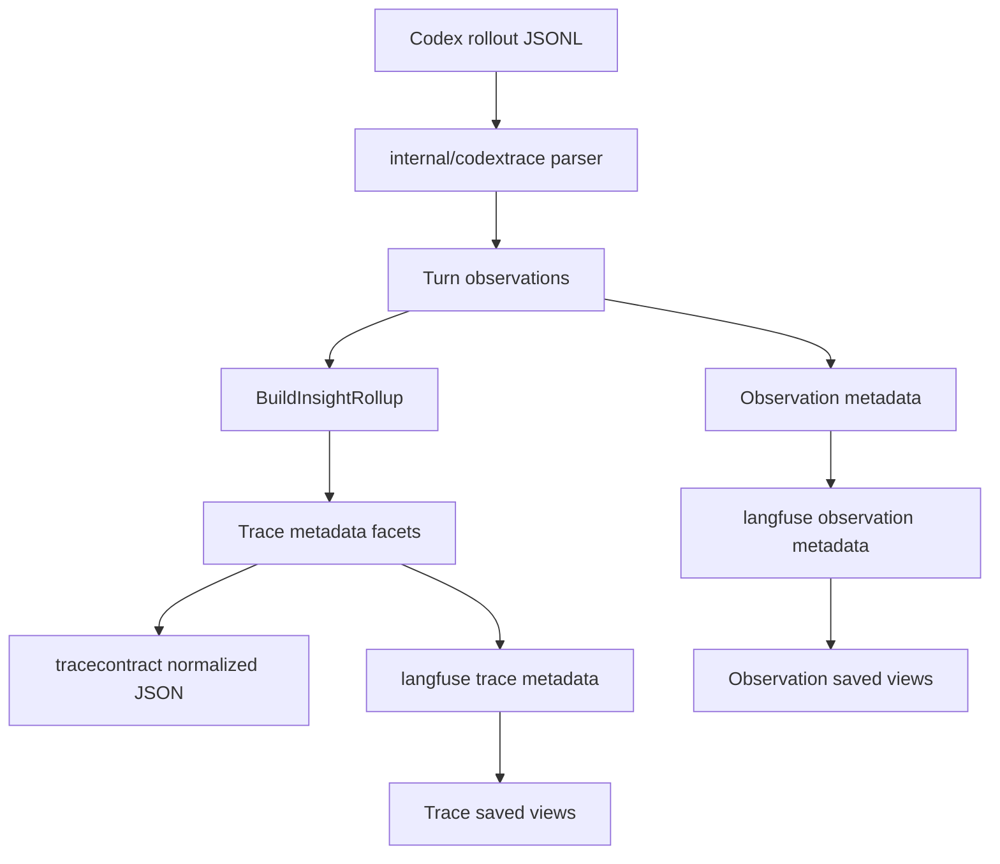

# Trace Navigation Facets and Saved Langfuse Views Plan

## 1. Title and Metadata

- Project name: Codex Langfuse Tracer
- Version: 1.1
- Owners: repository maintainer and implementation agent
- Date: 2026-05-01
- Document ID: CLT-NAV-FACETS-PLAN-001
- Purpose and scope: Add a small, deterministic set of trace-level navigation facets so Langfuse can filter Codex turns by read-only/file-changing state, command family, web search usage, and verification state. Keep detailed command and patch facts on existing observations. Use one implementation path: parser observations feed `internal/codextrace.BuildInsightRollup`, rollup metadata feeds `internal/tracecontract` and `internal/langfuse/export.go`.

## 2. Design Consensus and Trade-Offs

| Topic | Verdict | Rationale |
|---|---|---|
| One metadata path | DECISION | `BuildInsightRollup(turn).Metadata()` is already the repo-owned place for trace-level derived metadata. Do not add adapters, side registries, exporter-specific classifiers, or Langfuse-only logic. |
| Observation detail vs trace navigation | DECISION | `command_kind`, `exit_code`, `duration_ms`, and file lists stay on observations. Trace metadata gets only bounded booleans, counts, and small sorted arrays for filtering. |
| Command family facets | FOR | Existing `ClassifyCommand` already emits `test`, `build`, `lint`, `format`, `git`, `read`, `search`, `install`, `systemd`, `network`, and `other`. Reusing that single classifier makes trace filters possible without new command parsing. |
| Count plus boolean fields | DECISION | Counts are the canonical values; booleans are derived from counts in one helper because Langfuse metadata filters are easier for humans with `ran_search_command equals true`. This is intentional data denormalization, not duplicated logic. |
| Tool family matrix | AGAINST | A broad `tool_names`/`used_mcp_tool`/`used_tool_search` matrix is not needed for the immediate navigation problem. Keep `tool_count`, `patch_count`, and add only `used_web_search`/`web_search_count` because web search is not a shell command. |
| Read-only meaning | DECISION | `is_read_only` means no observed local file changes in the exported turn. It does not mean no network access, no install command, or operational safety. |
| Install and network commands | DECISION | `ran_install_command` and `ran_network_command` are activity facets. They do not alter `is_read_only` because this exporter does not run a working-tree diff. |
| Unknown commands | DECISION | Unknown shell commands classify as the explicit `other` command family. Do not add fallback parsers or command-output heuristics. |
| Saved views | FOR | Saved Langfuse views are the direct solution for repeated metadata filters. The repo should document the view names and filters, but not try to automate Langfuse UI state. |
| Compatibility branches | AGAINST | No legacy names, no old/new schema toggle, no migration shim. This repo is local tooling; one current metadata contract is enough. |

## 3. PRD / Stakeholder and System Needs

- Problem:
  - In Langfuse, `command_kind=search` is visible on `codex.tool.exec_command` observations, not on trace rows.
  - The operator needs trace-table filters for common Codex workflows: read-only investigation, file-changing turns, search/read commands, network/install commands, web search, and failed verification.
  - Repeated custom metadata filters should be saved as Langfuse views.
- Users:
  - Local operator reviewing Codex CLI turns in Langfuse.
  - Maintainer evolving the trace contract.
  - Future implementation agent using the plan as the source of implementation scope.
- Value:
  - Find relevant turns without opening every trace.
  - Keep detailed drill-down on observations.
  - Keep the codebase small by extending the current rollup path only.
- Success metrics:
  - `go test ./internal/codextrace ./internal/langfuse ./internal/tracecontract ./test -count=1` passes.
  - `go test ./... -count=1` passes before completion.
  - Root trace metadata contains the fields listed in Section 8 and no raw command output, raw diffs, hidden reasoning, or full `changed_files`.
  - Langfuse trace filters can use `codex_insight.is_read_only`, `codex_insight.has_file_changes`, `codex_insight.ran_search_command`, and `codex_insight.used_web_search`.
  - Langfuse observation filters continue to use `command_kind` on `codex.tool.exec_command`.
- Scope:
  - Update `internal/codextrace/insight.go`.
  - Update focused tests in `internal/codextrace`, `internal/langfuse`, `internal/tracecontract`, and `test`.
  - Update golden fixtures only through the existing contract flow.
  - Update `README.md`, `TESTING.md`, and `PROJECT_CONTEXT.md` with filter and saved-view guidance.
- Non-goals:
  - No new observation names.
  - No new config flags, environment toggles, package scripts, or Makefile targets.
  - No generalized facet framework.
  - No Langfuse UI automation.
  - No per-file observations.
  - No full changed-file list on trace metadata.
  - No command-output based classifier.
  - No working-tree scan during export.
- Dependencies:
  - Go module `github.com/kirilligum/codex-langfuse-tracer`.
  - Existing packages: `internal/codextrace`, `internal/langfuse`, `internal/tracecontract`, `test`.
  - Existing commands in `TESTING.md`, primarily `go test ./... -count=1`, package-scoped `go test`, and `git diff --check`.
  - Existing local Langfuse project at `http://localhost:3000/project/codex-local` for human saved-view setup.
- Risks:
  - Too many trace metadata fields make the table harder to use.
  - Boolean names can imply safety if docs are vague.
  - Duplicate command-kind lists can drift if tests rebuild classifier logic independently.
  - Saved views can accidentally include temporary `Session ID` filters.
- Assumptions:
  - `exec_command_end`, `patch_apply_end`, and `web_search_end` rollout events keep their current parser shape.
  - `apply_patch` remains the source for structured file-change data.
  - `insightMetadataAttributes(turn)` continues to project all rollup metadata as `langfuse.trace.metadata.codex_insight.<field>`.
- Compute controls:
  ```yaml
  branch_limits:
    max_parallel_feature_branches: 1
    max_parallel_test_branches: 1
  reflection_passes: 1
  early_stop%: 0
  ```

## 4. SRS / Canonical Requirements

### Functional Requirements

- REQ-201 type func: Derive file-state facets on root trace metadata. Acceptance: `has_file_changes == (patch_count > 0 || changed_file_count > 0)` and `is_read_only == !has_file_changes`.
- REQ-202 type func: Derive command-family trace facets from existing `command_kind`. Acceptance: metadata includes `command_kinds`, `ran_<kind>_command`, and `<kind>_command_count` for every existing command kind.
- REQ-203 type func: Derive web-search trace facets from existing `codex.tool.web_search` observations. Acceptance: metadata includes `used_web_search` and `web_search_count`.
- REQ-204 type func: Preserve observation-level command and patch details. Acceptance: `codex.tool.exec_command` keeps `command_kind`, `status`, `exit_code`, `duration_ms`, and `failure_type`; `codex.tool.apply_patch` keeps file-change metadata.
- REQ-205 type func: Document saved Langfuse views for trace and observation filters. Acceptance: docs include exact view names and filters.
- REQ-206 type func: Document the difference between trace filters and observation filters. Acceptance: docs say `codex_insight.ran_search_command` filters traces and `command_kind=search` filters observations.

### Non-Functional Requirements

- REQ-207 type nfr: Keep facets always-on and deterministic. Acceptance: no new config, environment, or CLI option controls the fields.
- REQ-208 type security: Keep trace metadata bounded and non-sensitive. Acceptance: root metadata omits raw command output, raw diffs, full `changed_files`, hidden reasoning, encrypted reasoning, and secret sentinels.
- REQ-209 type maintainability: Use one table-driven implementation for command families. Acceptance: command-kind iteration is centralized in `internal/codextrace/insight.go`; tests use exported or local expected values without reimplementing classifier rules.
- REQ-210 type reliability: Missing optional observation metadata does not fail export. Acceptance: missing status, duration, or exit code still produces valid count and boolean fields.

### Interface/API Requirements

- REQ-211 type int: Project trace facets through the existing Langfuse metadata path. Acceptance: only the root `codex.agent` span receives `langfuse.trace.metadata.codex_insight.<field>` attributes.
- REQ-212 type int: Keep current trace and observation names. Acceptance: no rename of `codex.turn.transcript`, `codex.tool.exec_command`, `codex.tool.apply_patch`, or `codex.tool.web_search`.

### Data Requirements

- REQ-213 type data: Emit stable fixed keys for command counts and booleans. Acceptance: absent command kinds emit count `0` and boolean `false`.
- REQ-214 type data: Sort array fields. Acceptance: `command_kinds`, `changed_extensions`, and `touched_test_files` are sorted and duplicate-free.

### Error Handling and Telemetry Expectations

- REQ-215 type reliability: Unknown commands use the explicit `other` family. Acceptance: `other_command_count` increments and `ran_other_command=true`.
- REQ-216 type int: Do not add a second serialization path. Acceptance: `internal/tracecontract` and `internal/langfuse` consume `BuildInsightRollup(turn).Metadata()`.

### Architecture Diagram



C4-style ASCII representation:

```text
Person: Operator
  Uses Langfuse to filter Codex turns and inspect command/tool details.

System: Codex Langfuse Tracer
  Parses Codex rollout JSONL and emits Langfuse traces.

Container: internal/codextrace
  Owns parsing, command classification, and trace metadata rollup.

Container: internal/tracecontract
  Normalizes traces for golden contract tests.

Container: internal/langfuse
  Projects rollup metadata onto the root Langfuse span and keeps observation metadata on child spans.

External system: Langfuse
  Stores traces, observations, metadata filters, and saved views.
```

## 5. Iterative Implementation and Test Plan

### Strategy

- Add failing tests before implementation.
- Keep implementation in `internal/codextrace/insight.go` unless an existing test proves export/contract wiring needs a narrow change elsewhere.
- Use a single command-kind slice/helper to populate counts, booleans, and sorted arrays.
- Let `internal/langfuse/export.go` stay generic over rollup metadata.
- Do not introduce schema aliases, migration branches, or compatibility toggles.
- Add restore tags before phase transitions:
  ```bash
  git tag -f restore/trace-navigation-facets-Pxx-start
  git tag -f restore/trace-navigation-facets-Pxx-done
  ```

### Risk Register

| Risk | Trigger | Mitigation |
|---|---|---|
| Metadata bloat | New tool matrices or path-like values are added | Limit new fields to Section 8. |
| Misleading read-only label | Docs imply safety or no network activity | Tests and docs define read-only as no observed local file changes. |
| Classifier drift | Tests copy classifier rules | Tests assert outputs from representative observations; implementation owns classifier rules. |
| Export duplication | Langfuse code branches per field | Exporter test requires generic `codex_insight` projection. |
| Saved-view drift | Views include active session filter | Saved-view instructions explicitly clear temporary filters first. |

### Suspension and Resumption Criteria

- Suspend if baseline `go test ./internal/codextrace ./internal/langfuse ./internal/tracecontract ./test -count=1` fails before new edits.
- Suspend if a planned field requires raw output, diffs, or working-tree scans.
- Resume from the latest restore tag after reviewing `git status --short`.

### Phase P00: Rollup Facets

Scope and objectives: Add file-state, command-family, and web-search facets in `internal/codextrace`. Impacted requirements: REQ-201, REQ-202, REQ-203, REQ-207, REQ-209, REQ-210, REQ-213, REQ-214, REQ-215.

- Step 0: create restore point with `git tag -f restore/trace-navigation-facets-P00-start`.
- Step 1 RED: create/update `TEST-201` in `internal/codextrace/insight_test.go` for REQ-201, REQ-202, REQ-203, REQ-213, REQ-214, and REQ-215; run `go test ./internal/codextrace -run TestInsightNavigationFacets -count=1`; expected FAIL because root metadata does not yet emit the new fields.
- Step 2 GREEN: implement the minimal rollup changes in `internal/codextrace/insight.go`; run `go test ./internal/codextrace -run TestInsightNavigationFacets -count=1`; expected PASS.
- Step 3 REFACTOR: centralize command-kind iteration and metadata key creation in one helper; run `go test ./internal/codextrace -run 'TestInsightNavigationFacets|TestInsightCommandClassification|TestInsightRollupDeterminism' -count=1`; expected PASS.
- Step 4 MEASURE: run `go test ./internal/codextrace -count=1`; expected PASS.
- Step 5: create restore point with `git tag -f restore/trace-navigation-facets-P00-done`.

Exit gates:

- Green: one table-driven rollup path emits all Section 8 fields.
- Yellow: fields pass unit tests but docs are not updated; continue to P02.
- Red: implementation adds a second classifier, scans the working tree, or adds a config toggle.

Phase metrics:

| Metric | Estimated value | Rationale |
|---|---:|---|
| Confidence % | 88 | Reuses existing observations and classifier. |
| Long-term robustness % | 86 | One helper owns derived command metadata. |
| Internal interactions | 2 | `insight.go` and its tests. |
| External interactions | 0 | No network or Langfuse call. |
| Complexity % | 28 | Adds one fixed metadata family. |
| Feature creep % | 8 | Web search is the only non-command facet added. |
| Technical debt % | 7 | No parallel implementation path. |
| YAGNI score | 88 | Fields directly map to requested filters. |
| MoSCoW | Must | Core trace navigation behavior. |
| Local/non-local scope | Local | `internal/codextrace` only. |
| Architectural changes count | 0 | Existing rollup architecture remains. |

### Phase P01: Contract and Langfuse Projection

Scope and objectives: Lock the metadata contract and prove Langfuse projection uses the existing generic path. Impacted requirements: REQ-204, REQ-208, REQ-211, REQ-212, REQ-216.

- Step 0: create restore point with `git tag -f restore/trace-navigation-facets-P01-start`.
- Step 1 RED: create/update `TEST-202` in `test/contract_fixture_test.go` and `TEST-203` in `internal/langfuse/spans_test.go` for REQ-204, REQ-208, REQ-211, REQ-212, and REQ-216; run `go test ./test -run TestGoldenNavigationFacetsMetadataSchema -count=1 && go test ./internal/langfuse -run TestNavigationFacetsMetadataExportedOnAgent -count=1`; expected FAIL because golden fixtures and export assertions do not yet include the new fields.
- Step 2 GREEN: update golden fixtures through the existing trace contract path and, only if the test proves it necessary, adjust `internal/langfuse/export.go` without field-specific branches; run `go test ./test -run TestGoldenNavigationFacetsMetadataSchema -count=1 && go test ./internal/langfuse -run TestNavigationFacetsMetadataExportedOnAgent -count=1`; expected PASS.
- Step 3 REFACTOR: remove duplicate expected-key lists by keeping one test helper for required trace metadata fields; run `go test ./internal/langfuse ./internal/tracecontract ./test -count=1`; expected PASS.
- Step 4 MEASURE: run `git diff --check`; expected PASS.
- Step 5: create restore point with `git tag -f restore/trace-navigation-facets-P01-done`.

Exit gates:

- Green: normalized golden output and root Langfuse span expose the same rollup fields.
- Yellow: Langfuse UI views are not created yet; continue to P02.
- Red: child observations receive copied `codex_insight` trace metadata or observation metadata loses `command_kind`.

Phase metrics:

| Metric | Estimated value | Rationale |
|---|---:|---|
| Confidence % | 84 | Contract and exporter tests cover both sinks. |
| Long-term robustness % | 84 | Generic projection prevents per-field drift. |
| Internal interactions | 4 | Contract tests, fixtures, Langfuse tests, exporter path. |
| External interactions | 0 | In-memory tests only. |
| Complexity % | 30 | Fixture updates are mechanical. |
| Feature creep % | 6 | No new API or UI automation. |
| Technical debt % | 8 | One expected-key helper avoids repeated lists. |
| YAGNI score | 86 | Contract coverage protects the user-facing filter API. |
| MoSCoW | Must | Required for Langfuse trace filtering. |
| Local/non-local scope | Non-local | Tests and fixtures change together. |
| Architectural changes count | 0 | Same OTLP projection path. |

### Phase P02: Documentation and Saved Views

Scope and objectives: Document the field semantics and the saved-view workflow. Impacted requirements: REQ-205, REQ-206, REQ-207.

- Step 0: create restore point with `git tag -f restore/trace-navigation-facets-P02-start`.
- Step 1 RED: create/update `TEST-204` in `test/docs_static_test.go` for REQ-205, REQ-206, and REQ-207; run `go test ./test -run TestDocsNavigationFacetsAndSavedViews -count=1`; expected FAIL because docs do not yet list the new filters, view names, and read-only definition.
- Step 2 GREEN: update `README.md`, `PROJECT_CONTEXT.md`, and `TESTING.md` with the field list, trace-vs-observation filter examples, and saved-view procedure; run `go test ./test -run TestDocsNavigationFacetsAndSavedViews -count=1`; expected PASS.
- Step 3 REFACTOR: keep the concise field list in one primary doc and cross-reference it from the others; run `go test ./test -run 'TestDocsNavigationFacetsAndSavedViews|TestDocsTraceInsightMetadata' -count=1`; expected PASS.
- Step 4 MEASURE: run `go test ./test -run TestDocs -count=1`; expected PASS.
- Step 5: create restore point with `git tag -f restore/trace-navigation-facets-P02-done`.

Exit gates:

- Green: docs tell the operator how to filter traces and observations and how to save views.
- Yellow: local Langfuse is unavailable; repo-local validation remains complete.
- Red: docs say `is_read_only` excludes network/install activity or introduce new config flags.

Phase metrics:

| Metric | Estimated value | Rationale |
|---|---:|---|
| Confidence % | 82 | Static docs tests cover the user workflow terms. |
| Long-term robustness % | 80 | Saved-view names become documented operator workflow. |
| Internal interactions | 4 | README, PROJECT_CONTEXT, TESTING, docs test. |
| External interactions | 1 | Human Langfuse view creation after repo tests pass. |
| Complexity % | 20 | Documentation-only after fields exist. |
| Feature creep % | 5 | Only required views are listed. |
| Technical debt % | 6 | Cross-references avoid repeated long tables. |
| YAGNI score | 90 | Solves repeated filter entry directly. |
| MoSCoW | Must | Saved filters were explicitly requested. |
| Local/non-local scope | Non-local | Several docs and one test. |
| Architectural changes count | 0 | No code architecture change. |

### Final Acceptance

- Run `go test ./internal/codextrace ./internal/langfuse ./internal/tracecontract ./test -count=1`; expected PASS.
- Run `go test ./... -count=1`; expected PASS.
- Run `git diff --check`; expected PASS.
- Create restore point with `git tag -f restore/trace-navigation-facets-final`.

## 6. Evaluations

```yaml
evals:
  - id: EVAL-201
    purpose: dev
    metrics:
      - name: focused_package_pass
      - name: full_repo_pass
      - name: diff_whitespace_clean
    thresholds:
      focused_package_pass: true
      full_repo_pass: true
      diff_whitespace_clean: true
    seeds:
      - testdata/manifest.json
      - testdata/rollouts/complete-tools.jsonl
    runtime_budget: 60s
```

## 7. Tests

### 7.1 Test Inventory

- Framework: Go `testing`.
- Existing commands from `TESTING.md`:
  - `go test ./... -count=1`
  - `go test ./test -run TestGoldenTraceContract -count=1`
  - `go test ./internal/codextrace -count=1`
  - `go test ./internal/watch -count=1`
  - `go test ./internal/langfuse -count=1`
  - `git diff --check`
- Existing test locations:
  - `internal/codextrace/*_test.go`
  - `internal/langfuse/*_test.go`
  - `internal/tracecontract/*_test.go`
  - `internal/watch/*_test.go`
  - `internal/config/*_test.go`
  - `cmd/codex-langfuse-exporter/*_test.go`
  - `test/*_test.go`
- No new package manager, Makefile, script, or CI command is needed.

### 7.2 Test Suites Overview

| name | purpose | runner | command | runtime budget | when it runs |
|---|---|---|---|---:|---|
| Unit | Rollup facets and classifier behavior | Go `testing` | `go test ./internal/codextrace -count=1` | 10s | pre-commit |
| Integration | Contract and Langfuse projection | Go `testing` | `go test ./internal/langfuse ./internal/tracecontract ./test -count=1` | 30s | pre-commit |
| Static | Docs and examples | Go `testing` | `go test ./test -run TestDocs -count=1` | 10s | pre-commit |
| Acceptance | Full repo | Go `testing` | `go test ./... -count=1` | 60s | pre-commit |

### 7.3 Test Definitions

- id: TEST-201
  - name: Insight navigation facets
  - type: unit
  - verifies: REQ-201, REQ-202, REQ-203, REQ-209, REQ-213, REQ-214, REQ-215
  - location: `internal/codextrace/insight_test.go`
  - traceability tag: `// TEST-201`
  - command: `go test ./internal/codextrace -run TestInsightNavigationFacets -count=1`
  - fixtures/mocks/data: synthetic `Turn` values with `codex.tool.exec_command`, `codex.tool.apply_patch`, and `codex.tool.web_search` observations.
  - deterministic controls: literal command strings and observation names; no filesystem or network.
  - pass_criteria: metadata contains Section 8 fields; `sed` is `read`; `rg` is `search`; `curl` is `network`; `npm install` is `install`; unknown command is `other`; `is_read_only` depends only on observed file changes; arrays are sorted.
  - expected_runtime: 1s

- id: TEST-202
  - name: Golden navigation metadata schema
  - type: integration
  - verifies: REQ-204, REQ-208, REQ-212, REQ-214, REQ-216
  - location: `test/contract_fixture_test.go`
  - traceability tag: `// TEST-202`
  - command: `go test ./test -run TestGoldenNavigationFacetsMetadataSchema -count=1`
  - fixtures/mocks/data: `testdata/manifest.json`, `testdata/rollouts/complete-tools.jsonl`, and generated golden normalized JSON.
  - deterministic controls: repo-local fixtures only.
  - pass_criteria: root metadata contains required keys, omits forbidden raw fields, and existing observation metadata remains present.
  - expected_runtime: 3s

- id: TEST-203
  - name: Navigation facets exported on agent
  - type: integration
  - verifies: REQ-211, REQ-212, REQ-216
  - location: `internal/langfuse/spans_test.go`
  - traceability tag: `// TEST-203`
  - command: `go test ./internal/langfuse -run TestNavigationFacetsMetadataExportedOnAgent -count=1`
  - fixtures/mocks/data: existing complete-turn fixture from `testdata/rollouts/complete-tools.jsonl`.
  - deterministic controls: in-memory exporter; no HTTP.
  - pass_criteria: root `codex.agent` span includes representative `langfuse.trace.metadata.codex_insight.*` fields and child observations do not copy those root fields.
  - expected_runtime: 2s

- id: TEST-204
  - name: Docs navigation facets and saved views
  - type: static
  - verifies: REQ-205, REQ-206, REQ-207
  - location: `test/docs_static_test.go`
  - traceability tag: `// TEST-204`
  - command: `go test ./test -run TestDocsNavigationFacetsAndSavedViews -count=1`
  - fixtures/mocks/data: `README.md`, `TESTING.md`, `PROJECT_CONTEXT.md`.
  - deterministic controls: repo-local file reads only.
  - pass_criteria: docs define trace filters, observation filters, saved view names, `Views -> Create Custom View`, no-config behavior, and the strict `is_read_only` definition.
  - expected_runtime: 1s

### 7.4 Human Checks

- id: CHECK-201
  - name: Saved Langfuse views
  - procedure:
    1. Open `http://localhost:3000/project/codex-local/traces`.
    2. Clear temporary filters such as `Session ID`.
    3. Create trace views:
       - `Traces: read only`: `Metadata codex_insight.is_read_only equals true`
       - `Traces: changed files`: `Metadata codex_insight.has_file_changes equals true`
       - `Traces: search commands`: `Metadata codex_insight.ran_search_command equals true`
       - `Traces: read commands`: `Metadata codex_insight.ran_read_command equals true`
       - `Traces: network commands`: `Metadata codex_insight.ran_network_command equals true`
       - `Traces: install commands`: `Metadata codex_insight.ran_install_command equals true`
       - `Traces: web search`: `Metadata codex_insight.used_web_search equals true`
       - `Traces: failed verification`: `Metadata codex_insight.verification_status equals failed`
    4. Create observation views:
       - `Observations: command search`: `Name equals codex.tool.exec_command` and `Metadata command_kind equals search`
       - `Observations: command read`: `Name equals codex.tool.exec_command` and `Metadata command_kind equals read`
       - `Observations: command network`: `Name equals codex.tool.exec_command` and `Metadata command_kind equals network`
       - `Observations: command install`: `Name equals codex.tool.exec_command` and `Metadata command_kind equals install`
       - `Observations: failed commands`: `Name equals codex.tool.exec_command` and `Metadata failure_type equals nonzero_exit`
       - `Observations: apply patches`: `Name equals codex.tool.apply_patch`
       - `Observations: web search`: `Name equals codex.tool.web_search`
    5. Reopen one trace view and one observation view from `Views` and confirm filters and sort order are restored.
  - pass_criteria: required views exist and do not include temporary session filters.

## 8. Data Contract

Schema snapshot:

```yaml
trace_metadata_existing:
  tool_count: integer
  command_count: integer
  failed_command_count: integer
  patch_count: integer
  changed_file_count: integer
  changed_extensions: [string]
  touched_test_files: [string]
  verification_command_count: integer
  verification_status: enum[not_applicable, not_run, passed, failed]
  last_verification_command: string
  last_verification_status: string

trace_metadata_new:
  has_file_changes: boolean
  is_read_only: boolean
  command_kinds: [string]
  ran_test_command: boolean
  test_command_count: integer
  ran_build_command: boolean
  build_command_count: integer
  ran_lint_command: boolean
  lint_command_count: integer
  ran_format_command: boolean
  format_command_count: integer
  ran_git_command: boolean
  git_command_count: integer
  ran_read_command: boolean
  read_command_count: integer
  ran_search_command: boolean
  search_command_count: integer
  ran_install_command: boolean
  install_command_count: integer
  ran_systemd_command: boolean
  systemd_command_count: integer
  ran_network_command: boolean
  network_command_count: integer
  ran_other_command: boolean
  other_command_count: integer
  used_web_search: boolean
  web_search_count: integer

observation_metadata_existing:
  codex.tool.exec_command:
    command_kind: enum[test, build, lint, format, git, read, search, install, systemd, network, other]
    status: string
    exit_code: integer
    duration_ms: integer
    failure_type: enum[none, nonzero_exit, timeout, unknown]
  codex.tool.apply_patch:
    changed_files: [string]
    added_files: [string]
    modified_files: [string]
    deleted_files: [string]
    moved_files: [string]
    file_change_types: object
    changed_file_count: integer
```

Invariants:

- `has_file_changes == (patch_count > 0 || changed_file_count > 0)`.
- `is_read_only == !has_file_changes`.
- For each command kind, `ran_<kind>_command == (<kind>_command_count > 0)`.
- `command_kinds` contains only command kinds with count greater than zero, sorted ascending.
- `used_web_search == (web_search_count > 0)`.
- Root trace metadata never includes `changed_files`.
- Observation metadata remains the source for command detail and patch detail.

Privacy and data quality constraints:

- Do not export hidden chain-of-thought or encrypted reasoning content.
- Do not promote raw command output, raw diffs, full file paths, or secrets to root metadata.
- Treat `is_read_only` as an observed exporter fact, not a security guarantee.

## 9. Reproducibility

- Seeds:
  - `testdata/manifest.json`
  - `testdata/rollouts/complete-tools.jsonl`
  - synthetic `Turn` values in `internal/codextrace/insight_test.go`
- Hardware assumptions:
  - Linux workstation or WSL2 environment capable of running Go tests.
- OS/container assumptions:
  - No container image is required.
  - No browser driver is required for repo tests.
- Relevant environment variables:
  - `LANGFUSE_HOST`
  - `LANGFUSE_PUBLIC_KEY`
  - `LANGFUSE_SECRET_KEY`
  - `CODEX_HOME`
  - `XDG_CONFIG_HOME`
  - `GOCACHE`
  - `GOMODCACHE`

## 10. Requirements Traceability Matrix

| Phase | REQ-### | TEST-### | Test Path | Command |
|---|---|---|---|---|
| P00 | REQ-201 | TEST-201 | `internal/codextrace/insight_test.go` | `go test ./internal/codextrace -run TestInsightNavigationFacets -count=1` |
| P00 | REQ-202 | TEST-201 | `internal/codextrace/insight_test.go` | `go test ./internal/codextrace -run TestInsightNavigationFacets -count=1` |
| P00 | REQ-203 | TEST-201 | `internal/codextrace/insight_test.go` | `go test ./internal/codextrace -run TestInsightNavigationFacets -count=1` |
| P01 | REQ-204 | TEST-202 | `test/contract_fixture_test.go` | `go test ./test -run TestGoldenNavigationFacetsMetadataSchema -count=1` |
| P02 | REQ-205 | TEST-204 | `test/docs_static_test.go` | `go test ./test -run TestDocsNavigationFacetsAndSavedViews -count=1` |
| P02 | REQ-206 | TEST-204 | `test/docs_static_test.go` | `go test ./test -run TestDocsNavigationFacetsAndSavedViews -count=1` |
| P02 | REQ-207 | TEST-204 | `test/docs_static_test.go` | `go test ./test -run TestDocsNavigationFacetsAndSavedViews -count=1` |
| P01 | REQ-208 | TEST-202 | `test/contract_fixture_test.go` | `go test ./test -run TestGoldenNavigationFacetsMetadataSchema -count=1` |
| P00 | REQ-209 | TEST-201 | `internal/codextrace/insight_test.go` | `go test ./internal/codextrace -run TestInsightNavigationFacets -count=1` |
| P00 | REQ-210 | TEST-201 | `internal/codextrace/insight_test.go` | `go test ./internal/codextrace -run TestInsightNavigationFacets -count=1` |
| P01 | REQ-211 | TEST-203 | `internal/langfuse/spans_test.go` | `go test ./internal/langfuse -run TestNavigationFacetsMetadataExportedOnAgent -count=1` |
| P01 | REQ-212 | TEST-203 | `internal/langfuse/spans_test.go` | `go test ./internal/langfuse -run TestNavigationFacetsMetadataExportedOnAgent -count=1` |
| P00 | REQ-213 | TEST-201 | `internal/codextrace/insight_test.go` | `go test ./internal/codextrace -run TestInsightNavigationFacets -count=1` |
| P00 | REQ-214 | TEST-201 | `internal/codextrace/insight_test.go` | `go test ./internal/codextrace -run TestInsightNavigationFacets -count=1` |
| P00 | REQ-215 | TEST-201 | `internal/codextrace/insight_test.go` | `go test ./internal/codextrace -run TestInsightNavigationFacets -count=1` |
| P01 | REQ-216 | TEST-202 | `test/contract_fixture_test.go` | `go test ./test -run TestGoldenNavigationFacetsMetadataSchema -count=1` |
| P01 | REQ-216 | TEST-203 | `internal/langfuse/spans_test.go` | `go test ./internal/langfuse -run TestNavigationFacetsMetadataExportedOnAgent -count=1` |

## 11. Execution Log Template

```text
Phase:
Phase Status: Pending/Done

Completed Steps:
-

Quantitative Results:
- metric:
- mean:
- std:
- 95% CI:

Issues/Resolutions:
-

Failed Attempts:
-

Deviations:
-

Lessons Learned:
-

ADR Updates:
-
```

## 12. Appendix: ADR Index

- ADR-CLT-NAV-001: Use one metadata path: `BuildInsightRollup(turn).Metadata()` feeds contract and Langfuse export.
- ADR-CLT-NAV-002: Add command-family trace facets from existing `command_kind`; no second classifier.
- ADR-CLT-NAV-003: Define `is_read_only` as no observed local file changes, independent from network/install activity.
- ADR-CLT-NAV-004: Do not add a generic tool facet matrix; add only `used_web_search` and `web_search_count`.
- ADR-CLT-NAV-005: Use Langfuse saved views as the durable workflow for repeated custom filters.

## 13. Consistency Check

- Every REQ appears in the RTM.
- Every TEST referenced in phases or RTM is defined in Section 7.3.
- Every phase has RED, GREEN, REFACTOR, and MEASURE steps.
- Every verification step includes a concrete command.
- No new package manager, Makefile, script, config flag, adapter, compatibility branch, or fallback parser is introduced.
- Trace metadata fields are bounded booleans, counts, and sorted arrays.
- Observation metadata remains the detailed source for command and patch facts.
